## 数组

### ArrayList添加和扩容机制

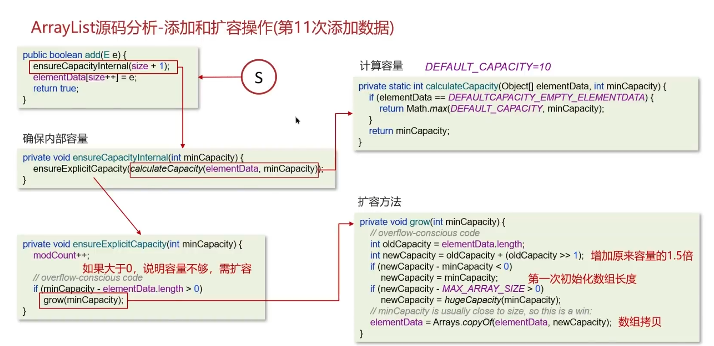

### ArrayList底层的实现原理

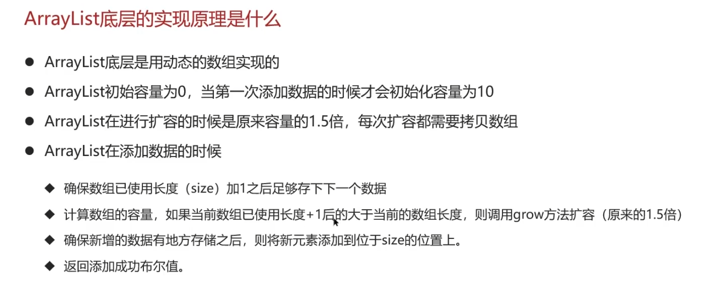

### 如何实现数组和List之间的转换

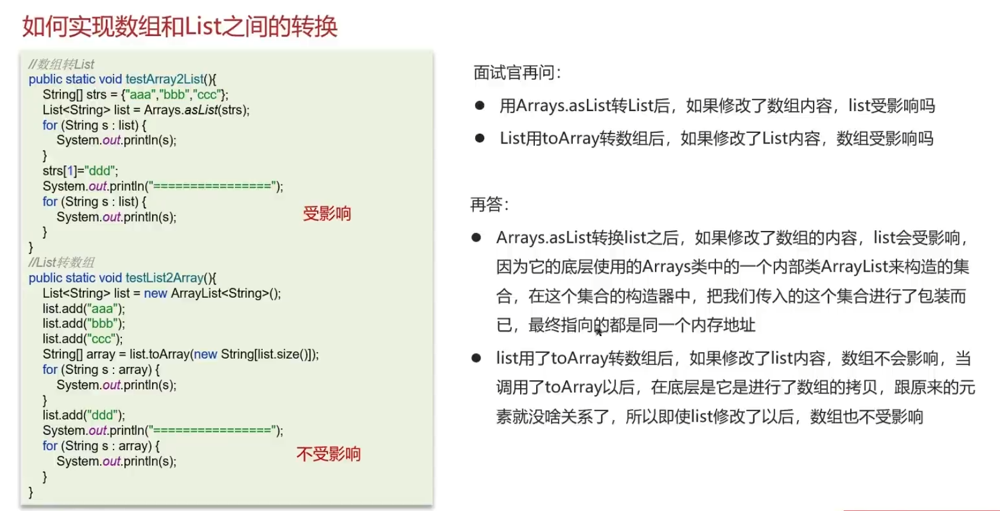

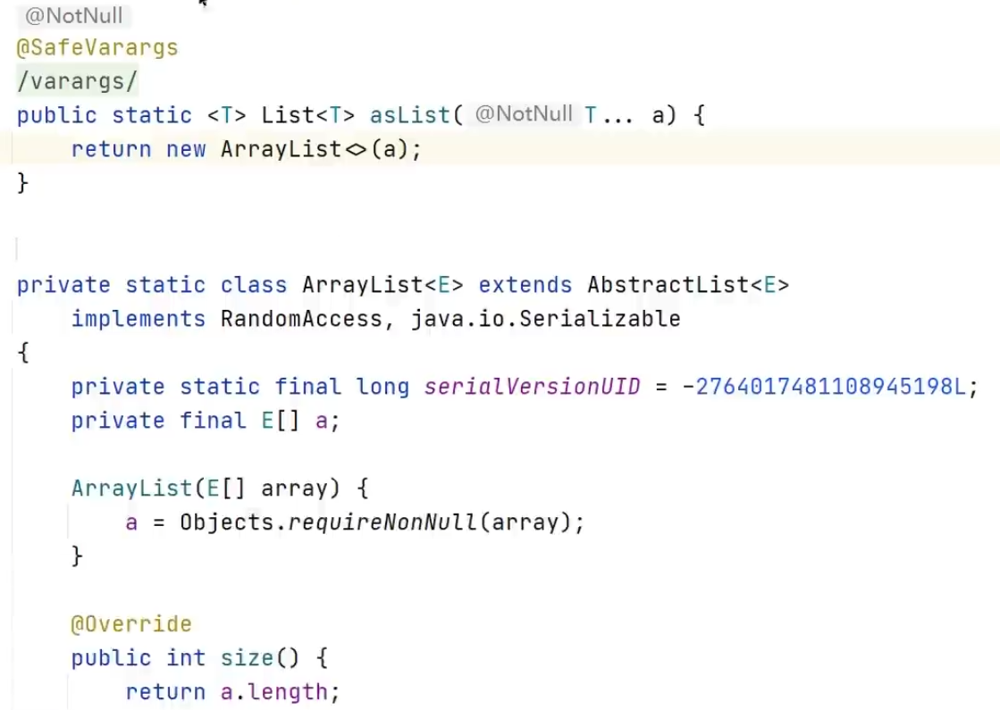

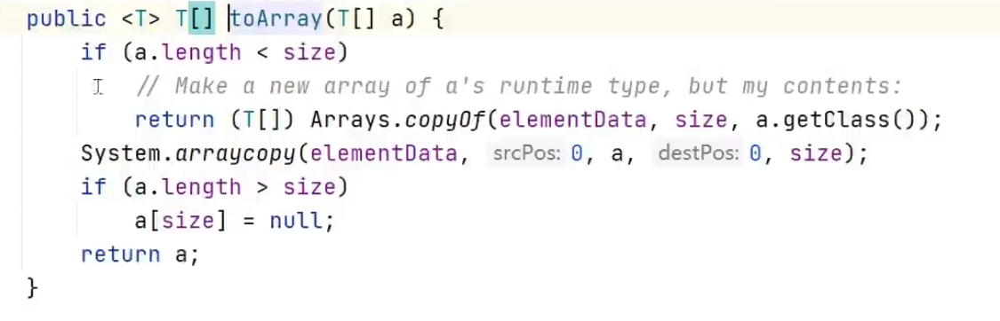

### ArrayList和LinkedList的区别是什么

1. 底层数据结构（动态数组、双向链表）

2. 操作数据效率

3. 内存空间占用

4. 线程安全（都不是线程安全的）

    保证线程安全的方案：

    + 在方法内使用，局部变量是线程安全的

    + 使用线程安全的ArrayList和LinkedList

        ```java
        List<Object> syncArrayList = Collections.synchronizedList(new ArrayList<>());
        List<Object> syncLinkedList = Collections.synchronizedList(new LinkedList<>());
        ```

## HashMap

### 红黑树

又称平衡二叉搜索树、平衡二叉B树

性质：

1. 节点为红色或者黑色
2. 根节点为黑色
3. 叶子节点都是黑色的空节点
4. 红色节点的子节点都是黑色
5. 从任一节点到叶子节点的所有路径，都包含相同数目的黑色节点

插入和删除的时间复杂度都是 $O(\log_2n)$ 

### HashTable解决哈希冲突

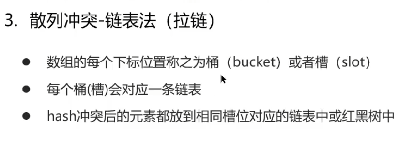

### HashMap的实现原理

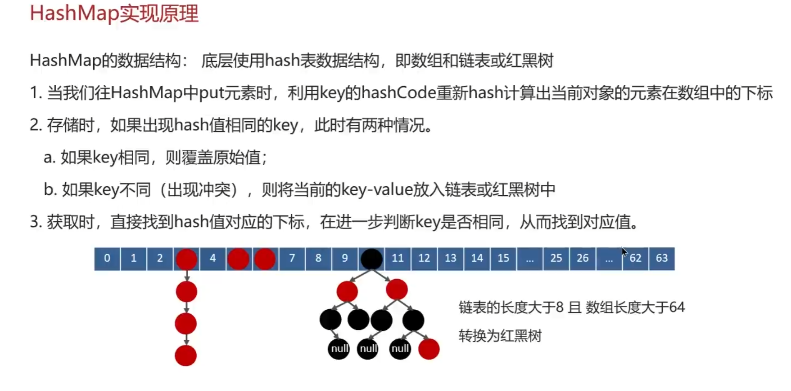

### HashMap在jdk1.7和jdk1.8的区别

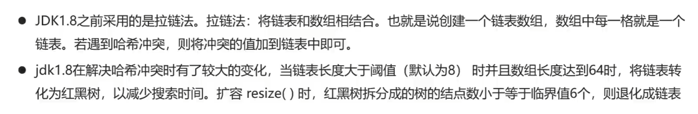

### HashMap的put方法的具体流程（待看源码）

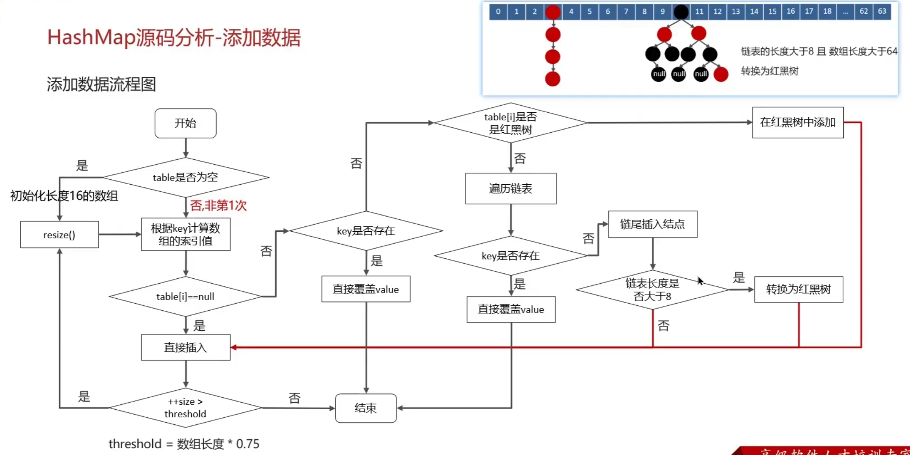

### HashMap的扩容机制

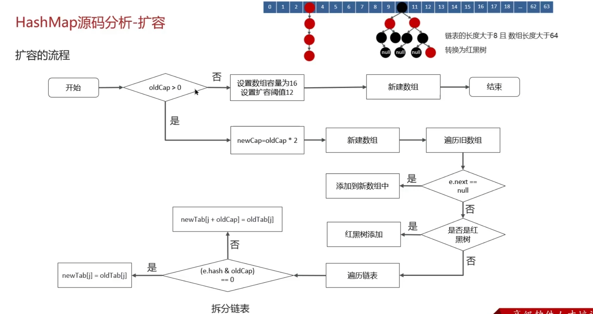

### HashMap的寻址算法

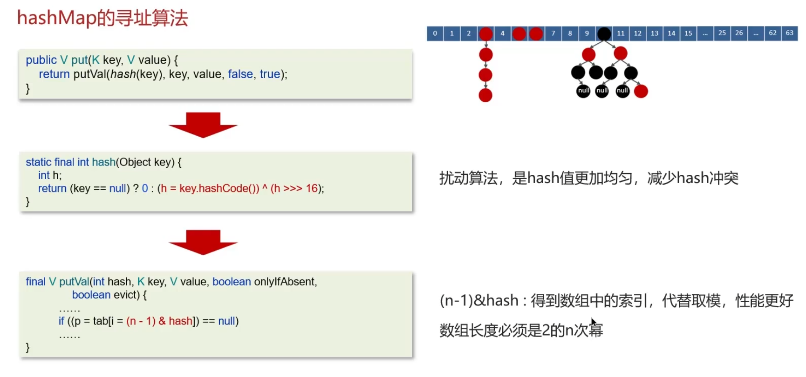

### HashMap在jdk1.7的多线程死循环问题

链表为头插法，扩容时链表顺序颠倒，但是其他线程的指针可能还是原来的顺序

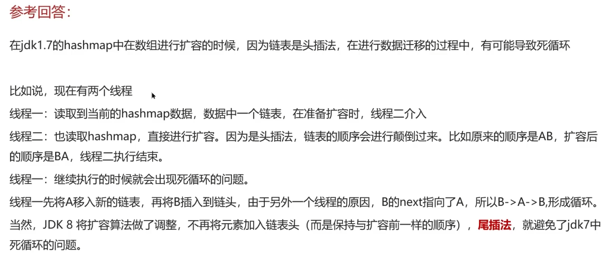

