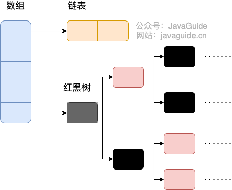
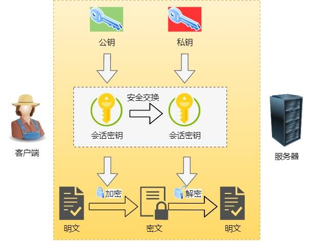
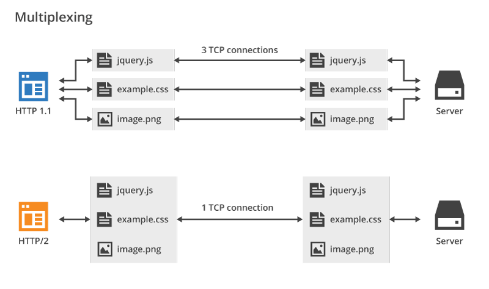
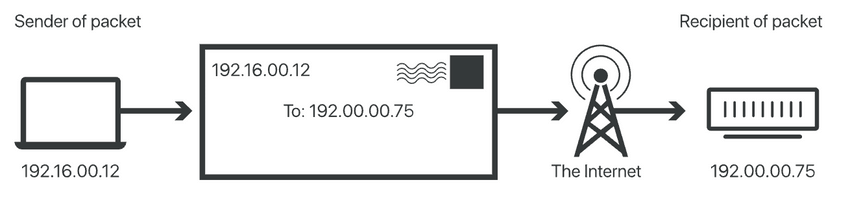
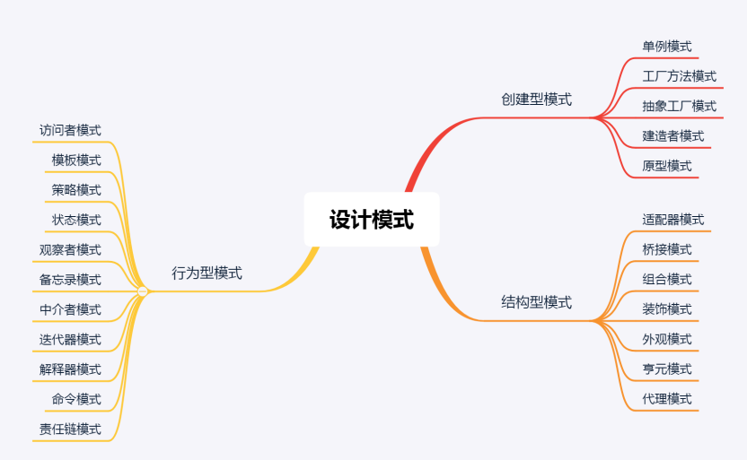

# Java

## Java 基础

### Java 中的几种基本数据类型是什么？对应的包装类型是什么？各自占用多少字节呢？

Java 中有 8 种基本数据类型，分别为：

- 6 种数字类型：
  - 4 种整数型：`byte`、`short`、`int`、`long`
  - 2 种浮点型：`float`、`double`
- 1 种字符类型：`char`
- 1 种布尔型：`boolean`。

这 8 种基本数据类型的默认值以及所占空间的大小如下：

| 基本类型  | 位数 | 字节 | 默认值  | 取值范围                                                     |
| :-------- | :--- | :--- | :------ | ------------------------------------------------------------ |
| `byte`    | 8    | 1    | 0       | -128 ~ 127                                                   |
| `short`   | 16   | 2    | 0       | -32768（-2^15） ~ 32767（2^15 - 1）                          |
| `int`     | 32   | 4    | 0       | -2147483648 ~ 2147483647                                     |
| `long`    | 64   | 8    | 0L      | -9223372036854775808（-2^63） ~ 9223372036854775807（2^63 -1） |
| `char`    | 16   | 2    | 'u0000' | 0 ~ 65535（2^16 - 1）                                        |
| `float`   | 32   | 4    | 0f      | 1.4E-45 ~ 3.4028235E38                                       |
| `double`  | 64   | 8    | 0d      | 4.9E-324 ~ 1.7976931348623157E308                            |
| `boolean` | 1    |      | false   | true、false                                                  |

可以看到，像 `byte`、`short`、`int`、`long`能表示的最大正数都减 1 了。这是为什么呢？这是因为在二进制补码表示法中，最高位是用来表示符号的（0 表示正数，1 表示负数），其余位表示数值部分。所以，如果我们要表示最大的正数，我们需要把除了最高位之外的所有位都设为 1。如果我们再加 1，就会导致溢出，变成一个负数。

对于 `boolean`，官方文档未明确定义，它依赖于 JVM 厂商的具体实现。逻辑上理解是占用 1 位，但是实际中会考虑计算机高效存储因素。

另外，Java 的每种基本类型所占存储空间的大小不会像其他大多数语言那样随机器硬件架构的变化而变化。这种所占存储空间大小的不变性是 Java 程序比用其他大多数语言编写的程序更具可移植性的原因之一（《Java 编程思想》2.2 节有提到）。

**注意：**

1. Java 里使用 `long` 类型的数据一定要在数值后面加上 **L**，否则将作为整型解析。
2. Java 里使用 `float` 类型的数据一定要在数值后面加上 **f 或 F**，否则将无法通过编译。
3. `char a = 'h'`char :单引号，`String a = "hello"` :双引号。

这八种基本类型都有对应的包装类分别为：`Byte`、`Short`、`Integer`、`Long`、`Float`、`Double`、`Character`、`Boolean` 。

**基本类型和包装类型的区别？**

- **用途**：除了定义一些常量和局部变量之外，我们在其他地方比如方法参数、对象属性中很少会使用基本类型来定义变量。并且，包装类型可用于泛型，而基本类型不可以。
- **存储方式**：基本数据类型的局部变量存放在 Java 虚拟机栈中的局部变量表中，基本数据类型的成员变量（未被 `static` 修饰 ）存放在 Java 虚拟机的堆中。包装类型属于对象类型，我们知道几乎所有对象实例都存在于堆中。
- **占用空间**：相比于包装类型（对象类型）， 基本数据类型占用的空间往往非常小。
- **默认值**：成员变量包装类型不赋值就是 `null` ，而基本类型有默认值且不是 `null`。
- **比较方式**：对于基本数据类型来说，`==` 比较的是值。对于包装数据类型来说，`==` 比较的是对象的内存地址。所有整型包装类对象之间值的比较，全部使用 `equals()` 方法。

**为什么说是几乎所有对象实例都存在于堆中呢？** 这是因为 HotSpot 虚拟机引入了 JIT 优化之后，会对对象进行逃逸分析，如果发现某一个对象并没有逃逸到方法外部，那么就可能通过标量替换来实现栈上分配，而避免堆上分配内存

⚠️ 注意：**基本数据类型存放在栈中是一个常见的误区！** 基本数据类型的存储位置取决于它们的作用域和声明方式。如果它们是局部变量，那么它们会存放在栈中；如果它们是成员变量，那么它们会存放在堆/方法区/元空间中。

```java
public class Test {
    // 成员变量，存放在堆中
    int a = 10;
    // 被 static 修饰的成员变量，JDK 1.7 及之前位于方法区，1.8 后存放于元空间，均不存放于堆中。
    // 变量属于类，不属于对象。
    static int b = 20;

    public void method() {
        // 局部变量，存放在栈中
        int c = 30;
        static int d = 40; // 编译错误，不能在方法中使用 static 修饰局部变量
    }
}
```

### 包装类型的缓存机制了解么？

Java 基本数据类型的包装类型的大部分都用到了缓存机制来提升性能。

`Byte`,`Short`,`Integer`,`Long` 这 4 种包装类默认创建了数值 **[-128，127]** 的相应类型的缓存数据，`Character` 创建了数值在 **[0,127]** 范围的缓存数据，`Boolean` 直接返回 `TRUE` or `FALSE`。

对于 `Integer`，可以通过 JVM 参数 `-XX:AutoBoxCacheMax=<size>` 修改缓存上限，但不能修改下限 -128。实际使用时，并不建议设置过大的值，避免浪费内存，甚至是 OOM。

对于`Byte`,`Short`,`Long` ,`Character` 没有类似 `-XX:AutoBoxCacheMax` 参数可以修改，因此缓存范围是固定的，无法通过 JVM 参数调整。`Boolean` 则直接返回预定义的 `TRUE` 和 `FALSE` 实例，没有缓存范围的概念。

**Integer 缓存源码：**

```java
public static Integer valueOf(int i) {
    if (i >= IntegerCache.low && i <= IntegerCache.high)
        return IntegerCache.cache[i + (-IntegerCache.low)];
    return new Integer(i);
}
private static class IntegerCache {
    static final int low = -128;
    static final int high;
    static {
        // high value may be configured by property
        int h = 127;
    }
}
```

**`Character` 缓存源码:**

```java
public static Character valueOf(char c) {
    if (c <= 127) { // must cache
      return CharacterCache.cache[(int)c];
    }
    return new Character(c);
}

private static class CharacterCache {
    private CharacterCache(){}
    static final Character cache[] = new Character[127 + 1];
    static {
        for (int i = 0; i < cache.length; i++)
            cache[i] = new Character((char)i);
    }

}
```

**`Boolean` 缓存源码：**

```java
public static Boolean valueOf(boolean b) {
    return (b ? TRUE : FALSE);
}
```

如果超出对应范围仍然会去创建新的对象，缓存的范围区间的大小只是在性能和资源之间的权衡。

两种浮点数类型的包装类 `Float`,`Double` 并没有实现缓存机制。

```java
Integer i1 = 33;
Integer i2 = 33;
System.out.println(i1 == i2);// 输出 true

Float i11 = 333f;
Float i22 = 333f;
System.out.println(i11 == i22);// 输出 false

Double i3 = 1.2;
Double i4 = 1.2;
System.out.println(i3 == i4);// 输出 false
```

下面我们来看一个问题：下面的代码的输出结果是 `true` 还是 `false` 呢？

```java
Integer i1 = 40;
Integer i2 = new Integer(40);
System.out.println(i1==i2);
```

`Integer i1=40` 这一行代码会发生装箱，也就是说这行代码等价于 `Integer i1=Integer.valueOf(40)` 。因此，`i1` 直接使用的是缓存中的对象。而`Integer i2 = new Integer(40)` 会直接创建新的对象。

因此，答案是 `false` 。你答对了吗？

记住：**所有整型包装类对象之间值的比较，全部使用 equals 方法比较**。


### 自动装箱与拆箱了解吗？原理是什么？

- **装箱**：将基本类型用它们对应的引用类型包装起来；
- **拆箱**：将包装类型转换为基本数据类型；

举例：

```java
Integer i = 10;  //装箱
int n = i;   //拆箱
```

从字节码中，我们发现装箱其实就是调用了 包装类的`valueOf()`方法，拆箱其实就是调用了 `xxxValue()`方法。

因此，

- `Integer i = 10` 等价于 `Integer i = Integer.valueOf(10)`
- `int n = i` 等价于 `int n = i.intValue()`;

注意：**如果频繁拆装箱的话，也会严重影响系统的性能。我们应该尽量避免不必要的拆装箱操作。**

```java
private static long sum() {
    // 应该使用 long 而不是 Long
    Long sum = 0L;
    for (long i = 0; i <= Integer.MAX_VALUE; i++)
        sum += i;
    return sum;
}
```

### String、StringBuffer 和 StringBuilder 的区别是什么? 

**可变性**

`String` 是不可变的（后面会详细分析原因）。

`StringBuilder` 与 `StringBuffer` 都继承自 `AbstractStringBuilder` 类，在 `AbstractStringBuilder` 中也是使用字符数组保存字符串，不过没有使用 `final` 和 `private` 关键字修饰，最关键的是这个 `AbstractStringBuilder` 类还提供了很多修改字符串的方法比如 `append` 方法。

```
abstract class AbstractStringBuilder implements Appendable, CharSequence {
    char[] value;
    public AbstractStringBuilder append(String str) {
        if (str == null)
            return appendNull();
        int len = str.length();
        ensureCapacityInternal(count + len);
        str.getChars(0, len, value, count);
        count += len;
        return this;
    }
    //...
}
```

**线程安全性**

`String` 中的对象是不可变的，也就可以理解为常量，线程安全。`AbstractStringBuilder` 是 `StringBuilder` 与 `StringBuffer` 的公共父类，定义了一些字符串的基本操作，如 `expandCapacity`、`append`、`insert`、`indexOf` 等公共方法。`StringBuffer` 对方法加了同步锁或者对调用的方法加了同步锁，所以是线程安全的。`StringBuilder` 并没有对方法进行加同步锁，所以是非线程安全的。

**性能**

每次对 `String` 类型进行改变的时候，都会生成一个新的 `String` 对象，然后将指针指向新的 `String` 对象。`StringBuffer` 每次都会对 `StringBuffer` 对象本身进行操作，而不是生成新的对象并改变对象引用。相同情况下使用 `StringBuilder` 相比使用 `StringBuffer` 仅能获得 10%~15% 左右的性能提升，但却要冒多线程不安全的风险。

**对于三者使用的总结：**

- 操作少量的数据: 适用 `String`
- 单线程操作字符串缓冲区下操作大量数据: 适用 `StringBuilder`
- 多线程操作字符串缓冲区下操作大量数据: 适用 `StringBuffer`

### String 为什么是不可变的?

`String` 类中使用 `final` 关键字修饰字符数组来保存字符串，~~所以`String` 对象是不可变的。~~

```
public final class String implements java.io.Serializable, Comparable<String>, CharSequence {
    private final char value[];
  //...
}
```

> 🐛 修正：我们知道被 `final` 关键字修饰的类不能被继承，修饰的方法不能被重写，修饰的变量是基本数据类型则值不能改变，修饰的变量是引用类型则不能再指向其他对象。因此，`final` 关键字修饰的数组保存字符串并不是 `String` 不可变的根本原因，因为这个数组保存的字符串是可变的（`final` 修饰引用类型变量的情况）。
>
> `String` 真正不可变有下面几点原因：
>
> 1. 保存字符串的数组被 `final` 修饰且为私有的，并且`String` 类没有提供/暴露修改这个字符串的方法。
> 2. `String` 类被 `final` 修饰导致其不能被继承，进而避免了子类破坏 `String` 不可变。
>
> 相关阅读：[如何理解 String 类型值的不可变？ - 知乎提问](https://www.zhihu.com/question/20618891/answer/114125846)
>
> 补充（来自[issue 675](https://github.com/Snailclimb/JavaGuide/issues/675)）：在 Java 9 之后，`String`、`StringBuilder` 与 `StringBuffer` 的实现改用 `byte` 数组存储字符串。

```
public final class String implements java.io.Serializable,Comparable<String>, CharSequence {
    // @Stable 注解表示变量最多被修改一次，称为“稳定的”。
    @Stable
    private final byte[] value;
}

abstract class AbstractStringBuilder implements Appendable, CharSequence {
    byte[] value;

}
```


**Java 9 为何要将 `String` 的底层实现由 `char[]` 改成了 `byte[]` ?**

新版的 String 其实支持两个编码方案：Latin-1 和 UTF-16。如果字符串中包含的汉字没有超过 Latin-1 可表示范围内的字符，那就会使用 Latin-1 作为编码方案。Latin-1 编码方案下，`byte` 占一个字节(8 位)，`char` 占用 2 个字节（16），`byte` 相较 `char` 节省一半的内存空间。

JDK 官方就说了绝大部分字符串对象只包含 Latin-1 可表示的字符。

[](https://camo.githubusercontent.com/20d5b1eab045f5cbdee9942051814fb5c87975a7e0ffc07eb736c316ac8dbcef/68747470733a2f2f6f73732e6a61766167756964652e636e2f6769746875622f6a61766167756964652f6a646b392d737472696e672d6c6174696e312e706e67)

如果字符串中包含的汉字超过 Latin-1 可表示范围内的字符，`byte` 和 `char` 所占用的空间是一样的。

这是官方的介绍：https://openjdk.java.net/jeps/254 。

### String s1 = new String("abc"); 这段代码创建了几个字符串对象？

先说答案：会创建 1 或 2 个字符串对象。

1. 字符串常量池中不存在 "abc"：会创建 2 个字符串对象。一个在字符串常量池中，由 `ldc` 指令触发创建。一个在堆中，由 `new String()` 创建，并使用常量池中的 "abc" 进行初始化。
2. 字符串常量池中已存在 "abc"：会创建 1 个字符串对象。该对象在堆中，由 `new String()` 创建，并使用常量池中的 "abc" 进行初始化。

下面开始详细分析。

1、如果字符串常量池中不存在字符串对象 “abc”，那么它首先会在字符串常量池中创建字符串对象 "abc"，然后在堆内存中再创建其中一个字符串对象 "abc"。

示例代码（JDK 1.8）：

```java
String s1 = new String("abc");
```

对应的字节码：

```java
// 在堆内存中分配一个尚未初始化的 String 对象。
// #2 是常量池中的一个符号引用，指向 java/lang/String 类。
// 在类加载的解析阶段，这个符号引用会被解析成直接引用，即指向实际的 java/lang/String 类。
0 new #2 <java/lang/String>
// 复制栈顶的 String 对象引用，为后续的构造函数调用做准备。
// 此时操作数栈中有两个相同的对象引用：一个用于传递给构造函数，另一个用于保持对新对象的引用，后续将其存储到局部变量表。
3 dup
// JVM 先检查字符串常量池中是否存在 "abc"。
// 如果常量池中已存在 "abc"，则直接返回该字符串的引用；
// 如果常量池中不存在 "abc"，则 JVM 会在常量池中创建该字符串字面量并返回它的引用。
// 这个引用被压入操作数栈，用作构造函数的参数。
4 ldc #3 <abc>
// 调用构造方法，使用从常量池中加载的 "abc" 初始化堆中的 String 对象
// 新的 String 对象将包含与常量池中的 "abc" 相同的内容，但它是一个独立的对象，存储于堆中。
6 invokespecial #4 <java/lang/String.<init> : (Ljava/lang/String;)V>
// 将堆中的 String 对象引用存储到局部变量表
9 astore_1
// 返回，结束方法
10 return
```

`ldc (load constant)` 指令的确是从常量池中加载各种类型的常量，包括字符串常量、整数常量、浮点数常量，甚至类引用等。对于字符串常量，`ldc` 指令的行为如下：

1. **从常量池加载字符串**：`ldc` 首先检查字符串常量池中是否已经有内容相同的字符串对象。
2. **复用已有字符串对象**：如果字符串常量池中已经存在内容相同的字符串对象，`ldc` 会将该对象的引用加载到操作数栈上。
3. **没有则创建新对象并加入常量池**：如果字符串常量池中没有相同内容的字符串对象，JVM 会在常量池中创建一个新的字符串对象，并将其引用加载到操作数栈中。

2、如果字符串常量池中已存在字符串对象“abc”，则只会在堆中创建 1 个字符串对象“abc”。

示例代码（JDK 1.8）：

```java
// 字符串常量池中已存在字符串对象“abc”
String s1 = "abc";
// 下面这段代码只会在堆中创建 1 个字符串对象“abc”
String s2 = new String("abc");
```

对应的字节码：

```java
0 ldc #2 <abc>
2 astore_1
3 new #3 <java/lang/String>
6 dup
7 ldc #2 <abc>
9 invokespecial #4 <java/lang/String.<init> : (Ljava/lang/String;)V>
12 astore_2
13 return
```

这里就不对上面的字节码进行详细注释了，7 这个位置的 `ldc` 命令不会在堆中创建新的字符串对象“abc”，这是因为 0 这个位置已经执行了一次 `ldc` 命令，已经在堆中创建过一次字符串对象“abc”了。7 这个位置执行 `ldc` 命令会直接返回字符串常量池中字符串对象“abc”对应的引用。

### == 与 equals？

**`==`** 对于基本类型和引用类型的作用效果是不同的：

- 对于基本数据类型来说，`==` 比较的是值。
- 对于引用数据类型来说，`==` 比较的是对象的内存地址。

> 因为 Java 只有值传递，所以，对于 == 来说，不管是比较基本数据类型，还是引用数据类型的变量，其本质比较的都是值，只是引用类型变量存的值是对象的地址。

**`equals()`** 不能用于判断基本数据类型的变量，只能用来判断两个对象是否相等。`equals()`方法存在于`Object`类中，而`Object`类是所有类的直接或间接父类，因此所有的类都有`equals()`方法。

`Object` 类 `equals()` 方法：

```java
public boolean equals(Object obj) {
     return (this == obj);
}
```

`equals()` 方法存在两种使用情况：

- **类没有重写 `equals()`方法**：通过`equals()`比较该类的两个对象时，等价于通过“==”比较这两个对象，使用的默认是 `Object`类`equals()`方法。
- **类重写了 `equals()`方法**：一般我们都重写 `equals()`方法来比较两个对象中的属性是否相等；若它们的属性相等，则返回 true(即，认为这两个对象相等)。

举个例子（这里只是为了举例。实际上，你按照下面这种写法的话，像 IDEA 这种比较智能的 IDE 都会提示你将 `==` 换成 `equals()` ）：

```java
String a = new String("ab"); // a 为一个引用
String b = new String("ab"); // b为另一个引用,对象的内容一样
String aa = "ab"; // 放在常量池中
String bb = "ab"; // 从常量池中查找
System.out.println(aa == bb);// true
System.out.println(a == b);// false
System.out.println(a.equals(b));// true
System.out.println(42 == 42.0);// true
```

`String` 中的 `equals` 方法是被重写过的，因为 `Object` 的 `equals` 方法是比较的对象的内存地址，而 `String` 的 `equals` 方法比较的是对象的值。

当创建 `String` 类型的对象时，虚拟机会在常量池中查找有没有已经存在的值和要创建的值相同的对象，如果有就把它赋给当前引用。如果没有就在常量池中重新创建一个 `String` 对象。

`String`类`equals()`方法：

```java
public boolean equals(Object anObject) {
    if (this == anObject) {
        return true;
    }
    if (anObject instanceof String) {
        String anotherString = (String)anObject;
        int n = value.length;
        if (n == anotherString.value.length) {
            char v1[] = value;
            char v2[] = anotherString.value;
            int i = 0;
            while (n-- != 0) {
                if (v1[i] != v2[i])
                    return false;
                i++;
            }
            return true;
        }
    }
    return false;
}
```

### hashCode 与 equals ？

> 当你把对象加入 `HashSet` 时，`HashSet` 会先计算对象的 `hashCode` 值来判断对象加入的位置，同时也会与其他已经加入的对象的 `hashCode` 值作比较，如果没有相符的 `hashCode`，`HashSet` 会假设对象没有重复出现。但是如果发现有相同 `hashCode` 值的对象，这时会调用 `equals()` 方法来检查 `hashCode` 相等的对象是否真的相同。如果两者相同，`HashSet` 就不会让其加入操作成功。如果不同的话，就会重新散列到其他位置。这样我们就大大减少了 `equals` 的次数，相应就大大提高了执行速度。

其实， `hashCode()` 和 `equals()`都是用于比较两个对象是否相等。

**那为什么 JDK 还要同时提供这两个方法呢？**

这是因为在一些容器（比如 `HashMap`、`HashSet`）中，有了 `hashCode()` 之后，判断元素是否在对应容器中的效率会更高（参考添加元素进`HashSet`的过程）！

我们在前面也提到了添加元素进`HashSet`的过程，如果 `HashSet` 在对比的时候，同样的 `hashCode` 有多个对象，它会继续使用 `equals()` 来判断是否真的相同。也就是说 `hashCode` 帮助我们大大缩小了查找成本。

如果两个对象的`hashCode` 值相等，那这两个对象不一定相等（哈希碰撞）。

如果两个对象的`hashCode` 值相等并且`equals()`方法也返回 `true`，我们才认为这两个对象相等。

如果两个对象的`hashCode` 值不相等，我们就可以直接认为这两个对象不相等。

### 深拷贝和浅拷贝区别了解吗？什么是引用拷贝？

- **浅拷贝**：浅拷贝会在堆上创建一个新的对象（区别于引用拷贝的一点），不过，如果原对象内部的属性是引用类型的话，浅拷贝会直接复制内部对象的引用地址，也就是说拷贝对象和原对象共用同一个内部对象。
- **深拷贝**：深拷贝会完全复制整个对象，包括这个对象所包含的内部对象。

#### 浅拷贝

浅拷贝的示例代码如下，我们这里实现了 `Cloneable` 接口，并重写了 `clone()` 方法。

`clone()` 方法的实现很简单，直接调用的是父类 `Object` 的 `clone()` 方法。

```java
public class Address implements Cloneable{
    private String name;
    // 省略构造函数、Getter&Setter方法
    @Override
    public Address clone() {
        try {
            return (Address) super.clone();
        } catch (CloneNotSupportedException e) {
            throw new AssertionError();
        }
    }
}

public class Person implements Cloneable {
    private Address address;
    // 省略构造函数、Getter&Setter方法
    @Override
    public Person clone() {
        try {
            Person person = (Person) super.clone();
            return person;
        } catch (CloneNotSupportedException e) {
            throw new AssertionError();
        }
    }
}
```

测试：

```java
Person person1 = new Person(new Address("武汉"));
Person person1Copy = person1.clone();
System.out.println(person1.getAddress() == person1Copy.getAddress()); // true
```

从输出结构就可以看出， `person1` 的克隆对象和 `person1` 使用的仍然是同一个 `Address` 对象。

#### 深拷贝

这里我们简单对 `Person` 类的 `clone()` 方法进行修改，连带着要把 `Person` 对象内部的 `Address` 对象一起复制。

```java
@Override
public Person clone() {
    try {
        Person person = (Person) super.clone();
        person.setAddress(person.getAddress().clone());
        return person;
    } catch (CloneNotSupportedException e) {
        throw new AssertionError();
    }
}
```

测试：

```java
Person person1 = new Person(new Address("武汉"));
Person person1Copy = person1.clone();
System.out.println(person1.getAddress() == person1Copy.getAddress()); // false
System.out.println(person1.getAddress().getName().equals(person1Copy.getAddress().getName())); // true
```

从输出结构就可以看出，显然 `person1` 的克隆对象和 `person1` 包含的 `Address` 对象已经是不同的了。

**那什么是引用拷贝呢？** 简单来说，引用拷贝就是两个不同的引用指向同一个对象。

我专门画了一张图来描述浅拷贝、深拷贝、引用拷贝：


### 谈谈对 Java 注解的理解，解决了什么问题？

#### 何谓注解

`Annotation` （注解） 是 Java5 开始引入的新特性，可以看作是一种特殊的注释，主要用于修饰类、方法或者变量，提供某些信息供程序在编译或者运行时使用。

注解本质是一个继承了`Annotation` 的特殊接口：

```java
@Target(ElementType.METHOD)
@Retention(RetentionPolicy.SOURCE)
public @interface Override {

}

public interface Override extends Annotation{

}
```

JDK 提供了很多内置的注解（比如 `@Override`、`@Deprecated（已弃用）`），同时，我们还可以自定义注解。

#### 注解的解析方法有哪几种

注解只有被解析之后才会生效，常见的解析方法有两种：

- **编译期直接扫描**：编译器在编译 Java 代码的时候扫描对应的注解并处理，比如某个方法使用`@Override` 注解，编译器在编译的时候就会检测当前的方法是否重写了父类对应的方法。
- **运行期通过反射处理**：像框架中自带的注解(比如 Spring 框架的 `@Value`、`@Component`)都是通过反射来进行处理的。

### Exception 和 Error 有什么区别？

在 Java 中，所有的异常都有一个共同的祖先 `java.lang` 包中的 `Throwable` 类。`Throwable` 类有两个重要的子类：

- **`Exception`** :程序本身可以处理的异常，可以通过 `catch` 来进行捕获。`Exception` 又可以分为 Checked Exception (受检查异常，必须处理) 和 Unchecked Exception (不受检查异常，可以不处理)。
- **`Error`**：`Error` 属于程序无法处理的错误 ，我们~~没办法通过 `catch` 来进行捕获~~不建议通过`catch`捕获 。例如 Java 虚拟机运行错误（`Virtual MachineError`）、虚拟机内存不够错误(`OutOfMemoryError`)、类定义错误（`NoClassDefFoundError`）等 。这些异常发生时，Java 虚拟机（JVM）一般会选择线程终止。

### 什么是 Java 反射

如果说大家研究过框架的底层原理或者咱们自己写过框架的话，一定对反射这个概念不陌生。反射之所以被称为框架的灵魂，主要是因为它赋予了我们在运行时分析类以及执行类中方法的能力。通过反射你可以获取任意一个类的所有属性和方法，你还可以调用这些方法和属性

### 反射有什么缺点？你是怎么理解反射的（为什么框架需要反射）？

反射可以让我们的代码更加灵活、为各种框架提供开箱即用的功能提供了便利。

不过，反射让我们在运行时有了分析操作类的能力的同时，也增加了安全问题，比如可以无视泛型参数的安全检查（泛型参数的安全检查发生在编译时）。另外，反射的性能也要稍差点，不过，对于框架来说实际是影响不大的。

相关阅读：[Java Reflection: Why is it so slow?](https://stackoverflow.com/questions/1392351/java-reflection-why-is-it-so-slow) 

反射提供了框架在运行时动态加载和操作类的能力，从而实现更灵活和可扩展的框架结构。框架可以通过反射来实现配置文件的解析、动态创建对象、调用对象的方法等功能。反射使得框架可以在不了解具体类实现的情况下进行操作，从而实现了框架的解耦和扩展性。例如，依赖注入框架（如Spring）可以使用反射来动态创建和注入对象，使得应用程序可以在不修改代码的情况下配置和更改对象的依赖关系。通过反射，框架可以在运行时根据配置和需求来加载和使用类，提供更大的灵活性和可定制性。

### 反射的应用场景

像咱们平时大部分时候都是在写业务代码，很少会接触到直接使用反射机制的场景。但是！这并不代表反射没有用。相反，正是因为反射，你才能这么轻松地使用各种框架。像 Spring/Spring Boot、MyBatis 等等框架中都大量使用了反射机制。

**这些框架中也大量使用了动态代理，而动态代理的实现也依赖反射。**

比如下面是通过 JDK 实现动态代理的示例代码，其中就使用了反射类 `Method` 来调用指定的方法。

```java
public class DebugInvocationHandler implements InvocationHandler {
    /**
     * 代理类中的真实对象
     */
    private final Object target;

    public DebugInvocationHandler(Object target) {
        this.target = target;
    }

    public Object invoke(Object proxy, Method method, Object[] args) throws InvocationTargetException, IllegalAccessException {
        System.out.println("before method " + method.getName());
        Object result = method.invoke(target, args);
        System.out.println("after method " + method.getName());
        return result;
    }
}
```

另外，像 Java 中的一大利器 **注解** 的实现也用到了反射。

为什么你使用 Spring 的时候 ，一个`@Component`注解就声明了一个类为 Spring Bean 呢？为什么你通过一个 `@Value`注解就读取到配置文件中的值呢？究竟是怎么起作用的呢？

这些都是因为你可以基于反射分析类，然后获取到类/属性/方法/方法的参数上的注解。你获取到注解之后，就可以做进一步的处理。

### Java 泛型了解么？什么是类型擦除？介绍⼀下常用的通配符？

**Java 泛型（Generics）** 是 JDK 5 中引入的一个新特性。使用泛型参数，可以增强代码的可读性以及稳定性。

编译器可以对泛型参数进行检测，并且通过泛型参数可以指定传入的对象类型。比如 `ArrayList<Person> persons = new ArrayList<Person>()` 这行代码就指明了该 `ArrayList` 对象只能传入 `Person` 对象，如果传入其他类型的对象就会报错。

```
ArrayList<E> extends AbstractList<E>
```

并且，原生 `List` 返回类型是 `Object` ，需要手动转换类型才能使用，使用泛型后编译器自动转换。

#### 泛型一般有三种使用方式:**泛型类**、**泛型接口**、**泛型方法**。

**1.泛型类**：

```java
//此处T可以随便写为任意标识，常见的如T、E、K、V等形式的参数常用于表示泛型
//在实例化泛型类时，必须指定T的具体类型
public class Generic<T>{

    private T key;

    public Generic(T key) {
        this.key = key;
    }

    public T getKey(){
        return key;
    }
}
```

如何实例化泛型类：

```java
Generic<Integer> genericInteger = new Generic<Integer>(123456);
```

**2.泛型接口**：

```java
public interface Generator<T> {
    public T method();
}
```

实现泛型接口，不指定类型：

```java
class GeneratorImpl<T> implements Generator<T>{
    @Override
    public T method() {
        return null;
    }
}
```

实现泛型接口，指定类型：

```java
class GeneratorImpl implements Generator<String> {
    @Override
    public String method() {
        return "hello";
    }
}
```

**3.泛型方法**：

```java
   public static < E > void printArray( E[] inputArray )
   {
         for ( E element : inputArray ){
            System.out.printf( "%s ", element );
         }
         System.out.println();
    }
```

使用：

```java
// 创建不同类型数组：Integer, Double 和 Character
Integer[] intArray = { 1, 2, 3 };
String[] stringArray = { "Hello", "World" };
printArray( intArray  );
printArray( stringArray  );
```

> 注意: `public static < E > void printArray( E[] inputArray )` 一般被称为静态泛型方法;在 java 中泛型只是一个占位符，必须在传递类型后才能使用。类在实例化时才能真正的传递类型参数，由于静态方法的加载先于类的实例化，也就是说类中的泛型还没有传递真正的类型参数，静态的方法的加载就已经完成了，所以静态泛型方法是没有办法使用类上声明的泛型的。只能使用自己声明的 `<E>`

#### 项目中哪里用到了泛型？

- 自定义接口通用返回结果 `CommonResult<T>` 通过参数 `T` 可根据具体的返回类型动态指定结果的数据类型
- 定义 `Excel` 处理类 `ExcelUtil<T>` 用于动态指定 `Excel` 导出的数据类型
- 构建集合工具类（参考 `Collections` 中的 `sort`, `binarySearch` 方法）。
- ……

#### 类型擦除

**类型擦除**是Java泛型实现中的一种机制，旨在确保泛型代码在编译后能与非泛型代码兼容。具体来说，编译器在编译时会移除所有泛型类型信息，将其替换为原始类型（通常是`Object`），并在必要时插入类型转换。这种机制使得泛型代码在运行时与非泛型代码保持一致。

**类型擦除的主要特点：**

1. **类型参数替换**：泛型类型参数在编译时被替换为`Object`或其上限类型。
2. **类型检查**：编译器在编译时进行类型检查，确保类型安全。
3. **桥接方法**：编译器生成桥接方法，确保多态性在类型擦除后仍能正常工作。

**示例：**

```java
public class Box<T> {
    private T value;

    public void setValue(T value) {
        this.value = value;
    }

    public T getValue() {
        return value;
    }
}
```
编译后，`Box<String>`和`Box<Integer>`都会被擦除为`Box<Object>`，且`getValue`和`setValue`方法的类型参数也会被替换为`Object`。

#### 常用的通配符

Java泛型中的通配符用于表示未知类型，主要有以下三种：

1. **无界通配符 (`?`)**：
   - 表示任意类型。
   - 常用于泛型类或方法的参数类型，表示可以接受任何类型的参数。

   **示例：**
   ```java
   public void printList(List<?> list) {
       for (Object elem : list) {
           System.out.println(elem);
       }
   }
   ```

2. **上界通配符 (`<? extends T>`)**：
   - 表示类型必须是`T`或其子类。
   - 常用于读取操作，确保类型安全。

   **示例：**
   ```java
   public double sumOfList(List<? extends Number> list) {
       double sum = 0.0;
       for (Number num : list) {
           sum += num.doubleValue();
       }
       return sum;
   }
   ```

3. **下界通配符 (`<? super T>`)**：
   - 表示类型必须是`T`或其父类。
   - 常用于写入操作，确保类型安全。

   **示例：**
   ```java
   public void addNumbers(List<? super Integer> list) {
       for (int i = 1; i <= 10; i++) {
           list.add(i);
       }
   }
   ```

### 内部类

内部类是定义在另一个类内部的类，包含内部类的类被称为外部类。内部类可以访问外部类的成员，包括私有成员，而外部类也可以访问内部类的成员。 

优点：
- **封装性**：可以将一些相关的类组织在一起，提高代码的封装性和可读性。 
- **访问权限**：内部类可以访问外部类的私有成员。 
- **实现回调机制**：方便实现一些回调功能。

分类 ：

内部类可以分为以下几种类型： 

- **成员内部类**：定义在外部类的成员位置，与类的成员变量和方法处于同一层次。

```java
class Outer {
    private int outerVar = 10;     // 成员内部类
    class Inner {
        public void printOuterVar() {
            System.out.println(outerVar);
        }
    }
} 
public class Main {
    public static void main(String[] args) {
        Outer outer = new Outer();
        Outer.Inner inner = outer.new Inner();
        inner.printOuterVar(); // 输出: 10
    }
} 
```

- **静态内部类**：使用 `static` 关键字修饰的内部类，它不能直接访问外部类的非静态成员。 

```java 
class Outer {
    private static int outerStaticVar = 20;     // 静态内部类
    static class StaticInner {
        public void printOuterStaticVar() {
            System.out.println(outerStaticVar);
        }    
    }
}
public class Main {
    public static void main(String[] args) {
        Outer.StaticInner staticInner = new Outer.StaticInner();
        staticInner.printOuterStaticVar(); // 输出: 20
    }
} 
```

- **局部内部类**：定义在方法内部的类，只能在该方法内部使用。 

```java 
class Outer {
    public void outerMethod() {
        int localVar = 30;         // 局部内部类
        class LocalInner {
            public void printLocalVar() {
                System.out.println(localVar);
            }
        }
        LocalInner localInner = new LocalInner();
        localInner.printLocalVar();
    }
} 
public class Main {
    public static void main(String[] args) {
        Outer outer = new Outer();
        outer.outerMethod(); // 输出: 30
    }
} 
```

### 匿名内部类 

匿名内部类是一种没有名字的内部类，它通常用于创建一个实现了某个接口或继承了某个类的对象，并且只使用一次。 

优点 
- **简洁性**：可以减少代码量，使代码更加简洁。 
- **即时使用**：适合只需要使用一次的情况，无需单独定义一个类。 

```java 
new 父类构造器(参数列表) | 接口名() {
    // 匿名内部类的类体部分
} 
```

示例

```java
// 定义一个接口
interface MyInterface {
    void doSomething();
}

public class Main {
    public static void main(String[] args) {
        // 使用匿名内部类实现 MyInterface 接口
        MyInterface myInterface = new MyInterface() {
            @Override
            public void doSomething() {
                System.out.println("Doing something...");
            }
        };

        myInterface.doSomething(); // 输出: Doing something...
    }
}
```


在上述示例中，通过匿名内部类实现了 `MyInterface` 接口，并创建了一个实现该接口的对象。这种方式避免了单独定义一个类来实现接口，使代码更加简洁。

### BIO,NIO,AIO 有什么区别

#### BIO (Blocking I/O)

**BIO 属于同步阻塞 IO 模型** 。

同步阻塞 IO 模型中，应用程序发起 read 调用后，会一直阻塞，直到内核把数据拷贝到用户空间。

[](https://camo.githubusercontent.com/d0a4d31dbdf884656c091742cf5864f18b7be13bdb0af660b5828fead1bb19e7/68747470733a2f2f6f73732e6a61766167756964652e636e2f70332d6a75656a696e2f36613965373034616634396234333830626236383666306339366433336238317e74706c762d6b3375316662706663702d77617465726d61726b2e706e67)

在客户端连接数量不高的情况下，是没问题的。但是，当面对十万甚至百万级连接的时候，传统的 BIO 模型是无能为力的。因此，我们需要一种更高效的 I/O 处理模型来应对更高的并发量。

#### NIO (Non-blocking/New I/O)

Java 中的 NIO 于 Java 1.4 中引入，对应 `java.nio` 包，提供了 `Channel` , `Selector`，`Buffer` 等抽象。NIO 中的 N 可以理解为 Non-blocking，不单纯是 New。它是支持面向缓冲的，基于通道的 I/O 操作方法。 对于高负载、高并发的（网络）应用，应使用 NIO 。

Java 中的 NIO 可以看作是 **I/O 多路复用模型**。也有很多人认为，Java 中的 NIO 属于同步非阻塞 IO 模型。

跟着我的思路往下看看，相信你会得到答案！

我们先来看看 **同步非阻塞 IO 模型**。

[](https://camo.githubusercontent.com/b7adbae5478c18a5edffb52bb8d16d07e704491226dc1dc3736846a7b76e98c1/68747470733a2f2f6f73732e6a61766167756964652e636e2f70332d6a75656a696e2f62623137346532326462653034626237396665336663313236616564306336317e74706c762d6b3375316662706663702d77617465726d61726b2e706e67)

同步非阻塞 IO 模型中，应用程序会一直发起 read 调用，等待数据从内核空间拷贝到用户空间的这段时间里，线程依然是阻塞的，直到在内核把数据拷贝到用户空间。

相比于同步阻塞 IO 模型，同步非阻塞 IO 模型确实有了很大改进。通过轮询操作，避免了一直阻塞。

但是，这种 IO 模型同样存在问题：**应用程序不断进行 I/O 系统调用轮询数据是否已经准备好的过程是十分消耗 CPU 资源的。**

这个时候，**I/O 多路复用模型** 就上场了。

[](https://camo.githubusercontent.com/b7222fcb57ba3048b83b939e67511016ac5939093f2e81a468fc65ae5be8d1ad/68747470733a2f2f6f73732e6a61766167756964652e636e2f6769746875622f6a61766167756964652f6a6176612f696f2f38386666383632373634303234633362383536373336376466313164663661627e74706c762d6b3375316662706663702d77617465726d61726b2e706e67)

IO 多路复用模型中，线程首先发起 select 调用，询问内核数据是否准备就绪，等内核把数据准备好了，用户线程再发起 read 调用。read 调用的过程（数据从内核空间 -> 用户空间）还是阻塞的。

> 目前支持 IO 多路复用的系统调用，有 select，epoll 等等。select 系统调用，目前几乎在所有的操作系统上都有支持。
>
> - **select 调用**：内核提供的系统调用，它支持一次查询多个系统调用的可用状态。几乎所有的操作系统都支持。
> - **epoll 调用**：linux 2.6 内核，属于 select 调用的增强版本，优化了 IO 的执行效率。

**IO 多路复用模型，通过减少无效的系统调用，减少了对 CPU 资源的消耗。**

Java 中的 NIO ，有一个非常重要的**选择器 ( Selector )** 的概念，也可以被称为 **多路复用器**。通过它，只需要一个线程便可以管理多个客户端连接。当客户端数据到了之后，才会为其服务。

[](https://camo.githubusercontent.com/f79ab6dcc264812a863b9f0656563fe3835837e87ed4e842255e7c59dd3a6461/68747470733a2f2f6f73732e6a61766167756964652e636e2f6769746875622f6a61766167756964652f6a6176612f6e696f2f6368616e6e656c2d6275666665722d73656c6563746f722e706e67)

#### AIO (Asynchronous I/O)

AIO 也就是 NIO 2。Java 7 中引入了 NIO 的改进版 NIO 2,它是异步 IO 模型。

异步 IO 是基于事件和回调机制实现的，也就是应用操作之后会直接返回，不会堵塞在那里，当后台处理完成，操作系统会通知相应的线程进行后续的操作。

[](https://camo.githubusercontent.com/2ffe8d5d53046fe53484d57320b977c08e3e5d90805ba1e9d994ac108d4c8b3c/68747470733a2f2f6f73732e6a61766167756964652e636e2f6769746875622f6a61766167756964652f6a6176612f696f2f33303737653732613161663034393535396538316431383230356235366664377e74706c762d6b3375316662706663702d77617465726d61726b2e706e67)

目前来说 AIO 的应用还不是很广泛。Netty 之前也尝试使用过 AIO，不过又放弃了。这是因为，Netty 使用了 AIO 之后，在 Linux 系统上的性能并没有多少提升。

最后，来一张图，简单总结一下 Java 中的 BIO、NIO、AIO。

[](https://camo.githubusercontent.com/6697ba62393d6c6a3f805c1818a0488d00da092e92ae14048e9fdae7a16a30f2/68747470733a2f2f6f73732e6a61766167756964652e636e2f6769746875622f6a61766167756964652f6a6176612f6e696f2f62696f2d61696f2d6e696f2e706e67)


## Java 集合框架

### 说说 List、Set、Queue、Map 四者的区别？底层的数据结构？

`List`（对付顺序的好帮手）：存储的元素是有序的、可重复的。

`Set`（注重独一无二的性质）：存储的元素不可重复的。

`Queue`（实现排队功能的叫号机）：按特定的排队规则来确定先后顺序，存储的元素是有序的、可重复的。

`Map`（用 key 来搜索的专家）：使用键值对（key-value）存储，类似于数学上的函数 y=f(x)，"x" 代表 key，"y" 代表 value，key 是无序的、不可重复的，value 是无序的、可重复的，每个键最多映射到一个值。

Collection 接口下：

#### List

- `ArrayList`：`Object[]` 数组。详细可以查看：[ArrayList 源码分析](./arraylist-source-code.md)。
- `Vector`：`Object[]` 数组。
- `LinkedList`：双向链表(JDK1.6 之前为循环链表，JDK1.7 取消了循环)。详细可以查看：[LinkedList 源码分析](./linkedlist-source-code.md)。

#### Set

- `HashSet`(无序，唯一): 基于 `HashMap` 实现的，底层采用 `HashMap` 来保存元素。
- `LinkedHashSet`: `LinkedHashSet` 是 `HashSet` 的子类，并且其内部是通过 `LinkedHashMap` 来实现的。
- `TreeSet`(有序，唯一): 红黑树(自平衡的排序二叉树)。

#### Queue

- `PriorityQueue`: `Object[]` 数组来实现小顶堆。当调用 `poll()` 方法时，如果队列为空，会立即返回 `null`，不会阻塞线程。
- `DelayQueue`: 阻塞队列。当调用 `take()` 方法时，如果队列中没有延迟时间到期的元素，线程会被阻塞，直到有元素的延迟时间到期。
- `ArrayDeque`: 可扩容动态双向数组。

Map接口下：

#### Map

- `HashMap`：JDK1.8 之前 `HashMap` 由数组+链表组成的，数组是 `HashMap` 的主体，链表则是主要为了解决哈希冲突而存在的（“拉链法”解决冲突）。JDK1.8 以后在解决哈希冲突时有了较大的变化，当链表长度大于阈值（默认为 8）（将链表转换成红黑树前会判断，如果当前数组的长度小于 64，那么会选择先进行数组扩容，而不是转换为红黑树）时，将链表转化为红黑树，以减少搜索时间。详细可以查看：[HashMap 源码分析](./hashmap-source-code.md)。
- `LinkedHashMap`：`LinkedHashMap` 继承自 `HashMap`，所以它的底层仍然是基于拉链式散列结构即由数组和链表或红黑树组成。另外，`LinkedHashMap` 在上面结构的基础上，增加了一条双向链表，使得上面的结构可以保持键值对的插入顺序。同时通过对链表进行相应的操作，实现了访问顺序相关逻辑。详细可以查看：[LinkedHashMap 源码分析](./linkedhashmap-source-code.md)
- `Hashtable`：数组+链表组成的，数组是 `Hashtable` 的主体，链表则是主要为了解决哈希冲突而存在的。
- `TreeMap`：红黑树（自平衡的排序二叉树）。

### 有哪些集合是线程不安全的，如何解决？

#### ArrayList

`ArrayList` 是一个动态数组，它不是线程安全的。当多个线程同时对 `ArrayList` 进行读写操作时，可能会出现数组越界、数据覆盖等问题。

```cpp
import java.util.ArrayList;
import java.util.List;

public class ArrayListThreadUnsafeExample {
    private static List<Integer> list = new ArrayList<>();

    public static void main(String[] args) throws InterruptedException {
        // 线程 1：向列表中添加元素
        Thread t1 = new Thread(() -> {
            for (int i = 0; i < 1000; i++) {
                list.add(i);
            }
        });
        // 线程 2：向列表中添加元素
        Thread t2 = new Thread(() -> {
            for (int i = 1000; i < 2000; i++) {
                list.add(i);
            }
        });

        t1.start();
        t2.start();

        t1.join();
        t2.join();

        System.out.println("List size: " + list.size());
    }
}
```

上述代码在多线程环境下运行时，可能会出现 `ConcurrentModificationException` 或最终列表大小不符合预期的情况。

#### LinkedList

`LinkedList` 是一个双向链表，同样不是线程安全的。多线程同时对其进行操作时，可能会破坏链表的结构。

#### HashMap

`HashMap` 是常用的哈希表实现，它不支持多线程并发访问。在多线程环境下，`put` 和 `get` 操作可能会导致数据不一致，甚至可能出现死循环（在 JDK 7 及以前的版本中）。

#### HashSet

`HashSet` 基于 `HashMap` 实现，因此也是线程不安全的。多线程对 `HashSet` 进行添加、删除操作时，可能会导致数据不一致。

#### 解决方法

1. 使用 `Collections.synchronizedXXX()` 方法

`Collections` 类提供了一系列静态方法，可以将线程不安全的集合转换为线程安全的集合。例如，`Collections.synchronizedList()` 可以将 `List` 转换为线程安全的列表，`Collections.synchronizedMap()` 可以将 `Map` 转换为线程安全的映射。

```java
import java.util.ArrayList;
import java.util.Collections;
import java.util.List;

public class SynchronizedListExample {
    private static List<Integer> list = Collections.synchronizedList(new ArrayList<>());

    public static void main(String[] args) throws InterruptedException {
        Thread t1 = new Thread(() -> {
            for (int i = 0; i < 1000; i++) {
                list.add(i);
            }
        });
        Thread t2 = new Thread(() -> {
            for (int i = 1000; i < 2000; i++) {
                list.add(i);
            }
        });

        t1.start();
        t2.start();

        t1.join();
        t2.join();

        System.out.println("List size: " + list.size());
    }
}
```

这种方法通过在每个方法上加锁来保证线程安全，但在高并发场景下，由于锁的粒度较大，性能可能会受到影响。

2. 使用并发集合类

Java 的 `java.util.concurrent` 包中提供了许多并发集合类，这些类在设计上考虑了多线程并发访问的情况，具有更好的性能。

- **`CopyOnWriteArrayList`**：适用于读多写少的场景，它在进行写操作时会复制一份新的数组，因此读操作不需要加锁，不会阻塞读线程。

```java
import java.util.List;
import java.util.concurrent.CopyOnWriteArrayList;

public class CopyOnWriteArrayListExample {
    private static List<Integer> list = new CopyOnWriteArrayList<>();

    public static void main(String[] args) throws InterruptedException {
        Thread t1 = new Thread(() -> {
            for (int i = 0; i < 1000; i++) {
                list.add(i);
            }
        });
        Thread t2 = new Thread(() -> {
            for (int i = 1000; i < 2000; i++) {
                list.add(i);
            }
        });

        t1.start();
        t2.start();

        t1.join();
        t2.join();

        System.out.println("List size: " + list.size());
    }
}
```

- **`ConcurrentHashMap`**：是线程安全的哈希表实现，采用分段锁或 CAS（Compare-And-Swap）等机制，在多线程环境下具有较好的并发性能。

```java
import java.util.Map;
import java.util.concurrent.ConcurrentHashMap;

public class ConcurrentHashMapExample {
    private static Map<Integer, Integer> map = new ConcurrentHashMap<>();

    public static void main(String[] args) throws InterruptedException {
        Thread t1 = new Thread(() -> {
            for (int i = 0; i < 1000; i++) {
                map.put(i, i);
            }
        });
        Thread t2 = new Thread(() -> {
            for (int i = 1000; i < 2000; i++) {
                map.put(i, i);
            }
        });

        t1.start();
        t2.start();

        t1.join();
        t2.join();

        System.out.println("Map size: " + map.size());
    }
}
```

- **`CopyOnWriteArraySet`**：基于 `CopyOnWriteArrayList` 实现，是线程安全的 `Set` 集合。

在需要线程安全的 `Set` 且写操作相对较多的场景下，可以使用 `Collections.newSetFromMap(new ConcurrentHashMap<>())` 来创建一个基于 `ConcurrentHashMap` 的线程安全 `Set`。这种方式实际上就是利用 `ConcurrentHashMap` 来实现 `Set` 的功能，能够在一定程度上满足对线程安全 `Set` 的需求，所以 Java 没有再专门提供 `ConcurrentHashSet` 类。示例代码如下：

```java
import java.util.Collections;
import java.util.Set;
import java.util.concurrent.ConcurrentHashMap;

public class ConcurrentHashSetAlternative {
    public static void main(String[] args) {
        Set<String> concurrentSet = Collections.newSetFromMap(new ConcurrentHashMap<>());
        concurrentSet.add("element1");
        concurrentSet.add("element2");
        System.out.println(concurrentSet.contains("element1")); 
    }
}
```

3. 使用显式锁

可以使用 `ReentrantLock` 等显式锁来手动控制对集合的访问，从而保证线程安全。

```java
import java.util.ArrayList;
import java.util.List;
import java.util.concurrent.locks.ReentrantLock;

public class ExplicitLockExample {
    private static List<Integer> list = new ArrayList<>();
    private static ReentrantLock lock = new ReentrantLock();

    public static void main(String[] args) throws InterruptedException {
        Thread t1 = new Thread(() -> {
            for (int i = 0; i < 1000; i++) {
                lock.lock();
                try {
                    list.add(i);
                } finally {
                    lock.unlock();
                }
            }
        });
        Thread t2 = new Thread(() -> {
            for (int i = 1000; i < 2000; i++) {
                lock.lock();
                try {
                    list.add(i);
                } finally {
                    lock.unlock();
                }
            }
        });

        t1.start();
        t2.start();

        t1.join();
        t2.join();

        System.out.println("List size: " + list.size());
    }
}
```

这种方法需要手动管理锁的获取和释放，代码复杂度相对较高。

### 比较 HashSet、LinkedHashSet、TreeSet 三者的异同

`HashSet`、`LinkedHashSet` 和 `TreeSet` 都是 `Set` 接口的实现类，都能保证元素唯一，并且都不是线程安全的。

`HashSet`、`LinkedHashSet` 和 `TreeSet` 的主要区别在于底层数据结构不同。`HashSet` 的底层数据结构是哈希表（基于 `HashMap` 实现）。`LinkedHashSet` 的底层数据结构是链表和哈希表，元素的插入和取出顺序满足 FIFO（First In First Out，先进先出）。`TreeSet` 底层数据结构是红黑树，元素是有序的，排序的方式有自然排序和定制排序。

底层数据结构不同又导致这三者的应用场景不同。`HashSet` 用于不需要保证元素插入和取出顺序的场景，`LinkedHashSet` 用于保证元素的插入和取出顺序满足 FIFO 的场景，`TreeSet` 用于支持对元素自定义排序规则的场景。

### HashMap 和 Hashtable 的区别

- **线程是否安全：** `HashMap` 是非线程安全的，`Hashtable` 是线程安全的,因为 `Hashtable` 内部的方法基本都经过`synchronized` 修饰。（如果你要保证线程安全的话就使用 `ConcurrentHashMap` 吧！）；
- **效率：** 因为线程安全的问题，`HashMap` 要比 `Hashtable` 效率高一点。另外，`Hashtable` 基本被淘汰，不要在代码中使用它；
- **对 Null key 和 Null value 的支持：** `HashMap` 可以存储 null 的 key 和 value，但 null 作为键只能有一个，null 作为值可以有多个；Hashtable 不允许有 null 键和 null 值，否则会抛出 `NullPointerException`。
- **初始容量大小和每次扩充容量大小的不同：** ① 创建时如果不指定容量初始值，`Hashtable` 默认的初始大小为 11，之后每次扩充，容量变为原来的 2n+1。`HashMap` 默认的初始化大小为 16。之后每次扩充，容量变为原来的 2 倍。② 创建时如果给定了容量初始值，那么 `Hashtable` 会直接使用你给定的大小，而 `HashMap` 会将其扩充为 2 的幂次方大小（`HashMap` 中的`tableSizeFor()`方法保证，下面给出了源代码）。也就是说 `HashMap` 总是使用 2 的幂作为哈希表的大小,后面会介绍到为什么是 2 的幂次方。
- **底层数据结构：** JDK1.8 以后的 `HashMap` 在解决哈希冲突时有了较大的变化，当链表长度大于阈值（默认为 8）时，将链表转化为红黑树（将链表转换成红黑树前会判断，如果当前数组的长度小于 64，那么会选择先进行数组扩容，而不是转换为红黑树），以减少搜索时间（后文中我会结合源码对这一过程进行分析）。`Hashtable` 没有这样的机制。
- **哈希函数的实现**：`HashMap` 对哈希值进行了高位和低位的混合扰动处理以减少冲突，而 `Hashtable` 直接使用键的 `hashCode()` 值。

**`HashMap` 中带有初始容量的构造函数：**

```java
    public HashMap(int initialCapacity, float loadFactor) {
        if (initialCapacity < 0)
            throw new IllegalArgumentException("Illegal initial capacity: " +
                                               initialCapacity);
        if (initialCapacity > MAXIMUM_CAPACITY)
            initialCapacity = MAXIMUM_CAPACITY;
        if (loadFactor <= 0 || Float.isNaN(loadFactor))
            throw new IllegalArgumentException("Illegal load factor: " +
                                               loadFactor);
        this.loadFactor = loadFactor;
        this.threshold = tableSizeFor(initialCapacity);
    }
     public HashMap(int initialCapacity) {
        this(initialCapacity, DEFAULT_LOAD_FACTOR);
    }
```

下面这个方法保证了 `HashMap` 总是使用 2 的幂作为哈希表的大小。

```java
/**
 * Returns a power of two size for the given target capacity.
 */
static final int tableSizeFor(int cap) {
    int n = cap - 1;
    n |= n >>> 1;
    n |= n >>> 2;
    n |= n >>> 4;
    n |= n >>> 8;
    n |= n >>> 16;
    return (n < 0) ? 1 : (n >= MAXIMUM_CAPACITY) ? MAXIMUM_CAPACITY : n + 1;
}
```

### HashMap 和 HashSet 区别

`HashSet` 底层是基于 `HashMap` 实现的。（`HashSet` 的源码非常非常少，因为除了 `clone()`、`writeObject()`、`readObject()`是 `HashSet` 自己不得不实现之外，其他方法都是直接调用 `HashMap` 中的方法。

|               `HashMap`                |                          `HashSet`                           |
| :------------------------------------: | :----------------------------------------------------------: |
|           实现了 `Map` 接口            |                       实现 `Set` 接口                        |
|               存储键值对               |                          仅存储对象                          |
|     调用 `put()`向 map 中添加元素      |             调用 `add()`方法向 `Set` 中添加元素              |
| `HashMap` 使用键（Key）计算 `hashcode` | `HashSet` 使用成员对象来计算 `hashcode` 值，对于两个对象来说 `hashcode` 可能相同，所以`equals()`方法用来判断对象的相等性 |

### HashMap 和 TreeMap 区别

`TreeMap` 和`HashMap` 都继承自`AbstractMap` ，但是需要注意的是`TreeMap`它还实现了`NavigableMap`接口和`SortedMap` 接口。


实现 `NavigableMap` 接口让 `TreeMap` 有了对集合内元素的搜索的能力。

`NavigableMap` 接口提供了丰富的方法来探索和操作键值对:

1. **定向搜索**: `ceilingEntry()`, `floorEntry()`, `higherEntry()`和 `lowerEntry()` 等方法可以用于定位大于等于、小于等于、严格大于、严格小于给定键的最接近的键值对。
2. **子集操作**: `subMap()`, `headMap()`和 `tailMap()` 方法可以高效地创建原集合的子集视图，而无需复制整个集合。
3. **逆序视图**:`descendingMap()` 方法返回一个逆序的 `NavigableMap` 视图，使得可以反向迭代整个 `TreeMap`。
4. **边界操作**: `firstEntry()`, `lastEntry()`, `pollFirstEntry()`和 `pollLastEntry()` 等方法可以方便地访问和移除元素。

这些方法都是基于红黑树数据结构的属性实现的，红黑树保持平衡状态，从而保证了搜索操作的时间复杂度为 O(log n)，这让 `TreeMap` 成为了处理有序集合搜索问题的强大工具。

实现`SortedMap`接口让 `TreeMap` 有了对集合中的元素根据键排序的能力。默认是按 key 的升序排序，不过我们也可以指定排序的比较器。示例代码如下：

```java
public class Person {
    private Integer age;

    public Person(Integer age) {
        this.age = age;
    }

    public Integer getAge() {
        return age;
    }

    public static void main(String[] args) {
        TreeMap<Person, String> treeMap = new TreeMap<>(new Comparator<Person>() {
            @Override
            public int compare(Person person1, Person person2) {
                return Integer.compare(person1.getAge(), person2.getAge());
            }
        });
        treeMap.put(new Person(3), "person1");
        treeMap.put(new Person(18), "person2");
        treeMap.put(new Person(35), "person3");
        treeMap.put(new Person(16), "person4");
        treeMap.entrySet().stream().forEach(personStringEntry -> {
            System.out.println(personStringEntry.getValue());
        });
    }
}
```

输出:

```plain
person1
person4
person2
person3
```

可以看出，`TreeMap` 中的元素已经是按照 `Person` 的 age 字段的升序来排列了。

上面，我们是通过传入匿名内部类的方式实现的，你可以将代码替换成 Lambda 表达式实现的方式：

```java
TreeMap<Person, String> treeMap = new TreeMap<>((person1, person2) -> {
    return Integer.compare(person1.getAge(), person2.getAge());
});
```

**综上，相比于`HashMap`来说， `TreeMap` 主要多了对集合中的元素根据键排序的能力以及对集合内元素的搜索的能力。**

### HashMap 的底层实现？

#### JDK1.8 之前

JDK1.8 之前 `HashMap` 底层是 **数组和链表** 结合在一起使用也就是 **链表散列**。HashMap 通过 key 的 `hashcode` 经过扰动函数处理过后得到 hash 值，然后通过 `(n - 1) & hash` 判断当前元素存放的位置（这里的 n 指的是数组的长度），如果当前位置存在元素的话，就判断该元素与要存入的元素的 hash 值以及 key 是否相同，如果相同的话，直接覆盖，不相同就通过拉链法解决冲突。

`HashMap` 中的扰动函数（`hash` 方法）是用来优化哈希值的分布。通过对原始的 `hashCode()` 进行额外处理，扰动函数可以减小由于糟糕的 `hashCode()` 实现导致的碰撞，从而提高数据的分布均匀性。

**JDK 1.8 HashMap 的 hash 方法源码:**

JDK 1.8 的 hash 方法 相比于 JDK 1.7 hash 方法更加简化，但是原理不变。

```java
    static final int hash(Object key) {
      int h;
      // key.hashCode()：返回散列值也就是hashcode
      // ^：按位异或
      // >>>:无符号右移，忽略符号位，空位都以0补齐
      return (key == null) ? 0 : (h = key.hashCode()) ^ (h >>> 16);
  }
```

对比一下 JDK1.7 的 HashMap 的 hash 方法源码.

```java
static int hash(int h) {
    // This function ensures that hashCodes that differ only by
    // constant multiples at each bit position have a bounded
    // number of collisions (approximately 8 at default load factor).

    h ^= (h >>> 20) ^ (h >>> 12);
    return h ^ (h >>> 7) ^ (h >>> 4);
}
```

相比于 JDK1.8 的 hash 方法 ，JDK 1.7 的 hash 方法的性能会稍差一点点，因为毕竟扰动了 4 次。

所谓 **“拉链法”** 就是：将链表和数组相结合。也就是说创建一个链表数组，数组中每一格就是一个链表。若遇到哈希冲突，则将冲突的值加到链表中即可。


#### JDK1.8 之后

相比于之前的版本， JDK1.8 之后在解决哈希冲突时有了较大的变化，当链表长度大于阈值（默认为 8）（将链表转换成红黑树前会判断，如果当前数组的长度小于 64，那么会选择先进行数组扩容，而不是转换为红黑树）时，将链表转化为红黑树。

这样做的目的是减少搜索时间：链表的查询效率为 O(n)（n 是链表的长度），红黑树是一种自平衡二叉搜索树，其查询效率为 O(log n)。当链表较短时，O(n) 和 O(log n) 的性能差异不明显。但当链表变长时，查询性能会显著下降。



**为什么优先扩容而非直接转为红黑树？**

数组扩容能减少哈希冲突的发生概率（即将元素重新分散到新的、更大的数组中），这在多数情况下比直接转换为红黑树更高效。

红黑树需要保持自平衡，维护成本较高。并且，过早引入红黑树反而会增加复杂度。

**为什么选择阈值 8 和 64？**

1. 泊松分布表明，链表长度达到 8 的概率极低（小于千万分之一）。在绝大多数情况下，链表长度都不会超过 8。阈值设置为 8，可以保证性能和空间效率的平衡。
2. 数组长度阈值 64 同样是经过实践验证的经验值。在小数组中扩容成本低，优先扩容可以避免过早引入红黑树。数组大小达到 64 时，冲突概率较高，此时红黑树的性能优势开始显现。

> TreeMap、TreeSet 以及 JDK1.8 之后的 HashMap 底层都用到了红黑树。红黑树就是为了解决二叉查找树的缺陷，因为二叉查找树在某些情况下会退化成一个线性结构。

我们来结合源码分析一下 `HashMap` 链表到红黑树的转换。

**1、 `putVal` 方法中执行链表转红黑树的判断逻辑。**

链表的长度大于 8 的时候，就执行 `treeifyBin` （转换红黑树）的逻辑。

```java
// 遍历链表
for (int binCount = 0; ; ++binCount) {
    // 遍历到链表最后一个节点
    if ((e = p.next) == null) {
        p.next = newNode(hash, key, value, null);
        // 如果链表元素个数大于TREEIFY_THRESHOLD（8）
        if (binCount >= TREEIFY_THRESHOLD - 1) // -1 for 1st
            // 红黑树转换（并不会直接转换成红黑树）
            treeifyBin(tab, hash);
        break;
    }
    if (e.hash == hash &&
        ((k = e.key) == key || (key != null && key.equals(k))))
        break;
    p = e;
}
```

**2、`treeifyBin` 方法中判断是否真的转换为红黑树。**

```java
final void treeifyBin(Node<K,V>[] tab, int hash) {
    int n, index; Node<K,V> e;
    // 判断当前数组的长度是否小于 64
    if (tab == null || (n = tab.length) < MIN_TREEIFY_CAPACITY)
        // 如果当前数组的长度小于 64，那么会选择先进行数组扩容
        resize();
    else if ((e = tab[index = (n - 1) & hash]) != null) {
        // 否则才将列表转换为红黑树

        TreeNode<K,V> hd = null, tl = null;
        do {
            TreeNode<K,V> p = replacementTreeNode(e, null);
            if (tl == null)
                hd = p;
            else {
                p.prev = tl;
                tl.next = p;
            }
            tl = p;
        } while ((e = e.next) != null);
        if ((tab[index] = hd) != null)
            hd.treeify(tab);
    }
}
```

将链表转换成红黑树前会判断，如果当前数组的长度小于 64，那么会选择先进行数组扩容，而不是转换为红黑树。

### HashMap 的长度为什么是2的幂次方

为了让 `HashMap` 存取高效并减少碰撞，我们需要确保数据尽量均匀分布。哈希值在 Java 中通常使用 `int` 表示，其范围是 `-2147483648 ~ 2147483647`前后加起来大概 40 亿的映射空间，只要哈希函数映射得比较均匀松散，一般应用是很难出现碰撞的。但是，问题是一个 40 亿长度的数组，内存是放不下的。所以，这个散列值是不能直接拿来用的。用之前还要先做对数组的长度取模运算，得到的余数才能用来要存放的位置也就是对应的数组下标。

**这个算法应该如何设计呢？**

我们首先可能会想到采用 % 取余的操作来实现。但是，重点来了：“**取余(%)操作中如果除数是 2 的幂次则等价于与其除数减一的与(&)操作**（也就是说 `hash%length==hash&(length-1)` 的前提是 length 是 2 的 n 次方）。” 并且，**采用二进制位操作 & 相对于 % 能够提高运算效率**。

除了上面所说的位运算比取余效率高之外，我觉得更重要的一个原因是：**长度是 2 的幂次方，可以让 `HashMap` 在扩容的时候更均匀**。例如:

- length = 8 时，length - 1 = 7 的二进制位`0111`
- length = 16 时，length - 1 = 15 的二进制位`1111`

这时候原本存在 `HashMap` 中的元素计算新的数组位置时 `hash&(length-1)`，取决 hash 的第四个二进制位（从右数），会出现两种情况：

1. 第四个二进制位为 0，数组位置不变，也就是说当前元素在新数组和旧数组的位置相同。
2. 第四个二进制位为 1，数组位置在新数组扩容之后的那一部分。

这里列举一个例子：

```plain
假设有一个元素的哈希值为 10101100

旧数组元素位置计算：
hash        = 10101100
length - 1  = 00000111
& -----------------
index       = 00000100  (4)

新数组元素位置计算：
hash        = 10101100
length - 1  = 00001111
& -----------------
index       = 00001100  (12)

看第四位（从右数）：
1.高位为 0：位置不变。
2.高位为 1：移动到新位置（原索引位置+原容量）。
```

⚠️注意：这里列举的场景看的是第四个二进制位，更准确点来说看的是高位（从右数），例如 `length = 32` 时，`length - 1 = 31`，二进制为 `11111`，这里看的就是第五个二进制位。

也就是说扩容之后，在旧数组元素 hash 值比较均匀（至于 hash 值均不均匀，取决于前面讲的对象的 `hashcode()` 方法和扰动函数）的情况下，新数组元素也会被分配的比较均匀，最好的情况是会有一半在新数组的前半部分，一半在新数组后半部分。

这样也使得扩容机制变得简单和高效，扩容后只需检查哈希值高位的变化来决定元素的新位置，要么位置不变（高位为 0），要么就是移动到新位置（高位为 1，原索引位置+原容量）。

最后，简单总结一下 `HashMap` 的长度是 2 的幂次方的原因：

1. 位运算效率更高：位运算(&)比取余运算(%)更高效。当长度为 2 的幂次方时，`hash % length` 等价于 `hash & (length - 1)`。
2. 可以更好地保证哈希值的均匀分布：扩容之后，在旧数组元素 hash 值比较均匀的情况下，新数组元素也会被分配的比较均匀，最好的情况是会有一半在新数组的前半部分，一半在新数组后半部分。
3. 扩容机制变得简单和高效：扩容后只需检查哈希值高位的变化来决定元素的新位置，要么位置不变（高位为 0），要么就是移动到新位置（高位为 1，原索引位置+原容量）。

### ConcurrentHashMap 和 Hashtable 的区别

`ConcurrentHashMap` 和 `Hashtable` 的区别主要体现在实现线程安全的方式上不同。

- **底层数据结构：** JDK1.7 的 `ConcurrentHashMap` 底层采用 **分段的数组+链表** 实现，JDK1.8 采用的数据结构跟 `HashMap1.8` 的结构一样，数组+链表/红黑二叉树。`Hashtable` 和 JDK1.8 之前的 `HashMap` 的底层数据结构类似都是采用 **数组+链表** 的形式，数组是 HashMap 的主体，链表则是主要为了解决哈希冲突而存在的；
- **实现线程安全的方式（重要）：**
  - 在 JDK1.7 的时候，`ConcurrentHashMap` 对整个桶数组进行了分割分段(`Segment`，分段锁)，每一把锁只锁容器其中一部分数据（下面有示意图），多线程访问容器里不同数据段的数据，就不会存在锁竞争，提高并发访问率。
  - 到了 JDK1.8 的时候，`ConcurrentHashMap` 已经摒弃了 `Segment` 的概念，而是直接用 `Node` 数组+链表+红黑树的数据结构来实现，并发控制使用 `synchronized` 和 CAS 来操作。（JDK1.6 以后 `synchronized` 锁做了很多优化） 整个看起来就像是优化过且线程安全的 `HashMap`，虽然在 JDK1.8 中还能看到 `Segment` 的数据结构，但是已经简化了属性，只是为了兼容旧版本；
  - **`Hashtable`(同一把锁)** :使用 `synchronized` 来保证线程安全，效率非常低下。当一个线程访问同步方法时，其他线程也访问同步方法，可能会进入阻塞或轮询状态，如使用 put 添加元素，另一个线程不能使用 put 添加元素，也不能使用 get，竞争会越来越激烈效率越低。

下面，我们再来看看两者底层数据结构的对比图。

**Hashtable** :


**JDK1.7 的 ConcurrentHashMap**：


`ConcurrentHashMap` 是由 `Segment` 数组结构和 `HashEntry` 数组结构组成。

`Segment` 数组中的每个元素包含一个 `HashEntry` 数组，每个 `HashEntry` 数组属于链表结构。

**JDK1.8 的 ConcurrentHashMap**：


JDK1.8 的 `ConcurrentHashMap` 不再是 **Segment 数组 + HashEntry 数组 + 链表**，而是 **Node 数组 + 链表 / 红黑树**。不过，Node 只能用于链表的情况，红黑树的情况需要使用 **`TreeNode`**。当冲突链表达到一定长度时，链表会转换成红黑树。

`TreeNode`是存储红黑树节点，被`TreeBin`包装。`TreeBin`通过`root`属性维护红黑树的根结点，因为红黑树在旋转的时候，根结点可能会被它原来的子节点替换掉，在这个时间点，如果有其他线程要写这棵红黑树就会发生线程不安全问题，所以在 `ConcurrentHashMap` 中`TreeBin`通过`waiter`属性维护当前使用这棵红黑树的线程，来防止其他线程的进入。

```java
static final class TreeBin<K,V> extends Node<K,V> {
        TreeNode<K,V> root;
        volatile TreeNode<K,V> first;
        volatile Thread waiter;
        volatile int lockState;
        // values for lockState
        static final int WRITER = 1; // set while holding write lock
        static final int WAITER = 2; // set when waiting for write lock
        static final int READER = 4; // increment value for setting read lock
...
}
```

### ConcurrentHashMap 线程安全的具体实现方式/底层具体实现

#### JDK1.8 之前


首先将数据分为一段一段（这个“段”就是 `Segment`）的存储，然后给每一段数据配一把锁，当一个线程占用锁访问其中一个段数据时，其他段的数据也能被其他线程访问。

**`ConcurrentHashMap` 是由 `Segment` 数组结构和 `HashEntry` 数组结构组成**。

`Segment` 继承了 `ReentrantLock`,所以 `Segment` 是一种可重入锁，扮演锁的角色。`HashEntry` 用于存储键值对数据。

```java
static class Segment<K,V> extends ReentrantLock implements Serializable {
}
```

一个 `ConcurrentHashMap` 里包含一个 `Segment` 数组，`Segment` 的个数一旦**初始化就不能改变**。 `Segment` 数组的大小默认是 16，也就是说默认可以同时支持 16 个线程并发写。

`Segment` 的结构和 `HashMap` 类似，是一种数组和链表结构，一个 `Segment` 包含一个 `HashEntry` 数组，每个 `HashEntry` 是一个链表结构的元素，每个 `Segment` 守护着一个 `HashEntry` 数组里的元素，当对 `HashEntry` 数组的数据进行修改时，必须首先获得对应的 `Segment` 的锁。也就是说，对同一 `Segment` 的并发写入会被阻塞，不同 `Segment` 的写入是可以并发执行的。

#### JDK1.8 之后


Java 8 几乎完全重写了 `ConcurrentHashMap`，代码量从原来 Java 7 中的 1000 多行，变成了现在的 6000 多行。

`ConcurrentHashMap` 取消了 `Segment` 分段锁，采用 `Node + CAS + synchronized` 来保证并发安全。数据结构跟 `HashMap` 1.8 的结构类似，数组+链表/红黑二叉树。Java 8 在链表长度超过一定阈值（8）时将链表（寻址时间复杂度为 O(N)）转换为红黑树（寻址时间复杂度为 O(log(N))）。

Java 8 中，锁粒度更细，`synchronized` 只锁定当前链表或红黑二叉树的首节点，这样只要 hash 不冲突，就不会产生并发，就不会影响其他 Node 的读写，效率大幅提升。


## Java 并发


## JVM


# 计算机基础

## 计算机网络

### OSI 与 TCP/IP 各层的结构与功能。

#### OSI 七层模型


#### TCP/IP 四层模型


**应用层位于传输层之上，主要提两个终端设备上的应用程序之间信息交换的服务，它定义了信息交换的格式，消息会交给下一层传输层来传输。** 我们把应用层交互的数据单元称为报文。应用层协议定义了网络通信规则，对于不同的网络应用需要不同的应用层协议。在互联网中应用层协议很多，如支持 Web 应用的 HTTP 协议，支持电子邮件的 SMTP 协议等等。

**传输层的主要任务就是负责向两台终端设备进程之间的通信提供通用的数据传输服务。** 应用进程利用该服务传送应用层报文。“通用的”是指并不针对某一个特定的网络应用，而是多种应用可以使用同一个运输层服务。

**网络层负责为分组交换网上的不同主机提供通信服务。** 在发送数据时，网络层把运输层产生的报文段或用户数据报封装成分组和包进行传送。在 TCP/IP 体系结构中，由于网络层使用 IP 协议，因此分组也叫 IP 数据报，简称数据报。

**网络接口层可以看作是数据链路层和物理层的合体。**

1. 数据链路层(data link layer)通常简称为链路层（ 两台主机之间的数据传输，总是在一段一段的链路上传送的）。**数据链路层的作用是将网络层交下来的 IP 数据报组装成帧，在两个相邻节点间的链路上传送帧。每一帧包括数据和必要的控制信息（如同步信息，地址信息，差错控制等）。**
2. **物理层的作用是实现相邻计算机节点之间比特流的透明传送，尽可能屏蔽掉具体传输介质和物理设备的差异**

### 为什么网络要分层？

说到分层，我们先从我们平时使用框架开发一个后台程序来说，我们往往会按照每一层做不同的事情的原则将系统分为三层（复杂的系统分层会更多）:

1. Repository（数据库操作）
2. Service（业务操作）
3. Controller（前后端数据交互）

**复杂的系统需要分层，因为每一层都需要专注于一类事情。网络分层的原因也是一样，每一层只专注于做一类事情。**

1. **各层之间相互独立**：各层之间相互独立，各层之间不需要关心其他层是如何实现的，只需要知道自己如何调用下层提供好的功能就可以了（可以简单理解为接口调用）**。这个和我们对开发时系统进行分层是一个道理。**
2. **提高了整体灵活性**：每一层都可以使用最适合的技术来实现，你只需要保证你提供的功能以及暴露的接口的规则没有改变就行了。**这个和我们平时开发系统的时候要求的高内聚、低耦合的原则也是可以对应上的。**
3. **大问题化小**：分层可以将复杂的网络问题分解为许多比较小的、界限比较清晰简单的小问题来处理和解决。这样使得复杂的计算机网络系统变得易于设计，实现和标准化。 **这个和我们平时开发的时候，一般会将系统功能分解，然后将复杂的问题分解为容易理解的更小的问题是相对应的，这些较小的问题具有更好的边界（目标和接口）定义。**

我想到了计算机世界非常非常有名的一句话，这里分享一下：

> 计算机科学领域的任何问题都可以通过增加一个间接的中间层来解决，计算机整个体系从上到下都是按照严格的层次结构设计的。

### OSI 与 TCP/IP 各层都有哪些协议? 

#### 应用层

**HTTP（Hypertext Transfer Protocol，超文本传输协议）**：基于 TCP 协议，是一种用于传输超文本和多媒体内容的协议，主要是为 Web 浏览器与 Web 服务器之间的通信而设计的。当我们使用浏览器浏览网页的时候，我们网页就是通过 HTTP 请求进行加载的。

**SMTP（Simple Mail Transfer Protocol，简单邮件发送协议）**：基于 TCP 协议，是一种用于发送电子邮件的协议。注意 ⚠️：SMTP 协议只负责邮件的发送，而不是接收。要从邮件服务器接收邮件，需要使用 POP3 或 IMAP 协议。

**POP3/IMAP（邮件接收协议）**：基于 TCP 协议，两者都是负责邮件接收的协议。IMAP 协议是比 POP3 更新的协议，它在功能和性能上都更加强大。IMAP 支持邮件搜索、标记、分类、归档等高级功能，而且可以在多个设备之间同步邮件状态。几乎所有现代电子邮件客户端和服务器都支持 IMAP。

**FTP（File Transfer Protocol，文件传输协议）** : 基于 TCP 协议，是一种用于在计算机之间传输文件的协议，可以屏蔽操作系统和文件存储方式。注意 ⚠️：FTP 是一种不安全的协议，因为它在传输过程中不会对数据进行加密。建议在传输敏感数据时使用更安全的协议，如 SFTP。

**Telnet（远程登陆协议）**：基于 TCP 协议，用于通过一个终端登陆到其他服务器。Telnet 协议的最大缺点之一是所有数据（包括用户名和密码）均以明文形式发送，这有潜在的安全风险。这就是为什么如今很少使用 Telnet，而是使用一种称为 SSH 的非常安全的网络传输协议的主要原因。

**SSH（Secure Shell Protocol，安全的网络传输协议）**：基于 TCP 协议，通过加密和认证机制实现安全的访问和文件传输等业务

**RTP（Real-time Transport Protocol，实时传输协议）**：通常基于 UDP 协议，但也支持 TCP 协议。它提供了端到端的实时传输数据的功能，但不包含资源预留存、不保证实时传输质量，这些功能由 WebRTC 实现。

**DNS（Domain Name System，域名管理系统）**: 基于 UDP 协议，用于解决域名和 IP 地址的映射问题。

#### 传输层

**TCP（Transmission Control Protocol，传输控制协议 ）**：提供 **面向连接** 的，**可靠** 的数据传输服务。

**UDP（User Datagram Protocol，用户数据协议）**：提供 **无连接** 的，**尽最大努力** 的数据传输服务（不保证数据传输的可靠性），简单高效。

#### 网络层

**IP（Internet Protocol，网际协议）**：TCP/IP 协议中最重要的协议之一，属于网络层的协议，主要作用是定义数据包的格式、对数据包进行路由和寻址，以便它们可以跨网络传播并到达正确的目的地。目前 IP 协议主要分为两种，一种是过去的 IPv4，另一种是较新的 IPv6，目前这两种协议都在使用，但后者已经被提议来取代前者。

**ARP（Address Resolution Protocol，地址解析协议）**：ARP 协议解决的是网络层地址和链路层地址之间的转换问题。因为一个 IP 数据报在物理上传输的过程中，总是需要知道下一跳（物理上的下一个目的地）该去往何处，但 IP 地址属于逻辑地址，而 MAC 地址才是物理地址，ARP 协议解决了 IP 地址转 MAC 地址的一些问题。

**ICMP（Internet Control Message Protocol，互联网控制报文协议）**：一种用于传输网络状态和错误消息的协议，常用于网络诊断和故障排除。例如，Ping 工具就使用了 ICMP 协议来测试网络连通性。

**NAT（Network Address Translation，网络地址转换协议）**：NAT 协议的应用场景如同它的名称——网络地址转换，应用于内部网到外部网的地址转换过程中。具体地说，在一个小的子网（局域网，LAN）内，各主机使用的是同一个 LAN 下的 IP 地址，但在该 LAN 以外，在广域网（WAN）中，需要一个统一的 IP 地址来标识该 LAN 在整个 Internet 上的位置。

**OSPF（Open Shortest Path First，开放式最短路径优先）**：一种内部网关协议（Interior Gateway Protocol，IGP），也是广泛使用的一种动态路由协议，基于链路状态算法，考虑了链路的带宽、延迟等因素来选择最佳路径。

**RIP(Routing Information Protocol，路由信息协议）**：一种内部网关协议（Interior Gateway Protocol，IGP），也是一种动态路由协议，基于距离向量算法，使用固定的跳数作为度量标准，选择跳数最少的路径作为最佳路径。

**BGP（Border Gateway Protocol，边界网关协议）**：一种用来在路由选择域之间交换网络层可达性信息（Network Layer Reachability Information，NLRI）的路由选择协议，具有高度的灵活性和可扩展性。

### TCP 的三次握手与四次挥手的内容？ TCP 为什么连接是三次握手而断开是四次握手？

https://javaguide.cn/cs-basics/network/tcp-connection-and-disconnection.html

### TCP 与 UDP 的区别及使用场景？

|                        | TCP            | UDP            |
| ---------------------- | -------------- | -------------- |
| 是否面向连接           | 是             | 否             |
| 是否可靠               | 是             | 否             |
| 是否有状态             | 是             | 否             |
| 传输效率               | 较慢           | 较快           |
| 传输形式               | 面向字节流     | 面向数据报文段 |
| 首部开销               | 20 ～ 60 bytes | 8 bytes        |
| 是否提供广播或多播服务 | 否             | 是             |

**UDP 一般用于即时通信**，比如：语音、 视频、直播等等。这些场景对传输数据的准确性要求不是特别高，比如你看视频即使少个一两帧，实际给人的感觉区别也不大。

**TCP 用于对传输准确性要求特别高的场景**，比如文件传输、发送和接收邮件、远程登录等等。

### 为什么 DNS 协议使用 UDP？只使用了 UDP 吗？

DNS 协议主要使用 UDP，但在某些情况下也会使用 TCP，具体原因如下：

#### 主要使用 UDP 的原因

- **效率高**：UDP 是无连接的协议，在进行 DNS 查询时，无需像 TCP 那样进行三次握手等连接建立过程，能快速地发送和接收查询请求与响应，提高了查询效率。
- **轻量化**：DNS 查询和响应的数据量通常相对较小，UDP 的头部开销小，一般为 8 字节，适合传输这种短小的数据，能有效利用网络带宽。
- **支持广播和多播**：UDP 支持广播和多播功能，在某些局域网环境下，DNS 服务器可以利用广播或多播的方式向多个客户端同时发送 DNS 信息，方便进行域名解析。

#### 也会使用 TCP 的情况

- **区域传输**：在进行 DNS 区域传输时，由于传输的数据量较大，需要保证数据的完整性和准确性，TCP 的可靠传输机制能确保数据无差错、无丢失地传输。
- **响应超过 512 字节**：当 DNS 响应数据超过 512 字节时，UDP 可能会截断数据，导致信息不完整。此时就需要使用 TCP 来进行传输，因为 TCP 能够处理大数据包，保证数据的完整传输。

### TCP 是如何保证传输的可靠性？（知识点多，能挖掘不少问题，如重传机制、流量控制、拥塞控制。大厂面试常问）

https://javaguide.cn/cs-basics/network/tcp-reliability-guarantee.html

### 使用 TCP 的协议有哪些？使用 UDP 的协议有哪些？

**运行于 TCP 协议之上的协议**：

1. **HTTP 协议（HTTP/3.0 之前）**：超文本传输协议（HTTP，HyperText Transfer Protocol)是一种用于传输超文本和多媒体内容的协议，主要是为 Web 浏览器与 Web 服务器之间的通信而设计的。当我们使用浏览器浏览网页的时候，我们网页就是通过 HTTP 请求进行加载的。
2. **HTTPS 协议**：更安全的超文本传输协议(HTTPS,Hypertext Transfer Protocol Secure)，身披 SSL 外衣的 HTTP 协议
3. **FTP 协议**：文件传输协议 FTP（File Transfer Protocol）是一种用于在计算机之间传输文件的协议，可以屏蔽操作系统和文件存储方式。注意 ⚠️：FTP 是一种不安全的协议，因为它在传输过程中不会对数据进行加密。建议在传输敏感数据时使用更安全的协议，如 SFTP。
4. **SMTP 协议**：简单邮件传输协议（SMTP，Simple Mail Transfer Protocol）的缩写，是一种用于发送电子邮件的协议。注意 ⚠️：SMTP 协议只负责邮件的发送，而不是接收。要从邮件服务器接收邮件，需要使用 POP3 或 IMAP 协议。
5. **POP3/IMAP 协议**：两者都是负责邮件接收的协议。IMAP 协议是比 POP3 更新的协议，它在功能和性能上都更加强大。IMAP 支持邮件搜索、标记、分类、归档等高级功能，而且可以在多个设备之间同步邮件状态。几乎所有现代电子邮件客户端和服务器都支持 IMAP。
6. **Telnet 协议**：用于通过一个终端登陆到其他服务器。Telnet 协议的最大缺点之一是所有数据（包括用户名和密码）均以明文形式发送，这有潜在的安全风险。这就是为什么如今很少使用 Telnet，而是使用一种称为 SSH 的非常安全的网络传输协议的主要原因。
7. **SSH 协议** : SSH（ Secure Shell）是目前较可靠，专为远程登录会话和其他网络服务提供安全性的协议。利用 SSH 协议可以有效防止远程管理过程中的信息泄露问题。SSH 建立在可靠的传输协议 TCP 之上。

**运行于 UDP 协议之上的协议**：

1. **HTTP 协议（HTTP/3.0 ）**： HTTP/3.0 弃用 TCP，改用基于 UDP 的 QUIC 协议 。
2. **DHCP 协议**：动态主机配置协议，动态配置 IP 地址
3. **DNS**：域名系统（DNS，Domain Name System）将人类可读的域名 (例如，[www.baidu.com](http://www.baidu.com)) 转换为机器可读的 IP 地址 (例如，220.181.38.148)。 我们可以将其理解为专为互联网设计的电话薄。实际上，DNS 同时支持 UDP 和 TCP 协议。

### HTTP 基于 TCP 还是 UDP？

HTTP/3.0 之前是基于 TCP 协议的，而 HTTP/3.0 将弃用 TCP，改用 **基于 UDP 的 QUIC 协议** 。

此变化解决了 HTTP/2 中存在的队头阻塞问题。队头阻塞是指在 HTTP/2.0 中，多个 HTTP 请求和响应共享一个 TCP 连接，如果其中一个请求或响应因为网络拥塞或丢包而被阻塞，那么后续的请求或响应也无法发送，导致整个连接的效率降低。这是由于 HTTP/2.0 在单个 TCP 连接上使用了多路复用，受到 TCP 拥塞控制的影响，少量的丢包就可能导致整个 TCP 连接上的所有流被阻塞。HTTP/3.0 在一定程度上解决了队头阻塞问题，一个连接建立多个不同的数据流，这些数据流之间独立互不影响，某个数据流发生丢包了，其数据流不受影响（本质上是多路复用+轮询）。

除了解决队头阻塞问题，HTTP/3.0 还可以减少握手过程的延迟。在 HTTP/2.0 中，如果要建立一个安全的 HTTPS 连接，需要经过 TCP 三次握手和 TLS 握手：

1. TCP 三次握手：客户端和服务器交换 SYN 和 ACK 包，建立一个 TCP 连接。这个过程需要 1.5 个 RTT（round-trip time），即一个数据包从发送到接收的时间。
2. TLS 握手：客户端和服务器交换密钥和证书，建立一个 TLS 加密层。这个过程需要至少 1 个 RTT（TLS 1.3）或者 2 个 RTT（TLS 1.2）。

所以，HTTP/2.0 的连接建立就至少需要 2.5 个 RTT（TLS 1.3）或者 3.5 个 RTT（TLS 1.2）。而在 HTTP/3.0 中，使用的 QUIC 协议（TLS 1.3，TLS 1.3 除了支持 1 个 RTT 的握手，还支持 0 个 RTT 的握手）连接建立仅需 0-RTT 或者 1-RTT。这意味着 QUIC 在最佳情况下不需要任何的额外往返时间就可以建立新连接。

### HTTP 状态码有哪些？


### 一次完整的 HTTP 请求所经的步骤 

#### 1. DNS 解析

- 客户端要访问某个网站时，首先需要知道该网站服务器的 IP 地址。但用户通常输入的是域名（如 `www.example.com`），所以客户端会先向本地 DNS 服务器发送请求，查询该域名对应的 IP 地址。
- 若本地 DNS 服务器没有该记录，会向上级 DNS 服务器递归查询，直到找到对应的 IP 地址或者返回查询失败信息。

#### 2. TCP 连接建立（TCP 三次握手）

- 客户端获取到服务器的 IP 地址和端口号（HTTP 默认端口是 80，HTTPS 默认端口是 443）后，会通过 TCP 协议与服务器建立连接。
- **第一次握手**：客户端向服务器发送一个 SYN 包，包含客户端的初始序列号（ISN），表明客户端请求建立连接。
- **第二次握手**：服务器收到 SYN 包后，向客户端发送一个 SYN + ACK 包，包含服务器的初始序列号和对客户端 SYN 包的确认号，表明服务器同意建立连接。
- **第三次握手**：客户端收到 SYN + ACK 包后，向服务器发送一个 ACK 包，包含对服务器 SYN 包的确认号，此时连接建立成功。

#### 3. HTTP 请求发送

- 连接建立后，客户端会根据请求类型（如 GET、POST 等）构造 HTTP 请求消息。请求消息通常包含请求行（如 `GET /index.html HTTP/1.1`）、请求头（包含各种请求信息，如 `User - Agent`、`Accept` 等）和请求体（POST 请求可能包含提交的数据）。
- 客户端将构造好的 HTTP 请求消息通过 TCP 连接发送给服务器。

#### 4. 服务器处理请求

- 服务器接收到客户端的 HTTP 请求后，首先解析请求消息，获取请求的方法、请求的资源路径、请求头等信息。
- 服务器根据请求信息进行相应的处理，如从数据库中查询数据、调用业务逻辑处理程序等。

#### 5. HTTP 响应返回

- 服务器处理完请求后，会构造 HTTP 响应消息。响应消息包含状态行（如 `HTTP/1.1 200 OK`）、响应头（包含各种响应信息，如 `Content - Type`、`Content - Length` 等）和响应体（包含请求的资源内容，如 HTML 页面、JSON 数据等）。
- 服务器将构造好的 HTTP 响应消息通过 TCP 连接发送给客户端。

#### 6. TCP 连接关闭（TCP 四次挥手）

- 客户端收到服务器的响应后，可能会根据情况选择关闭 TCP 连接。
- **第一次挥手**：客户端向服务器发送一个 FIN 包，表明客户端请求关闭连接。
- **第二次挥手**：服务器收到 FIN 包后，向客户端发送一个 ACK 包，表明服务器同意关闭客户端到服务器方向的连接。
- **第三次挥手**：服务器向客户端发送一个 FIN 包，表明服务器请求关闭服务器到客户端方向的连接。
- **第四次挥手**：客户端收到 FIN 包后，向服务器发送一个 ACK 包，表明客户端同意关闭服务器到客户端方向的连接，此时连接关闭。

#### 7. 客户端解析渲染页面

- 若响应内容是 HTML 页面，客户端的浏览器会解析 HTML、CSS 和 JavaScript 代码。
- 浏览器根据解析结果构建 DOM 树和渲染树，将页面元素绘制到屏幕上，最终呈现给用户。

### 什么是 HTTP 协议？

#### HTTP 概述

HTTP（HyperText Transfer Protocol，超文本传输协议）是用于在互联网上传输超文本的协议，它是万维网数据通信的基础，为浏览器和 Web 服务器之间的通信提供了一种标准方式。其主要特点如下：

- **无状态**：每个请求都是独立的，服务器不会保留之前请求的信息。这有助于提高服务器的处理效率，但在需要记录用户状态的场景下，需要借助额外技术（如 Cookie、Session）。
- **简单快速**：请求方式（如 GET、POST 等）简单，服务器能够快速响应处理。
- **灵活**：可以传输多种类型的数据，通过设置请求头和响应头中的 `Content-Type` 字段指定数据类型。

### HTTP 报文的内容简单说⼀下！HTTP 请求报文和响应报文中有哪些数据？

#### HTTP 请求报文

HTTP 请求报文是客户端向服务器发送请求时使用的报文，主要包含以下几个部分：

- **请求行**：位于请求报文的第一行，包含三个部分，分别是请求方法（如 GET、POST、PUT、DELETE 等）、请求的 URI（统一资源标识符，标识请求的资源路径）和 HTTP 协议版本（如 HTTP/1.1）。例如：`GET /index.html HTTP/1.1`。
- **请求头**：由多个键值对组成，每个键值对占一行，用于传递关于请求的额外信息。常见的请求头字段有：
    - `User - Agent`：标识客户端的类型和版本，如浏览器的类型和版本信息。
    - `Accept`：表示客户端能够接受的响应数据类型，如 `text/html` 表示接受 HTML 格式的数据。
    - `Cookie`：用于传递客户端存储的 Cookie 信息，服务器可以根据这些信息识别客户端。
- **空行**：请求头和请求体之间用一个空行分隔，用于标识请求头的结束。
- **请求体**：可选部分，主要用于 POST、PUT 等请求方法中，携带客户端要发送给服务器的数据。例如，在表单提交时，表单数据会作为请求体发送给服务器。

#### HTTP 响应报文

HTTP 响应报文是服务器在接收到客户端请求后返回给客户端的报文，主要包含以下几个部分：

- **状态行**：位于响应报文的第一行，包含三个部分，分别是 HTTP 协议版本（如 HTTP/1.1）、状态码（用于表示请求的处理结果，如 200 表示成功，404 表示未找到资源）和状态消息（对状态码的简短描述，如 `OK`、`Not Found` 等）。例如：`HTTP/1.1 200 OK`。
- **响应头**：同样由多个键值对组成，用于传递关于响应的额外信息。常见的响应头字段有：
    - `Content - Type`：表示响应数据的类型，如 `text/html` 表示响应数据是 HTML 格式。
    - `Content - Length`：表示响应体的长度，单位为字节。
    - `Set - Cookie`：服务器用于向客户端发送 Cookie 信息。
- **空行**：响应头和响应体之间用一个空行分隔，用于标识响应头的结束。
- **响应体**：包含服务器返回给客户端的实际数据，如 HTML 页面、JSON 数据、图片等。

### HTTP 和 HTTPS 的区别了解么？

**端口号**：HTTP 默认是 80，HTTPS 默认是 443。

**URL 前缀**：HTTP 的 URL 前缀是 `http://`，HTTPS 的 URL 前缀是 `https://`。

**安全性和资源消耗**：HTTP 协议运行在 TCP 之上，所有传输的内容都是明文，客户端和服务器端都无法验证对方的身份。HTTPS 是运行在 SSL/TLS 之上的 HTTP 协议，SSL/TLS 运行在 TCP 之上。所有传输的内容都经过加密，加密采用对称加密，但对称加密的密钥用服务器方的证书进行了非对称加密。所以说，HTTP 安全性没有 HTTPS 高，但是 HTTPS 比 HTTP 耗费更多服务器资源。

**SEO（搜索引擎优化）**：搜索引擎通常会更青睐使用 HTTPS 协议的网站，因为 HTTPS 能够提供更高的安全性和用户隐私保护。使用 HTTPS 协议的网站在搜索结果中可能会被优先显示，从而对 SEO 产生影响。

HTTPS 协议需要向 CA（证书权威机构）申请数字证书，来保证服务器的身份是可信的。

### HTTPS 的安全性体现在什么方面？（本质还是在问 HTTPS 原理）

HTTP 由于是明⽂传输，所以安全上存在以下三个⻛险： 

+ 窃听⻛险，⽐如通信链路上可以获取通信内容，⽤户号容易没。 
+ 篡改⻛险，⽐如强制植⼊垃圾⼴告，视觉污染，⽤户眼容易瞎。 
+ 冒充⻛险，⽐如冒充淘宝⽹站，⽤户钱容易没。 

HTTPS 在 HTTP 与 TCP 层之间加⼊了  SSL/TLS 协议，可以很好的解决了上述的⻛险： 

+ 信息加密：交互信息⽆法被窃取，但你的号会因为「⾃身忘记」账号⽽没。 
+ 校验机制：⽆法篡改通信内容，篡改了就不能正常显示，但百度「竞价排名」依然可以搜索垃圾⼴告。 
+ 身份证书：证明淘宝是真的淘宝⽹，但你的钱还是会因为「剁⼿」⽽没。 

可⻅，只要⾃身不做「恶」，SSL/TLS 协议是能保证通信是安全的。 

HTTPS 是如何解决上⾯的三个⻛险的？ 

+ 混合加密的⽅式实现信息的机密性，解决了窃听的⻛险。 
+ 摘要算法的⽅式来实现完整性，它能够为数据⽣成独⼀⽆⼆的「指纹」，指纹⽤于校验数据的完整性，解决了篡改的⻛险。 
+ 将服务器公钥放⼊到数字证书中，解决了冒充的⻛险。 

#### 1 混合加密 

通过混合加密的⽅式可以保证信息的机密性，解决了窃听的⻛险。



HTTPS 采⽤的是对称加密和⾮对称加密结合的「混合加密」⽅式： 

+ 在通信建⽴前采⽤⾮对称加密的⽅式交换「会话秘钥」，后续就不再使⽤⾮对称加密。 
+ 在通信过程中全部使⽤对称加密的「会话秘钥」的⽅式加密明⽂数据。 

采⽤「混合加密」的⽅式的原因： 

+ 对称加密只使⽤⼀个密钥，运算速度快，密钥必须保密，⽆法做到安全的密钥交换。 
+ ⾮对称加密使⽤两个密钥：公钥和私钥，公钥可以任意分发⽽私钥保密，解决了密钥交换问题但速度慢。 

#### 2 摘要算法

摘要算法⽤来实现完整性，能够为数据⽣成独⼀⽆⼆的「指纹」，⽤于校验数据的完整性，解决了篡改的⻛险。 客户端在发送明⽂之前会通过摘要算法算出明⽂的「指纹」，发送的时候把「指纹 + 明⽂」⼀同加密成密⽂后，发 送给服务器，服务器解密后，⽤相同的摘要算法算出发送过来的明⽂，通过⽐较客户端携带的「指纹」和当前算出 的「指纹」做⽐较，若「指纹」相同，说明数据是完整的。

#### 3 数字证书

客户端先向服务器端索要公钥，然后⽤公钥加密信息，服务器收到密⽂后，⽤⾃⼰的私钥解密。

这就存在些问题，如何保证公钥不被篡改和信任度？

所以这⾥就需要借助第三⽅权威机构 CA （数字证书认证机构），将服务器公钥放在数字证书（由数字证书认证 机构颁发）中，只要证书是可信的，公钥就是可信的。 通过数字证书的⽅式保证服务器公钥的身份，解决冒充的⻛险。 

### HTTPS 加密过程是怎么样的？

HTTPS 的加密过程主要基于 SSL/TLS 协议，通常包含以下几个步骤：

#### 客户端发起连接

- 客户端向服务器发送一个 `ClientHello` 消息，包含客户端支持的 SSL/TLS 版本、加密算法列表、压缩算法列表等信息，同时还会生成一个随机数 `ClientRandom`。

#### 服务器响应

- 服务器接收到 `ClientHello` 消息后，选择一个 SSL/TLS 版本和加密算法，并发送 `ServerHello` 消息给客户端，包含服务器选择的版本、加密算法、服务器生成的随机数 `ServerRandom` 和服务器自己的数字证书等信息。
- 最后，服务器发送 `ServerHelloDone` 消息，表示服务器的初始响应结束。

#### 客户端验证证书并生成会话密钥

- 客户端接收到服务器的证书后，会验证证书的有效性，包括检查证书的颁发机构、证书是否过期等。
- 如果证书验证通过，客户端会生成一个新的随机数 `PreMasterSecret`，并使用服务器证书中的公钥对其进行加密，然后将加密后的 `PreMasterSecret` 发送给服务器。
- 客户端和服务器分别使用 `ClientRandom`、`ServerRandom` 和 `PreMasterSecret` 生成会话密钥 `SessionKey`，这个会话密钥将用于后续的数据加密和解密。

#### 客户端和服务器交换确认信息

- 客户端发送 `ChangeCipherSpec` 消息，表示后续的通信将使用新生成的会话密钥进行加密。
- 客户端发送 `Finished` 消息，该消息经过会话密钥加密，用于验证密钥交换和身份验证过程是否成功。
- 服务器接收到 `ChangeCipherSpec` 消息后，也发送 `ChangeCipherSpec` 消息，表示后续的通信将使用会话密钥进行加密。
- 服务器发送 `Finished` 消息，同样经过会话密钥加密，用于验证整个握手过程的完整性。

#### 数据传输

- 经过上述步骤，客户端和服务器之间建立了安全的连接。后续的数据传输将使用会话密钥进行加密和解密，确保数据的机密性和完整性。当通信结束时，双方关闭连接。

#### 要点

https 先使用非对称加密，客户端和服务器端都得到3个随机数，计算会话密钥，然后在通过对称加密，使用会话密钥对信息进行加密。

对称加密的速度相对要快于非对称加密，因此最后使用对称加密来加密数据。

前两个随机数是明文的，而第三个随机数 `PreMasterSecret` 是使用服务器公钥加密的。

### HTTP/1.0 和 HTTP/1.1 有什么区别？

**连接方式** : HTTP/1.0 为短连接，HTTP/1.1 支持长连接。HTTP 协议的长连接和短连接，实质上是 TCP 协议的长连接和短连接。

**状态响应码** : HTTP/1.1 中新加入了大量的状态码，光是错误响应状态码就新增了 24 种。比如说，`100 (Continue)`——在请求大资源前的预热请求，`206 (Partial Content)`——范围请求的标识码，`409 (Conflict)`——请求与当前资源的规定冲突，`410 (Gone)`——资源已被永久转移，而且没有任何已知的转发地址。

**缓存机制** : 在 HTTP/1.0 中主要使用 Header 里的 If-Modified-Since,Expires 来做为缓存判断的标准，HTTP/1.1 则引入了更多的缓存控制策略例如 Entity tag，If-Unmodified-Since, If-Match, If-None-Match 等更多可供选择的缓存头来控制缓存策略。

**带宽**：HTTP/1.0 中，存在一些浪费带宽的现象，例如客户端只是需要某个对象的一部分，而服务器却将整个对象送过来了，并且不支持断点续传功能，HTTP/1.1 则在请求头引入了 range 头域，它允许只请求资源的某个部分，即返回码是 206（Partial Content），这样就方便了开发者自由的选择以便于充分利用带宽和连接。

**Host 头（Host Header）处理** :HTTP/1.1 引入了 Host 头字段，允许在同一 IP 地址上托管多个域名，从而支持虚拟主机的功能。而 HTTP/1.0 没有 Host 头字段，无法实现虚拟主机。

### HTTP/1.1 和 HTTP/2.0 有什么区别？

**多路复用（Multiplexing）**：HTTP/2.0 在同一连接上可以同时传输多个请求和响应（可以看作是 HTTP/1.1 中长链接的升级版本），互不干扰。HTTP/1.1 则使用串行方式，每个请求和响应都需要独立的连接，而浏览器为了控制资源会有 6-8 个 TCP 连接的限制。。这使得 HTTP/2.0 在处理多个请求时更加高效，减少了网络延迟和提高了性能。

**二进制帧（Binary Frames）**：HTTP/2.0 使用二进制帧进行数据传输，而 HTTP/1.1 则使用文本格式的报文。二进制帧更加紧凑和高效，减少了传输的数据量和带宽消耗。

**头部压缩（Header Compression）**：HTTP/1.1 支持`Body`压缩，`Header`不支持压缩。HTTP/2.0 支持对`Header`压缩，使用了专门为`Header`压缩而设计的 HPACK 算法，减少了网络开销。

**服务器推送（Server Push）**：HTTP/2.0 支持服务器推送，可以在客户端请求一个资源时，将其他相关资源一并推送给客户端，从而减少了客户端的请求次数和延迟。而 HTTP/1.1 需要客户端自己发送请求来获取相关资源。

HTTP/2.0 多路复用效果图



可以看到，HTTP/2.0 的多路复用使得不同的请求可以共用一个 TCP 连接，避免建立多个连接带来不必要的额外开销，而 HTTP/1.1 中的每个请求都会建立一个单独的连接

### HTTP/2.0 和 HTTP/3.0 有什么区别？

**传输协议**：HTTP/2.0 是基于 TCP 协议实现的，HTTP/3.0 新增了 QUIC（Quick UDP Internet Connections） 协议来实现可靠的传输，提供与 TLS/SSL 相当的安全性，具有较低的连接和传输延迟。你可以将 QUIC 看作是 UDP 的升级版本，在其基础上新增了很多功能比如加密、重传等等。HTTP/3.0 之前名为 HTTP-over-QUIC，从这个名字中我们也可以发现，HTTP/3 最大的改造就是使用了 QUIC。

**连接建立**：HTTP/2.0 需要经过经典的 TCP 三次握手过程（由于安全的 HTTPS 连接建立还需要 TLS 握手，共需要大约 3 个 RTT）。由于 QUIC 协议的特性（TLS 1.3，TLS 1.3 除了支持 1 个 RTT 的握手，还支持 0 个 RTT 的握手）连接建立仅需 0-RTT 或者 1-RTT。这意味着 QUIC 在最佳情况下不需要任何的额外往返时间就可以建立新连接。

**头部压缩**：HTTP/2.0 使用 HPACK 算法进行头部压缩，而 HTTP/3.0 使用更高效的 QPACK 头压缩算法。

**队头阻塞**：HTTP/2.0 多请求复用一个 TCP 连接，一旦发生丢包，就会阻塞住所有的 HTTP 请求。由于 QUIC 协议的特性，HTTP/3.0 在一定程度上解决了队头阻塞（Head-of-Line blocking, 简写：HOL blocking）问题，一个连接建立多个不同的数据流，这些数据流之间独立互不影响，某个数据流发生丢包了，其数据流不受影响（本质上是多路复用+轮询）。

**连接迁移**：HTTP/3.0 支持连接迁移，因为 QUIC 使用 64 位 ID 标识连接，只要 ID 不变就不会中断，网络环境改变时（如从 Wi-Fi 切换到移动数据）也能保持连接。而 TCP 连接是由（源 IP，源端口，目的 IP，目的端口）组成，这个四元组中一旦有一项值发生改变，这个连接也就不能用了。

**错误恢复**：HTTP/3.0 具有更好的错误恢复机制，当出现丢包、延迟等网络问题时，可以更快地进行恢复和重传。而 HTTP/2.0 则需要依赖于 TCP 的错误恢复机制。

**安全性**：在 HTTP/2.0 中，TLS 用于加密和认证整个 HTTP 会话，包括所有的 HTTP 头部和数据负载。TLS 的工作是在 TCP 层之上，它加密的是在 TCP 连接中传输的应用层的数据，并不会对 TCP 头部以及 TLS 记录层头部进行加密，所以在传输的过程中 TCP 头部可能会被攻击者篡改来干扰通信。而 HTTP/3.0 的 QUIC 对整个数据包（包括报文头和报文体）进行了加密与认证处理，保障安全性。

### HTTP 长连接和短连接了解么？

#### HTTP 短连接

- **概念**：短连接是指客户端与服务器进行一次请求 - 响应交互后就断开连接。每次进行新的请求时，都需要重新建立 TCP 连接。在早期的 HTTP/1.0 协议中，默认使用短连接。
- 特点
    - **连接建立和断开频繁**：每次请求都要经历 TCP 三次握手建立连接，请求完成后又通过 TCP 四次挥手断开连接，会带来一定的性能开销。
    - **资源占用时间短**：连接在请求响应完成后即关闭，不会长时间占用服务器资源，但频繁的连接和断开操作也会消耗一定的系统资源。

#### HTTP 长连接

- **概念**：长连接是指客户端与服务器建立连接后，在一段时间内保持连接不断开，可以进行多次请求 - 响应交互。在 HTTP/1.1 协议中，默认开启长连接，通过在请求头和响应头中添加 `Connection: keep - alive` 字段来标识。
- 特点
    - **减少连接开销**：避免了每次请求都进行 TCP 连接的建立和断开操作，提高了请求响应的效率，尤其适用于频繁交互的场景。
    - **资源占用时间长**：连接会在一段时间内保持，可能会占用服务器的资源，因此服务器需要对长连接进行管理，设置合理的超时时间。

### Cookie 和 Session 的关系？

**`Session` 的主要作用就是通过服务端记录用户的状态。** 典型的场景是购物车，当你要添加商品到购物车的时候，系统不知道是哪个用户操作的，因为 HTTP 协议是无状态的。服务端给特定的用户创建特定的 `Session` 之后就可以标识这个用户并且跟踪这个用户了。

`Cookie` 数据保存在客户端(浏览器端)，`Session` 数据保存在服务器端。相对来说 `Session` 安全性更高。如果使用 `Cookie` ，不要将敏感信息写入 `Cookie` 中，最好能将 `Cookie` 信息加密然后使用到的时候再去服务器端解密。

#### 共同点

- **目的相同**：都是为了解决 HTTP 协议无状态的问题，用于在客户端和服务器之间保持用户的会话状态，以便服务器能够识别不同的用户请求。

#### 区别

- 存储位置

    - **Cookie**：数据存储在客户端浏览器中。当服务器向客户端发送响应时，可以在响应头中设置 `Set - Cookie` 字段，将 Cookie 信息发送给客户端，客户端将其存储在本地。
    - **Session**：数据存储在服务器端。服务器为每个客户端创建一个唯一的会话标识（Session ID），并将该 ID 发送给客户端，客户端将其存储在 Cookie 中（也可以通过 URL 重写等方式传递）。

    

- 安全性

    - **Cookie**：由于存储在客户端，容易被篡改或窃取，安全性相对较低。敏感信息一般不适合存储在 Cookie 中。
    - **Session**：数据存储在服务器端，相对安全。但 Session ID 可能会被窃取，导致会话劫持等安全问题。

    

- 数据大小限制

    - **Cookie**：单个 Cookie 的大小通常有限制（一般为 4KB 左右），且浏览器对每个域名下的 Cookie 数量也有限制。
    - **Session**：服务器端存储数据的大小理论上没有限制，但会受到服务器内存等资源的限制。

#### 关系

- Cookie 是实现 Session 的一种常用方式。服务器通过 Cookie 将 Session ID 发送给客户端，客户端在后续的请求中携带该 Session ID 发送给服务器，服务器根据 Session ID 查找对应的会话信息，从而实现对用户会话状态的跟踪。但 Session 也可以不依赖 Cookie 实现，例如通过 URL 重写的方式将会话 ID 附加在 URL 后面传递。

### URI 和 URL 的区别是什么? 

- URI(Uniform Resource Identifier) 是统一资源标志符，可以唯一标识一个资源。
- URL(Uniform Resource Locator) 是统一资源定位符，可以提供该资源的路径。它是一种具体的 URI，即 URL 可以用来标识一个资源，而且还指明了如何 locate 这个资源。

URI 的作用像身份证号一样，URL 的作用更像家庭住址一样。URL 是一种具体的 URI，它不仅唯一标识资源，而且还提供了定位该资源的信息。

### GET 和 POST 的区别？ 

GET 和 POST 是 HTTP 协议中两种常用的请求方法，它们在不同的场景和目的下有不同的特点和用法。一般来说，可以从以下几个方面来区分二者（重点搞清两者在语义上的区别即可）：

- 语义（主要区别）：GET 通常用于获取或查询资源，而 POST 通常用于创建或修改资源。
- 幂等：GET 请求是幂等的，即多次重复执行不会改变资源的状态，而 POST 请求是不幂等的，即每次执行可能会产生不同的结果或影响资源的状态。
- 格式：GET 请求的参数通常放在 URL 中，形成查询字符串（querystring），而 POST 请求的参数通常放在请求体（body）中，可以有多种编码格式，如 application/x-www-form-urlencoded、multipart/form-data、application/json 等。GET 请求的 URL 长度受到浏览器和服务器的限制，而 POST 请求的 body 大小则没有明确的限制。不过，实际上 GET 请求也可以用 body 传输数据，只是并不推荐这样做，因为这样可能会导致一些兼容性或者语义上的问题。
- 缓存：由于 GET 请求是幂等的，它可以被浏览器或其他中间节点（如代理、网关）缓存起来，以提高性能和效率。而 POST 请求则不适合被缓存，因为它可能有副作用，每次执行可能需要实时的响应。
- 安全性：GET 请求和 POST 请求如果使用 HTTP 协议的话，那都不安全，因为 HTTP 协议本身是明文传输的，必须使用 HTTPS 协议来加密传输数据。另外，GET 请求相比 POST 请求更容易泄露敏感数据，因为 GET 请求的参数通常放在 URL 中。

再次提示，重点搞清两者在语义上的区别即可，实际使用过程中，也是通过语义来区分使用 GET 还是 POST。不过，也有一些项目所有的请求都用 POST，这个并不是固定的，项目组达成共识即可。

### 什么是 WebSocket？⼀般用来做什么？

WebSocket 是一种基于 TCP 连接的全双工通信协议，即客户端和服务器可以同时发送和接收数据。

WebSocket 协议在 2008 年诞生，2011 年成为国际标准，几乎所有主流较新版本的浏览器都支持该协议。不过，WebSocket 不只能在基于浏览器的应用程序中使用，很多编程语言、框架和服务器都提供了 WebSocket 支持。

WebSocket 协议本质上是应用层的协议，用于弥补 HTTP 协议在持久通信能力上的不足。客户端和服务器仅需一次握手，两者之间就直接可以创建持久性的连接，并进行双向数据传输。

下面是 WebSocket 的常见应用场景：

- 视频弹幕
- 实时消息推送
- 实时游戏对战
- 多用户协同编辑
- 社交聊天

### WebSocket 和 HTTP 有什么区别？

WebSocket 和 HTTP 两者都是基于 TCP 的应用层协议，都可以在网络中传输数据。

下面是二者的主要区别：

- WebSocket 是一种双向实时通信协议，而 HTTP 是一种单向通信协议。并且，HTTP 协议下的通信只能由客户端发起，服务器无法主动通知客户端。
- WebSocket 使用 ws:// 或 wss://（使用 SSL/TLS 加密后的协议，类似于 HTTP 和 HTTPS 的关系） 作为协议前缀，HTTP 使用 http:// 或 https:// 作为协议前缀。
- WebSocket 可以支持扩展，用户可以扩展协议，实现部分自定义的子协议，如支持压缩、加密等。
- WebSocket 通信数据格式比较轻量，用于协议控制的数据包头部相对较小，网络开销小，而 HTTP 通信每次都要携带完整的头部，网络开销较大（HTTP/2.0 使用二进制帧进行数据传输，还支持头部压缩，减少了网络开销）。

### WebSocket 的工作过程是什么样的？

WebSocket 的工作过程可以分为以下几个步骤：

1. 客户端向服务器发送一个 HTTP 请求，请求头中包含 `Upgrade: websocket` 和 `Sec-WebSocket-Key` 等字段，表示要求升级协议为 WebSocket；
2. 服务器收到这个请求后，会进行升级协议的操作，如果支持 WebSocket，它将回复一个 HTTP 101 状态码，响应头中包含 ，`Connection: Upgrade`和 `Sec-WebSocket-Accept: xxx` 等字段、表示成功升级到 WebSocket 协议。
3. 客户端和服务器之间建立了一个 WebSocket 连接，可以进行双向的数据传输。数据以帧（frames）的形式进行传送，WebSocket 的每条消息可能会被切分成多个数据帧（最小单位）。发送端会将消息切割成多个帧发送给接收端，接收端接收消息帧，并将关联的帧重新组装成完整的消息。
4. 客户端或服务器可以主动发送一个关闭帧，表示要断开连接。另一方收到后，也会回复一个关闭帧，然后双方关闭 TCP 连接。

另外，建立 WebSocket 连接之后，通过心跳机制来保持 WebSocket 连接的稳定性和活跃性。

### SSE 与 WebSocket 该如何选择？

SSE 与 WebSocket 作用相似，都可以建立服务端与浏览器之间的通信，实现服务端向客户端推送消息，但还是有些许不同：

- SSE 是基于 HTTP 协议的，它们不需要特殊的协议或服务器实现即可工作；WebSocket 需单独服务器来处理协议。
- SSE 单向通信，只能由服务端向客户端单向通信；WebSocket 全双工通信，即通信的双方可以同时发送和接受信息。
- SSE 实现简单开发成本低，无需引入其他组件；WebSocket 传输数据需做二次解析，开发门槛高一些。
- SSE 默认支持断线重连；WebSocket 则需要自己实现。
- SSE 只能传送文本消息，二进制数据需要经过编码后传送；WebSocket 默认支持传送二进制数据。

**SSE 与 WebSocket 该如何选择？**

SSE 好像一直不被大家所熟知，一部分原因是出现了 WebSocket，这个提供了更丰富的协议来执行双向、全双工通信。对于游戏、即时通信以及需要双向近乎实时更新的场景，拥有双向通道更具吸引力。

但是，在某些情况下，不需要从客户端发送数据。而你只需要一些服务器操作的更新。比如：站内信、未读消息数、状态更新、股票行情、监控数量等场景，SSE 不管是从实现的难易和成本上都更加有优势。此外，SSE 具有 WebSocket 在设计上缺乏的多种功能，例如：自动重新连接、事件 ID 和发送任意事件的能力。

### PING 命令的作用是什么？

PING 命令是一种常用的网络诊断工具，经常用来测试网络中主机之间的连通性和网络延迟。

PING 命令的输出结果通常包括以下几部分信息：

1. **ICMP Echo Request（请求报文）信息**：序列号、TTL（Time to Live）值。
2. **目标主机的域名或 IP 地址**：输出结果的第一行。
3. **往返时间（RTT，Round-Trip Time）**：从发送 ICMP Echo Request（请求报文）到接收到 ICMP Echo Reply（响应报文）的总时间，用来衡量网络连接的延迟。
4. **统计结果（Statistics）**：包括发送的 ICMP 请求数据包数量、接收到的 ICMP 响应数据包数量、丢包率、往返时间（RTT）的最小、平均、最大和标准偏差值。

如果 PING 对应的目标主机无法得到正确的响应，则表明这两个主机之间的连通性存在问题（有些主机或网络管理员可能禁用了对 ICMP 请求的回复，这样也会导致无法得到正确的响应）。如果往返时间（RTT）过高，则表明网络延迟过高。

### PING 命令的工作原理是什么？

PING 基于网络层的 **ICMP（Internet Control Message Protocol，互联网控制报文协议）**，其主要原理就是通过在网络上发送和接收 ICMP 报文实现的。

ICMP 报文中包含了类型字段，用于标识 ICMP 报文类型。ICMP 报文的类型有很多种，但大致可以分为两类：

- **查询报文类型**：向目标主机发送请求并期望得到响应。
- **差错报文类型**：向源主机发送错误信息，用于报告网络中的错误情况。

PING 用到的 ICMP Echo Request（类型为 8）和 ICMP Echo Reply（类型为 0） 属于查询报文类型 。

- PING 命令会向目标主机发送 ICMP Echo Request。
- 如果两个主机的连通性正常，目标主机会返回一个对应的 ICMP Echo Reply。

### DNS 是什么？解决了什么问题？

DNS（Domain Name System）域名管理系统，是当用户使用浏览器访问网址之后，使用的第一个重要协议。DNS 要解决的是**域名和 IP 地址的映射问题**。


在一台电脑上，可能存在浏览器 DNS 缓存，操作系统 DNS 缓存，路由器 DNS 缓存。如果以上缓存都查询不到，那么 DNS 就闪亮登场了。

目前 DNS 的设计采用的是分布式、层次数据库结构，**DNS 是应用层协议，它可以在 UDP 或 TCP 协议之上运行，端口为 53** 。

### DNS 能解析端口吗？

DNS**不能直接解析端口**。

端口是计算机网络中用于区分不同应用程序或服务的标识。在 TCP/IP 协议中，IP 地址用于定位网络中的设备，而端口号则用于标识该设备上的具体应用程序或服务。常见的端口号有 HTTP 服务默认的 80 端口，HTTPS 服务默认的 443 端口等。在建立网络连接时，需要同时指定目标服务器的 IP 地址和端口号。端口信息并不包含在 DNS 解析的过程中，通常是在应用层的协议（如 HTTP、FTP 等）中规定或者由用户手动指定。例如，在浏览器的地址栏中输入 `http://www.example.com:8080`，这里的 `8080` 就是手动指定的端口号。

### DNS 服务器有哪些？

DNS 服务器自底向上可以依次分为以下几个层级（所有 DNS 服务器都属于以下四个类别之一）：

- 根 DNS 服务器。根 DNS 服务器提供 TLD 服务器的 IP 地址。目前世界上只有 13 组根服务器，我国境内目前仍没有根服务器。
- 顶级域 DNS 服务器（TLD 服务器）。顶级域是指域名的后缀，如`com`、`org`、`net`和`edu`等。国家也有自己的顶级域，如`uk`、`fr`和`ca`。TLD 服务器提供了权威 DNS 服务器的 IP 地址。
- 权威 DNS 服务器。在因特网上具有公共可访问主机的每个组织机构必须提供公共可访问的 DNS 记录，这些记录将这些主机的名字映射为 IP 地址。

- 本地 DNS 服务器。每个 ISP（互联网服务提供商）都有一个自己的本地 DNS 服务器。当主机发出 DNS 请求时，该请求被发往本地 DNS 服务器，它起着代理的作用，并将该请求转发到 DNS 层次结构中。严格说来，不属于 DNS 层级结构

世界上并不是只有 13 台根服务器，这是很多人普遍的误解，网上很多文章也是这么写的。实际上，现在根服务器数量远远超过这个数量。最初确实是为 DNS 根服务器分配了 13 个 IP 地址，每个 IP 地址对应一个不同的根 DNS 服务器。然而，由于互联网的快速发展和增长，这个原始的架构变得不太适应当前的需求。为了提高 DNS 的可靠性、安全性和性能，目前这 13 个 IP 地址中的每一个都有多个服务器，截止到 2023 年底，所有根服务器之和达到了 1700 多台，未来还会继续增加。

### DNS 解析的过程是什么样的？

#### 递归查询

- **本地 DNS 服务器**：用户发起域名请求，本地设备将请求发送给本地 DNS 服务器。若本地 DNS 服务器有该域名的缓存记录，直接返回 IP 地址。
- **根 DNS 服务器**：若本地 DNS 服务器无缓存，它向根 DNS 服务器查询，根 DNS 服务器返回顶级域（如.com、.cn）DNS 服务器地址。
- **顶级域 DNS 服务器**：本地 DNS 服务器再向顶级域 DNS 服务器查询，得到权威 DNS 服务器地址。
- **权威 DNS 服务器**：最后本地 DNS 服务器向权威 DNS 服务器查询，获取域名对应的 IP 地址并返回给用户，同时可将结果缓存。

#### 迭代查询

由本地 DNS 服务器依次向根、顶级域、权威 DNS 服务器查询，每次查询得到下一步要查询的服务器地址，直至获取 IP 地址。

### DNS 劫持了解吗？如何应对？

DNS 劫持是一种网络攻击，它通过修改 DNS 服务器的解析结果，使用户访问的域名指向错误的 IP 地址，从而导致用户无法访问正常的网站，或者被引导到恶意的网站。DNS 劫持有时也被称为 DNS 重定向、DNS 欺骗或 DNS 污染。

#### 用户层面

- **修改 DNS 服务器**：将设备的 DNS 服务器修改为公共且信誉良好的 DNS 服务器，如阿里云的 223.5.5.5、223.6.6.6，谷歌的 8.8.8.8、8.8.4.4。
- **使用 HTTPS 网站**：HTTPS 可加密数据传输，降低劫持后信息泄露风险。尽量访问有 HTTPS 协议的网站。
- **安装安全软件**：安装知名杀毒软件和防火墙，实时监控和拦截恶意程序及 DNS 攻击。

#### 网站运营者层面

- **配置 DNSSEC**：启用 DNSSEC（域名系统安全扩展），验证 DNS 查询响应的真实性和完整性，防止攻击者篡改 DNS 记录。
- **使用 CDN**：借助 CDN（内容分发网络）的抗攻击能力和节点优势，保障域名解析正常。
- **监控与应急处理**：持续监控 DNS 解析情况，发现异常及时联系 DNS 服务提供商处理，同时做好应急响应预案。

### IP 协议的作用是什么？

**IP（Internet Protocol，网际协议）** 是 TCP/IP 协议中最重要的协议之一，属于网络层的协议，主要作用是定义数据包的格式、对数据包进行路由和寻址，以便它们可以跨网络传播并到达正确的目的地。

目前 IP 协议主要分为两种，一种是过去的 IPv4，另一种是较新的 IPv6，目前这两种协议都在使用，但后者已经被提议来取代前者。

### 什么是 IP 地址？IP 寻址如何工作？

每个连入互联网的设备或域（如计算机、服务器、路由器等）都被分配一个 **IP 地址（Internet Protocol address）**，作为唯一标识符。每个 IP 地址都是一个字符序列，如 192.168.1.1（IPv4）、2001:0db8:85a3:0000:0000:8a2e:0370:7334（IPv6） 。

当网络设备发送 IP 数据包时，数据包中包含了 **源 IP 地址** 和 **目的 IP 地址** 。源 IP 地址用于标识数据包的发送方设备或域，而目的 IP 地址则用于标识数据包的接收方设备或域。这类似于一封邮件中同时包含了目的地地址和回邮地址。

网络设备根据目的 IP 地址来判断数据包的目的地，并将数据包转发到正确的目的地网络或子网络，从而实现了设备间的通信。

这种基于 IP 地址的寻址方式是互联网通信的基础，它允许数据包在不同的网络之间传递，从而实现了全球范围内的网络互联互通。IP 地址的唯一性和全局性保证了网络中的每个设备都可以通过其独特的 IP 地址进行标识和寻址。



### IPv4 和 IPv6 有什么区别？

**IPv4（Internet Protocol version 4）** 是目前广泛使用的 IP 地址版本，其格式是四组由点分隔的数字，例如：123.89.46.72。IPv4 使用 32 位地址作为其 Internet 地址，这意味着共有约 42 亿（ 2^32）个可用 IP 地址。

为了解决 IP 地址耗尽的问题，最根本的办法是采用具有更大地址空间的新版本 IP 协议 - **IPv6（Internet Protocol version 6）**。IPv6 地址使用更复杂的格式，该格式使用由单或双冒号分隔的一组数字和字母，例如：2001:0db8:85a3:0000:0000:8a2e:0370:7334 。IPv6 使用 128 位互联网地址，这意味着越有 2^128（3 开头的 39 位数字，恐怖如斯） 个可用 IP 地址。

除了更大的地址空间之外，IPv6 的优势还包括：

+ **无状态地址自动配置（Stateless Address Autoconfiguration，简称 SLAAC）**：主机可以直接通过根据接口标识和网络前缀生成全局唯一的 IPv6 地址，而无需依赖 DHCP（Dynamic Host Configuration Protocol）服务器，简化了网络配置和管理。
+ **NAT（Network Address Translation，网络地址转换） 成为可选项**：IPv6 地址资源充足，可以给全球每个设备一个独立的地址。
+ **对标头结构进行了改进**：IPv6 标头结构相较于 IPv4 更加简化和高效，减少了处理开销，提高了网络性能。
+ **可选的扩展头**：允许在 IPv6 标头中添加不同的扩展头（Extension Headers），用于实现不同类型的功能和选项。
+ **ICMPv6（Internet Control Message Protocol for IPv6）**：IPv6 中的 ICMPv6 相较于 IPv4 中的 ICMP 有了一些改进，如邻居发现、路径 MTU 发现等功能的改进，从而提升了网络的可靠性和性能。


# 数据库

## 数据库基础


## MySQL


## Redis


# 系统设计

## Spring

### 什么是 Spring 框架?

### 列举一些重要的 Spring 模块？

### 谈谈自己对于 Spring IoC 和 AOP 的理解

### Spring Bean 的生命周期说一下

### Spring 中的 bean 的作用域有哪些?

### 拦截器和过滤器了解么？

### Spring 动态代理默认用哪一种

### hibernate 和 mybatis 区别

### Spring Boot 和 Spring 的区别

### 说出使用 Spring Boot 的主要优点

### 什么是 Spring Boot Starter?

### 介绍一下 @SpringBootApplication 注解

### Spring Boot 的自动配置是如何实现的?

### Spring Boot 支持哪些嵌入式 web 容器？


## 设计模式

### 何为设计模式？有哪些常见的设计模式？

设计模式（Design pattern）代表了最佳的实践，通常被有经验的⾯向对象 的软件开发⼈员所采⽤。设计模式是软件开发⼈员在软件开发过程中⾯临 的⼀般问题的解决⽅案。这些解决⽅案是众多软件开发⼈员经过相当⻓的 ⼀段时间的试验和错误总结出来的。

设计模式是⼀套被反复使⽤的、多数⼈知晓的、经过分类编⽬的、代码设 计经验的总结。使⽤设计模式是为了重⽤代码、让代码更容易被他⼈理解、保证代码可靠性。 毫⽆疑问，设计模式于⼰于他⼈于系统都是多赢的，设计模式使代码编制真正⼯程化，设计模式是软件⼯程的基⽯，如同⼤厦的⼀块块砖⽯⼀样。项⽬中合理地运⽤设计模式可以完美地解决很多问题，每种模式在现实中都有相应的原理来与之对应，每种模式都描述了 ⼀个在我们周围不断重复发⽣的问题，以及该问题的核⼼解决⽅案，这也是设计模式能被⼴泛应⽤的原因。

**设计模式的分类**

+ **创建型**： 在创建对象的同时隐藏创建逻辑，不使⽤ new 直接实例化对象，程序在判断需要创建哪些对象时更灵活。包括⼯⼚/抽象⼯⼚/单例/ 建造者/原型模式。
+ **结构型**： 通过类和接⼝间的继承和引⽤实现创建复杂结构的对象。包 括适配器/桥接模式/过滤器/组合/装饰器/外观/享元/代理模式。
+ **⾏为型**： 通过类之间不同通信⽅式实现不同⾏为。包括责任链/命名/解 释器/迭代器/中介者/备忘录/观察者/状态/策略/模板/访问者模式。



### 单例模式了解么？说一下单例模式的使用场景。手写一个单例模式的实现。

### 观察者模式了解么？说一下观察者模式的使用场景。

### 工厂模式了解么？说一下工厂模式的使用场景。

### 责任链模式了解么？哪些开源项目（Netty、MyBatis ...）中用到了责任链模式？怎么用的？

### SOLID 原则了解么？简单谈谈自己对于单⼀职责原则和开闭原则的理解。

### 阅读 Spring 源码的时候什么设计模式最让你影响深刻？能简单讲讲吗？


## 权限认证

### 认证 (Authentication) 和授权 (Authorization)的区别是什么？

- **认证 (Authentication)：** 你是谁。
- **授权 (Authorization)：** 你有权限干什么。

**Authentication（认证）** 是验证您的身份的凭据（例如用户名/用户 ID 和密码），通过这个凭据，系统得以知道你就是你，也就是说系统存在你这个用户。所以，Authentication 被称为身份/用户验证。

**Authorization（授权）** 发生在 **Authentication（认证）** 之后。授权嘛，光看意思大家应该就明白，它主要掌管我们访问系统的权限。比如有些特定资源只能具有特定权限的人才能访问比如 admin，有些对系统资源操作比如删除、添加、更新只能特定人才具有。

### 什么是 Cookie ? Cookie 的作用是什么？

`Cookie` 和 `Session` 都是用来跟踪浏览器用户身份的会话方式，但是两者的应用场景不太一样。

维基百科是这样定义 `Cookie` 的：

> `Cookies` 是某些网站为了辨别用户身份而储存在用户本地终端上的数据（通常经过加密）。

简单来说：**`Cookie` 存放在客户端，一般用来保存用户信息**。

下面是 `Cookie` 的一些应用案例：

1. 我们在 `Cookie` 中保存已经登录过的用户信息，下次访问网站的时候页面可以自动帮你登录的一些基本信息给填了。除此之外，`Cookie` 还能保存用户首选项，主题和其他设置信息。
2. 使用 `Cookie` 保存 `SessionId` 或者 `Token` ，向后端发送请求的时候带上 `Cookie`，这样后端就能取到 `Session` 或者 `Token` 了。这样就能记录用户当前的状态了，因为 HTTP 协议是无状态的。
3. `Cookie` 还可以用来记录和分析用户行为。举个简单的例子你在网上购物的时候，因为 HTTP 协议是没有状态的，如果服务器想要获取你在某个页面的停留状态或者看了哪些商品，一种常用的实现方式就是将这些信息存放在 `Cookie`

### 如何在服务端使用 Cookie?

以 Spring Boot 项目为例。

**1)设置 `Cookie` 返回给客户端**

```java
@GetMapping("/change-username")
public String setCookie(HttpServletResponse response) {
    // 创建一个 cookie
    Cookie cookie = new Cookie("username", "Jovan");
    //设置 cookie过期时间
    cookie.setMaxAge(7 * 24 * 60 * 60); // expires in 7 days
    //添加到 response 中
    response.addCookie(cookie);

    return "Username is changed!";
}
```

**2) 使用 Spring 框架提供的 `@CookieValue` 注解获取特定的 cookie 的值**

```java
@GetMapping("/")
public String readCookie(@CookieValue(value = "username", defaultValue = "Atta") String username) {
    return "Hey! My username is " + username;
}
```

**3) 读取所有的 `Cookie` 值**

```java
@GetMapping("/all-cookies")
public String readAllCookies(HttpServletRequest request) {

    Cookie[] cookies = request.getCookies();
    if (cookies != null) {
        return Arrays.stream(cookies)
                .map(c -> c.getName() + "=" + c.getValue()).collect(Collectors.joining(", "));
    }

    return "No cookies";
}
```

### Cookie 和 Session 有什么区别？

**`Session` 的主要作用就是通过服务端记录用户的状态。** 典型的场景是购物车，当你要添加商品到购物车的时候，系统不知道是哪个用户操作的，因为 HTTP 协议是无状态的。服务端给特定的用户创建特定的 `Session` 之后就可以标识这个用户并且跟踪这个用户了。

`Cookie` 数据保存在客户端(浏览器端)，`Session` 数据保存在服务器端。相对来说 `Session` 安全性更高。如果使用 `Cookie` 的一些敏感信息不要写入 `Cookie` 中，最好能将 `Cookie` 信息加密然后使用到的时候再去服务器端解密。

### 如何使用 Session 进行身份验证？

很多时候我们都是通过 `SessionID` 来实现特定的用户，`SessionID` 一般会选择存放在 Redis 中。举个例子：

1. 用户成功登陆系统，然后返回给客户端具有 `SessionID` 的 `Cookie` 。
2. 当用户向后端发起请求的时候会把 `SessionID` 带上，这样后端就知道你的身份状态了。


用户向服务器发送用户名、密码、验证码用于登陆系统。

服务器验证通过后，服务器为用户创建一个 `Session`，并将 `Session` 信息存储起来。

服务器向用户返回一个 `SessionID`，写入用户的 `Cookie`。

当用户保持登录状态时，`Cookie` 将与每个后续请求一起被发送出去。

服务器可以将存储在 `Cookie` 上的 `SessionID` 与存储在内存中或者数据库中的 `Session` 信息进行比较，以验证用户的身份，返回给用户客户端响应信息的时候会附带用户当前的状态。

使用 `Session` 的时候需要注意下面几个点：

- 依赖 `Session` 的关键业务一定要确保客户端开启了 `Cookie`。
- 注意 `Session` 的过期时间。

### 如果没有 Cookie 的话 Session 还能用吗？

一般是通过 `Cookie` 来保存 `SessionID` ，假如你使用了 `Cookie` 保存 `SessionID` 的方案的话， 如果客户端禁用了 `Cookie`，那么 `Session` 就无法正常工作。

但是，并不是没有 `Cookie` 之后就不能用 `Session` 了，比如你可以将 `SessionID` 放在请求的 `url` 里面`https://javaguide.cn/?Session_id=xxx` 。这种方案的话可行，但是安全性和用户体验感降低。当然，为了安全你也可以对 `SessionID` 进行一次加密之后再传入后端。

### 为什么 Cookie 无法防止 CSRF 攻击，而 token 可以？

**CSRF(Cross Site Request Forgery)** 一般被翻译为 **跨站请求伪造** 。那么什么是 **跨站请求伪造** 呢？说简单点，就是用你的身份去发送一些对你不友好的请求。举个简单的例子：

小壮登录了某网上银行，他来到了网上银行的帖子区，看到一个帖子下面有一个链接写着“科学理财，年盈利率过万”，小壮好奇的点开了这个链接，结果发现自己的账户少了 10000 元。这是这么回事呢？原来黑客在链接中藏了一个请求，这个请求直接利用小壮的身份给银行发送了一个转账请求,也就是通过你的 Cookie 向银行发出请求。

```html
<a src=http://www.mybank.com/Transfer?bankId=11&money=10000>科学理财，年盈利率过万</>
```

进行 `Session` 认证的时候，我们一般使用 `Cookie` 来存储 `SessionId`,当我们登陆后后端生成一个 `SessionId` 放在 Cookie 中返回给客户端，服务端通过 Redis 或者其他存储工具记录保存着这个 `SessionId`，客户端登录以后每次请求都会带上这个 `SessionId`，服务端通过这个 `SessionId` 来标示你这个人。如果别人通过 `Cookie` 拿到了 `SessionId` 后就可以代替你的身份访问系统了。

`Session` 认证中 `Cookie` 中的 `SessionId` 是由浏览器发送到服务端的，借助这个特性，攻击者就可以通过让用户误点攻击链接，达到攻击效果。

但是，我们使用 `Token` 的话就不会存在这个问题，在我们登录成功获得 `Token` 之后，一般会选择存放在 `localStorage` （浏览器本地存储）中。然后我们在前端通过某些方式会给每个发到后端的请求加上这个 `Token`,这样就不会出现 CSRF 漏洞的问题。因为，即使你点击了非法链接发送了请求到服务端，这个非法请求是不会携带 `Token` 的，所以这个请求将是非法的。

需要注意的是：不论是 `Cookie` 还是 `Token` 都无法避免 **跨站脚本攻击（Cross Site Scripting）XSS** 。

> 跨站脚本攻击（Cross Site Scripting）缩写为 CSS 但这会与层叠样式表（Cascading Style Sheets，CSS）的缩写混淆。因此，有人将跨站脚本攻击缩写为 XSS。

XSS 中攻击者会用各种方式将恶意代码注入到其他用户的页面中。就可以通过脚本盗用信息比如 `Cookie` 。

### 什么是 Token？什么是 JWT？如何基于 Token 进行身份验证？

[JWT 基础概念详解](https://javaguide.cn/system-design/security/jwt-intro.html)

#### Token

- 定义：Token 通常是指访问令牌，是一种用于验证和授权用户访问资源的字符串或代码。它相当于用户的 “通行证”，代表了用户的身份和权限信息。
- 作用：在用户登录系统后，服务器会为用户生成一个唯一的 token 并返回给客户端。客户端在后续请求中携带这个 token，服务器通过验证 token 的有效性来确定用户是否有权访问请求的资源，从而实现身份验证和授权。

#### JWT（JSON Web Token）

定义：JWT （JSON Web Token） 是目前最流行的跨域认证解决方案，是一种基于 Token 的认证授权机制。 从 JWT 的全称可以看出，JWT 本身也是 Token，一种规范化之后的 JSON 结构的 Token。

JWT 自身包含了身份验证所需要的所有信息，因此，我们的服务器不需要存储 Session 信息。这显然增加了系统的可用性和伸缩性，大大减轻了服务端的压力。

可以看出，**JWT 更符合设计 RESTful API 时的「Stateless（无状态）」原则** 。

并且， 使用 JWT 认证可以有效避免 CSRF 攻击，因为 JWT 一般是存在在 localStorage 中，使用 JWT 进行身份验证的过程中是不会涉及到 Cookie 的。

**组成部分**

- 头部：通常包含令牌的类型（如 JWT）和所使用的签名算法（如 HMAC SHA256 或 RSA）等信息。
- 载荷：包含了实际的用户信息和元数据，如用户 ID、用户名、角色、过期时间等。这些信息以键值对的形式存储。
- 签名：用于验证 JWT 的完整性和真实性，防止 JWT 被篡改。它是通过使用头部中指定的算法，对头部和载荷进行签名生成的。

#### 基于 Token 的身份验证流程

1. **用户登录**：用户在客户端输入用户名和密码等凭证进行登录。
2. **服务器验证**：客户端将用户凭证发送到服务器，服务器验证用户身份信息。如果验证成功，服务器会为该用户生成一个 token。
3. **返回 Token**：服务器将生成的 token 返回给客户端，客户端通常会将 token 存储在本地，如浏览器的 localStorage 中，放在 Cookie 中会有 CSRF 风险。
4. **后续请求**：在客户端发起后续请求时，会在请求头中添加 token，一般是在 `Authorization` 字段中，格式为 `Bearer [token]`。
5. **服务器验证**：服务器接收到请求后，从请求头中提取 token，并对其进行验证，检查 token 的有效性、是否过期等。
6. **授权访问**：如果 token 验证通过，服务器根据 token 中包含的用户信息和权限，允许用户访问相应的资源；如果验证失败，则返回错误信息，拒绝用户访问。

[JWT 身份认证优缺点分析](https://javaguide.cn/system-design/security/advantages-and-disadvantages-of-jwt.html)

### 什么是 OAuth 2.0？

OAuth 是一个行业的标准授权协议，主要用来授权第三方应用获取有限的权限。而 OAuth 2.0 是对 OAuth 1.0 的完全重新设计，OAuth 2.0 更快，更容易实现，OAuth 1.0 已经被废弃。详情请见：[rfc6749](https://tools.ietf.org/html/rfc6749)。

实际上它就是一种授权机制，它的最终目的是为第三方应用颁发一个有时效性的令牌 Token，使得第三方应用能够通过该令牌获取相关的资源。

OAuth 2.0 比较常用的场景就是第三方登录，当你的网站接入了第三方登录的时候一般就是使用的 OAuth 2.0 协议。

另外，现在 OAuth 2.0 也常见于支付场景（微信支付、支付宝支付）和开发平台（微信开放平台、阿里开放平台等等）。

### 什么是 SSO(单点登录)？SSO 有什么好处？

https://javaguide.cn/system-design/security/sso-intro.html

SSO(Single Sign On)即单点登录说的是用户登陆多个子系统的其中一个就有权访问与其相关的其他系统。举个例子我们在登陆了京东金融之后，我们同时也成功登陆京东的京东超市、京东国际、京东生鲜等子系统。

**SSO的好处：**

+ **用户角度** :用户能够做到一次登录多次使用，无需记录多套用户名和密码，省心。
+ **系统管理员角度** : 管理员只需维护好一个统一的账号中心就可以了，方便。
+ **新系统开发角度:** 新系统开发时只需直接对接统一的账号中心即可，简化开发流程，省时。

### RBAC 权限模型了解吗？和 ABAC 权限模型有何区别？如何选择？

#### RBAC 权限模型

- **定义**：RBAC 模型基于用户所担任的角色来分配访问权限。将用户与角色关联，角色与权限关联，用户通过成为相应角色的成员而获得该角色所拥有的权限。
- **组成要素**：主要包括用户、角色、权限和会话。用户是系统的使用者，角色代表了用户在系统中的职位或职责，权限定义了对系统资源的操作许可，会话是用户与系统交互的过程，用户在会话期间激活一个或多个角色来访问资源。

#### ABAC 权限模型

- **定义**：ABAC 模型依据用户、资源和环境等多方面的属性来进行访问控制决策。通过定义一系列基于属性的规则，系统根据这些规则和相关主体、客体的属性值来判断是否允许访问。
- **组成要素**：包括主体属性（如用户的年龄、部门等）、客体属性（如文件的创建时间、所属类别等）、环境属性（如当前时间、网络位置等）和策略（由属性和操作符组成的访问控制规则）。

#### 两者区别

- **授权依据**：RBAC 基于角色进行授权，ABAC 基于属性进行授权。
- **灵活性**：RBAC 中权限与角色绑定，当组织结构变化时，可能需要重新配置角色和权限；ABAC 基于属性定义规则，在应对复杂多变的访问控制需求时更灵活，无需大量修改配置。
- **管理复杂度**：RBAC 的角色和权限管理相对集中和直观；ABAC 需管理大量的属性和规则，管理复杂度较高。
- **适用场景**：RBAC 适用于组织结构相对稳定、权限管理层次清晰的系统；ABAC 适用于对访问控制有高度灵活性和细粒度要求的场景，如云计算、大数据平台等。

#### 选择方法

- **考虑系统规模和复杂度**：小型简单系统用 RBAC 便于管理和维护；大型复杂且访问控制需求多变的系统宜用 ABAC。
- **依据业务需求特点**：业务流程固定、权限与职位关联紧密的选 RBAC；业务场景复杂、需根据多种属性动态授权的选 ABAC。
- **权衡管理成本和效率**：希望管理简单高效，对灵活性要求不高时选 RBAC；愿意投入更多管理成本以换取高度灵活的访问控制则选 ABAC。


# 高性能

## 消息队列

### RabbitMQ

