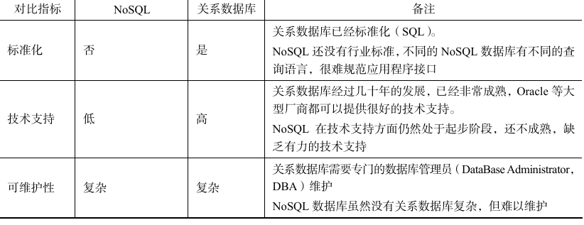

# 数据库基础

## 范式

### 1NF

属性不可再分割，一个字段只能是一个值，是所有关系型数数据库最基本的要求。

### 2NF

在1NF的基础上，消除了非主属性对码的部分函数依赖

### 3NF

在2NF的基础上，消除了非主属性对码的传递函数依赖

## 数据库设计通常分为哪⼏步?  

1. 需求分析 : 分析⽤户的需求，包括数据、功能和性能需求。
2. 概念结构设计 : 主要采⽤ E-R 模型进⾏设计，包括画 E-R 图。
3. 逻辑结构设计 : 通过将 E-R 图转换成表，实现从 E-R 模型到关系模型的转换。
4. 物理结构设计 : 主要是为所设计的数据库选择合适的存储结构和存取路径。
5. 数据库实施 : 包括编程、测试和试运⾏。
6. 数据库的运⾏和维护 : 系统的运⾏与数据库的⽇常维护

# MySQL

## 如何定位慢查询

现象：页面加载过慢、接口压测时间过长（超过1s）

# Redis

## NoSQL 概述

NoSQL是一种不同于关系数据库的数据库管理系统设计方式，是对非关系数据库的统称，它 所采用的数据模型并非传统关系数据库的关系模型，而是类似键值、列族、文等非关系模型。 NoSQL数据库没有定的表结构，通常也不存在连接操作，也没有严格ACID约束。因此， 与关系数据库相比，NoSQL 具有灵活的水平可扩展性，可以支持海量数据存储。此外，NoSQL 数据库支持MapReduce 风格的编程，可以较好地应用于大数据时代的各种数据管理。NoSQL数 据库的出现，一方面弥补了关系数据库在当前商业应用中存在的各种缺陷，另一方面也动了关 系数据库的传统断地位。 

### 为什么需要 NoSQL

+ High performance 高并发读写
+ Huge Storage 海量数据的高效率存储和访问
+ High Scalability && High Availability 高可扩展性和高可用性

### 四大分类

键值数据库、列数据库、文档数据库、图形数据库

### 特点

+ 易扩展：数据库之间没有关系
+ 灵活的数据模型：对大数据量和高性能的读写表现灵活，不需要提前对存储的数据建立字段
+ 大数据量、高性能
+ 高可用

## Redis 概述

是使用 C 语言开发的高性能键值对数据库

支持多种数据类型：字符串、列表、有序集合、散列、集合类型

### Redis 应用场景

+ 缓存
+ 聊天室在线好友列表
+ 任务队列
+ 网站访问统计
+ 数据过期处理
+ 应用排行榜
+ 分布式集群架构中的 session 分离

## Jedis 入门

Jedis 是 Redis 官方首选的 Java 客户端开发包

## Redis 数据结构

### 五种数据类型

+ 字符串 String
+ 字符串列表 list
+ 字符串集合 set
+ 有序字符串集合 sorted set
+ 哈希 hash

Key 定义的注意点：不要过长或最短，有统一的命名规范

