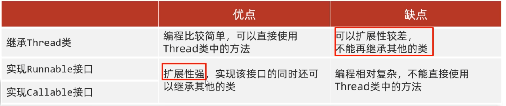

## 多线程与并发

### 并发和并行

并发：在同一时刻，有多个指令在单个CPU上**交替**执行

并行：在同一时刻，有多个指令在单个CPU上**同时**执行

### 多线程的实现方式

1. 继承 Thread 类，重写 run 方法，Class.start() 调用。
2. 实现 Runnable 接口的类，直线 run 方法。

```java
public class MyRun implements Runnable {
    @Override
    public void run() {
        System.out.println("Hello, world!");
    }
}

public class ThreadDemo {
    public static void main(String[] args) {
        MyRun mr = new MyRun();
        Thread t = new Thread(mr);
        t.start();
    }
}
```

3. 利用 Callable 接口，重写 call（有返回值，表示多线程运行的结果），创建 FutureTask 的对象来管理多线程运行的结果，再创建 Thread 类的对象并启动。

```java
public class MyCallable implements Callable<V> { // V表示泛型
    @Override
    public V call() {
        // 运行代码
        return V;
    }
}

public class ThreadDemo {
    public static void main(String[] args) {
        MyCallable mc = new MyCallable();
        FuterTask<V> ft = new FutureTask<>(mc);
        Thread t = new THread(ft);
        t.start();
        
        V value = ft.get(); // 获取结果
    }
}
```

