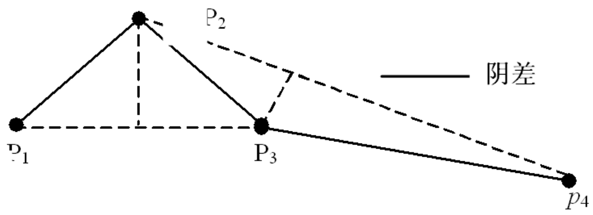
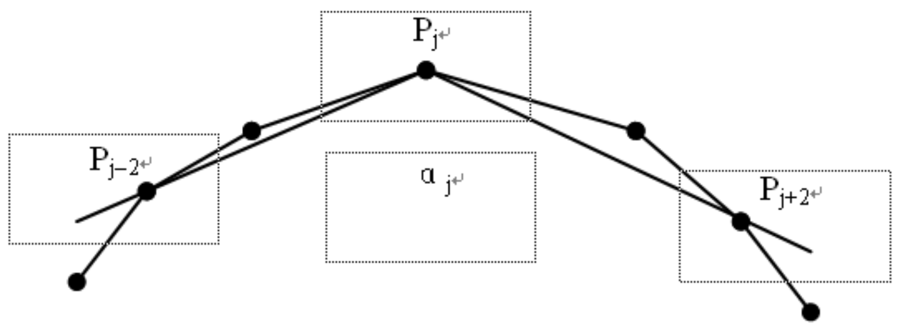
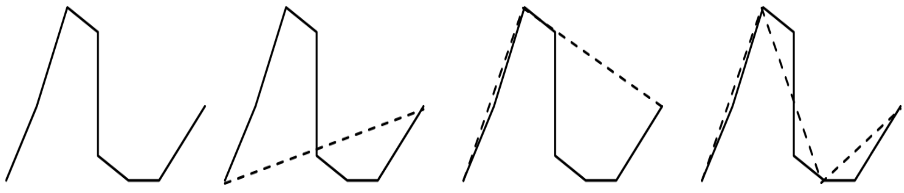

## 名词解释 3分*9个

### 叠加分析

叠置分析（**Overlay Analysis**）：将两层或多层地图要素进行叠加产生一个新要素层的操作，其结果将原来要素分割生成新的要素，新要素综合了原来两层或多层要素所具有的属性。叠置分析不仅生成了新的空间关系，还将输入数据层的属性联系起来产生了新的属性关系。叠置分析是对新要素的属性按一定的数学模型进行计算分析，进而产生用户需要的结果或回答用户提出的问题。

叠置分析包括**3**种类型：

+ 多边形叠置

**UNION**：输出内容是两个输入的所有多边形。

**INTERSECT**：输出内容是两个输入的共同覆盖区域。

**IDENTITY**：以一个输入的边界为准，而将另一个多边形与之相匹配，输出内容是第一个多边形区域内二个输入层所有多边形。

+ 点与多边形叠加

点与多边形叠加，实质是计算包含关系。叠加的结果是为每点产生一个新的属性。

+ 线与多边形叠加

将多边形要素层叠加到一个弧段层上，以确定每条弧段（全部或部分）落在该多边形内。

### LBS

LBS是[基于位置服务](https://baike.baidu.com/item/基于位置服务/22306055?fromModule=lemma_inlink)（Location Based Services）的简称，是利用各类型的定位技术来获取定位设备当前的所在位置，通过移动互联网向定位设备提供信息资源和基础服务。首先用户可利用定位技术确定自身的空间位置，随后用户便可通过移动互联网来获取与位置相关资源和信息。LBS服务中融合了移动通讯、互联网络、空间定位、位置信息、大数据等多种信息技术，利用移动互联网络服务平台进行数据更新和交互，使用户可以通过空间定位来获取相应的服务。

### TIN

不规则三角网 (*triangulated irregular network*) 的首字母缩略词。 一种将地理空间分割为连续的不重叠三角形的矢量数据结构。 每个三角形的折点都是具有 x、y 和 z 值的采样数据点。 这些采样点通过直线连接，形成 Delaunay 三角形。 TIN 用来存储和展示表面模型。

### 拓扑关系

拓扑关系是指地理空间数据中各个要素之间的空间连接、邻接和包含等关系。在GIS中，它不但用于空间数据的组织，而且在空间分析和应用中都有非常重要的意义。

以下是几种基本的拓扑关系：

1. **邻接（Adjacency）**：
   - 指两个地理要素在空间上相邻，但没有共同的边界。例如，两个地块可能共享一个边缘，但它们并不相交。
2. **连接（Connectivity）**：
   - 指两个地理要素在空间上相连，有共同的边界或节点。例如，两条道路在一个交叉口相连。
3. **包含（Containment）**：
   - 指一个地理要素完全包含在另一个要素内部，例如，一个湖泊完全位于一个国家公园内。
4. **交叉（Crossing）**：
   - 指两个地理要素在空间上相交，但不一定连接。例如，两条道路在空间上交叉，但并不在同一个点相连。
5. **接触（Touch）**：
   - 指两个地理要素在空间上仅在一个点上接触，没有更多的共同边界。例如，两个地块可能仅在一条线的端点处接触。
6. **重叠（Overlap）**：
   - 指两个地理要素在空间上有共同的区域，即它们在某个区域内重叠。例如，两个地块可能在某个区域重叠。
7. **分离（Disjoint）**：
   - 指两个地理要素在空间上没有任何接触点，即它们是完全分离的。

拓扑关系在GIS中的重要性体现在以下几个方面：

- **数据质量控制**：通过检查和维护拓扑关系，可以确保数据的一致性和准确性。
- **空间分析**：拓扑关系是进行空间查询、网络分析、区域合并等操作的基础。
- **地图制作**：在地图制作过程中，拓扑关系有助于确保地图的可读性和美观性。
- **自动化处理**：在自动化的GIS处理流程中，拓扑关系有助于定义和执行地理要素之间的空间操作。

### 空间数据

空间数据：空间数据（**Spatial Data**）是指用来表示空间实体的位置、形状、大小及其分布特征诸多方面信息的数据。

它可以用来描述来自现实世界的目标，具有定位、定性、时间和空间关系等特性。定位是指在一个已知的坐标系里空间目标都具有唯一的空间位置；定性是指有关空间目标的自然属性，它伴随着目标的地理位置；时间是指空间目标是随时间的变化而变化；空间关系通常又称拓扑关系。

### 四叉树结构（Quadtree）

Chp02 page47

四叉树（Quadtree）和八叉树（Octree）是两种用于空间数据组织和索引的数据结构，它们主要用于高效地存储和检索空间数据，尤其是在处理栅格数据时。这两种结构都是基于递归分割空间的方法。

**定义**： 四叉树是一种树状数据结构，它将二维空间递归地划分为四个象限（或称为四个子区域）。每个节点代表一个区域，如果这个区域包含多个地理要素或者满足某种条件（如要素数量超过阈值），则这个节点会被进一步划分为四个子节点，每个子节点代表原区域的一个象限。

**特点**：

- 每个节点有四个子节点，分别代表其空间区域的四个象限。
- 递归分割，直到每个节点的区域只包含一个要素或者要素数量低于某个阈值。
- 适用于二维空间数据的索引，如地图上的点、线、面对象。

**应用**： 四叉树常用于空间查询、空间数据的快速访问、图像处理等领域。在GIS中，四叉树可以用于地图的渐进式显示，即根据用户的缩放级别动态加载地图细节。

### 八叉树结构（Octree）

**定义**： 八叉树是一种三维空间数据结构，它将三维空间递归地划分为八个子区域。每个节点代表一个立方体区域，如果这个区域包含多个要素或者满足某种条件，则这个节点会被进一步划分为八个子节点，每个子节点代表原区域的一个八分体。

**特点**：

- 每个节点有八个子节点，分别代表其空间区域的八个八分体。
- 递归分割，直到每个节点的区域只包含一个要素或者要素数量低于某个阈值。
- 适用于三维空间数据的索引，如地形高程数据、三维建筑物模型等。

**应用**： 八叉树在三维空间数据处理中非常有用，例如在地形分析、三维可视化、虚拟现实等领域。它可以帮助快速定位和检索三维空间中的要素，提高数据处理的效率。

### 地图投影

Chp03 page7

GIS中的地图投影是指将地球表面的三维地理坐标（纬度、经度和高度）转换为二维平面坐标的过程。由于地球是一个近似的椭球体，而地图是平面的，因此需要通过某种数学方法将地球表面的地理信息转换到平面上，这个过程就是地图投影。以下是地图投影的一些基本概念：

1. **投影类型**：
   - **圆柱投影**：投影面是一个与地球椭球体相切或相割的圆柱面，然后将圆柱展开成平面。常见的圆柱投影有墨卡托投影。
   - **圆锥投影**：投影面是一个与地球椭球体相切或相割的圆锥面，然后将圆锥展开成平面。常见的圆锥投影有兰伯特共形投影。
   - **方位投影**：投影面是一个平面，与地球椭球体相切于某一特定点，然后将平面展开。常见的方位投影有极方位投影。

2. **投影参数**：
   - **标准纬线**：在某些投影中，选择特定的纬度线作为标准，以减少投影变形。
   - **标准经线**：与标准纬线类似，某些投影会选定特定的经度线作为标准。

3. **投影变形**：
   - 任何地图投影都无法完全避免变形，包括面积变形、形状变形、距离变形和方向变形。不同的投影方法会以不同的方式平衡这些变形。

4. **投影的应用**：
   - 地图投影的选择取决于地图的用途。例如，航海图通常使用墨卡托投影，因为它能保持航线的直线特性；而政治地图可能使用等面积投影，以保持国家面积的比例关系。

5. **投影带**：
   - 为了减少投影变形，GIS中常常将地球划分为若干个投影带，每个投影带使用不同的标准纬线和标准经线进行投影。

6. **GIS中的投影系统**：
   - 在GIS中，地图投影不仅涉及到地理坐标的转换，还包括了坐标系统的管理，如UTM（通用横轴墨卡托）系统，它将地球划分为60个6度宽的带，每个带使用独立的投影。

地图投影是GIS中的一个核心概念，它使得我们能够在地图上准确地表示和分析地理信息。正确的投影选择对于确保地图数据的准确性和可用性至关重要。

### 数字高程模型

数字高程模型（Digital Elevation Model，简称DEM）是通过有限的地形高程数据实现对地面地形的数字化模拟，即地形表面形态的数字化表达。DEM以网格化的方式记录地表各点的高度数值，可以用来模拟地形、分析地貌特征等。它是地理信息系统（GIS）中常用的一种地理数据模型，用于表示地球表面的高程信息。

生成方法：等高线数字化法、地性线数字化法、三角网法、摄影测量法、人工网格法

### 动态缓冲分析

动态缓冲区分析（dynamic buffer analysis）是空间对象对邻近对象的影响随时间和距离变化呈不同程度的扩散或衰减关系时所进行的一种缓冲区分析。这种分析方法不是简单地设定距离参数，而是必须依赖操作对象和要求，选择适用的分析模型，有时还需要对模型作变换。动态缓冲区分析模型参数的确定和缓冲区的建立步骤，可以根据具体的应用场景和要求来设定。

### 空间数据压缩

空间数据压缩是指采用特定的算法和技术减少空间数据的存储量，同时保持数据的有效信息和精度。空间数据压缩的目的是提高存储效率、减少传输时间和带宽需求。

（**1**）间隔取点法

这种方法是每隔**k**个点取一点，或每隔一规定的距离取一点，但首末点一定要保留。这种方法可大量压缩数字化使用连续方法获取的点和栅格数据矢量化而得到的点，但不一定能恰当地保留方向上曲率显著变化的点。

（**2**）垂距法

这种方法是按垂距的限差选取符合或超过限差的点。

（**3**）合并法（偏角法）

这种方法是沿着边界线，逐点计算通过当前点Pj的两条直线Lj1和Lj2之间的夹角αj，其中Lj1是经过Pj和Pj-k0两点的直线，而Lj2是经过Pj和Pj+k0两点的直线。若｜αj｜小于某一阈值α0，那么就认为Pj是一应保留点。

（**4**）分裂法（道格拉斯-普克法）

这种方法可用以下几步来描述：①在给定的曲线的两端之间连一直线。②对曲线上每一点计算它与直线的垂直距离。若所有这些距离均小于某一阈值ε0，那么就用它来表示原曲线。③若②中条件不满足，含有最大垂直距离的点Pj为保留点将原曲线分成两段曲线，对它们递归地重复使用分裂法。

### 矢量数据

矢量结构是通过记录坐标的方式来表示点、线、面等地理实体。

特点：定位明显，属性隐含。

获取方法：

(1) 手工数字化法；

(2) 手扶跟踪数字化法；

(3) 数据结构转换法。

### 栅格数据

栅格结构是以规则的阵列来表示空间地物或现象分布的数据组织，组织中的每个数据表示地理要素的非几何属性特征。

特点：属性明显，定位隐含。

获取方法：

(1) 手工网格法；

(2) 扫描数字化法；

(3) 分类影像输入法；

(4) 数据结构转换法。

### 空间数据质量控制

空间数据的质量控制是针对空间数据的特点来进行的，空间数据的质量主要包括数据完整性 、数据逻辑一致性、数据位置精度、数据属性精度、数据时间精度以及一些关于数据的说明 。空间数据的质量控制就是通过采用科学的方法，制定出空间数据的生产技术规程，并采取一系列切实有效的方法在空间数据的生产过程中，针对空间数据质量的关键性问题予以精度控制和错误改正，以保证空间数据的质量。

空间数据是地理信息系统不可缺少的组成部分，其质量在很大程度上影响和制约着地理信息 系统的可用性，为地理信息系统用户提供满足质量要求的空间数据是地理信息系统建设的关键任务之一。

### 空间元数据

Chp06

在地理空间数据中，元数据是**说明数据内容、质量、状况和其他有关特征的背景信息**。 示例： 传统的图书馆卡片、出版图书的版权说明、磁盘的标签等都是元数据。 纸质地图的元数据主要表现为地图类型、地图图例，包括图名、空间参照系和图廓坐标、地图内容说明、比例尺和精度、编制出版单位和日期或更新日期、销售信息等。

### 空间插值

空间插值，统计学名称，常用于将离散点的测量数据转换为连续的数据曲面，以便与其它空间现象的分布模式进行比较，它包括了空间内插和外推两种算法。

### PaaS、SaaS、IaaS

- **IaaS**：基础设施服务，Infrastructure-as-a-service
- **PaaS**：平台服务，Platform-as-a-service
- **SaaS**：软件服务，Software-as-a-service

https://www.ruanyifeng.com/blog/2017/07/iaas-paas-saas.html

**SaaS 是软件的开发、管理、部署都交给第三方，不需要关心技术问题，可以拿来即用。**普通用户接触到的互联网服务，几乎都是 SaaS，下面是一些例子。

> - 客户管理服务 Salesforce
> - 团队协同服务 Google Apps
> - 储存服务 Box
> - 储存服务 Dropbox
> - 社交服务 Facebook / Twitter / Instagram

**PaaS 提供软件部署平台（runtime），抽象掉了硬件和操作系统细节，可以无缝地扩展（scaling）。开发者只需要关注自己的业务逻辑，不需要关注底层。**下面这些都属于 PaaS。

> - Heroku
> - Google App Engine
> - OpenShift

**IaaS 是云服务的最底层，主要提供一些基础资源。**它与 PaaS 的区别是，用户需要自己控制底层，实现基础设施的使用逻辑。下面这些都属于 IaaS。

> - Amazon EC2
> - Digital Ocean
> - RackSpace Cloud

## 简答题 9分*5个

### 简述3种3D建模的方式和流程

**以下是利用遥感、软件和手工进行3D建模的方法及其技术流程：**

#### 1. 利用遥感进行3D建模

**方法**：

- **数据获取**：通过卫星、无人机或航空摄影获取高分辨率的遥感影像。这些影像可以是光学图像、激光扫描点云等。
- **数据预处理**：对获取的遥感数据进行去云、畸变校正和大气校正，以提高数据质量。
- **特征提取**：利用图像处理技术提取地物特征，进行分割和分类。
- **三维建模**：通过点云重建法或影像匹配技术，将处理后的数据转化为三维模型。例如，使用无人机倾斜摄影技术采集城市影像，并通过软件进行三角量测和纹理映射，从而生成城市的三维模型。

**技术流程**：

1. 确定建模目标和需求。
2. 设计无人机航线并进行影像采集。
3. 进行数据预处理（如匀光、畸变校正）。
4. 使用三维建模软件（如3DSMax）进行空中三角量测和纹理映射。
5. 输出最终的三维模型。

#### 2. 利用软件进行3D建模

**方法**：

- **软件选择**：使用专业的3D建模软件，如Blender、3ds Max、Maya等。

- **建模过程**：
- **基础模型创建**：从简单的几何体开始，逐步构建模型的基本形状。
  - **细节雕刻**：使用雕刻工具添加细节特征，如纹理、凹凸等。
- **UV展开与贴图**：将模型表面映射到二维平面，绘制纹理贴图。
  - **材质与灯光设置**：为模型分配材质，调整灯光以增强视觉效果。

**技术流程**：

1. 概念设计，收集参考资料。
2. 在选定的软件中创建基础模型。
3. 细化模型，添加细节。
4. 进行UV展开和贴图绘制。
5. 设置材质和灯光，进行渲染和后期处理。

#### 3. 手工进行3D建模

**方法**：

- **数据采集**：利用GNSS-RTK或全站仪进行现场测量，获取物体的几何数据。
- **建模软件**：使用传统的3D建模软件（如SketchUp、3ds Max）进行手工建模。
- **模型创建**：根据测量数据在软件中构建三维模型，手动添加纹理和细节。

**技术流程**：

1. 现场数据采集，获取物体的几何信息。
2. 在建模软件中创建基础模型。
3. 手动调整模型细节，添加纹理。
4. 完成模型后进行渲染和输出。

**关于3D建模的方式和流程，以下是几种常见的3D建模技术和相应的流程：**

1. **多边形建模（Polygon Modeling）**：
   - 多边形建模是目前三维软件中比较流行的建模方法。它的基本原理是以两点构成一条边，再由三条或更多条边构成一个面，最后由多个面构成一个体。
   - 流程通常包括：创建基础几何体、细化模型、添加细节、材质贴图和渲染。

2. **NURBS曲面建模（NURBS Modeling）**：
   - NURBS建模基于数学曲线和曲面，能够创建非常光滑且在数学上精确的曲面。适合创建如汽车、飞机和数码产品等具有复杂曲面的物体。
   - 流程涉及定义曲线、构建曲面、调整控制点和权重、以及最终的渲染和材质应用。

3. **参数化建模（Parametric Modeling）**：
   - 参数化建模使用参数和规则来定义三维物体的形状和特征。这种方法允许设计师通过修改参数来快速迭代和优化设计，非常适合于产品设计和工程领域。
   - 流程包括定义参数、构建模型、参数调整、模型优化和输出。

4. **逆向工程建模（Reverse Engineering Modeling）**：
   - 逆向工程建模是通过3D扫描仪扫描现有的物体或结构，然后使用3D建模软件创建其数字副本。
   - 流程包括3D扫描、数据预处理、模型重建、验证和优化。

5. **点云建模（Point Cloud Modeling）**：
   - 点云建模是通过3D扫描技术获取大量点的坐标信息，然后使用这些点来构建三维模型。
   - 流程涉及点云数据采集、数据预处理、点云到网格的转换、模型细化和渲染。

6. **传统人工建模**：
   - 传统三维建模通常使用如3dsMax、Google Sketchup等建模软件，基于CAD二维矢量图、影像数据或者手工拍摄的照片估算建筑物的轮廓和高度信息进行人工建模。
   - 流程包括概念设计、建模、材质贴图、渲染和后期处理等。

7. **三维激光扫描建模**：
   - 三维激光扫描技术以非接触式激光、照相、白光等方式扫描立体的物品获得大量点云数据，通过对点云数据进行配准、降噪、提取、封装等一系列操作构建三角网模型，再重新建构曲面模型。
   - 流程包括现场扫描、数据处理、模型构建和纹理映射。

8. **数字近景摄影测量建模**：
   - 数字近景摄影测量技术是针对100米范围内目标所获取的近景图像进行自动匹配、空三解算、生成点云、纹理映射等一系列操作来构建三维模型。
   - 流程包括图像采集、图像处理、点云生成、模型构建和纹理映射。

9. **倾斜摄影测量建模**：
   - 利用无人机的优势以及倾斜摄影技术，可以快速准确的对一片区域进行实景建模。通过在同一飞行平台上搭载多角度相机，同时从垂直、倾斜等不同的角度采集影像，获取地面物体更为完整准确的信息。
   - 流程包括飞行拍摄、影像处理、模型生成和后期优化。

这些建模技术和流程各有特点，适用于不同的应用场景和需求。

### 3种空间分析方法（最短路径）

在GIS中规划最佳路径时，会用到以下几种空间分析方法：

1. **成本距离分析（Cost Distance）**：
   - 该方法确定的是各像元距最近源位置的最短加权距离，或者说是累积行程成本。在路径规划中，可以根据成本面上的最小累积成本提供栅格中每个像元到最近源的距离。
2. **成本路径分析（Cost Path）**：
   - 使用成本距离和回溯链接栅格数据，可以求得从起点到终点的最短成本路径。这种方法适用于在权重（成本）不同的栅格表面上寻找路径。
3. **坡度和起伏度分析**：
   - 在地形分析中，坡度和起伏度是影响路径选择的重要因素。通过计算DEM（高程数据）的坡度和起伏度，并将其作为成本因素纳入路径分析中，可以找到更合理的路径。
4. **栅格计算（Raster Calculator）**：
   - 利用栅格计算器合并不同的成本数据集，如坡度、起伏度和河流成本，来生成最终的成本数据集。这个成本数据集可以用来计算成本距离和成本路径。
5. **网络分析（Network Analysis）**：
   - 在GIS中，网络分析工具可以用来规划最佳路径，特别是在道路网络中。这种方法可以考虑到道路的连通性、方向性以及交通规则等因素。
6. **Dijkstra算法和A\*算法**：
   - 这些是经典的路径搜索算法，可以在网络中找到两点之间的最短路径。Dijkstra算法适用于所有边权重相等的情况，而A*算法则适用于边权重不等的情况。
7. **基于采样的规划算法**：
   - 如RRT（Rapidly-exploring Random Tree）、RRT*（RRT with optimization）等，这些算法利用随机采样的方法来生成路径，特别适用于复杂和动态的环境。
8. **智能仿生学算法**：
   - 包括蚁群算法、神经网络算法、粒子群算法、遗传算法等，这些算法通过模仿自然界的行为来解决路径规划问题。

空间分析是地理信息系统（GIS）中的一个重要组成部分，它涉及到对地理空间数据的分析和解释。以下是几种常用的空间分析方法：

1. **缓冲区分析（Buffer Analysis）**：
   - 缓冲区分析是一种基于距离的分析方法，它为地图上的一个或多个要素创建一个指定距离的区域。这个区域可以是圆形、多边形或其他形状，常用于影响范围的评估，例如，确定一个工厂周围的污染影响范围。

2. **叠加分析（Overlay Analysis）**：
   - 叠加分析是将两个或多个不同主题的图层进行空间叠加，以产生一个新的图层，这个新图层包含了叠加区域的属性信息。这种方法常用于土地利用规划、环境影响评估等，例如，将土壤类型图和土地利用图进行叠加，以确定适宜的农业用地。

3. **网络分析（Network Analysis）**：
   - 网络分析主要用于道路网络、水流网络等线性要素的分析。它可以计算最短路径、服务区域、设施选址等问题。例如，GIS可以用来确定从一点到另一点的最快路线，或者确定在紧急情况下资源的最佳分配。

4. **空间插值（Spatial Interpolation）**：
   - 空间插值是一种估计未知位置点属性值的方法，它基于已知点的数据。这种方法在地理空间数据不完整时非常有用，例如，根据几个气象站的降雨量数据来估计整个区域的降雨分布。

5. **热点分析（Hot Spot Analysis）**：
   - 热点分析用于识别空间数据中的聚集现象，即在某个区域内某种现象的发生频率异常高。这在犯罪分析、疾病传播等领域非常有用，例如，识别犯罪高发区域或疾病爆发的热点地区。

6. **空间统计分析（Spatial Statistical Analysis）**：
   - 空间统计分析涉及使用统计方法来分析空间数据，以识别模式、趋势和关系。这包括空间自相关分析、空间回归分析等，用于理解空间数据的分布特征和空间依赖性。

7. **地形分析（Terrain Analysis）**：
   - 地形分析涉及对地形数据的分析，包括坡度、坡向、水流方向、视域分析等。这些分析有助于理解地形对水流、视线、交通等的影响。

这些方法在GIS中被广泛应用，它们帮助用户从空间数据中提取有价值的信息，支持决策制定和问题解决。

### 常用地图投影以及比例尺；常见误差和影响因素

关于我国常用的地图投影、比例尺以及常见误差和影响因素，以下是详细的说明：

#### 常用地图投影
1. **高斯-克吕格投影（Gauss-Kruger）**：这是我国基本比例尺地形图（1:100万、1:50万、1:25万、1:10万、1:5万、1:2.5万、1:1万、1:5000）除1:100万以外均采用的投影方式。它是一种横轴等角切圆柱投影，也称为横轴墨卡托投影。

2. **兰伯特投影（Lambert）**：1:100万地形图采用兰伯特投影，这是一种正轴等角割圆锥投影，适用于小于1:100万的地图。

3. **墨卡托投影（Mercator）**：海上小于50万的地形图多用墨卡托投影，这是一种正轴等角圆柱投影。

4. **阿伯斯投影（Albers）**：属于同一投影系统的Albers投影（正轴等积割圆锥投影）也常用于我国大部份省区图以及大多数这一比例尺的地图。

#### 比例尺
我国规定的国家基本比例尺地形图包括1:500、1:1000、1:2000、1:5000、1:1万、1:2.5万、1:5万、1:10万、1:25万、1:50万、1:100万。

#### 常见误差和影响因素

地图投影的误差主要来源于地球的曲率和地图平面之间的转换，以下是一些常见的误差和影响因素：

1. **长度变形**：在高斯-克吕格投影中，中央子午线长度变形比为1，其他任何点长度比均大于1。在同一条经线上，长度变形随纬度降低而增大，在赤道处最大。在同一条纬线上，离中央经线越远，变形越大，最大值位于投影带边缘。

2. **面积变形**：兰伯特投影和阿伯斯投影是等面积投影，即投影区域面积保持与实地相等，但其他投影可能会有面积变形。

3. **角度变形**：墨卡托投影没有角度变形，由每一点向各方向的长度比相等，而其他投影可能会有角度变形。

4. **投影带的影响**：为了控制变形，我国地图采用分带方法。1:1万及更大比例尺地形图采用3°分带，1:2.5万至1:50万地形图采用6°分带。

5. **比例尺的影响**：不同比例尺的地图会有不同的细节展示和精度，大比例尺地图内容详细，几何精度高，而小比例尺地图内容概括性强。

这些误差和影响因素需要在地图制作和使用过程中予以考虑，以确保地图的准确性和可用性。

### gis的组成和功能（结合实例）

GIS（地理信息系统）是一种用于捕捉、存储、分析、管理和展示地理空间数据的系统。GIS的组成和功能可以通过一个具体的实例来说明，比如城市规划中的GIS应用。

#### GIS的组成

1. **硬件**：
   - **服务器和工作站**：用于存储和处理大量地理数据。
   - **移动设备**：如GPS设备，用于现场数据采集。
   - **网络设备**：支持数据的远程访问和传输。

2. **软件**：
   - **操作系统**：如Windows、Linux等，为GIS软件提供运行环境。
   - **数据库管理系统**：如Oracle、MySQL等，用于存储和管理空间和非空间数据。
   - **GIS软件**：如ArcGIS、QGIS等，提供数据输入、管理、分析和可视化功能。

3. **数据**：
   - **空间数据**：包括矢量数据（点、线、面）和栅格数据（像素）。
   - **属性数据**：与空间数据相关联的非空间信息，如人口统计、土地利用类型等。
   - **遥感数据**：通过卫星或航空摄影获取的图像数据。

4. **人员**：
   - **GIS分析师**：负责数据的分析和解释。
   - **数据管理员**：负责数据的维护和更新。
   - **技术开发人员**：负责GIS系统的开发和维护。

5. **方法**：
   - **数据采集方法**：如实地调查、遥感技术。
   - **数据分析方法**：如空间插值、网络分析、缓冲区分析等。

#### GIS的功能

以城市规划为例，GIS的功能可以体现在以下几个方面：

1. **数据集成与管理**：
   - 集成不同来源的空间和非空间数据，如土地利用图、人口分布、交通网络等。
   - 管理数据的版本和更新，确保数据的一致性和准确性。

2. **空间分析**：
   - **缓冲区分析**：为城市基础设施（如学校、医院）创建服务区域，评估服务覆盖范围。
   - **网络分析**：规划交通网络，计算最佳路径，评估交通流量。
   - **地形分析**：分析地形对城市排水系统的影响。

3. **规划与决策支持**：
   - 利用GIS进行土地利用规划，评估不同规划方案的可行性。
   - 支持环境影响评估，预测开发项目对环境的影响。

4. **可视化与展示**：
   - 制作地图和三维模型，直观展示城市规划方案。
   - 通过GIS软件生成报告和图表，辅助决策。

5. **共享与协作**：
   - 通过GIS服务器和网络技术，实现数据和分析结果的共享。
   - 支持跨部门协作，提高规划效率。

6. **监测与更新**：
   - 利用遥感数据监测城市发展变化，及时更新GIS数据库。
   - 跟踪城市基础设施的使用状况，为维护和升级提供依据。

通过这个实例，我们可以看到GIS不仅仅是一个技术工具，它还是一个集成了多种功能的平台，能够支持复杂的决策过程，提高城市规划和管理的效率和质量。

### 数字高程模型的应用（举例说明）

数字高程模型（DEM）在多个领域有着广泛的应用，以下是一些具体的实例：

1. **城市规划**：
   - 在城市规划中，DEM提供了地形起伏、坡度、坡向等关键信息，成为规划决策的重要支持工具。例如，通过对DEM数据的分析，可以准确地判断出一个地区的潜在洪水影响区域，为制定洪水控制和应对措施提供决策支持。
   - DEM数据还可以用于分析规划区的水土流失敏感性、城市建设的适宜性；提取的等高线和坡度分布信息，可以作为规划道路选线的依据；提取的坡向信息，可以作为城市建设用地布局以及人工林草建设的参考依据。

2. **环境监测**：
   - DEM作为环境监测的基础数据源之一，有助于提高监测的精确性和效率。利用DEM数据可以计算坡度、坡向，这些参数对于洪水风险评估、土壤侵蚀模型等环境监测任务至关重要。
   - 在农业监测项目中，高分辨率的DEM可以提供精确的地形坡度和排水条件，对于制定精准农业策略至关重要。在自然灾害监测，比如洪水和滑坡，高分辨率的DEM可以用来分析地表水的流动路径和潜在的危险区域。

3. **防灾减灾**：
   - 通过DEM，可以模拟降雨或河流水位上涨后的洪水传播路径，预测可能受影响的区域。
   - 基于DEM的坡度分析可以识别出潜在的滑坡危险区。
   - 在地震发生后，利用DEM分析地形变化，可以评估地震对地表的影响，如断层错动、地面塌陷等。

4. **军事用途**：
   - 利用DEM进行战场地形模拟，帮助制定战术决策。
   - 高精度的DEM可以用于制作详细的军事地图，辅助部队行动。

5. **水文分析**：
   - 基于DEM的地表水文分析可以提取地表水流径流模型的水流方向、汇流累积量、水流长度、河流网络，以及对研究区的流域进行分割等。
   - 通过对这些基本水文因子的提取和基本水文分析，可以在DEM表面之上再现水流的流动过程，最终完成水文分析过程。

这些实例展示了DEM在不同领域的应用价值，从城市规划到环境监测，再到防灾减灾和军事应用，DEM都发挥着重要作用。

### 举例说明信息化模型及其应用

信息化模型是指利用信息技术对现实世界中的实体或系统进行数字化表达和处理的模型，它在多个领域都有广泛的应用。以下是一些具体的应用实例：

1. **建筑设计与管理（BIM技术）**：
   - 在建筑设计领域，BIM（建筑信息模型）技术是信息化模型的一个重要应用。BIM技术通过创建建筑项目的三维模型，集成了建筑设计、施工和运营的全生命周期信息。这种模型不仅提高了设计精度和效率，还优化了空间使用，并支持多种分析功能，如日照分析、能耗评估等。
2. **智慧城市建设**：
   - 3D城市模型在智慧城市建设中发挥着重要作用。通过整合各种传感器和摄像头获取的数据，3D城市模型可以对城市活动进行可视化分析，帮助改善城市规划和设施管理。例如，可以进行人流模拟以优化城市活动路线，或在商业设施中进行数字孪生化，实现线上线下的联动。
3. **农业物联网**：
   - GIS技术结合信息化模型在农业领域提供了精准农业的解决方案。通过分析土地变化和作物生长条件，信息化模型帮助农民做出更好的种植决策，提高作物管理效率。
4. **公用事业管理**：
   - 信息化模型在公用事业领域，如电力和水务管理中，提供了准确的预测和规划工具。通过地理空间数据分析，公用事业公司能够预测和应对极端天气事件，优化能源分配和灾害响应。
5. **数字孪生技术**：
   - 数字孪生技术通过创建物理资产的数字副本，使得在虚拟环境中对这些资产进行模拟和分析成为可能。这在制造业、医疗、城市规划等领域都有应用，例如，通过模拟手术过程来提高手术成功率，或在城市规划中测试不同的设计方案。
6. **交通与物流**：
   - 在交通领域，信息化模型可以用于交通流量分析、路线规划和交通管理。例如，通过分析交通数据，可以优化交通信号控制，减少拥堵。
7. **环境监测与保护**：
   - 信息化模型在环境监测中用于分析环境变化，如森林覆盖、水资源分布等，为环境保护和自然资源管理提供决策支持。

这些例子展示了信息化模型如何通过集成和分析地理空间数据，为不同行业提供决策支持和优化运营管理。随着技术的进步，信息化模型的应用将更加广泛和深入。

### 软件工程的角度，总体设计内容

在软件工程中，GIS（地理信息系统）的总体设计是构建GIS系统的关键阶段，其主要内容包括以下几个方面：

1. **体系结构设计**：
    - 总体设计需要确定GIS系统的体系结构，包括不同发展阶段的架构技术，如面向过程的架构（POA）、面向系统的架构（EOA）和面向服务的架构（SOA）。
2. **模块设计**：
    - 设计GIS系统的总体模块，包括功能模块的划分和模块间的接口关系。模块设计应遵循结构化设计方法，强调自顶向下、逐步求精的设计策略。
3. **软硬件配置**：
    - 总体设计需要考虑软硬件的配置，包括服务器、存储设备、网络设施以及GIS软件的选择和配置。
4. **应用模型设计**：
    - 设计GIS系统中应用模型的特点、作用及分类，这些模型是GIS系统功能实现的核心。
5. **地理编码设计**：
    - 地理编码是GIS系统中的一个重要组成部分，总体设计需要考虑地理编码的作用、原则和步骤。
6. **用户界面设计**：
    - 用户界面设计是GIS总体设计的重要组成部分，它包括界面布局、交互元素设计、响应式设计等，以提升用户体验和系统的易用性。
7. **数据设计**：
    - 将系统分析阶段建立的信息域模型转换为软件实现中所需的数据结构，包括空间数据和属性数据的组织方式。
8. **接口设计**：
    - 设计模块之间的接口，确保模块间的有效通信和数据交换。
9. **系统功能需求分配**：
    - 根据系统的功能需求，将不同的功能分配给软件结构中的相应模块。
10. **设计原则和准则**：
    - 遵循统一的设计原则和标准，如完备性、标准化、系统性、兼容性、通用性、可靠性、实用性和可扩充性。
11. **GIS功能模块划分**：
    - 根据数据的处理流程，将GIS的功能划分为数据输入、数据管理、数据处理、空间分析和数据输出等模块，并设计每个模块的功能和作用。

总体设计是GIS系统建设的基础和关键，它直接影响到系统的性能、可维护性和扩展性。通过总体设计，可以将系统需求转换为具体的数据结构和软件体系结构，为后续的详细设计和实现打下坚实的基础。

### 以网络分析，智慧交通的应用

基于网络分析的智慧交通应用主要涉及以下几个方面：

1. **交通流量预测与信号控制**：
    - 利用AI技术和大数据分析，系统可以从历史交通数据中学习和预测未来的交通流量，帮助城市管理者优化交通流量，提升市民的出行体验。例如，纽约市采用深度学习模型对交通流量进行预测，有效减少了高峰期的交通拥堵。
2. **智能交通信号控制**：
    - 利用AI技术实时调整信号灯以优化交通流量。这种系统可以根据当前道路状况动态调节绿灯时长，以减少等待时间和交通拥堵。例如，在洛杉矶，AI控制的交通信号系统使交通流量提高了30%。
3. **车流监测与事故检测**：
    - 通过监控系统实时识别交通违规行为，并及时处理，提升交通安全。同时，监测车流情况，快速响应交通事故，减少因事故造成的交通拥堵。
4. **停车管理与导航**：
    - 智慧交通系统通过GPS定位和实时交通信息，提供公交车的实时位置和到站时间，帮助乘客合理安排出行时间。同时，整合多种交通方式和出行服务，提供一站式的出行服务和支付平台，方便用户进行出行规划和支付。
5. **公共交通优化**：
    - 智慧交通系统通过智能调度系统，对公交线路、车辆进行规划调度，实现智能排班，提升商业车辆、公共汽车和出租车的运营效率。
6. **无人驾驶与车联网技术**：
    - 自动驾驶汽车通过AI系统的运算，可以实现高效、安全的驾驶体验，减少人为失误，提高道路通行能力。车联网技术使得交通设施、车辆和道路之间能够实现信息的互联互通，提升交通管理的效率与精准度。
7. **智慧路况监测**：
    - 基于5G+C-V2X网络构建的智能路况监测平台可实现道路环境监控、流量分析、基础设施故障监控、智慧执法等业务。智能路侧设备对路面积水、路面结冰、雾霾天气、施工维护、隧道实景、车道异物、事故提醒、车速管控交通路况实施采集，通过5G网络将信息上传至云平台实时分析决策后，再通过5G和C-V2X将信息下发给车辆和行人。

这些应用展示了智慧交通如何利用网络分析和相关技术来提升交通管理的效率和安全性，改善城市交通状况，并为市民提供更便捷的出行服务。

## 综合题 14分*2个

### GIS在AI、LLM、BigData中的作用；AI、LLM、BigData对GIS有什么帮助？

GIS（地理信息系统）与LLM（大型语言模型）的结合为地理空间数据分析和应用带来了新的视角和能力。以下是GIS在LLM中的应用以及LLM对GIS的帮助的具体实例：

**GIS在LLM中的应用：**

1. **智能化地理数据分析**：
   - LLM可以通过自然语言处理技术理解和生成有关地理空间数据的描述性语言，使非专业人士也能轻松理解复杂的GIS数据。例如，自动生成某地区的地理特征描述或解释某一现象的地理背景。

2. **智能导航和规划**：
   - 结合LLM和GIS，可以为用户提供更加智能和个性化的导航服务。用户可以用自然语言描述他们的需求，系统会根据用户的需求和地理位置提供最佳建议。

3. **地理问答系统**：
   - 通过将LLM与GIS结合，可以开发一个地理问答系统，用户可以用自然语言提问关于地理知识的问题，系统会基于地理信息平台的数据给出准确的答案。

4. **地理数据分析和可视化**：
   - LLM可以帮助用户更轻松地分析和理解地理数据，例如，用户可以用自然语言请求分析某个区域的人口分布或经济数据等。

**LLM对GIS的帮助：**

1. **数据采集与处理**：
   - 利用LLM，可以实现遥感影像的智能解译，提高地理信息的采集效率。例如，通过深度学习算法，自动识别和分类遥感影像，提高地图的更新速度。

2. **空间分析**：
   - LLM可以助力GIS进行更加高效的空间分析。例如，利用机器学习算法，实现对地理现象的智能预测，为城市规划、灾害预警等提供有力支持。

3. **地图制作与可视化**：
   - LLM可以在地图制作和可视化方面发挥重要作用。例如，通过自然语言处理技术，实现地图注记的智能生成，提高地图的可读性。

4. **增强大语言模型的空间认知能力**：
   - 通过集成基础地理空间分析工具和其他地理模型，改善了LLM对于空间认知能力的不足，使其在原有文本语义理解能力的基础上，能够更深入地理解和分析地理空间数据。

5. **降低GIS专业应用的操作门槛**：
   - LLM的集成使得非专业人员也能轻松进行制图和地理空间分析，降低了GIS专业应用的操作门槛。

6. **结果可视化**：
   - 传统的语言模型以纯文本聊天的形式存在，缺乏直观的结果展示能力。LLM结合GIS可以提供丰富的可视化手段，多维度展现空间分析的结果。

综上所述，GIS与LLM的结合不仅提升了地理空间数据的分析和应用能力，也使得地理信息的交互和理解变得更加直观和便捷。

**GIS结合AI和大型语言模型（LLM）等技术，在救援任务中发挥着越来越重要的作用：**

- **实时监控与数据分析**：GIS技术可以实时监控灾害现场的情况，收集并分析大量实时数据，这些数据有助于了解灾害的实时进展，并预测可能的趋势，为应急决策提供科学依据。
- **资源优化配置**：GIS能够准确掌握各类救援资源的位置、数量和状态，通过数据分析和模拟，实现资源的科学调度和优化配置，提高救援效率。
- **风险评估与预防**：利用GIS技术，可以对城市的各类灾害风险进行评估，如火灾、交通事故和洪水等。通过识别潜在风险区域和制定相应的预防措施，可以显著降低灾害的发生概率和影响程度。
- **决策支持可视化**：GIS技术的可视化功能使得决策者能够直观地了解灾害现场的情况和救援进展。通过电子地图和数据的有机结合，决策者可以更加科学、合理地制定救援方案，提高决策效率和准确性。
- **协同作战能力提升**：GIS技术可以促进各部门、各单位之间的信息共享和沟通协作。通过实时更新和共享灾害现场的信息，各部门可以更加紧密地配合，形成合力，提高救援的整体效率。
- **智能化预测与响应**：通过引入人工智能和机器学习算法，GIS技术能够对海量的矿山数据进行更深入的分析和挖掘，自动识别潜在的风险模式和规律，智能预测矿山事故的发生概率和可能影响范围，为提前制定应急预案提供更精准的依据。
- **与物联网技术的深度融合**：传感器、智能设备等物联网终端收集的实时数据，如矿山内部的环境参数、设备运行状态等，能够与GIS平台无缝对接，使得应急指挥中心能够近乎实时地掌握矿山的动态变化，及时发现异常情况并做出快速响应。

**大数据对GIS的影响主要体现在以下几个方面：**

- **提升空间信息处理能力**：大数据与GIS的融合进一步提升了空间信息处理能力，让空间大数据的价值挖掘变得简单，推动地理智慧的更大提升。
- **推动GIS软件基础能力提升**：大数据与GIS的融合对GIS软件的能力有了更高的要求，势必将推动GIS软件基础能力的提升。

**GIS在大数据中的作用包括：**

- **数据整合与管理**：GIS技术能够整合矿山基础数据，实现数据的标准化、一体化管理，提高数据管理效率。
- **风险监测评估与预警**：GIS技术通过空间分析为风险监测评估与预警提供科学依据；可发挥其资源统筹优势，辅助人员与设备定位，实现救援车辆和人员的实时监控，优化救援路径，提高救援效率。
- **支持多领域业务智能化应用**：GIS技术将更加注重跨领域的合作和数据共享，与地质、气象、环保等相关领域的系统进行集成，整合更多元化的数据资源，为应急提供更全面、综合的决策支持。
- **解决大数据难题和挑战**：GIS技术需要解决体量庞大且多来源的时空数据的汇聚和存储、多维度、多结构时空数据治理和管理、高效应用算力资源实现分布式运算等难题和挑战。

### 选址步骤

### GIS在某行业（如国土资源）中的应用

GIS在国土资源行业的应用非常广泛，以下是一些具体的作用和实例：

1. **资源调查与规划**：
   - GIS能够帮助国土资源管理部门进行资源调查与规划工作。通过收集、整理和分析地理数据，可以更好地了解国土资源的分布、类型、数量和质量等信息，为资源保护和合理开发提供科学依据。例如，在水资源调查中，GIS可以帮助确定水源地、水域范围、地下水脉络、河流水系等要素，构建水资源空间数据库，实现对水资源的动态监测与管理。

2. **环境评估与管控**：
   - GIS在国土资源调查中的环境评估与管控工作也非常重要。通过收集、分析和展示环境要素的地理数据，可以评估环境质量、监测污染源、预测环境变化，并提出相应的环境治理方案。例如，在某城市的工业区开展环境评估工作时，GIS可以帮助确定工业企业的分布情况、排放污染物的路径与扩散范围等，实现对环境质量的快速评估与管控。

3. **土地利用与管理**：
   - GIS在土地利用与管理中的应用也十分广泛。通过收集、整理和分析土地利用数据，可以为国土资源的合理利用和保护提供参考依据。例如，在某地区进行土地利用调查时，GIS可以帮助确定土地的类型、利用状况、土地所有权等信息，并进行土地利用规划。

4. **土地资源管理**：
   - GIS可以用于土地用途管制、土地整治、土地评估、土地资源调查、土地利用规划等方面。GIS可以帮助各级政府部门进行土地用途管制，避免乱占土地现象的出现，并对各种土地资源进行分类，实现土地的合理开发。

5. **国土空间规划**：
   - GIS在国土空间规划中的应用包括地形分析、资源管理和环境保护等多个方面。GIS的运用主要集中在数据的收集和分析，这是GIS应用的一个关键环节。通过GIS系统进行数据的整合与分析，可以产生地图、数字高程模型等相关的研究成果，为国土空间规划提供决策支持。

6. **数字化国土空间治理**：
   - 超图软件利用数字化、网络化、智能化手段，建立了国土空间基础信息平台及国土空间规划监测评估预警管理系统。这个系统汇聚全域全要素资源，构建自然资源一张图，并依托大平台、一体化应用架构，服务自然资源全业务。

7. **提高管理效率和透明度**：
   - 有了基于GIS技术构建的国土资源管理系统后，各级政府部门可以轻松摸清国土资源家底；国土管理业务人员可以轻松查找土地权属，普通百姓可以在网上看到城市基准地价和土地分等定级信息，让土地管理透明化。

综上所述，GIS在国土资源行业中的应用不仅提高了管理效率和决策的科学性，还增强了公众对国土资源管理的了解和参与。

### GIS在导航系统中有什么作用

GIS在导航系统中扮演着至关重要的角色，其主要作用可以概括为以下几点：

1. **数据采集与管理**：
   - GIS能够采集和整理来自不同来源的地理数据，包括道路网络、兴趣点（POI）等，并将其转换成统一的数据格式供导航系统使用。同时，GIS还负责对这些数据进行有效的存储和管理，以便于后续的数据更新和维护工作。

2. **路网分析**：
   - 利用GIS技术，导航系统可以对道路网络进行分析和建模，快速计算出不同路段的通行时间、拥堵情况等信息。这样，导航系统就能够根据实时的交通状况，为用户提供最佳的导航路线，避免拥堵和延误。

3. **位置定位**：
   - GIS结合全球定位系统（如GPS、北斗等）实现对用户位置的准确定位。GIS不仅能够提供经纬度坐标信息，还能结合地理数据为用户提供周边环境信息，例如附近的餐饮、加油站等场所的位置和服务信息。

4. **实时导航与路径规划**：
   - GIS在车辆导航监控中提供图形化的人机界面，用户可以在矢量电子地图上进行缩小、放大和地图漫游等操作。用户还可以进行地理实体的查询，并在电子地图上进行路径规划，选择最短路径。GIS能够实时、准确地显示车辆的位置，跟踪车辆的行驶过程，为车辆等交通工具提供实时具体的导航监控服务。

5. **地图制作与空间分析**：
   - GIS用于卫星导航系统的地图制作，将卫星影像和地理数据融合，生成精确的地图产品。GIS的空间分析功能，如迭加分析、地形分析和最短路径优化分析等，为导航系统提供核心支持。

6. **提高交通效率与安全**：
   - 基于GIS和GPS技术的车载导航监控系统能够提高交通系统效率和交通安全，降低交通拥挤，减轻空气污染和节省能源。这使得交通基础设施能够发挥出最大的效能，提高服务质量，使社会能够高效地使用交通设施和资源，从而获得巨大的社会经济效益。

综上所述，GIS在导航系统中的作用是多方面的，它不仅提供了数据支持和位置定位功能，还通过路网分析和路径规划等空间分析功能，极大地增强了导航系统的实用性和准确性。

### 3S 的综合应用

1. **车辆导航与车辆监控系统**：
    - 这是一个集成了GPS、GIS和遥感技术的综合应用。GPS提供车辆的精确定位，GIS用于存储和管理车辆的位置数据，并在电子地图上显示车辆的实时位置，遥感技术则可以提供道路状况的图像信息，如交通拥堵情况。这些技术的综合使用，使得车辆导航系统能够提供最优路径规划，同时车辆监控系统能够实时监控车辆状态，提高运输效率和安全性。
2. **海洋资源开发**：
    - 在海洋资源开发中，3S技术可以用于监测海洋环境变化、评估资源分布和制定开发计划。遥感技术通过卫星影像监测海洋表面温度、洋流和污染物分布；GIS技术用于整合和分析这些数据，制定资源开发和环境保护的策略；GPS技术则用于精确定位海上平台和船只，确保资源开发的精确性和安全性。
3. **精细农业发展**：
    - 3S技术在精细农业中应用广泛，遥感技术可以监测作物生长状况、土壤湿度和病虫害情况；GIS技术用于管理农田数据，分析作物生长模式和产量预测；GPS技术则用于指导农业机械的精准播种和施肥，提高农业生产效率和作物产量。
4. **土地研究**：
    - 在土地研究中，3S技术可以用于土地利用变化监测、土地资源评估和城市规划。遥感技术提供土地覆盖和土地利用的动态变化数据；GIS技术用于分析土地利用模式和变化趋势；GPS技术则用于实地勘测和土地边界的精确划定。
5. **环境监测**：
    - 3S技术在环境监测中发挥重要作用，遥感技术用于获取大范围的环境数据，如森林覆盖、水质状况和大气污染；GIS技术整合这些数据，进行环境影响评估和制定环境保护措施；GPS技术则用于监测环境监测设备的精确位置和移动轨迹。

这些实例展示了3S技术的综合应用在多个领域中的重要性和有效性，它们通过提供精确的空间数据和分析工具，支持决策、规划和管理。