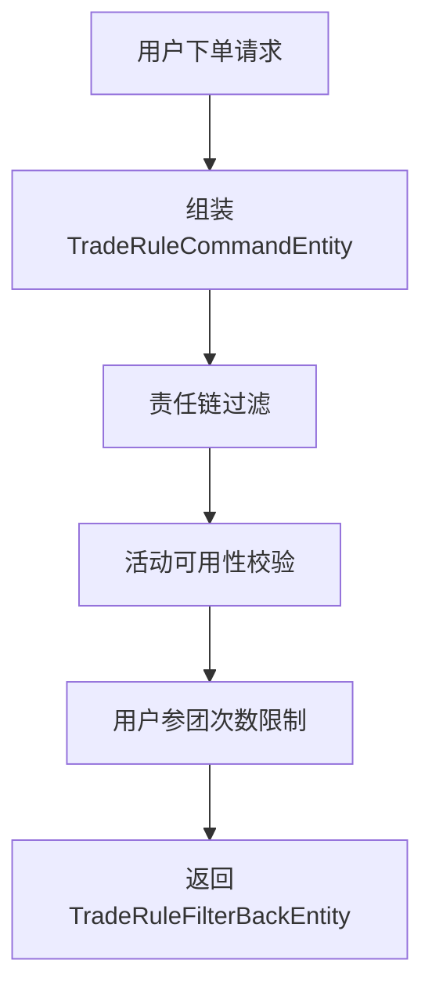

# 2-11 交易规则责任链过滤

## 一、业务背景与目标
交易规则责任链过滤用于在团购交易流程中，对用户下单、活动参与等关键环节进行规则校验和过滤，确保业务合规、风控有效，并支持灵活扩展和动态调整。

## 二、核心流程梳理


1. **请求发起**：用户在团购活动中发起下单请求。
2. **组装命令对象**：系统将用户ID、活动ID等关键信息封装为 `TradeRuleCommandEntity`。
3. **责任链过滤执行**：
   - 通过 `BusinessLinkedList<TradeRuleCommandEntity, DynamicContext, TradeRuleFilterBackEntity>` 责任链结构，依次执行各个规则节点。
   - 典型节点包括：
     - 活动可用性校验（`ActivityUsabilityRuleFilter`）
     - 用户参团次数限制（`UserTakeLimitRuleFilter`）
   - 每个节点根据业务逻辑判断是否放行或拦截，必要时可终止后续流程。
4. **结果回传**：责任链执行结果封装为 `TradeRuleFilterBackEntity`，如用户可下单次数等，供后续业务处理。

## 三、关键类与接口
- **TradeRuleCommandEntity**：命令参数对象，包含 userId、activityId 等。
- **TradeRuleFilterBackEntity**：责任链执行结果对象，包含 userTakeOrderCount 等。
- **TradeRuleFilterFactory**：责任链工厂，负责组装链路。
- **BusinessLinkedList**：责任链核心实现，支持节点动态组合。
- **ActivityUsabilityRuleFilter / UserTakeLimitRuleFilter**：具体规则节点，实现链式过滤。

## 四、实现要点
- 采用链式调用模式，节点间解耦，便于扩展和维护。
- 每个规则节点实现统一接口，便于责任链工厂自动装配。
- 支持动态上下文（DynamicContext）传递，满足复杂业务场景。
- 责任链执行结果可灵活扩展，便于后续业务处理。

## 五、业务意义
- **灵活扩展**：新增或调整规则节点无需影响整体流程。
- **高内聚低耦合**：各节点职责单一，便于单元测试和维护。
- **动态配置**：可根据业务需求动态调整责任链结构。

## 六、典型调用关系示意


## 七、参考代码片段
```java
// 责任链工厂组装
@Bean("tradeRuleFilter")
public BusinessLinkedList<TradeRuleCommandEntity, DynamicContext, TradeRuleFilterBackEntity> tradeRuleFilter(
    ActivityUsabilityRuleFilter activityUsabilityRuleFilter,
    UserTakeLimitRuleFilter userTakeLimitRuleFilter) {
    LinkArmory<TradeRuleCommandEntity, DynamicContext, TradeRuleFilterBackEntity> linkArmory = new LinkArmory<>(
        "交易规则责任链",
        activityUsabilityRuleFilter,
        userTakeLimitRuleFilter);
    return linkArmory.getLogicLink();
}

// 责任链调用
TradeRuleFilterBackEntity result = tradeRuleFilter.apply(
    TradeRuleCommandEntity.builder().userId(userId).activityId(activityId).build(),
    new TradeRuleFilterFactory.DynamicContext()
);
```

---
**本节内容基于 git diff 2-10 至 2-11 版本变更梳理，聚焦于交易规则责任链过滤的业务流程与实现要点。**