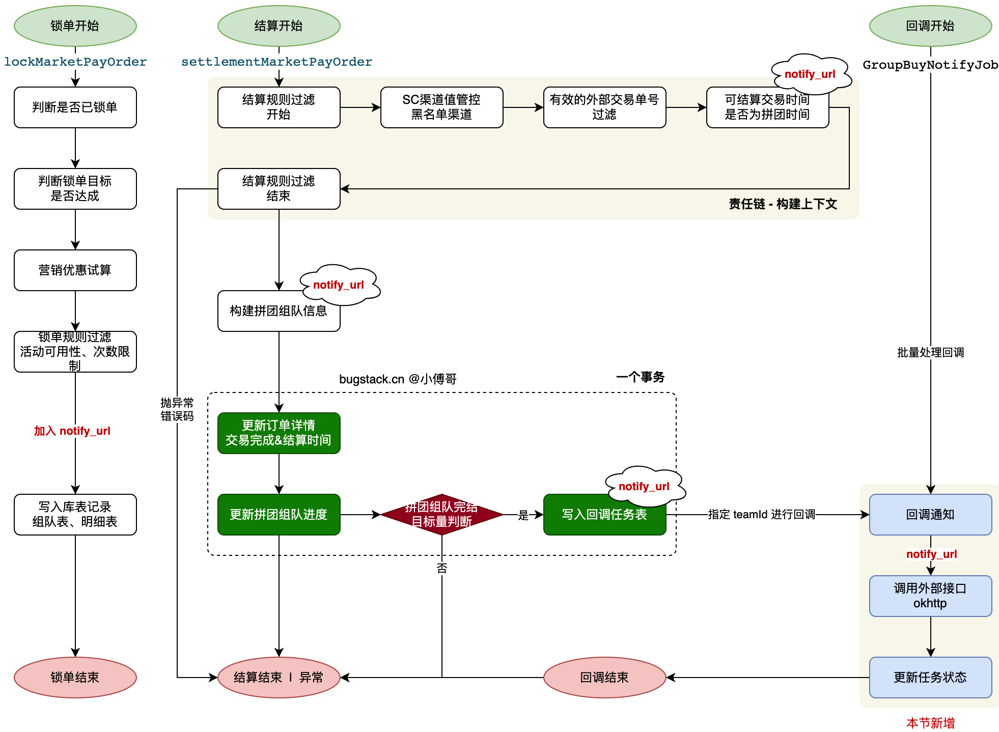

## 诉求

在微服务设计中，当一个微服务系统的流程结束后，要通知下一个微服务系统。这个通知的过程，可以是 RPC、MQ，也可以是 HTTP 方式。  
   
RPC、MQ，这一类的都是需要有一个公用的注册中心，它的技术架构比较适合于公司内部的统一系统使用。如果是有和外部其他系统的对接，通常我们会使用 HTTP 这样统一标准协议的接口进行使用。  
   
那么，本章节要为拼团组队交易结算完结后，实现一个回调通知的任务处理。告知另外的微服务系统可以进行后续的流程了。  
   
注意：微信支付，支付宝支付，也是在完成支付后，做的这样的回调处理。

## 业务流程



-   
    首先，本节的重点在拼团成团后，实现回调通知流程。回调的过程，需要在用户锁单时需要增加一个回调的地址，并在拼团完结后发起回调。
    

- 那么，这里的一些功能改造点；
    - `group_buy_order` 在设计的时候有一个 `notify_url` 回调地址，本节我们修改库表添加上这个字段。并对工程中的 `dao&po&mapper` 操作，增加 `notify_url` 字段。
    - MarketTradeController 营销交易服务，lockMarketPayOrder 锁单接口入参对象，增加 notifyUrl 回调地址。并有 PayDiscountEntity 对象透传到 `TradeRepository#lockMarketPayOrder` 仓储操作。这样写到 `group_buy_order` 表就有回调地址了，等做回调操作的时候，就可以把这个地址写入到回调任务表中。
    - `TradeSettlementOrderService#settlementMarketPayOrder` 结算服务，需要把锁单记录中的 notify_url 拿到，放到 GroupBuyTeamEntity 中，这样在写入 notify_task 表记录的时候就可以把 notify_url 一起写入进去了。
    - 基于 okhttp 框架，封装对 http 接口的调用。用于处理调用外部其他微服务，实现回调通知的处理。因为外部的接口是随着每个服务调用拼团写入进来的 http 请求地址，所以在封装这部分调用的时候，要允许动态透传请求地址。实现类写到 infrastructure 基础设置层的 gateway 调用外部网关层。实现类；`GroupBuyNotifyService` 提供方法；`groupBuyNotify`
    - 在交易结算服务类 ITradeSettlementOrderService，定义执行结算回调通知接口，包括；`execSettlementNotifyJob()、execSettlementNotifyJob(String teamId)` 一个是有入参的，一个无入参。这样可以指定给某个拼团队伍做结算。结算的过程就是调用 `GroupBuyNotifyService#groupBuyNotify` 完成回调通知，并根据返回的结果更新 notify_task 表状态记录（成功、失败、重试），并记录回调次数，小于5次的时候都可以继续回调。
    - 回调通知，可以分为两个阶段处理。一个是拼团完成后立即执行，另外一个任务补偿。立即执行是为了提供时效性，但因为远程的 http 调用受网络和服务的影响可能会失败，所以要增加一个任务补偿来做定时检查。其中立即执行在 `TradeSettlementOrderService#settlementMarketPayOrder -> settlementMarketPayOrder` 处理。另外定时任务在 `GroupBuyNotifyJob` 处理。
    - 测试接口，`trigger/http` 下，增加 `TestApiClientController` 接口实现类，提供回调接口服务。这个是模拟的其他的微服务，将来要提供的接口。

## 代码实现

### 数据库表结构

在 `group_buy_order` 表中增加 `notify_url` 字段。

### 锁单写入

锁单时将  `notifyUrl` 写入对应的实体类，代码略。

### 结算处理

```java
package site.dopplerxd.infrastructure.adapter.repository;  
  
/**   
* @description 交易仓储服务  
*/  
@Slf4j  
@Repository  
public class TradeRepository implements ITradeRepository {  
      
    @Resource  
    private INotifyTaskDao notifyTaskDao;
      
    @Override  
    public List<NotifyTaskEntity> queryUnExecutedNotifyTaskList() {  
        List<NotifyTask> notifyTaskList = notifyTaskDao.queryUnExecutedNotifyTaskList();  
        List<NotifyTaskEntity> notifyTaskEntityList = new ArrayList<>();  
          
        if (notifyTaskList.isEmpty()) {  
            return new ArrayList<>();  
        }  
          
        for (NotifyTask notifyTask : notifyTaskList) {  
            NotifyTaskEntity notifyTaskEntity = NotifyTaskEntity.builder()  
            .teamId(notifyTask.getTeamId())  
            .notifyUrl(notifyTask.getNotifyUrl())  
            .notifyCount(notifyTask.getNotifyCount())  
            .parameterJson(notifyTask.getParameterJson())  
            .build();  
            notifyTaskEntityList.add(notifyTaskEntity);  
        }  
        return notifyTaskEntityList;  
    }  
      
    @Override  
    public List<NotifyTaskEntity> queryUnExecutedNotifyTaskList(String teamId) {  
        NotifyTask notifyTask = notifyTaskDao.queryUnExecutedNotifyTaskByTeamId(teamId);  
          
        if (notifyTask == null) {  
            return new ArrayList<>();  
        }  
          
        return Collections.singletonList(NotifyTaskEntity.builder()  
                    .teamId(notifyTask.getTeamId())  
                    .notifyUrl(notifyTask.getNotifyUrl())  
                    .notifyCount(notifyTask.getNotifyCount())  
                    .parameterJson(notifyTask.getParameterJson())  
                    .build());  
    }  
      
    @Override  
    public int updateNotifyTaskStatusSuccess(String teamId) {  
        return notifyTaskDao.updateNotifyTaskStatusSuccess(teamId);  
    }  
      
    @Override  
    public int updateNotifyTaskStatusRetry(String teamId) {  
        return notifyTaskDao.updateNotifyTaskStatusRetry(teamId);  
    }  
      
    @Override  
    public int updateNotifyTaskStatusError(String teamId) {  
        return notifyTaskDao.updateNotifyTaskStatusError(teamId);  
    }  
      
    @Transactional(timeout = 500)  
    @Override  
    public boolean settlementMarketPayOrder(GroupBuyTeamSettlementAggregate groupBuyTeamSettlementAggregate) {  
        UserEntity userEntity = groupBuyTeamSettlementAggregate.getUserEntity();  
        GroupBuyTeamEntity groupBuyTeamEntity = groupBuyTeamSettlementAggregate.getGroupBuyTeamEntity();  
        TradePaySuccessEntity tradePaySuccessEntity = groupBuyTeamSettlementAggregate.getTradePaySuccessEntity();  
          
        // 1. 更新拼团订单状态明细  
        GroupBuyOrderList groupBuyOrderListReq = new GroupBuyOrderList();  
        groupBuyOrderListReq.setUserId(userEntity.getUserId());  
        groupBuyOrderListReq.setOutTradeNo(tradePaySuccessEntity.getOutTradeNo());  
        groupBuyOrderListReq.setOutTradeTime(tradePaySuccessEntity.getOutTradeTime());  
          
        int updateOrderListStatusCount = groupBuyOrderListDao.updateOrderStatus2COMPLETE(groupBuyOrderListReq);  
        if (updateOrderListStatusCount != 1) {  
            throw new AppException(ResponseCode.UPDATE_ZERO);  
        }  
          
        // 2. 更新拼团达成数量  
        int updateAddCompleteCount = groupBuyOrderDao.updateAddCompleteCount(groupBuyTeamEntity.getTeamId());  
        if (updateAddCompleteCount != 1) {  
            throw new AppException(ResponseCode.UPDATE_ZERO);  
        }  
          
        // 3. 更新拼团完成状态  
        if (groupBuyTeamEntity.getTargetCount() - groupBuyTeamEntity.getCompleteCount() == 1) {  
            int updateOrderStatusCount = groupBuyOrderDao.updateOrderStatus2COMPLETE(groupBuyTeamEntity.getTeamId());  
            if (updateOrderStatusCount != 1) {  
            throw new AppException(ResponseCode.UPDATE_ZERO);  
            }  
              
            // 查询拼团交易完成外部单号列表  
            List<String> outTradeNoList = groupBuyOrderListDao.queryGroupBuyCompleteOrderOutTradeNoListByTeamId(groupBuyTeamEntity.getTeamId());  
              
            // 拼团完成写入回调记录  
            NotifyTask notifyTask = new NotifyTask();  
            notifyTask.setActivityId(groupBuyTeamEntity.getActivityId());  
            notifyTask.setTeamId(groupBuyTeamEntity.getTeamId());  
            notifyTask.setNotifyUrl(groupBuyTeamEntity.getNotifyUrl());  
            notifyTask.setNotifyCount(0);  
            notifyTask.setNotifyStatus(0);  
            notifyTask.setParameterJson(JSON.toJSONString(new HashMap<String, Object>() {{  
                put("teamId", groupBuyTeamEntity.getTeamId());  
                put("outTradeNoList", outTradeNoList);  
            }}));  
              
            notifyTaskDao.insert(notifyTask);  
            return true;  
        }  
        return false;  
    }  
}
```

+ settlementMarketPayOrder 方法，从 GroupBuyTeamEntity 拼团记录获取到 notify_url 写入到 NotifyTask 表记录中。

### 回调网关 okhttp

```java
public class GroupBuyNotifyService {  
      
    @Resource  
    private OkHttpClient okHttpClient;  
      
    public String groupBuyNotify(String apiUrl, String notifyRequestDTOJson) throws Exception {  
        try {  
            MediaType mediaType = MediaType.parse("application/json");  
            RequestBody body = RequestBody.create(mediaType, notifyRequestDTOJson);  
            Request request = new Request.Builder()  
                    .url(apiUrl)  
                    .method("POST", body)  
                    .addHeader("Content-Type", "application/json")  
                    .build();  
            Response response = okHttpClient.newCall(request).execute();  
            assert response.body() != null;  
            return response.body().string();  
        } catch (Exception e) {  
            throw new AppException(ResponseCode.HTTP_EXCEPTION);  
        }  
    }  
      
}
```

+ 回调服务，在基础设置层的 gateway 中实现。用于动态调用外部的接口，进行回调通知。
+ 这部分业务代码可以通过 Apipost、Apifox 等工具生成，结合 IDEA 上对应的插件，可以把接口上传到 api 测试软件上。

### 回调封装和直接调用

```java
package site.dopplerxd.domain.trade.service.settlement;  
  
/**  
* @description 拼团交易结算服务  
*/   
public class TradeSettlementOrderService implements ITradeSettlementOrderService {  
      
    @Resource  
    private ITradeRepository repository;  
    @Resource  
    private ITradePort port;  
    @Resource  
    private BusinessLinkedList<TradeSettlementRuleCommandEntity, TradeSettlementRuleFilterFactory.DynamicContext, TradeSettlementRuleFilterBackEntity>  
    tradeSettlementRuleFilter;  
      
    @Override  
    public TradePaySettlementEntity settlementMarketPayOrder(TradePaySuccessEntity tradePaySuccessEntity) throws Exception {  
    log.info("拼团交易-支付订单结算:{} outTradeNo:{}", tradePaySuccessEntity.getUserId(), tradePaySuccessEntity.getOutTradeNo());  
      
    ......
      
    // 4. 拼团交易结算  
    boolean needNotify = repository.settlementMarketPayOrder(groupBuyTeamSettlementAggregate);  
      
    // 5. 组队回调处理 - 处理失败也会有定时任务补偿，通过这样的方式吗，减轻任务调度，提高时效性  
    if (needNotify) {  
        Map<String, Integer> notifyResultMap = execSettlementNotifyJob(teamId);  
        log.info("回调通知拼团完结 result:{}", JSON.toJSONString(notifyResultMap));  
    }  
      
    // 6. 返回结算信息  
    return ...;
    }  
      
    @Override  
    public Map<String, Integer> execSettlementNotifyJob() throws Exception {  
        log.info("拼团交易-执行结算通知任务");  
          
        // 查询未执行任务
        List<NotifyTaskEntity> notifyTaskEntityList = repository.queryUnExecutedNotifyTaskList();  
          
        return execSettlementNotifyJob(notifyTaskEntityList);  
    }  
      
    @Override  
    public Map<String, Integer> execSettlementNotifyJob(String teamId) throws Exception {  
        log.info("拼团交易-执行结算通知任务，指定teamId:{}", teamId);  
          
        List<NotifyTaskEntity> notifyTaskEntityList = repository.queryUnExecutedNotifyTaskList(teamId);  
          
        return execSettlementNotifyJob(notifyTaskEntityList);  
    }  
      
    private Map<String, Integer> execSettlementNotifyJob(List<NotifyTaskEntity> notifyTaskEntityList) throws Exception {  
        int successCount = 0, retryCount = 0, errorCount = 0;  
          
        for (NotifyTaskEntity notifyTaskEntity : notifyTaskEntityList) {  
            String response = port.groupBuyNotify(notifyTaskEntity);  
              
            if (NotifyTaskHTTPEnumVO.SUCCESS.getCode().equals(response)) {  
                int updateSuccessCount = repository.updateNotifyTaskStatusSuccess(notifyTaskEntity.getTeamId());  
                if (updateSuccessCount == 1) {  
                successCount += 1;  
                }  
            } else if (NotifyTaskHTTPEnumVO.ERROR.getCode().equals(response)) {  
                // 回调尝试次数小于5次，重试  
                if (notifyTaskEntity.getNotifyCount() < 5) {  
                    int updateRetryCount = repository.updateNotifyTaskStatusRetry(notifyTaskEntity.getTeamId());  
                    if (updateRetryCount == 1) {  
                        retryCount += 1;  
                    }  
                } else {  
                    int updateErrorCount = repository.updateNotifyTaskStatusError(notifyTaskEntity.getTeamId());  
                    if (updateErrorCount == 1) {  
                        errorCount += 1;  
                    }  
                }  
            }  
        }  
          
        Map<String, Integer> resultMap = new HashMap<>();  
        resultMap.put("waitCount", notifyTaskEntityList.size());  
        resultMap.put("successCount", successCount);  
        resultMap.put("retryCount", retryCount);  
        resultMap.put("errorCount", errorCount);  
          
        return resultMap;  
    }  
}
```

+ `Map<String, Integer> notifyResultMap = execSettlementNotifyJob(teamId);` 回调通知处理。这步失败也没关系，后续会有定时任务处理。
+ `execSettlementNotifyJob(List<NotifyTaskEntity> notifyTaskEntityList)` 回调任务，调用 `port.groupBuyNotify(notifyTask);` 回调服务。
- 根据回调服务返回的结果，更新回调任务表记录。包括；调用了几次、成功的状态。

### 任务补偿

```java
package site.dopplerxd.trigger.job;  
  
/**  
* @description 拼团完结回调通知任务；拼团回调任务表，实际公司场景会定时清理数据结转，不会有太多数据挤压  
*/    
public class GroupBuyNotifyJob {  
      
    @Resource  
    private ITradeSettlementOrderService tradeSettlementOrderService;  
          
    @Scheduled(cron = "0/15 * * * * ?")  
    public void exec() {  
        try {  
            Map<String, Integer> result = tradeSettlementOrderService.execSettlementNotifyJob();  
            log.info("定时任务，回调通知拼团完结任务 result:{}", JSON.toJSONString(result));  
        } catch (Exception e) {  
            log.error("定时任务，回调通知拼团完结任务失败", e);  
        }  
    }  
}
```

- 首先，app 下的 Application 类，要添加一个 `@EnableScheduling` 注解，这样才能使用任务。
- 之后，trigger 下的 job 包下，创建 GroupBuyNotifyJob 回调任务，调用回调通知。

