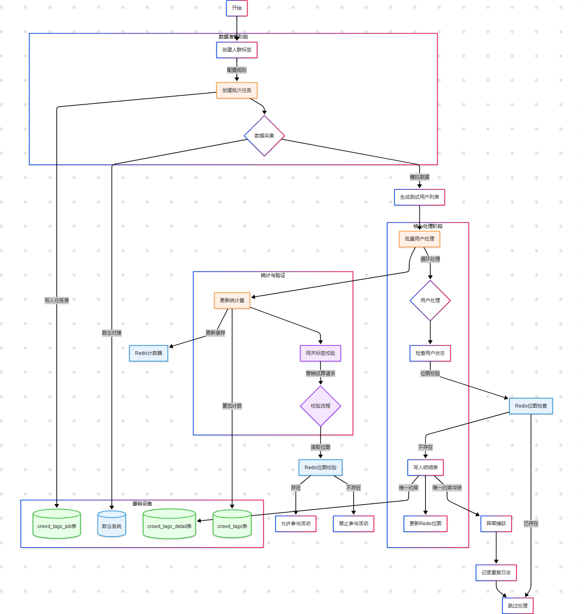

## 人群标签采集的目的与作用

### 🎯 目的：

构建一个**轻量化、高性能、高并发可读**的人群标签系统，实现对指定业务行为用户的精准识别、归类和持久化，为精准营销提供数据支持。

### 💡 作用：

| 功能模块       | 作用                                               |
| -------------- | -------------------------------------------------- |
| 🎯 用户分群     | 按照标签规则（如参与次数、消费金额等）划分用户群体 |
| 📦 数据仓支撑   | 借助公司已有数据仓库的数据进行用户行为分析         |
| 🚀 Redis BitMap | 高效存储和快速查询数百万级用户是否属于某一标签     |
| 📣 精准营销     | 支撑优惠券、定向消息、通知等精准活动触达           |
| 🧠 模型驱动     | 可配合R语言建模结果实现自动化规则生成              |

## 业务流程



1. **用户行为触发** → 被采集为业务数据
2. **业务数据归入数仓**，形成基础数据集市
3. **人群标签任务** 读取规则 → 执行匹配分析
4. **符合条件用户** 写入人群标签明细表
5. **同步写入 Redis BitMap** 实现高效标记
6. **统计数量** 用于后续分析和管理
7. **运营人员** 使用标签投放营销活动

## 相关代码实现

### TagService 人群标签服务

- 通过采集人群标签任务获取人群数据，暂时没有这类业务数据，所以先模拟一个用户数据，你也可以调整这里的数据为你需要的。
- 采集数据后，`repository.addCrowdTagsUserId(tagId, userId);` 写入到数据库表。注意 addCrowdTagsUserId 方法，写入后还会做 BitMap 存储。
- 这些操作完成后，会更新统计量。注意，目前的统计量更新是不准的，因为执行 addCrowdTagsUserId 操作，会有主键冲突，主键冲突直接拦截不会抛异常。那么更新人群标签的统计量会继续增加。你可以思考下这里要怎么处理，课程后续也会继续处理。

```java
@Slf4j
@Service
public class TagService implements ITagService {

    @Resource
    private ITagRepository repository;

    @Override
    public void execTagBatchJob(String tagId, String batchId) {
        log.info("人群标签批次任务 tagId:{} batchId:{}", tagId, batchId);

        // 1. 查询批次任务
        CrowdTagsJobEntity crowdTagsJobEntity = repository.queryCrowdTagsJobEntity(tagId, batchId);

        // 2. 采集用户数据

        // 3. 数据写入记录
        // 没数据，先模拟
        List<String> userIdList = new ArrayList<String>(){{
            add("xiaofuge");
            add("dopplerxd");
        }};

        // 4. 一般人群标签的处理在公司中，会有专门的数据数仓团队通过脚本方式写入到数据库，不需要这样一个个或者批次来写
        for (String userId : userIdList) {
            repository.addCrowdTagsUserId(tagId, userId);
        }

        // 5. 更新人群标签统计量
        repository.updateCrowdTagsStatistics(tagId, userIdList.size());
    }
}

```

`TagService.execTagBatchJob()`

- 查询标签任务：从数据库获取标签的规则（如参与次数、统计时间范围）
- 用户采集（简化模拟）：收集满足规则的用户 ID 列表
- 写入明细记录：批量写入 `crowd_tags_detail`
- 更新统计数据：更新 `crowd_tags` 中该标签的用户总数

### TagRepository

```java
@Repository
public class TagRepository implements ITagRepository {

    @Resource
    private ICrowdTagsJobDao crowdTagsJobDao;
    @Resource
    private ICrowdTagsDao crowdTagsDao;
    @Resource
    private ICrowdTagsDetailDao crowdTagsDetailDao;
    @Resource
    private IRedisService redisService;
    
    @Override
    public CrowdTagsJobEntity queryCrowdTagsJobEntity(String tagId, String batchId) {
        CrowdTagsJob crowdTagsJobReq = new CrowdTagsJob();
        crowdTagsJobReq.setTagId(tagId);
        crowdTagsJobReq.setBatchId(batchId);

        CrowdTagsJob crowdTagsJobRes = crowdTagsJobDao.queryCrowdTagsJob(crowdTagsJobReq);

        return CrowdTagsJobEntity.builder()
                .tagType(crowdTagsJobRes.getTagType())
                .tagRule(crowdTagsJobRes.getTagRule())
                .statStartTime(crowdTagsJobRes.getStatStartTime())
                .statEndTime(crowdTagsJobRes.getStatEndTime())
                .build();
    }

    @Override
    public void addCrowdTagsUserId(String tagId, String userId) {
        CrowdTagsDetail crowdTagsDetailReq = new CrowdTagsDetail();
        crowdTagsDetailReq.setTagId(tagId);
        crowdTagsDetailReq.setUserId(userId);

        try {
            crowdTagsDetailDao.addCrowdTagsUserId(crowdTagsDetailReq);

            RBitSet bitSet = redisService.getBitSet(tagId);
            bitSet.set(redisService.getIndexFromUserId(userId), true);
        } catch (DuplicateKeyException ignore) {
            // 忽略唯一索引冲突
        }
    }

    @Override
    public void updateCrowdTagsStatistics(String tagId, int size) {
        CrowdTags crowdTagsReq = new CrowdTags();
        crowdTagsReq.setTagId(tagId);
        crowdTagsReq.setStatistics(size);

        crowdTagsDao.updateCrowdTagsStatistics(crowdTagsReq);
    }
}
```

`TagRepository.addCrowdTagsUserId()`

- 向数据库写入明细（唯一索引处理冲突）
- 利用 Redis BitMap 将用户在该标签下标记为“存在”
- BitMap位置由 `getIndexFromUserId()` 确定

### Redis bitmap 进行数据存储

```java
public interface IRedisService {
	default int getIndexFromUserId(String userId) {
        try {
            MessageDigest md = MessageDigest.getInstance("MD5");
            byte[] hashBytes = md.digest(userId.getBytes(StandardCharsets.UTF_8));
            // 将哈希值转换为整数
            BigInteger bigInt = new BigInteger(1, hashBytes);
            // 取模运算，确保索引在数组范围内
            return bigInt.mod(BigInteger.valueOf(Integer.MAX_VALUE)).intValue();
        } catch (NoSuchAlgorithmException e) {
            throw new RuntimeException("MD5 algorithm not found", e);
        }
    }
}
```

## AI 面试题

### **1. 什么是人群标签？在拼团营销系统中它的作用是什么？**

#### ✅ 人群标签定义：

人群标签是对用户某些业务行为、特征、属性的抽象描述，标签本质上是一种**用户分群的规则标识**，用来标记用户是否属于某个业务定义下的特定群体。

#### ✅ 举例：

- 近30天购买金额 ≥ 500 元 → 高价值用户标签
- 最近参与拼团 ≥ 3 次 → 活跃拼团用户标签
- 领取优惠券但未下单 → 流失预警用户标签

#### ✅ 在拼团营销系统中的作用：

1. **精准营销投放**：基于标签圈定用户，分发拼团优惠、通知、券、短信等。
2. **策略自动化执行**：与拼团活动绑定，实现自动判断用户是否具备资格（如参与/可见限制）。
3. **活动效果监控**：统计标签对应用户行为的反馈，形成精细化复盘数据。
4. **提升ROI（投入产出比）**：减少无效投放，把资源集中在高潜用户上。

------

### **2. 为什么选择使用 Redis BitMap 存储人群标签？优点是什么？**

#### ✅ BitMap 是什么？

Redis BitMap 是一种使用**位数组（bitmap）**来存储布尔值（0/1）的数据结构。每一个用户ID 映射为一个位，`1` 表示“属于该标签”，`0` 表示“不属于”。

#### ✅ 为什么适合存储人群标签？

1. **空间极省**：
   - BitMap 每位只占 1 bit，1000 万用户仅需约 1.25MB 内存。
   - 相比于 Set 或 List 类型，节省数十倍空间。
2. **查找极快**：
   - 位操作时间复杂度 O(1)，判断用户是否命中某个标签非常快。
3. **并集/交集操作简单**：
   - Redis 提供 `BITOP AND/OR/XOR` 指令，方便实现标签组合筛选。
4. **天然支持幂等性和唯一性**：
   - 相同用户设置位值多次不会产生重复问题。
5. **高并发可读**：
   - BitMap 存储于内存中，适合大规模实时读写场景。

------

### **3. 描述一次完整的人群标签采集流程，涉及哪些关键模块？**

#### 📊 流程步骤：

```
[用户行为] → [业务数据写入数仓] → [触发人群标签任务] → [规则解析]
        → [匹配命中用户] → [写入 crowd_tags_detail 表]
        → [写入 Redis BitMap] → [统计更新 crowd_tags 表]
```

#### 🔧 关键模块说明：

| 模块                   | 说明                                           |
| ---------------------- | ---------------------------------------------- |
| **CrowdTagsJobEntity** | 描述标签任务，包括统计时间、规则、标签类型等   |
| **TagService**         | 核心执行入口，负责驱动整个标签计算流程         |
| **Repository层**       | 封装 DB 与 Redis 操作，解耦数据访问            |
| **DataWarehouse**      | 离线标签计算的数据来源，由数仓负责提供分析结果 |
| **Redis BitMap**       | 实现百万级别标签用户存储与实时判断             |

------

### **4. 如何保证用户标签写入的幂等性？你在代码中如何处理？**

#### ✅ 幂等性定义：

无论执行多少次相同操作，结果始终一致。对于标签系统来说，用户应不会被重复计入某标签。

#### ✅ 写入数据库的幂等性：

```java
try {
    crowdTagsDetailDao.addCrowdTagsUserId(crowdTagsDetailReq);
} catch (DuplicateKeyException ignore) {
    // 遇到唯一键冲突忽略，避免重复插入
}
```

- **唯一索引约束**：数据库对 `(tag_id, user_id)` 做唯一索引控制
- **异常捕获兜底**：重复插入会抛出 `DuplicateKeyException`，系统忽略处理

#### ✅ 写入 Redis 的幂等性：

```java
bitSet.set(redisService.getIndexFromUserId(userId), true);
```

- BitMap 设置重复位值不会报错，天然幂等
- Redis BitMap 的位操作不会导致数据重复或污染

------

### **5. 如果标签数据量达到千万级，Redis BitMap 是否还能应对？如何优化？**

#### ✅ Redis BitMap 可应对：

- BitMap 理论上支持 2^32 个用户，即超过 40 亿用户；
- 1 千万用户仅占用 ≈ 1.25 MB 内存，Redis 毫无压力。

#### ✅ 优化建议：

| 优化点                   | 说明                                                     |
| ------------------------ | -------------------------------------------------------- |
| **分片存储**             | 大标签拆成多个小 BitMap，如按用户ID hash分段             |
| **Roaring Bitmap**       | 压缩稀疏数据（如 Java RoaringBitmap + Redis Bloom 实现） |
| **数据预热/延迟加载**    | 活跃标签常驻内存，其余标签按需加载                       |
| **布隆过滤器**           | 对不活跃标签使用布隆过滤器代替位图，节省资源             |
| **多节点 Redis Cluster** | 水平扩展 Redis，提升并发能力与可用性                     |

