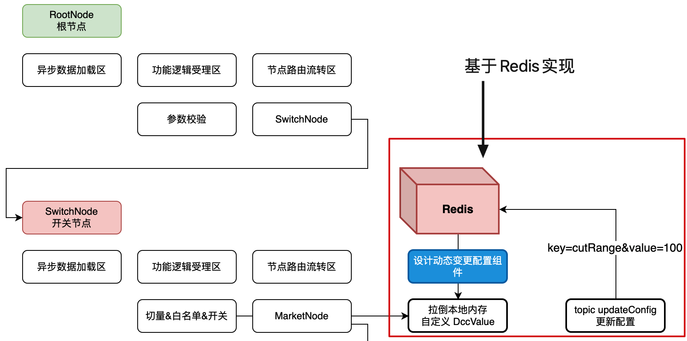
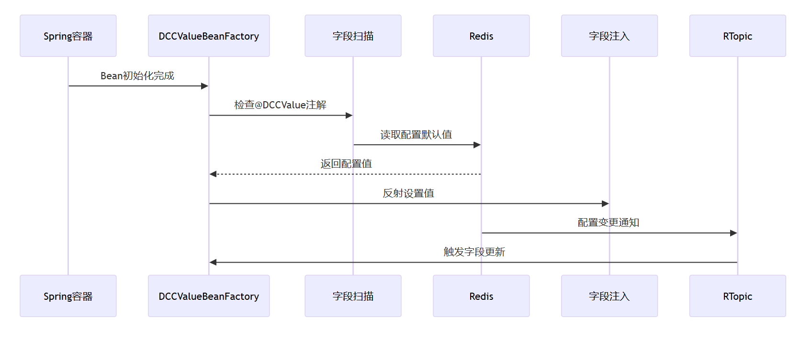

项目引入了基于 Redis 的动态配置开关（Dynamic Configuration Control，简称 DCC）机制。这一功能旨在实现系统配置的动态调整，无需重启应用，从而提高系统的灵活性和可维护性。

## 🧩 功能概述

该提交实现了一个基于 Redis 的动态配置开关系统，允许开发者在不重启应用的情况下，动态地启用或禁用某些功能模块。这对于需要快速响应市场变化或进行 A/B 测试的场景尤为重要。

## 🔍 实现原理

该功能的实现主要涉及以下几个组件：

1. **注解定义**：通过自定义注解 `@DCCValue`，开发者可以在代码中标记需要动态控制的配置项。
2. **配置值加载**：`DCCValueBeanFactory` 类负责在应用启动时扫描带有 `@DCCValue` 注解的字段，并从 Redis 中加载对应的配置值。
3. **Redis 存储**：配置项以键值对的形式存储在 Redis 中，键为配置项的名称，值为配置项的当前状态（如 "true" 或 "false"）。
4. **配置服务**：`DCCService` 提供了接口供其他模块查询配置项的当前状态，从而决定是否执行某些功能。
5. **控制器接口**：`DCCController` 提供了 HTTP 接口，允许运维人员或其他系统通过 API 动态修改配置项的值，实现对功能的启用或禁用。

## 🔄 工作流程

1. **配置定义**：开发者在需要动态控制的功能点上使用 `@DCCValue` 注解标记。
2. **应用启动**：`DCCValueBeanFactory` 在应用启动时扫描所有带有 `@DCCValue` 注解的字段，并从 Redis 中加载对应的配置值，注入到应用中。
3. **功能判断**：在运行时，功能模块通过调用 `DCCService` 提供的接口，查询配置项的当前状态，决定是否执行相关功能。
4. **动态修改**：运维人员可以通过调用 `DCCController` 提供的 HTTP 接口，修改 Redis 中的配置值，从而动态控制功能的启用或禁用。





## 🧱 主要组件职责解释

| 组件                    | 类型                    | 作用                                                         |
| ----------------------- | ----------------------- | ------------------------------------------------------------ |
| **Spring容器**          | 容器框架                | 管理 Bean 生命周期，负责启动时注入、初始化所有 Bean          |
| **DCCValueBeanFactory** | Bean 工厂（自定义）     | 负责扫描带有 `@DCCValue` 注解的字段、从 Redis 加载配置、动态注入 |
| **字段扫描器**          | 反射工具类              | 利用反射扫描 Bean 中的字段，判断是否包含 `@DCCValue` 注解    |
| **Redis**               | 配置中心                | 存储所有动态配置值，并支持发布变更通知（Pub/Sub）            |
| **字段注入器**          | 工具类                  | 根据反射结果动态设置字段值                                   |
| **RTopic**              | Redis Topic（消息通道） | Redis 发布订阅组件，用于配置变更通知与实时刷新字段值         |

## 🔁 完整工作流程详解（对应图片）

### 🧩 **阶段一：应用启动时初始化注入配置值**

1. **Spring 容器初始化 Bean 完成**
    Spring 加载完所有 Bean，准备进入实际运行。
2. **DCCValueBeanFactory 执行初始化逻辑**
    工厂类开始扫描所有 Bean，查找包含 `@DCCValue` 注解的字段。
3. **字段扫描器：扫描字段 + 注解识别**
    利用反射判断字段是否标注了 `@DCCValue`。
4. **Redis：读取对应字段的配置值**
    查找键名为注解中定义的 key 或字段名的值（支持默认值逻辑）。
5. **字段注入器：使用反射将值注入 Bean 字段**
    通过 Java 反射 API 设置字段的运行时值。
6. **返回配置值 → 注入完成**
    字段已被正确赋值为 Redis 中的最新配置状态。

### 🧩 **阶段二：运行时配置发生变更，字段动态刷新**

1. **Redis 中配置项发生变更**
    比如运维通过 API 修改配置项 `activity.strategy.switch = false`。
2. **通过 Redis RTopic 发布变更通知**
    使用 `RedisTemplate.convertAndSend("DCC_TOPIC", key)` 发布消息。
3. **订阅端（字段注入器）收到消息 → 定位字段**
    系统内部已监听该 Topic，接收到变更后开始查找对应字段。
4. **反射更新字段值为最新值**
    字段被重新注入新值（如从 `true → false`），即刻生效。

## 🧩 核心类职责对照

| 类名                                 | 职责描述                                              |
| ---------------------------------- | ------------------------------------------------- |
| `@DCCValue` 注解                     | 声明字段受动态配置控制，可设置默认值和配置键                            |
| `DCCValueBeanFactory`              | 扫描所有 Bean 并处理带注解字段，从 Redis 加载并注入配置值               |
| `RedisTemplate` / `RedissonClient` | 与 Redis 通信，包括 `get`, `set`, `publish` 等           |
| `RTopic`                           | Redis 发布订阅通道，用于推送配置更新                             |
| `字段注入器`                            | 封装 Java 反射逻辑，支持运行时动态赋值                            |
| `DCCController`                    | 提供运维修改配置值的 REST 接口（如 `/dcc/update?key=a&value=b`） |

## 🌐 示例：如何声明并使用动态配置字段

```java
@Slf4j
@RestController
@CrossOrigin("*")
@RequestMapping("/api/v1/gbm/dcc")
public class DCCController implements IDCCService {

    @Resource
    private RTopic dccTopic;

    /**
     * 动态值变更
     * <p>
     * curl http://127.0.0.1:8092/api/v1/gbm/dcc/update_config?key=downgradeSwitch&value=1
     * curl http://127.0.0.1:8092/api/v1/gbm/dcc/update_config?key=cutRange&value=0
     */
    @RequestMapping(value = "/update_config", method = RequestMethod.GET)
    @Override
    public Response<Boolean> updateConfig(@RequestParam String key, @RequestParam String value) {
        try {
            log.info("DCC 动态配置值变更 key:{} value:{}", key, value);
            dccTopic.publish(key + "," + value);
            return Response.<Boolean>builder()
                   .code(ResponseCode.SUCCESS.getCode())
                   .info(ResponseCode.SUCCESS.getInfo())
                   .build();
        } catch (Exception e) {
            log.error("DCC 动态配置值变更失败 key:{} value:{}", key, value, e);
            return Response.<Boolean>builder()
                    .code(ResponseCode.UN_ERROR.getCode())
                    .info(ResponseCode.UN_ERROR.getInfo())
                    .build();
        }
    }

}
```

调用接口 `http://127.0.0.1:8092/api/v1/gbm/dcc/update_config?key=downgradeSwitch&value=1`，就会将 `downgradeSwitch` 设置为 `1`，不关机实现 `降级拦截`。

## ✅ DCC 的优势

- **无需重启**：配置项的修改不需要重启应用，减少了系统的停机时间。
- **快速响应**：能够快速响应市场变化，进行功能的启用或禁用。
- **A/B 测试**：支持对不同用户群体启用不同的功能，进行 A/B 测试。
- **运维便捷**：通过 HTTP 接口即可修改配置项，简化了运维操作。

| 优点         | 说明                                  |
| ------------ | ------------------------------------- |
| 🔧 热更新     | 改配置不重启，立即生效                |
| 🚀 高性能     | 基于 Redis 内存结构，查询与注入效率高 |
| ♻️ 反射灵活   | 可动态控制任意字段，不侵入业务逻辑    |
| 🛠️ 可扩展性强 | 可对接配置中心、数据库、消息中间件等  |

