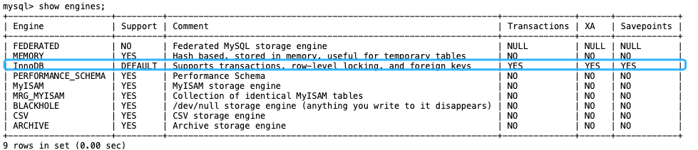
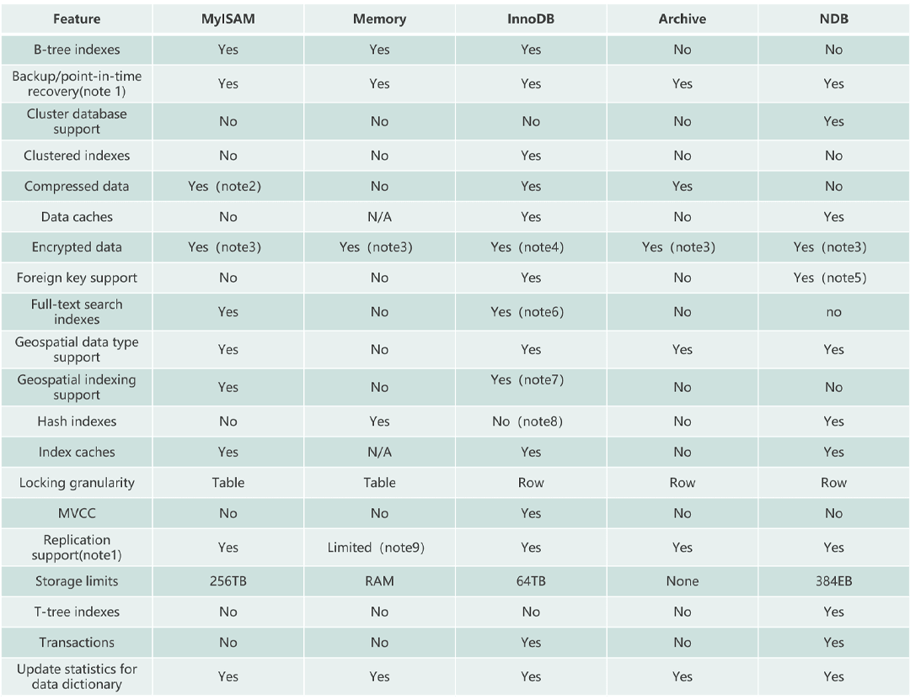

---
tags:
  - MySQL
  - 面试
---
## MySQL 存储引擎

### MySQL 支持哪些存储引擎？默认使用哪个？

可以使用 `SHOW ENGINES` 命令来查看 MySQL 支持的所有存储引擎



MySQL 5.5 之前，默认存储引擎是 MyISAM；5.5 版本之后，默认使用 InnoDB 作为存储引擎。

### MyISAM 和 InnoDB 有什么区别？

**1、是否支持行级锁**
MyISAM 只有表级锁(table-level locking)，而 InnoDB 支持行级锁(row-level locking)和表级锁,默认为行级锁。

也就是说，MyISAM 一锁就是锁住了整张表，这在并发写的情况下是多么滴憨憨啊！这也是为什么 InnoDB 在并发写的时候，性能更牛皮了！

**2、是否支持事务**
MyISAM 不提供事务支持。

InnoDB 提供事务支持，实现了 SQL 标准定义了四个隔离级别，具有提交(commit)和回滚(rollback)事务的能力。并且，InnoDB 默认使用的 REPEATABLE-READ（可重读）隔离级别是可以解决幻读问题发生的（基于 MVCC 和 Next-Key Lock）。

关于 MySQL 事务的详细介绍，可以看看我写的这篇文章：MySQL 事务隔离级别详解。

**3、是否支持外键**
MyISAM 不支持，而 InnoDB 支持。

外键对于维护数据一致性非常有帮助，但是对性能有一定的损耗。因此，通常情况下，是不建议在实际生产项目中使用外键的，在业务代码中进行约束即可！

阿里的《Java 开发手册》也是明确规定禁止使用外键的。

不过，在代码中进行约束的话，对程序员的能力要求更高，具体是否要采用外键还是要根据项目实际情况而定。

总结：一般也不建议在数据库层面使用外键的，应用层面可以解决。不过，这样会对数据的一致性造成威胁。具体要不要使用外键还是要根据项目来决定。

**4、是否支持数据库异常崩溃后的安全恢复**
MyISAM 不支持，而 InnoDB 支持。
使用 InnoDB 的数据库在异常崩溃后，数据库重新启动的时候会保证数据库恢复到崩溃前的状态。这个恢复的过程依赖于 redo log 。

**5、是否支持 MVCC**
MyISAM 不支持，而 InnoDB 支持。

MyISAM 连行级锁都不支持。MVCC 可以看作是行级锁的一个升级，可以有效减少加锁操作，提高性能。

**6、索引实现不一样。**
虽然 MyISAM 引擎和 InnoDB 引擎都是使用 B+Tree 作为索引结构，但是两者的实现方式不太一样。

InnoDB 引擎中，其数据文件本身就是索引文件。相比 MyISAM，索引文件和数据文件是分离的，其表数据文件本身就是按 B+Tree 组织的一个索引结构，树的叶节点 data 域保存了完整的数据记录。

**7、性能有差别。**
InnoDB 的性能比 MyISAM 更强大，不管是在读写混合模式下还是只读模式下，随着 CPU 核数的增加，InnoDB 的读写能力呈线性增长。MyISAM 因为读写不能并发，它的处理能力跟核数没关系。

**8、数据缓存策略和机制实现不同。**
InnoDB 使用缓冲池（Buffer Pool）缓存数据页和索引页，MyISAM 使用键缓存（Key Cache）仅缓存索引页而不缓存数据页。

**总结：**
InnoDB 支持行级别的锁粒度，MyISAM 不支持，只支持表级别的锁粒度。
MyISAM 不提供事务支持。InnoDB 提供事务支持，实现了 SQL 标准定义了四个隔离级别。
MyISAM 不支持外键，而 InnoDB 支持。
MyISAM 不支持 MVCC，而 InnoDB 支持。
虽然 MyISAM 引擎和 InnoDB 引擎都是使用 B+Tree 作为索引结构，但是两者的实现方式不太一样。
MyISAM 不支持数据库异常崩溃后的安全恢复，而 InnoDB 支持。
InnoDB 的性能比 MyISAM 更强大。



## MySQL 事务

### 事务的四大特性了解么？

+ **原子性**（Atomicity）：事务是最小的执行单位，不允许分割。事务的原子性确保动作要么全部完成，要么完全不起作用；
+ **一致性**（Consistency）：执行事务前后，数据保持一致，例如转账业务中，无论事务是否成功，转账者和收款人的总额应该是不变的；
+ **隔离性**（Isolation）：并发访问数据库时，一个用户的事务不被其他事务所干扰，各并发事务之间数据库是独立的；
+ **持久性**（Durability）：一个事务被提交之后。它对数据库中数据的改变是持久的，即使数据库发生故障也不应该对其有任何影响。

只有保证了事务的持久性、原子性、隔离性之后，一致性才能得到保障。也就是说 A、I、D 是手段，C 是目的。

### 并发事务带来了哪些问题？

+ **脏读（Dirty read）**
    一个事务读取数据并且对数据进行了修改，这个修改对其他事务来说是可见的，即使当前事务没有提交。这时另外一个事务读取了这个还未提交的数据，但第一个事务突然回滚，导致数据并没有被提交到数据库，那第二个事务读取到的就是脏数据，这也就是脏读的由来。
    
    例如：事务 1 读取某表中的数据 A=20，事务 1 修改 A=A-1，事务 2 读取到 A = 19,事务 1 回滚导致对 A 的修改并未提交到数据库， A 的值还是 20。
+ **丢失修改（Lost to modify）**
    在一个事务读取一个数据时，另外一个事务也访问了该数据，那么在第一个事务中修改了这个数据后，第二个事务也修改了这个数据。这样第一个事务内的修改结果就被丢失，因此称为丢失修改。
    
    例如：事务 1 读取某表中的数据 A=20，事务 2 也读取 A=20，事务 1 先修改 A=A-1，事务 2 后来也修改 A=A-1，最终结果 A=19，事务 1 的修改被丢失。
+ **不可重复读（Unrepeatable read）**
    指在一个事务内多次读同一数据。在这个事务还没有结束时，另一个事务也访问该数据。那么，在第一个事务中的两次读数据之间，由于第二个事务的修改导致第一个事务两次读取的数据可能不太一样。这就发生了在一个事务内两次读到的数据是不一样的情况，因此称为不可重复读。
    
    例如：事务 1 读取某表中的数据 A=20，事务 2 也读取 A=20，事务 1 修改 A=A-1，事务 2 再次读取 A =19，此时读取的结果和第一次读取的结果不同。
+ **幻读（Phantom read）**
    幻读与不可重复读类似。它发生在一个事务读取了几行数据，接着另一个并发事务插入了一些数据时。在随后的查询中，第一个事务就会发现多了一些原本不存在的记录，就好像发生了幻觉一样，所以称为幻读。
    
    例如：事务 2 读取某个范围的数据，事务 1 在这个范围插入了新的数据，事务 2 再次读取这个范围的数据发现相比于第一次读取的结果多了新的数据。

### 不可重复读和幻读有什么区别？

+ 不可重复读的重点是内容修改或者记录减少比如多次读取一条记录发现其中某些记录的值被修改；
+ 幻读的重点在于记录新增比如多次执行同一条查询语句（DQL）时，发现查到的记录增加了。

幻读其实可以看作是不可重复读的一种特殊情况，单独把幻读区分出来的原因主要是解决幻读和不可重复读的方案不一样。

举个例子：执行 `delete` 和 `update` 操作的时候，可以直接对记录加锁，保证事务安全。而执行 insert 操作的时候，由于记录锁（Record Lock）只能锁住已经存在的记录，为了避免插入新记录，需要依赖间隙锁（Gap Lock）。也就是说执行 `insert` 操作的时候需要依赖 Next-Key Lock（Record Lock+Gap Lock） 进行加锁来保证不出现幻读。

### MySQL 事务隔离级别？默认是什么级别？

SQL 标准定义了四个隔离级别：
+ **READ-UNCOMMITTED（读取未提交）**：最低的隔离级别，允许读取尚未提交的数据变更，可能会导致脏读、幻读或不可重复读。
+ **READ-COMMITTED（读取已提交）**：允许读取并发事务已经提交的数据，可以阻止脏读，但是幻读或不可重复读仍有可能发生。
+ **REPEATABLE-READ（可重复读）**：对同一字段的多次读取结果都是一致的，除非数据是被本身事务自己所修改，可以阻止脏读和不可重复读，但幻读仍有可能发生。
+ **SERIALIZABLE（可串行化）**：最高的隔离级别，完全服从 ACID 的隔离级别。所有的事务依次逐个执行，这样事务之间就完全不可能产生干扰，也就是说，该级别可以防止脏读、不可重复读以及幻读。

| 隔离级别             | 脏读  | 幻读  | 不可重复读 |
| ---------------- | --- | --- | ----- |
| READ-UNCOMMITTED | √   | √   | √     |
| READ-COMMITTED   | ×   | √   | √     |
| REPEATABLE-READ  | ×   | ×   | √     |
| SERIALIZABLE     | ×   | ×   | ×     |

MySQL InnoDB 存储引擎的默认支持的隔离级别是 **REPEATABLE-READ（可重读）**。我们可以通过 `SELECT @@tx_isolation;` 命令来查看，MySQL 8.0 该命令改为 `SELECT @@transaction_isolation;`

```sql
MySQL> SELECT @@tx_isolation;
+-----------------+
| @@tx_isolation  |
+-----------------+
| REPEATABLE-READ |
+-----------------+
```

从上面对 SQL 标准定义了四个隔离级别的介绍可以看出，标准的 SQL 隔离级别定义里，REPEATABLE-READ（可重复读）是不可以防止幻读的。

但是！InnoDB 实现的 REPEATABLE-READ 隔离级别其实是可以解决幻读问题发生的，主要有下面两种情况：

+ 快照读：由 MVCC 机制来保证不出现幻读。
+ 当前读：使用 Next-Key Lock 进行加锁来保证不出现幻读，Next-Key Lock 是行锁（Record Lock）和间隙锁（Gap Lock）的结合，行锁只能锁住已经存在的行，为了避免插入新行，需要依赖间隙锁。

因为隔离级别越低，事务请求的锁越少，所以大部分数据库系统的隔离级别都是 READ-COMMITTED ，但是你要知道的是 InnoDB 存储引擎默认使用 REPEATABLE-READ 并不会有任何性能损失。

InnoDB 存储引擎在分布式事务的情况下一般会用到 SERIALIZABLE 隔离级别。

### MySQL 的隔离级别是基于锁实现的吗？

MySQL 的隔离级别基于锁和 MVCC 机制共同实现的。

SERIALIZABLE 隔离级别是通过锁来实现的，READ-COMMITTED 和 REPEATABLE-READ 隔离级别是基于 MVCC 实现的。不过， SERIALIZABLE 之外的其他隔离级别可能也需要用到锁机制，就比如 REPEATABLE-READ 在当前读情况下需要使用加锁读来保证不会出现幻读

### InnoDB 对 MVCC 的具体实现

[JavaGuide - InnoDB存储引擎对MVCC的实现](https://javaguide.cn/database/mysql/innodb-implementation-of-mvcc.html)

## MySQL 字段类型

### char 和 varchar 的区别是什么？

CHAR 和 VARCHAR 是最常用到的字符串类型，两者的主要区别在于：**CHAR 是定长字符串，VARCHAR 是变长字符串**。

CHAR 在存储时会在右边填充空格以达到指定的长度，检索时会去掉空格；VARCHAR 在存储时需要使用 1 或 2 个额外字节记录字符串的长度，检索时不需要处理。

CHAR 更适合存储长度较短或者长度都差不多的字符串，例如 Bcrypt 算法、MD5 算法加密后的密码、身份证号码。VARCHAR 类型适合存储长度不确定或者差异较大的字符串，例如用户昵称、文章标题等。

CHAR(M) 和 VARCHAR(M) 的 M 都代表能够保存的字符数的最大值，无论是字母、数字还是中文，每个都只占用一个字符。

### varchar(100) 和 varchar(10) 的区别是什么？

VARCHAR(100) 和 VARCHAR(10) 都是变长类型，表示能存储最多 100 个字符和 10 个字符。因此，VARCHAR (100) 可以满足更大范围的字符存储需求，有更好的业务拓展性。而 VARCHAR(10)存储超过 10 个字符时，就需要修改表结构才可以。

虽说 VARCHAR(100)和 VARCHAR(10)能存储的字符范围不同，但二者存储相同的字符串，所占用磁盘的存储空间其实是一样的，这也是很多人容易误解的一点。

不过，VARCHAR(100) 会消耗更多的内存。这是因为 VARCHAR 类型在内存中操作时，通常会分配固定大小的内存块来保存值，即使用字符类型中定义的长度。例如在进行排序的时候，VARCHAR(100)是按照 100 这个长度来进行的，也就会消耗更多内存。

### decimal 和 float/double 的区别是什么？存储金钱应该用哪一种？

DECIMAL 和 FLOAT 的区别是：**DECIMAL 是定点数，FLOAT/DOUBLE 是浮点数。DECIMAL 可以存储精确的小数值，FLOAT/DOUBLE 只能存储近似的小数值**。

DECIMAL 用于存储具有精度要求的小数，例如与货币相关的数据，可以避免浮点数带来的精度损失。

在 Java 中，MySQL 的 DECIMAL 类型对应的是 Java 类 `java.math.BigDecimal`。

### 为什么不推荐使用 text 和 blob？

TEXT 类型类似于 CHAR（0-255 字节）和 VARCHAR（0-65,535 字节），但可以存储更长的字符串，即长文本数据，例如博客内容。

| 类型         | 可存储大小              | 用途      |
| ---------- | ------------------ | ------- |
| TINYTEXT   | 0-255 字节           | 一般文本字符串 |
| TEXT       | 0-65,535 字节        | 长文本字符串  |
| MEDIUMTEXT | 0-16,772,150 字节    | 较大文本数据  |
| LONGTEXT   | 0-4,294,967,295 字节 | 极大文本数据  |

BLOB 类型主要用于存储二进制大对象，例如图片、音视频等文件。

| 类型         | 可存储大小    | 用途            |
| ---------- | -------- | ------------- |
| TINYBLOB   | 0-255 字节 | 短文本二进制字符串     |
| BLOB       | 0-65 KB  | 二进制字符串        |
| MEDIUMBLOB | 0-16 MB  | 二进制形式的长文本数据   |
| LONGBLOB   | 0-4 GB   | 	二进制形式的极大文本数据 |

在日常开发中，很少使用 TEXT 类型，但偶尔会用到，而 BLOB 类型则基本不常用。如果预期长度范围可以通过 VARCHAR 来满足，建议避免使用 TEXT。

数据库规范通常不推荐使用 BLOB 和 TEXT 类型，这两种类型具有一些缺点和限制，例如：
+ 不能有默认值。
+ 在使用临时表时无法使用内存临时表，只能在磁盘上创建临时表（《高性能 MySQL》书中有提到）。
+ 检索效率较低。
+ 不能直接创建索引，需要指定前缀长度。
+ 可能会消耗大量的网络和 IO 带宽。
+ 可能导致表上的 DML 操作变慢。

## MySQL 索引

[MySQL索引详解](https://javaguide.cn/database/mysql/mysql-index.html)

### 为什么索引能提高查询速度？

索引的作用就相当于书的目录。打个比方: 我们在查字典的时候，如果没有目录，那我们就只能一页一页的去找我们需要查的那个字，速度很慢。如果有目录了，我们只需要先去目录里查找字的位置，然后直接翻到那一页就行了。

### 聚集索引和非聚集索引的概念和区别？

#### 聚簇索引（聚集索引）

**聚簇索引介绍**

聚簇索引（Clustered Index）即索引结构和数据一起存放的索引，并不是一种单独的索引类型。InnoDB 中的主键索引就属于聚簇索引。

在 MySQL 中，InnoDB 引擎的表的 .ibd文件就包含了该表的索引和数据，对于 InnoDB 引擎表来说，该表的索引(B+树)的每个非叶子节点存储索引，叶子节点存储索引和索引对应的数据。

**聚簇索引的优缺点**

**优点：**
+ **查询速度非常快**：聚簇索引的查询速度非常的快，因为整个 B+树本身就是一颗多叉平衡树，叶子节点也都是有序的，定位到索引的节点，就相当于定位到了数据。相比于非聚簇索引， 聚簇索引少了一次读取数据的 IO 操作。
+ **对排序查找和范围查找优化**：聚簇索引对于主键的排序查找和范围查找速度非常快。

**缺点：**
+ **依赖于有序的数据**：因为 B+树是多路平衡树，如果索引的数据不是有序的，那么就需要在插入时排序，如果数据是整型还好，否则类似于字符串或 UUID 这种又长又难比较的数据，插入或查找的速度肯定比较慢。
+ **更新代价大**：如果对索引列的数据被修改时，那么对应的索引也将会被修改，而且聚簇索引的叶子节点还存放着数据，修改代价肯定是较大的，所以对于主键索引来说，主键一般都是不可被修改的。

#### 非聚簇索引（非聚集索引）

**非聚簇索引介绍**

非聚簇索引(Non-Clustered Index)即索引结构和数据分开存放的索引，并不是一种单独的索引类型。二级索引(辅助索引)就属于非聚簇索引。MySQL 的 MyISAM 引擎，不管主键还是非主键，使用的都是非聚簇索引。

非聚簇索引的叶子节点并不一定存放数据的指针，因为二级索引的叶子节点就存放的是主键，根据主键再回表查数据。

**非聚簇索引的优缺点**

**优点：**
+ **更新代价比聚簇索引要小** ：非聚簇索引的更新代价就没有聚簇索引那么大了，非聚簇索引的叶子节点是不存放数据的。

**缺点：**
+ **依赖于有序的数据**：跟聚簇索引一样，非聚簇索引也依赖于有序的数据
+ **可能会二次查询（回表）**：这应该是非聚簇索引最大的缺点了。 当查到索引对应的指针或主键后，可能还需要根据指针或主键再到数据文件或表中查询。

### 非聚集索引一定回表查询吗？

**不一定。**

试想一种情况，用户准备使用 SQL 查询用户名，而用户名字段正好建立了索引。

```sql
 SELECT name FROM table WHERE name='guang19';
```

那么这个索引的 key 本身就是 name，查到对应的 name 直接返回就行了，无需回表查询。

即使是 MYISAM 也是这样，虽然 MYISAM 的主键索引确实需要回表，因为它的主键索引的叶子节点存放的是指针。但是！**如果 SQL 查的就是主键呢？**

```sql
SELECT id FROM table WHERE id=1;
```

主键索引本身的 key 就是主键，查到返回就行了。这种情况就称之为覆盖索引了。

### 索引这么多优点，为什么不对表中的每一个列创建一个索引呢？(使用索引一定能提高查询性能吗）

**缺点：**
+ 创建索引和维护索引需要耗费许多时间。当对表中的数据进行增删改的时候，如果数据有索引，那么索引也需要动态的修改，会降低 SQL 执行效率。
+ 索引需要使用物理文件存储，也会耗费一定空间。

使用索引不一定能提高查询性能：
+ 大多数情况下，索引查询都是比全表扫描要快的。但是如果数据库的数据量不大，那么使用索引也不一定能够带来很大提升。
+ 虽然索引能带来查询上的效率，但是维护索引的成本也是不小的。 如果一个字段不被经常查询，反而被经常修改，那么就更不应该在这种字段上建立索引了。

索引并不是越多越好，建议单张表索引不超过 5 个！索引可以提高效率同样可以降低效率。

索引可以增加查询效率，但同样也会降低插入和更新的效率，甚至有些情况下会降低查询效率。

因为 MySQL 优化器在选择如何优化查询时，会根据统一信息，对每一个可以用到的索引来进行评估，以生成出一个最好的执行计划，如果同时有很多个索引都可以用于查询，就会增加 MySQL 优化器生成执行计划的时间，同样会降低查询性能。

尽可能的考虑建立联合索引而不是单列索引
因为索引是需要占用磁盘空间的，可以简单理解为每个索引都对应着一颗 B+树。如果一个表的字段过多，索引过多，那么当这个表的数据达到一个体量后，索引占用的空间也是很多的，且修改索引时，耗费的时间也是较多的。如果是联合索引，多个字段在一个索引上，那么将会节约很大磁盘空间，且修改数据的操作效率也会提升。

### 索引底层的数据结构了解么？

[参考](https://javaguide.cn/database/mysql/mysql-index.html#%E7%B4%A2%E5%BC%95%E5%BA%95%E5%B1%82%E6%95%B0%E6%8D%AE%E7%BB%93%E6%9E%84%E9%80%89%E5%9E%8B)

### Hash 索引和 B+ 树索引优劣分析


### B+树做索引比红黑树好在哪里？


### 最左前缀匹配原则了解么？


### 什么是覆盖索引

如果一个索引包含（或者说覆盖）所有需要查询的字段的值，我们就称之为 **覆盖索引（Covering Index）** 。

在 InnoDB 存储引擎中，非主键索引的叶子节点包含的是主键的值。这意味着，当使用非主键索引进行查询时，数据库会先找到对应的主键值，然后再通过主键索引来定位和检索完整的行数据。这个过程被称为“回表”。

**覆盖索引即需要查询的字段正好是索引的字段，那么直接根据该索引，就可以查到数据了，而无需回表查询。**

> 如主键索引，如果一条 SQL 需要查询主键，那么正好根据主键索引就可以查到主键。再如普通索引，如果一条 SQL 需要查询 name，name 字段正好有索引，
> 那么直接根据这个索引就可以查到数据，也无需回表。


### 如何查看某条 SQL 语句是否用到了索引？

**执行计划** 是指一条 SQL 语句在经过 **MySQL 查询优化器** 的优化后，具体的执行方式。

执行计划通常用于 SQL 性能分析、优化等场景。通过 `EXPLAIN` 的结果，可以了解到如数据表的查询顺序、数据查询操作的操作类型、哪些索引可以被命中、哪些索引实际会命中、每个数据表有多少行记录被查询等信息。

MySQL 为我们提供了 `EXPLAIN` 命令，来获取执行计划的相关信息。

需要注意的是，`EXPLAIN` 语句并不会真的去执行相关的语句，而是通过查询优化器对语句进行分析，找出最优的查询方案，并显示对应的信息。

`EXPLAIN` 执行计划支持 `SELECT`、`DELETE`、`INSERT`、`REPLACE` 以及 `UPDATE` 语句。我们一般多用于分析 SELECT 查询语句，使用起来非常简单，语法如下：

```sql
EXPLAIN + SELECT 查询语句；
```

结果分析：

```sql
mysql> explain SELECT * FROM dept_emp WHERE emp_no IN (SELECT emp_no FROM dept_emp GROUP BY emp_no HAVING COUNT(emp_no)>1);
+----+-------------+----------+------------+-------+-----------------+---------+---------+------+--------+----------+-------------+
| id | select_type | table    | partitions | type  | possible_keys   | key     | key_len | ref  | rows   | filtered | Extra       |
+----+-------------+----------+------------+-------+-----------------+---------+---------+------+--------+----------+-------------+
|  1 | PRIMARY     | dept_emp | NULL       | ALL   | NULL            | NULL    | NULL    | NULL | 331143 |   100.00 | Using where |
|  2 | SUBQUERY    | dept_emp | NULL       | index | PRIMARY,dept_no | PRIMARY | 16      | NULL | 331143 |   100.00 | Using index |
+----+-------------+----------+------------+-------+-----------------+---------+---------+------+--------+----------+-------------+
```

其中的 **Extra** 列：
这列包含了 MySQL 解析查询的额外信息，通过这些信息，可以更准确的理解 MySQL 到底是如何执行查询的。常见的值如下：

+ Using filesort：在排序时使用了外部的索引排序，没有用到表内索引进行排序。
+ Using temporary：MySQL 需要创建临时表来存储查询的结果，常见于 ORDER BY 和 GROUP BY。
+ Using index：表明查询使用了覆盖索引，不用回表，查询效率非常高。
+ Using index condition：表示查询优化器选择使用了索引条件下推这个特性。
+ Using where：表明查询使用了 WHERE 子句进行条件过滤。一般在没有使用到索引的时候会出现。
+ Using join buffer (Block Nested Loop)：连表查询的方式，表示当被驱动表的没有使用索引的时候，MySQL 会先将驱动表读出来放到 join buffer 中，再遍历被驱动表与驱动表进行查询。

当 Extra 列包含 Using filesort 或 Using temporary 时，MySQL 的性能可能会存在问题，需要尽可能避免。

## MySQL 锁

### 表级锁和行级锁有什么区别？

MyISAM 仅仅支持表级锁(table-level locking)，一锁就锁整张表，这在并发写的情况下性非常差。InnoDB 不光支持表级锁(table-level locking)，还支持行级锁(row-level locking)，默认为行级锁。

行级锁的粒度更小，仅对相关的记录上锁即可（对一行或者多行记录加锁），所以对于并发写入操作来说， InnoDB 的性能更高。

**表级锁和行级锁对比：**
+ 表级锁： MySQL 中锁定粒度最大的一种锁（全局锁除外），是针对非索引字段加的锁，对当前操作的整张表加锁，实现简单，资源消耗也比较少，加锁快，不会出现死锁。不过，触发锁冲突的概率最高，高并发下效率极低。表级锁和存储引擎无关，MyISAM 和 InnoDB 引擎都支持表级锁。
+ 行级锁： MySQL 中锁定粒度最小的一种锁，是 针对索引字段加的锁 ，只针对当前操作的行记录进行加锁。 行级锁能大大减少数据库操作的冲突。其加锁粒度最小，并发度高，但加锁的开销也最大，加锁慢，会出现死锁。行级锁和存储引擎有关，是在存储引擎层面实现的。

### 哪些操作会加表级锁？哪些操作会加行级锁？请简单举例说一下。

InnoDB 的行锁是针对索引字段加的锁，表级锁是针对非索引字段加的锁。当我们执行 UPDATE、DELETE 语句时，如果 WHERE条件中字段没有命中唯一索引或者索引失效的话，就会导致扫描全表对表中的所有行记录进行加锁。

### InnoDB 有哪几类行锁？

InnoDB 行锁是通过对索引数据页上的记录加锁实现的，MySQL InnoDB 支持三种行锁定方式：

+ 记录锁（Record Lock）：属于单个行记录上的锁。
+ 间隙锁（Gap Lock）：锁定一个范围，不包括记录本身。
+ 临键锁（Next-Key Lock）：Record Lock+Gap Lock，锁定一个范围，包含记录本身，主要目的是为了解决幻读问题（MySQL 事务部分提到过）。记录锁只能锁住已经存在的记录，为了避免插入新记录，需要依赖间隙锁。

在 InnoDB 默认的隔离级别 REPEATABLE-READ 下，行锁默认使用的是 Next-Key Lock。但是，如果操作的索引是唯一索引或主键，InnoDB 会对 Next-Key Lock 进行优化，将其降级为 Record Lock，即仅锁住索引本身，而不是范围。

### Next-Key Lock 的加锁范围？

[参考文章](https://segmentfault.com/a/1190000040129107)

### 当前读和快照读有什么区别？

**快照读**（一致性非锁定读）就是单纯的 SELECT 语句，但不包括下面这两类 SELECT 语句：

```sql
SELECT ... FOR UPDATE
# 共享锁 可以在 MySQL 5.7 和 MySQL 8.0 中使用
SELECT ... LOCK IN SHARE MODE;
# 共享锁 可以在 MySQL 8.0 中使用
SELECT ... FOR SHARE;
```

快照即记录的历史版本，每行记录可能存在多个历史版本（多版本技术）。

快照读的情况下，如果读取的记录正在执行 UPDATE/DELETE 操作，读取操作不会因此去等待记录上 X 锁的释放，而是会去读取行的一个快照。

只有在事务隔离级别 RC(读取已提交) 和 RR（可重读）下，InnoDB 才会使用一致性非锁定读：

+ 在 RC 级别下，对于快照数据，一致性非锁定读总是读取被锁定行的最新一份快照数据。
+ 在 RR 级别下，对于快照数据，一致性非锁定读总是读取本事务开始时的行数据版本。

快照读比较适合对于数据一致性要求不是特别高且追求极致性能的业务场景。

**当前读** （一致性锁定读）就是给行记录加 X 锁或 S 锁。

当前读的一些常见 SQL 语句类型如下：

```sql
# 对读的记录加一个X锁
SELECT...FOR UPDATE
# 对读的记录加一个S锁
SELECT...LOCK IN SHARE MODE
# 对读的记录加一个S锁
SELECT...FOR SHARE
# 对修改的记录加一个X锁
INSERT...
UPDATE...
DELETE...
```

### MySQL 如何使用乐观锁和悲观锁？


## MySQL 日志

[三大日志详解](https://javaguide.cn/database/mysql/mysql-logs.html)

### MySQL 中常见的日志有哪些？


### 慢查询日志有什么用？


### binlog 主要记录了什么？


### redo log 如何保证事务的持久性？


### 页修改之后为什么不直接刷盘呢？


### binlog 和 redolog 有什么区别？


### undo log 如何保证事务的原子性？


