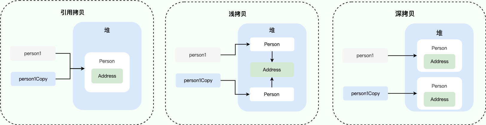

## Java 基础

### Java 中的几种基本数据类型是什么？对应的包装类型是什么？各自占用多少字节呢？

Java 中有 8 种基本数据类型，分别为：

- 6 种数字类型：
  - 4 种整数型：`byte`、`short`、`int`、`long`
  - 2 种浮点型：`float`、`double`
- 1 种字符类型：`char`
- 1 种布尔型：`boolean`。

这 8 种基本数据类型的默认值以及所占空间的大小如下：

| 基本类型  | 位数 | 字节 | 默认值  | 取值范围                                                     |
| :-------- | :--- | :--- | :------ | ------------------------------------------------------------ |
| `byte`    | 8    | 1    | 0       | -128 ~ 127                                                   |
| `short`   | 16   | 2    | 0       | -32768（-2^15） ~ 32767（2^15 - 1）                          |
| `int`     | 32   | 4    | 0       | -2147483648 ~ 2147483647                                     |
| `long`    | 64   | 8    | 0L      | -9223372036854775808（-2^63） ~ 9223372036854775807（2^63 -1） |
| `char`    | 16   | 2    | 'u0000' | 0 ~ 65535（2^16 - 1）                                        |
| `float`   | 32   | 4    | 0f      | 1.4E-45 ~ 3.4028235E38                                       |
| `double`  | 64   | 8    | 0d      | 4.9E-324 ~ 1.7976931348623157E308                            |
| `boolean` | 1    |      | false   | true、false                                                  |

可以看到，像 `byte`、`short`、`int`、`long`能表示的最大正数都减 1 了。这是为什么呢？这是因为在二进制补码表示法中，最高位是用来表示符号的（0 表示正数，1 表示负数），其余位表示数值部分。所以，如果我们要表示最大的正数，我们需要把除了最高位之外的所有位都设为 1。如果我们再加 1，就会导致溢出，变成一个负数。

对于 `boolean`，官方文档未明确定义，它依赖于 JVM 厂商的具体实现。逻辑上理解是占用 1 位，但是实际中会考虑计算机高效存储因素。

另外，Java 的每种基本类型所占存储空间的大小不会像其他大多数语言那样随机器硬件架构的变化而变化。这种所占存储空间大小的不变性是 Java 程序比用其他大多数语言编写的程序更具可移植性的原因之一（《Java 编程思想》2.2 节有提到）。

**注意：**

1. Java 里使用 `long` 类型的数据一定要在数值后面加上 **L**，否则将作为整型解析。
2. Java 里使用 `float` 类型的数据一定要在数值后面加上 **f 或 F**，否则将无法通过编译。
3. `char a = 'h'`char :单引号，`String a = "hello"` :双引号。

这八种基本类型都有对应的包装类分别为：`Byte`、`Short`、`Integer`、`Long`、`Float`、`Double`、`Character`、`Boolean` 。

**基本类型和包装类型的区别？**

- **用途**：除了定义一些常量和局部变量之外，我们在其他地方比如方法参数、对象属性中很少会使用基本类型来定义变量。并且，包装类型可用于泛型，而基本类型不可以。
- **存储方式**：基本数据类型的局部变量存放在 Java 虚拟机栈中的局部变量表中，基本数据类型的成员变量（未被 `static` 修饰 ）存放在 Java 虚拟机的堆中。包装类型属于对象类型，我们知道几乎所有对象实例都存在于堆中。
- **占用空间**：相比于包装类型（对象类型）， 基本数据类型占用的空间往往非常小。
- **默认值**：成员变量包装类型不赋值就是 `null` ，而基本类型有默认值且不是 `null`。
- **比较方式**：对于基本数据类型来说，`==` 比较的是值。对于包装数据类型来说，`==` 比较的是对象的内存地址。所有整型包装类对象之间值的比较，全部使用 `equals()` 方法。

**为什么说是几乎所有对象实例都存在于堆中呢？** 这是因为 HotSpot 虚拟机引入了 JIT 优化之后，会对对象进行逃逸分析，如果发现某一个对象并没有逃逸到方法外部，那么就可能通过标量替换来实现栈上分配，而避免堆上分配内存

⚠️ 注意：**基本数据类型存放在栈中是一个常见的误区！** 基本数据类型的存储位置取决于它们的作用域和声明方式。如果它们是局部变量，那么它们会存放在栈中；如果它们是成员变量，那么它们会存放在堆/方法区/元空间中。

```java
public class Test {
    // 成员变量，存放在堆中
    int a = 10;
    // 被 static 修饰的成员变量，JDK 1.7 及之前位于方法区，1.8 后存放于元空间，均不存放于堆中。
    // 变量属于类，不属于对象。
    static int b = 20;

    public void method() {
        // 局部变量，存放在栈中
        int c = 30;
        static int d = 40; // 编译错误，不能在方法中使用 static 修饰局部变量
    }
}
```

### 包装类型的缓存机制了解么？

Java 基本数据类型的包装类型的大部分都用到了缓存机制来提升性能。

`Byte`,`Short`,`Integer`,`Long` 这 4 种包装类默认创建了数值 **[-128，127]** 的相应类型的缓存数据，`Character` 创建了数值在 **[0,127]** 范围的缓存数据，`Boolean` 直接返回 `TRUE` or `FALSE`。

对于 `Integer`，可以通过 JVM 参数 `-XX:AutoBoxCacheMax=<size>` 修改缓存上限，但不能修改下限 -128。实际使用时，并不建议设置过大的值，避免浪费内存，甚至是 OOM。

对于`Byte`,`Short`,`Long` ,`Character` 没有类似 `-XX:AutoBoxCacheMax` 参数可以修改，因此缓存范围是固定的，无法通过 JVM 参数调整。`Boolean` 则直接返回预定义的 `TRUE` 和 `FALSE` 实例，没有缓存范围的概念。

**Integer 缓存源码：**

```java
public static Integer valueOf(int i) {
    if (i >= IntegerCache.low && i <= IntegerCache.high)
        return IntegerCache.cache[i + (-IntegerCache.low)];
    return new Integer(i);
}
private static class IntegerCache {
    static final int low = -128;
    static final int high;
    static {
        // high value may be configured by property
        int h = 127;
    }
}
```

**`Character` 缓存源码:**

```java
public static Character valueOf(char c) {
    if (c <= 127) { // must cache
      return CharacterCache.cache[(int)c];
    }
    return new Character(c);
}

private static class CharacterCache {
    private CharacterCache(){}
    static final Character cache[] = new Character[127 + 1];
    static {
        for (int i = 0; i < cache.length; i++)
            cache[i] = new Character((char)i);
    }

}
```

**`Boolean` 缓存源码：**

```java
public static Boolean valueOf(boolean b) {
    return (b ? TRUE : FALSE);
}
```

如果超出对应范围仍然会去创建新的对象，缓存的范围区间的大小只是在性能和资源之间的权衡。

两种浮点数类型的包装类 `Float`,`Double` 并没有实现缓存机制。

```java
Integer i1 = 33;
Integer i2 = 33;
System.out.println(i1 == i2);// 输出 true

Float i11 = 333f;
Float i22 = 333f;
System.out.println(i11 == i22);// 输出 false

Double i3 = 1.2;
Double i4 = 1.2;
System.out.println(i3 == i4);// 输出 false
```

下面我们来看一个问题：下面的代码的输出结果是 `true` 还是 `false` 呢？

```java
Integer i1 = 40;
Integer i2 = new Integer(40);
System.out.println(i1==i2);
```

`Integer i1=40` 这一行代码会发生装箱，也就是说这行代码等价于 `Integer i1=Integer.valueOf(40)` 。因此，`i1` 直接使用的是缓存中的对象。而`Integer i2 = new Integer(40)` 会直接创建新的对象。

因此，答案是 `false` 。你答对了吗？

记住：**所有整型包装类对象之间值的比较，全部使用 equals 方法比较**。


### 自动装箱与拆箱了解吗？原理是什么？

- **装箱**：将基本类型用它们对应的引用类型包装起来；
- **拆箱**：将包装类型转换为基本数据类型；

举例：

```java
Integer i = 10;  //装箱
int n = i;   //拆箱
```

从字节码中，我们发现装箱其实就是调用了 包装类的`valueOf()`方法，拆箱其实就是调用了 `xxxValue()`方法。

因此，

- `Integer i = 10` 等价于 `Integer i = Integer.valueOf(10)`
- `int n = i` 等价于 `int n = i.intValue()`;

注意：**如果频繁拆装箱的话，也会严重影响系统的性能。我们应该尽量避免不必要的拆装箱操作。**

```java
private static long sum() {
    // 应该使用 long 而不是 Long
    Long sum = 0L;
    for (long i = 0; i <= Integer.MAX_VALUE; i++)
        sum += i;
    return sum;
}
```

### String、StringBuffer 和 StringBuilder 的区别是什么? 

**可变性**

`String` 是不可变的（后面会详细分析原因）。

`StringBuilder` 与 `StringBuffer` 都继承自 `AbstractStringBuilder` 类，在 `AbstractStringBuilder` 中也是使用字符数组保存字符串，不过没有使用 `final` 和 `private` 关键字修饰，最关键的是这个 `AbstractStringBuilder` 类还提供了很多修改字符串的方法比如 `append` 方法。

```
abstract class AbstractStringBuilder implements Appendable, CharSequence {
    char[] value;
    public AbstractStringBuilder append(String str) {
        if (str == null)
            return appendNull();
        int len = str.length();
        ensureCapacityInternal(count + len);
        str.getChars(0, len, value, count);
        count += len;
        return this;
    }
    //...
}
```

**线程安全性**

`String` 中的对象是不可变的，也就可以理解为常量，线程安全。`AbstractStringBuilder` 是 `StringBuilder` 与 `StringBuffer` 的公共父类，定义了一些字符串的基本操作，如 `expandCapacity`、`append`、`insert`、`indexOf` 等公共方法。`StringBuffer` 对方法加了同步锁或者对调用的方法加了同步锁，所以是线程安全的。`StringBuilder` 并没有对方法进行加同步锁，所以是非线程安全的。

**性能**

每次对 `String` 类型进行改变的时候，都会生成一个新的 `String` 对象，然后将指针指向新的 `String` 对象。`StringBuffer` 每次都会对 `StringBuffer` 对象本身进行操作，而不是生成新的对象并改变对象引用。相同情况下使用 `StringBuilder` 相比使用 `StringBuffer` 仅能获得 10%~15% 左右的性能提升，但却要冒多线程不安全的风险。

**对于三者使用的总结：**

- 操作少量的数据: 适用 `String`
- 单线程操作字符串缓冲区下操作大量数据: 适用 `StringBuilder`
- 多线程操作字符串缓冲区下操作大量数据: 适用 `StringBuffer`

### String 为什么是不可变的?

`String` 类中使用 `final` 关键字修饰字符数组来保存字符串，~~所以`String` 对象是不可变的。~~

```
public final class String implements java.io.Serializable, Comparable<String>, CharSequence {
    private final char value[];
  //...
}
```

> 🐛 修正：我们知道被 `final` 关键字修饰的类不能被继承，修饰的方法不能被重写，修饰的变量是基本数据类型则值不能改变，修饰的变量是引用类型则不能再指向其他对象。因此，`final` 关键字修饰的数组保存字符串并不是 `String` 不可变的根本原因，因为这个数组保存的字符串是可变的（`final` 修饰引用类型变量的情况）。
>
> `String` 真正不可变有下面几点原因：
>
> 1. 保存字符串的数组被 `final` 修饰且为私有的，并且`String` 类没有提供/暴露修改这个字符串的方法。
> 2. `String` 类被 `final` 修饰导致其不能被继承，进而避免了子类破坏 `String` 不可变。
>
> 相关阅读：[如何理解 String 类型值的不可变？ - 知乎提问](https://www.zhihu.com/question/20618891/answer/114125846)
>
> 补充（来自[issue 675](https://github.com/Snailclimb/JavaGuide/issues/675)）：在 Java 9 之后，`String`、`StringBuilder` 与 `StringBuffer` 的实现改用 `byte` 数组存储字符串。

```
public final class String implements java.io.Serializable,Comparable<String>, CharSequence {
    // @Stable 注解表示变量最多被修改一次，称为“稳定的”。
    @Stable
    private final byte[] value;
}

abstract class AbstractStringBuilder implements Appendable, CharSequence {
    byte[] value;

}
```


**Java 9 为何要将 `String` 的底层实现由 `char[]` 改成了 `byte[]` ?**

新版的 String 其实支持两个编码方案：Latin-1 和 UTF-16。如果字符串中包含的汉字没有超过 Latin-1 可表示范围内的字符，那就会使用 Latin-1 作为编码方案。Latin-1 编码方案下，`byte` 占一个字节(8 位)，`char` 占用 2 个字节（16），`byte` 相较 `char` 节省一半的内存空间。

JDK 官方就说了绝大部分字符串对象只包含 Latin-1 可表示的字符。

[](https://camo.githubusercontent.com/20d5b1eab045f5cbdee9942051814fb5c87975a7e0ffc07eb736c316ac8dbcef/68747470733a2f2f6f73732e6a61766167756964652e636e2f6769746875622f6a61766167756964652f6a646b392d737472696e672d6c6174696e312e706e67)

如果字符串中包含的汉字超过 Latin-1 可表示范围内的字符，`byte` 和 `char` 所占用的空间是一样的。

这是官方的介绍：https://openjdk.java.net/jeps/254 。

### String s1 = new String("abc"); 这段代码创建了几个字符串对象？

先说答案：会创建 1 或 2 个字符串对象。

1. 字符串常量池中不存在 "abc"：会创建 2 个字符串对象。一个在字符串常量池中，由 `ldc` 指令触发创建。一个在堆中，由 `new String()` 创建，并使用常量池中的 "abc" 进行初始化。
2. 字符串常量池中已存在 "abc"：会创建 1 个字符串对象。该对象在堆中，由 `new String()` 创建，并使用常量池中的 "abc" 进行初始化。

下面开始详细分析。

1、如果字符串常量池中不存在字符串对象 “abc”，那么它首先会在字符串常量池中创建字符串对象 "abc"，然后在堆内存中再创建其中一个字符串对象 "abc"。

示例代码（JDK 1.8）：

```java
String s1 = new String("abc");
```

对应的字节码：

```java
// 在堆内存中分配一个尚未初始化的 String 对象。
// #2 是常量池中的一个符号引用，指向 java/lang/String 类。
// 在类加载的解析阶段，这个符号引用会被解析成直接引用，即指向实际的 java/lang/String 类。
0 new #2 <java/lang/String>
// 复制栈顶的 String 对象引用，为后续的构造函数调用做准备。
// 此时操作数栈中有两个相同的对象引用：一个用于传递给构造函数，另一个用于保持对新对象的引用，后续将其存储到局部变量表。
3 dup
// JVM 先检查字符串常量池中是否存在 "abc"。
// 如果常量池中已存在 "abc"，则直接返回该字符串的引用；
// 如果常量池中不存在 "abc"，则 JVM 会在常量池中创建该字符串字面量并返回它的引用。
// 这个引用被压入操作数栈，用作构造函数的参数。
4 ldc #3 <abc>
// 调用构造方法，使用从常量池中加载的 "abc" 初始化堆中的 String 对象
// 新的 String 对象将包含与常量池中的 "abc" 相同的内容，但它是一个独立的对象，存储于堆中。
6 invokespecial #4 <java/lang/String.<init> : (Ljava/lang/String;)V>
// 将堆中的 String 对象引用存储到局部变量表
9 astore_1
// 返回，结束方法
10 return
```

`ldc (load constant)` 指令的确是从常量池中加载各种类型的常量，包括字符串常量、整数常量、浮点数常量，甚至类引用等。对于字符串常量，`ldc` 指令的行为如下：

1. **从常量池加载字符串**：`ldc` 首先检查字符串常量池中是否已经有内容相同的字符串对象。
2. **复用已有字符串对象**：如果字符串常量池中已经存在内容相同的字符串对象，`ldc` 会将该对象的引用加载到操作数栈上。
3. **没有则创建新对象并加入常量池**：如果字符串常量池中没有相同内容的字符串对象，JVM 会在常量池中创建一个新的字符串对象，并将其引用加载到操作数栈中。

2、如果字符串常量池中已存在字符串对象“abc”，则只会在堆中创建 1 个字符串对象“abc”。

示例代码（JDK 1.8）：

```java
// 字符串常量池中已存在字符串对象“abc”
String s1 = "abc";
// 下面这段代码只会在堆中创建 1 个字符串对象“abc”
String s2 = new String("abc");
```

对应的字节码：

```java
0 ldc #2 <abc>
2 astore_1
3 new #3 <java/lang/String>
6 dup
7 ldc #2 <abc>
9 invokespecial #4 <java/lang/String.<init> : (Ljava/lang/String;)V>
12 astore_2
13 return
```

这里就不对上面的字节码进行详细注释了，7 这个位置的 `ldc` 命令不会在堆中创建新的字符串对象“abc”，这是因为 0 这个位置已经执行了一次 `ldc` 命令，已经在堆中创建过一次字符串对象“abc”了。7 这个位置执行 `ldc` 命令会直接返回字符串常量池中字符串对象“abc”对应的引用。

### == 与 equals？

**`==`** 对于基本类型和引用类型的作用效果是不同的：

- 对于基本数据类型来说，`==` 比较的是值。
- 对于引用数据类型来说，`==` 比较的是对象的内存地址。

> 因为 Java 只有值传递，所以，对于 == 来说，不管是比较基本数据类型，还是引用数据类型的变量，其本质比较的都是值，只是引用类型变量存的值是对象的地址。

**`equals()`** 不能用于判断基本数据类型的变量，只能用来判断两个对象是否相等。`equals()`方法存在于`Object`类中，而`Object`类是所有类的直接或间接父类，因此所有的类都有`equals()`方法。

`Object` 类 `equals()` 方法：

```java
public boolean equals(Object obj) {
     return (this == obj);
}
```

`equals()` 方法存在两种使用情况：

- **类没有重写 `equals()`方法**：通过`equals()`比较该类的两个对象时，等价于通过“==”比较这两个对象，使用的默认是 `Object`类`equals()`方法。
- **类重写了 `equals()`方法**：一般我们都重写 `equals()`方法来比较两个对象中的属性是否相等；若它们的属性相等，则返回 true(即，认为这两个对象相等)。

举个例子（这里只是为了举例。实际上，你按照下面这种写法的话，像 IDEA 这种比较智能的 IDE 都会提示你将 `==` 换成 `equals()` ）：

```java
String a = new String("ab"); // a 为一个引用
String b = new String("ab"); // b为另一个引用,对象的内容一样
String aa = "ab"; // 放在常量池中
String bb = "ab"; // 从常量池中查找
System.out.println(aa == bb);// true
System.out.println(a == b);// false
System.out.println(a.equals(b));// true
System.out.println(42 == 42.0);// true
```

`String` 中的 `equals` 方法是被重写过的，因为 `Object` 的 `equals` 方法是比较的对象的内存地址，而 `String` 的 `equals` 方法比较的是对象的值。

当创建 `String` 类型的对象时，虚拟机会在常量池中查找有没有已经存在的值和要创建的值相同的对象，如果有就把它赋给当前引用。如果没有就在常量池中重新创建一个 `String` 对象。

`String`类`equals()`方法：

```java
public boolean equals(Object anObject) {
    if (this == anObject) {
        return true;
    }
    if (anObject instanceof String) {
        String anotherString = (String)anObject;
        int n = value.length;
        if (n == anotherString.value.length) {
            char v1[] = value;
            char v2[] = anotherString.value;
            int i = 0;
            while (n-- != 0) {
                if (v1[i] != v2[i])
                    return false;
                i++;
            }
            return true;
        }
    }
    return false;
}
```

### hashCode 与 equals ？

> 当你把对象加入 `HashSet` 时，`HashSet` 会先计算对象的 `hashCode` 值来判断对象加入的位置，同时也会与其他已经加入的对象的 `hashCode` 值作比较，如果没有相符的 `hashCode`，`HashSet` 会假设对象没有重复出现。但是如果发现有相同 `hashCode` 值的对象，这时会调用 `equals()` 方法来检查 `hashCode` 相等的对象是否真的相同。如果两者相同，`HashSet` 就不会让其加入操作成功。如果不同的话，就会重新散列到其他位置。这样我们就大大减少了 `equals` 的次数，相应就大大提高了执行速度。

其实， `hashCode()` 和 `equals()`都是用于比较两个对象是否相等。

**那为什么 JDK 还要同时提供这两个方法呢？**

这是因为在一些容器（比如 `HashMap`、`HashSet`）中，有了 `hashCode()` 之后，判断元素是否在对应容器中的效率会更高（参考添加元素进`HashSet`的过程）！

我们在前面也提到了添加元素进`HashSet`的过程，如果 `HashSet` 在对比的时候，同样的 `hashCode` 有多个对象，它会继续使用 `equals()` 来判断是否真的相同。也就是说 `hashCode` 帮助我们大大缩小了查找成本。

如果两个对象的`hashCode` 值相等，那这两个对象不一定相等（哈希碰撞）。

如果两个对象的`hashCode` 值相等并且`equals()`方法也返回 `true`，我们才认为这两个对象相等。

如果两个对象的`hashCode` 值不相等，我们就可以直接认为这两个对象不相等。

### 深拷贝和浅拷贝区别了解吗？什么是引用拷贝？

- **浅拷贝**：浅拷贝会在堆上创建一个新的对象（区别于引用拷贝的一点），不过，如果原对象内部的属性是引用类型的话，浅拷贝会直接复制内部对象的引用地址，也就是说拷贝对象和原对象共用同一个内部对象。
- **深拷贝**：深拷贝会完全复制整个对象，包括这个对象所包含的内部对象。

#### 浅拷贝

浅拷贝的示例代码如下，我们这里实现了 `Cloneable` 接口，并重写了 `clone()` 方法。

`clone()` 方法的实现很简单，直接调用的是父类 `Object` 的 `clone()` 方法。

```java
public class Address implements Cloneable{
    private String name;
    // 省略构造函数、Getter&Setter方法
    @Override
    public Address clone() {
        try {
            return (Address) super.clone();
        } catch (CloneNotSupportedException e) {
            throw new AssertionError();
        }
    }
}

public class Person implements Cloneable {
    private Address address;
    // 省略构造函数、Getter&Setter方法
    @Override
    public Person clone() {
        try {
            Person person = (Person) super.clone();
            return person;
        } catch (CloneNotSupportedException e) {
            throw new AssertionError();
        }
    }
}
```

测试：

```java
Person person1 = new Person(new Address("武汉"));
Person person1Copy = person1.clone();
System.out.println(person1.getAddress() == person1Copy.getAddress()); // true
```

从输出结构就可以看出， `person1` 的克隆对象和 `person1` 使用的仍然是同一个 `Address` 对象。

#### 深拷贝

这里我们简单对 `Person` 类的 `clone()` 方法进行修改，连带着要把 `Person` 对象内部的 `Address` 对象一起复制。

```java
@Override
public Person clone() {
    try {
        Person person = (Person) super.clone();
        person.setAddress(person.getAddress().clone());
        return person;
    } catch (CloneNotSupportedException e) {
        throw new AssertionError();
    }
}
```

测试：

```java
Person person1 = new Person(new Address("武汉"));
Person person1Copy = person1.clone();
System.out.println(person1.getAddress() == person1Copy.getAddress()); // false
System.out.println(person1.getAddress().getName().equals(person1Copy.getAddress().getName())); // true
```

从输出结构就可以看出，显然 `person1` 的克隆对象和 `person1` 包含的 `Address` 对象已经是不同的了。

**那什么是引用拷贝呢？** 简单来说，引用拷贝就是两个不同的引用指向同一个对象。

我专门画了一张图来描述浅拷贝、深拷贝、引用拷贝：



### 谈谈对 Java 注解的理解，解决了什么问题？

#### 何谓注解

`Annotation` （注解） 是 Java5 开始引入的新特性，可以看作是一种特殊的注释，主要用于修饰类、方法或者变量，提供某些信息供程序在编译或者运行时使用。

注解本质是一个继承了`Annotation` 的特殊接口：

```java
@Target(ElementType.METHOD)
@Retention(RetentionPolicy.SOURCE)
public @interface Override {

}

public interface Override extends Annotation{

}
```

JDK 提供了很多内置的注解（比如 `@Override`、`@Deprecated（已弃用）`），同时，我们还可以自定义注解。

#### 注解的解析方法有哪几种

注解只有被解析之后才会生效，常见的解析方法有两种：

- **编译期直接扫描**：编译器在编译 Java 代码的时候扫描对应的注解并处理，比如某个方法使用`@Override` 注解，编译器在编译的时候就会检测当前的方法是否重写了父类对应的方法。
- **运行期通过反射处理**：像框架中自带的注解(比如 Spring 框架的 `@Value`、`@Component`)都是通过反射来进行处理的。

### Exception 和 Error 有什么区别？

在 Java 中，所有的异常都有一个共同的祖先 `java.lang` 包中的 `Throwable` 类。`Throwable` 类有两个重要的子类：

- **`Exception`** :程序本身可以处理的异常，可以通过 `catch` 来进行捕获。`Exception` 又可以分为 Checked Exception (受检查异常，必须处理) 和 Unchecked Exception (不受检查异常，可以不处理)。
- **`Error`**：`Error` 属于程序无法处理的错误 ，我们~~没办法通过 `catch` 来进行捕获~~不建议通过`catch`捕获 。例如 Java 虚拟机运行错误（`Virtual MachineError`）、虚拟机内存不够错误(`OutOfMemoryError`)、类定义错误（`NoClassDefFoundError`）等 。这些异常发生时，Java 虚拟机（JVM）一般会选择线程终止。

### 什么是 Java 反射

如果说大家研究过框架的底层原理或者咱们自己写过框架的话，一定对反射这个概念不陌生。反射之所以被称为框架的灵魂，主要是因为它赋予了我们在运行时分析类以及执行类中方法的能力。通过反射你可以获取任意一个类的所有属性和方法，你还可以调用这些方法和属性

### 反射有什么缺点？你是怎么理解反射的（为什么框架需要反射）？

反射可以让我们的代码更加灵活、为各种框架提供开箱即用的功能提供了便利。

不过，反射让我们在运行时有了分析操作类的能力的同时，也增加了安全问题，比如可以无视泛型参数的安全检查（泛型参数的安全检查发生在编译时）。另外，反射的性能也要稍差点，不过，对于框架来说实际是影响不大的。

相关阅读：[Java Reflection: Why is it so slow?](https://stackoverflow.com/questions/1392351/java-reflection-why-is-it-so-slow) 

反射提供了框架在运行时动态加载和操作类的能力，从而实现更灵活和可扩展的框架结构。框架可以通过反射来实现配置文件的解析、动态创建对象、调用对象的方法等功能。反射使得框架可以在不了解具体类实现的情况下进行操作，从而实现了框架的解耦和扩展性。例如，依赖注入框架（如Spring）可以使用反射来动态创建和注入对象，使得应用程序可以在不修改代码的情况下配置和更改对象的依赖关系。通过反射，框架可以在运行时根据配置和需求来加载和使用类，提供更大的灵活性和可定制性。

### 反射的应用场景

像咱们平时大部分时候都是在写业务代码，很少会接触到直接使用反射机制的场景。但是！这并不代表反射没有用。相反，正是因为反射，你才能这么轻松地使用各种框架。像 Spring/Spring Boot、MyBatis 等等框架中都大量使用了反射机制。

**这些框架中也大量使用了动态代理，而动态代理的实现也依赖反射。**

比如下面是通过 JDK 实现动态代理的示例代码，其中就使用了反射类 `Method` 来调用指定的方法。

```java
public class DebugInvocationHandler implements InvocationHandler {
    /**
     * 代理类中的真实对象
     */
    private final Object target;

    public DebugInvocationHandler(Object target) {
        this.target = target;
    }

    public Object invoke(Object proxy, Method method, Object[] args) throws InvocationTargetException, IllegalAccessException {
        System.out.println("before method " + method.getName());
        Object result = method.invoke(target, args);
        System.out.println("after method " + method.getName());
        return result;
    }
}
```

另外，像 Java 中的一大利器 **注解** 的实现也用到了反射。

为什么你使用 Spring 的时候 ，一个`@Component`注解就声明了一个类为 Spring Bean 呢？为什么你通过一个 `@Value`注解就读取到配置文件中的值呢？究竟是怎么起作用的呢？

这些都是因为你可以基于反射分析类，然后获取到类/属性/方法/方法的参数上的注解。你获取到注解之后，就可以做进一步的处理。

### Java 泛型了解么？什么是类型擦除？介绍⼀下常用的通配符？

**Java 泛型（Generics）** 是 JDK 5 中引入的一个新特性。使用泛型参数，可以增强代码的可读性以及稳定性。

编译器可以对泛型参数进行检测，并且通过泛型参数可以指定传入的对象类型。比如 `ArrayList<Person> persons = new ArrayList<Person>()` 这行代码就指明了该 `ArrayList` 对象只能传入 `Person` 对象，如果传入其他类型的对象就会报错。

```
ArrayList<E> extends AbstractList<E>
```

并且，原生 `List` 返回类型是 `Object` ，需要手动转换类型才能使用，使用泛型后编译器自动转换。

#### 泛型一般有三种使用方式:**泛型类**、**泛型接口**、**泛型方法**。

**1.泛型类**：

```java
//此处T可以随便写为任意标识，常见的如T、E、K、V等形式的参数常用于表示泛型
//在实例化泛型类时，必须指定T的具体类型
public class Generic<T>{

    private T key;

    public Generic(T key) {
        this.key = key;
    }

    public T getKey(){
        return key;
    }
}
```

如何实例化泛型类：

```java
Generic<Integer> genericInteger = new Generic<Integer>(123456);
```

**2.泛型接口**：

```java
public interface Generator<T> {
    public T method();
}
```

实现泛型接口，不指定类型：

```java
class GeneratorImpl<T> implements Generator<T>{
    @Override
    public T method() {
        return null;
    }
}
```

实现泛型接口，指定类型：

```java
class GeneratorImpl implements Generator<String> {
    @Override
    public String method() {
        return "hello";
    }
}
```

**3.泛型方法**：

```java
   public static < E > void printArray( E[] inputArray )
   {
         for ( E element : inputArray ){
            System.out.printf( "%s ", element );
         }
         System.out.println();
    }
```

使用：

```java
// 创建不同类型数组：Integer, Double 和 Character
Integer[] intArray = { 1, 2, 3 };
String[] stringArray = { "Hello", "World" };
printArray( intArray  );
printArray( stringArray  );
```

> 注意: `public static < E > void printArray( E[] inputArray )` 一般被称为静态泛型方法;在 java 中泛型只是一个占位符，必须在传递类型后才能使用。类在实例化时才能真正的传递类型参数，由于静态方法的加载先于类的实例化，也就是说类中的泛型还没有传递真正的类型参数，静态的方法的加载就已经完成了，所以静态泛型方法是没有办法使用类上声明的泛型的。只能使用自己声明的 `<E>`

#### 项目中哪里用到了泛型？

- 自定义接口通用返回结果 `CommonResult<T>` 通过参数 `T` 可根据具体的返回类型动态指定结果的数据类型
- 定义 `Excel` 处理类 `ExcelUtil<T>` 用于动态指定 `Excel` 导出的数据类型
- 构建集合工具类（参考 `Collections` 中的 `sort`, `binarySearch` 方法）。
- ……

#### 类型擦除

**类型擦除**是Java泛型实现中的一种机制，旨在确保泛型代码在编译后能与非泛型代码兼容。具体来说，编译器在编译时会移除所有泛型类型信息，将其替换为原始类型（通常是`Object`），并在必要时插入类型转换。这种机制使得泛型代码在运行时与非泛型代码保持一致。

**类型擦除的主要特点：**

1. **类型参数替换**：泛型类型参数在编译时被替换为`Object`或其上限类型。
2. **类型检查**：编译器在编译时进行类型检查，确保类型安全。
3. **桥接方法**：编译器生成桥接方法，确保多态性在类型擦除后仍能正常工作。

**示例：**

```java
public class Box<T> {
    private T value;

    public void setValue(T value) {
        this.value = value;
    }

    public T getValue() {
        return value;
    }
}
```
编译后，`Box<String>`和`Box<Integer>`都会被擦除为`Box<Object>`，且`getValue`和`setValue`方法的类型参数也会被替换为`Object`。

#### 常用的通配符

Java泛型中的通配符用于表示未知类型，主要有以下三种：

1. **无界通配符 (`?`)**：
   - 表示任意类型。
   - 常用于泛型类或方法的参数类型，表示可以接受任何类型的参数。

   **示例：**
   ```java
   public void printList(List<?> list) {
       for (Object elem : list) {
           System.out.println(elem);
       }
   }
   ```

2. **上界通配符 (`<? extends T>`)**：
   - 表示类型必须是`T`或其子类。
   - 常用于读取操作，确保类型安全。

   **示例：**
   ```java
   public double sumOfList(List<? extends Number> list) {
       double sum = 0.0;
       for (Number num : list) {
           sum += num.doubleValue();
       }
       return sum;
   }
   ```

3. **下界通配符 (`<? super T>`)**：
   - 表示类型必须是`T`或其父类。
   - 常用于写入操作，确保类型安全。

   **示例：**
   ```java
   public void addNumbers(List<? super Integer> list) {
       for (int i = 1; i <= 10; i++) {
           list.add(i);
       }
   }
   ```

### 内部类

内部类是定义在另一个类内部的类，包含内部类的类被称为外部类。内部类可以访问外部类的成员，包括私有成员，而外部类也可以访问内部类的成员。 

优点：
- **封装性**：可以将一些相关的类组织在一起，提高代码的封装性和可读性。 
- **访问权限**：内部类可以访问外部类的私有成员。 
- **实现回调机制**：方便实现一些回调功能。

分类 ：

内部类可以分为以下几种类型： 

- **成员内部类**：定义在外部类的成员位置，与类的成员变量和方法处于同一层次。

```java
class Outer {
    private int outerVar = 10;     // 成员内部类
    class Inner {
        public void printOuterVar() {
            System.out.println(outerVar);
        }
    }
} 
public class Main {
    public static void main(String[] args) {
        Outer outer = new Outer();
        Outer.Inner inner = outer.new Inner();
        inner.printOuterVar(); // 输出: 10
    }
} 
```

- **静态内部类**：使用 `static` 关键字修饰的内部类，它不能直接访问外部类的非静态成员。 

```java 
class Outer {
    private static int outerStaticVar = 20;     // 静态内部类
    static class StaticInner {
        public void printOuterStaticVar() {
            System.out.println(outerStaticVar);
        }    
    }
}
public class Main {
    public static void main(String[] args) {
        Outer.StaticInner staticInner = new Outer.StaticInner();
        staticInner.printOuterStaticVar(); // 输出: 20
    }
} 
```

- **局部内部类**：定义在方法内部的类，只能在该方法内部使用。 

```java 
class Outer {
    public void outerMethod() {
        int localVar = 30;         // 局部内部类
        class LocalInner {
            public void printLocalVar() {
                System.out.println(localVar);
            }
        }
        LocalInner localInner = new LocalInner();
        localInner.printLocalVar();
    }
} 
public class Main {
    public static void main(String[] args) {
        Outer outer = new Outer();
        outer.outerMethod(); // 输出: 30
    }
} 
```

### 匿名内部类 

匿名内部类是一种没有名字的内部类，它通常用于创建一个实现了某个接口或继承了某个类的对象，并且只使用一次。 

优点 
- **简洁性**：可以减少代码量，使代码更加简洁。 
- **即时使用**：适合只需要使用一次的情况，无需单独定义一个类。 

```java 
new 父类构造器(参数列表) | 接口名() {
    // 匿名内部类的类体部分
} 
```

示例

```java
// 定义一个接口
interface MyInterface {
    void doSomething();
}

public class Main {
    public static void main(String[] args) {
        // 使用匿名内部类实现 MyInterface 接口
        MyInterface myInterface = new MyInterface() {
            @Override
            public void doSomething() {
                System.out.println("Doing something...");
            }
        };

        myInterface.doSomething(); // 输出: Doing something...
    }
}
```


在上述示例中，通过匿名内部类实现了 `MyInterface` 接口，并创建了一个实现该接口的对象。这种方式避免了单独定义一个类来实现接口，使代码更加简洁。

### BIO,NIO,AIO 有什么区别

#### BIO (Blocking I/O)

**BIO 属于同步阻塞 IO 模型** 。

同步阻塞 IO 模型中，应用程序发起 read 调用后，会一直阻塞，直到内核把数据拷贝到用户空间。

[](https://camo.githubusercontent.com/d0a4d31dbdf884656c091742cf5864f18b7be13bdb0af660b5828fead1bb19e7/68747470733a2f2f6f73732e6a61766167756964652e636e2f70332d6a75656a696e2f36613965373034616634396234333830626236383666306339366433336238317e74706c762d6b3375316662706663702d77617465726d61726b2e706e67)

在客户端连接数量不高的情况下，是没问题的。但是，当面对十万甚至百万级连接的时候，传统的 BIO 模型是无能为力的。因此，我们需要一种更高效的 I/O 处理模型来应对更高的并发量。

#### NIO (Non-blocking/New I/O)

Java 中的 NIO 于 Java 1.4 中引入，对应 `java.nio` 包，提供了 `Channel` , `Selector`，`Buffer` 等抽象。NIO 中的 N 可以理解为 Non-blocking，不单纯是 New。它是支持面向缓冲的，基于通道的 I/O 操作方法。 对于高负载、高并发的（网络）应用，应使用 NIO 。

Java 中的 NIO 可以看作是 **I/O 多路复用模型**。也有很多人认为，Java 中的 NIO 属于同步非阻塞 IO 模型。

跟着我的思路往下看看，相信你会得到答案！

我们先来看看 **同步非阻塞 IO 模型**。

[](https://camo.githubusercontent.com/b7adbae5478c18a5edffb52bb8d16d07e704491226dc1dc3736846a7b76e98c1/68747470733a2f2f6f73732e6a61766167756964652e636e2f70332d6a75656a696e2f62623137346532326462653034626237396665336663313236616564306336317e74706c762d6b3375316662706663702d77617465726d61726b2e706e67)

同步非阻塞 IO 模型中，应用程序会一直发起 read 调用，等待数据从内核空间拷贝到用户空间的这段时间里，线程依然是阻塞的，直到在内核把数据拷贝到用户空间。

相比于同步阻塞 IO 模型，同步非阻塞 IO 模型确实有了很大改进。通过轮询操作，避免了一直阻塞。

但是，这种 IO 模型同样存在问题：**应用程序不断进行 I/O 系统调用轮询数据是否已经准备好的过程是十分消耗 CPU 资源的。**

这个时候，**I/O 多路复用模型** 就上场了。

[](https://camo.githubusercontent.com/b7222fcb57ba3048b83b939e67511016ac5939093f2e81a468fc65ae5be8d1ad/68747470733a2f2f6f73732e6a61766167756964652e636e2f6769746875622f6a61766167756964652f6a6176612f696f2f38386666383632373634303234633362383536373336376466313164663661627e74706c762d6b3375316662706663702d77617465726d61726b2e706e67)

IO 多路复用模型中，线程首先发起 select 调用，询问内核数据是否准备就绪，等内核把数据准备好了，用户线程再发起 read 调用。read 调用的过程（数据从内核空间 -> 用户空间）还是阻塞的。

> 目前支持 IO 多路复用的系统调用，有 select，epoll 等等。select 系统调用，目前几乎在所有的操作系统上都有支持。
>
> - **select 调用**：内核提供的系统调用，它支持一次查询多个系统调用的可用状态。几乎所有的操作系统都支持。
> - **epoll 调用**：linux 2.6 内核，属于 select 调用的增强版本，优化了 IO 的执行效率。

**IO 多路复用模型，通过减少无效的系统调用，减少了对 CPU 资源的消耗。**

Java 中的 NIO ，有一个非常重要的**选择器 ( Selector )** 的概念，也可以被称为 **多路复用器**。通过它，只需要一个线程便可以管理多个客户端连接。当客户端数据到了之后，才会为其服务。

[](https://camo.githubusercontent.com/f79ab6dcc264812a863b9f0656563fe3835837e87ed4e842255e7c59dd3a6461/68747470733a2f2f6f73732e6a61766167756964652e636e2f6769746875622f6a61766167756964652f6a6176612f6e696f2f6368616e6e656c2d6275666665722d73656c6563746f722e706e67)

#### AIO (Asynchronous I/O)

AIO 也就是 NIO 2。Java 7 中引入了 NIO 的改进版 NIO 2,它是异步 IO 模型。

异步 IO 是基于事件和回调机制实现的，也就是应用操作之后会直接返回，不会堵塞在那里，当后台处理完成，操作系统会通知相应的线程进行后续的操作。

[](https://camo.githubusercontent.com/2ffe8d5d53046fe53484d57320b977c08e3e5d90805ba1e9d994ac108d4c8b3c/68747470733a2f2f6f73732e6a61766167756964652e636e2f6769746875622f6a61766167756964652f6a6176612f696f2f33303737653732613161663034393535396538316431383230356235366664377e74706c762d6b3375316662706663702d77617465726d61726b2e706e67)

目前来说 AIO 的应用还不是很广泛。Netty 之前也尝试使用过 AIO，不过又放弃了。这是因为，Netty 使用了 AIO 之后，在 Linux 系统上的性能并没有多少提升。

最后，来一张图，简单总结一下 Java 中的 BIO、NIO、AIO。

[](https://camo.githubusercontent.com/6697ba62393d6c6a3f805c1818a0488d00da092e92ae14048e9fdae7a16a30f2/68747470733a2f2f6f73732e6a61766167756964652e636e2f6769746875622f6a61766167756964652f6a6176612f6e696f2f62696f2d61696f2d6e696f2e706e67)


## Java 集合框架

### 说说 List、Set、Queue、Map 四者的区别？底层的数据结构？

`List`（对付顺序的好帮手）：存储的元素是有序的、可重复的。

`Set`（注重独一无二的性质）：存储的元素不可重复的。

`Queue`（实现排队功能的叫号机）：按特定的排队规则来确定先后顺序，存储的元素是有序的、可重复的。

`Map`（用 key 来搜索的专家）：使用键值对（key-value）存储，类似于数学上的函数 y=f(x)，"x" 代表 key，"y" 代表 value，key 是无序的、不可重复的，value 是无序的、可重复的，每个键最多映射到一个值。

Collection 接口下：

#### List

- `ArrayList`：`Object[]` 数组。详细可以查看：[ArrayList 源码分析](https://javaguide.cn/java/collection/arraylist-source-code.html)。
- `Vector`：`Object[]` 数组。
- `LinkedList`：双向链表(JDK1.6 之前为循环链表，JDK1.7 取消了循环)。详细可以查看：[LinkedList 源码分析](https://javaguide.cn/java/collection/linkedlist-source-code.html)。

#### Set

- `HashSet`(无序，唯一): 基于 `HashMap` 实现的，底层采用 `HashMap` 来保存元素。
- `LinkedHashSet`: `LinkedHashSet` 是 `HashSet` 的子类，并且其内部是通过 `LinkedHashMap` 来实现的。
- `TreeSet`(有序，唯一): 红黑树(自平衡的排序二叉树)。

#### Queue

- `PriorityQueue`: `Object[]` 数组来实现小顶堆。当调用 `poll()` 方法时，如果队列为空，会立即返回 `null`，不会阻塞线程。
- `DelayQueue`: 阻塞队列。当调用 `take()` 方法时，如果队列中没有延迟时间到期的元素，线程会被阻塞，直到有元素的延迟时间到期。
- `ArrayDeque`: 可扩容动态双向数组。

Map接口下：

#### Map

- `HashMap`：JDK1.8 之前 `HashMap` 由数组+链表组成的，数组是 `HashMap` 的主体，链表则是主要为了解决哈希冲突而存在的（“拉链法”解决冲突）。JDK1.8 以后在解决哈希冲突时有了较大的变化，当链表长度大于阈值（默认为 8）（将链表转换成红黑树前会判断，如果当前数组的长度小于 64，那么会选择先进行数组扩容，而不是转换为红黑树）时，将链表转化为红黑树，以减少搜索时间。详细可以查看：[HashMap 源码分析](https://javaguide.cn/java/collection/hashmap-source-code.html)。
- `LinkedHashMap`：`LinkedHashMap` 继承自 `HashMap`，所以它的底层仍然是基于拉链式散列结构即由数组和链表或红黑树组成。另外，`LinkedHashMap` 在上面结构的基础上，增加了一条双向链表，使得上面的结构可以保持键值对的插入顺序。同时通过对链表进行相应的操作，实现了访问顺序相关逻辑。详细可以查看：[LinkedHashMap 源码分析](https://javaguide.cn/java/collection/linkedhashmap-source-code.html)
- `Hashtable`：数组+链表组成的，数组是 `Hashtable` 的主体，链表则是主要为了解决哈希冲突而存在的。
- `TreeMap`：红黑树（自平衡的排序二叉树）。

### 有哪些集合是线程不安全的，如何解决？

#### ArrayList

`ArrayList` 是一个动态数组，它不是线程安全的。当多个线程同时对 `ArrayList` 进行读写操作时，可能会出现数组越界、数据覆盖等问题。

```cpp
import java.util.ArrayList;
import java.util.List;

public class ArrayListThreadUnsafeExample {
    private static List<Integer> list = new ArrayList<>();

    public static void main(String[] args) throws InterruptedException {
        // 线程 1：向列表中添加元素
        Thread t1 = new Thread(() -> {
            for (int i = 0; i < 1000; i++) {
                list.add(i);
            }
        });
        // 线程 2：向列表中添加元素
        Thread t2 = new Thread(() -> {
            for (int i = 1000; i < 2000; i++) {
                list.add(i);
            }
        });

        t1.start();
        t2.start();

        t1.join();
        t2.join();

        System.out.println("List size: " + list.size());
    }
}
```

上述代码在多线程环境下运行时，可能会出现 `ConcurrentModificationException` 或最终列表大小不符合预期的情况。

#### LinkedList

`LinkedList` 是一个双向链表，同样不是线程安全的。多线程同时对其进行操作时，可能会破坏链表的结构。

#### HashMap

`HashMap` 是常用的哈希表实现，它不支持多线程并发访问。在多线程环境下，`put` 和 `get` 操作可能会导致数据不一致，甚至可能出现死循环（在 JDK 7 及以前的版本中）。

#### HashSet

`HashSet` 基于 `HashMap` 实现，因此也是线程不安全的。多线程对 `HashSet` 进行添加、删除操作时，可能会导致数据不一致。

#### 解决方法

1. 使用 `Collections.synchronizedXXX()` 方法

`Collections` 类提供了一系列静态方法，可以将线程不安全的集合转换为线程安全的集合。例如，`Collections.synchronizedList()` 可以将 `List` 转换为线程安全的列表，`Collections.synchronizedMap()` 可以将 `Map` 转换为线程安全的映射。

```java
import java.util.ArrayList;
import java.util.Collections;
import java.util.List;

public class SynchronizedListExample {
    private static List<Integer> list = Collections.synchronizedList(new ArrayList<>());

    public static void main(String[] args) throws InterruptedException {
        Thread t1 = new Thread(() -> {
            for (int i = 0; i < 1000; i++) {
                list.add(i);
            }
        });
        Thread t2 = new Thread(() -> {
            for (int i = 1000; i < 2000; i++) {
                list.add(i);
            }
        });

        t1.start();
        t2.start();

        t1.join();
        t2.join();

        System.out.println("List size: " + list.size());
    }
}
```

这种方法通过在每个方法上加锁来保证线程安全，但在高并发场景下，由于锁的粒度较大，性能可能会受到影响。

1. 使用并发集合类

Java 的 `java.util.concurrent` 包中提供了许多并发集合类，这些类在设计上考虑了多线程并发访问的情况，具有更好的性能。

- **`CopyOnWriteArrayList`**：适用于读多写少的场景，它在进行写操作时会复制一份新的数组，因此读操作不需要加锁，不会阻塞读线程。

```java
import java.util.List;
import java.util.concurrent.CopyOnWriteArrayList;

public class CopyOnWriteArrayListExample {
    private static List<Integer> list = new CopyOnWriteArrayList<>();

    public static void main(String[] args) throws InterruptedException {
        Thread t1 = new Thread(() -> {
            for (int i = 0; i < 1000; i++) {
                list.add(i);
            }
        });
        Thread t2 = new Thread(() -> {
            for (int i = 1000; i < 2000; i++) {
                list.add(i);
            }
        });

        t1.start();
        t2.start();

        t1.join();
        t2.join();

        System.out.println("List size: " + list.size());
    }
}
```

- **`ConcurrentHashMap`**：是线程安全的哈希表实现，采用分段锁或 CAS（Compare-And-Swap）等机制，在多线程环境下具有较好的并发性能。

```java
import java.util.Map;
import java.util.concurrent.ConcurrentHashMap;

public class ConcurrentHashMapExample {
    private static Map<Integer, Integer> map = new ConcurrentHashMap<>();

    public static void main(String[] args) throws InterruptedException {
        Thread t1 = new Thread(() -> {
            for (int i = 0; i < 1000; i++) {
                map.put(i, i);
            }
        });
        Thread t2 = new Thread(() -> {
            for (int i = 1000; i < 2000; i++) {
                map.put(i, i);
            }
        });

        t1.start();
        t2.start();

        t1.join();
        t2.join();

        System.out.println("Map size: " + map.size());
    }
}
```

- **`CopyOnWriteArraySet`**：基于 `CopyOnWriteArrayList` 实现，是线程安全的 `Set` 集合。

在需要线程安全的 `Set` 且写操作相对较多的场景下，可以使用 `Collections.newSetFromMap(new ConcurrentHashMap<>())` 来创建一个基于 `ConcurrentHashMap` 的线程安全 `Set`。这种方式实际上就是利用 `ConcurrentHashMap` 来实现 `Set` 的功能，能够在一定程度上满足对线程安全 `Set` 的需求，所以 Java 没有再专门提供 `ConcurrentHashSet` 类。示例代码如下：

```java
import java.util.Collections;
import java.util.Set;
import java.util.concurrent.ConcurrentHashMap;

public class ConcurrentHashSetAlternative {
    public static void main(String[] args) {
        Set<String> concurrentSet = Collections.newSetFromMap(new ConcurrentHashMap<>());
        concurrentSet.add("element1");
        concurrentSet.add("element2");
        System.out.println(concurrentSet.contains("element1")); 
    }
}
```

1. 使用显式锁

可以使用 `ReentrantLock` 等显式锁来手动控制对集合的访问，从而保证线程安全。

```java
import java.util.ArrayList;
import java.util.List;
import java.util.concurrent.locks.ReentrantLock;

public class ExplicitLockExample {
    private static List<Integer> list = new ArrayList<>();
    private static ReentrantLock lock = new ReentrantLock();

    public static void main(String[] args) throws InterruptedException {
        Thread t1 = new Thread(() -> {
            for (int i = 0; i < 1000; i++) {
                lock.lock();
                try {
                    list.add(i);
                } finally {
                    lock.unlock();
                }
            }
        });
        Thread t2 = new Thread(() -> {
            for (int i = 1000; i < 2000; i++) {
                lock.lock();
                try {
                    list.add(i);
                } finally {
                    lock.unlock();
                }
            }
        });

        t1.start();
        t2.start();

        t1.join();
        t2.join();

        System.out.println("List size: " + list.size());
    }
}
```

这种方法需要手动管理锁的获取和释放，代码复杂度相对较高。

### 比较 HashSet、LinkedHashSet、TreeSet 三者的异同

`HashSet`、`LinkedHashSet` 和 `TreeSet` 都是 `Set` 接口的实现类，都能保证元素唯一，并且都不是线程安全的。

`HashSet`、`LinkedHashSet` 和 `TreeSet` 的主要区别在于底层数据结构不同。`HashSet` 的底层数据结构是哈希表（基于 `HashMap` 实现）。`LinkedHashSet` 的底层数据结构是链表和哈希表，元素的插入和取出顺序满足 FIFO（First In First Out，先进先出）。`TreeSet` 底层数据结构是红黑树，元素是有序的，排序的方式有自然排序和定制排序。

底层数据结构不同又导致这三者的应用场景不同。`HashSet` 用于不需要保证元素插入和取出顺序的场景，`LinkedHashSet` 用于保证元素的插入和取出顺序满足 FIFO 的场景，`TreeSet` 用于支持对元素自定义排序规则的场景。

### HashMap 和 Hashtable 的区别

- **线程是否安全：** `HashMap` 是非线程安全的，`Hashtable` 是线程安全的,因为 `Hashtable` 内部的方法基本都经过`synchronized` 修饰。（如果你要保证线程安全的话就使用 `ConcurrentHashMap` 吧！）；
- **效率：** 因为线程安全的问题，`HashMap` 要比 `Hashtable` 效率高一点。另外，`Hashtable` 基本被淘汰，不要在代码中使用它；
- **对 Null key 和 Null value 的支持：** `HashMap` 可以存储 null 的 key 和 value，但 null 作为键只能有一个，null 作为值可以有多个；Hashtable 不允许有 null 键和 null 值，否则会抛出 `NullPointerException`。
- **初始容量大小和每次扩充容量大小的不同：** ① 创建时如果不指定容量初始值，`Hashtable` 默认的初始大小为 11，之后每次扩充，容量变为原来的 2n+1。`HashMap` 默认的初始化大小为 16。之后每次扩充，容量变为原来的 2 倍。② 创建时如果给定了容量初始值，那么 `Hashtable` 会直接使用你给定的大小，而 `HashMap` 会将其扩充为 2 的幂次方大小（`HashMap` 中的`tableSizeFor()`方法保证，下面给出了源代码）。也就是说 `HashMap` 总是使用 2 的幂作为哈希表的大小,后面会介绍到为什么是 2 的幂次方。
- **底层数据结构：** JDK1.8 以后的 `HashMap` 在解决哈希冲突时有了较大的变化，当链表长度大于阈值（默认为 8）时，将链表转化为红黑树（将链表转换成红黑树前会判断，如果当前数组的长度小于 64，那么会选择先进行数组扩容，而不是转换为红黑树），以减少搜索时间（后文中我会结合源码对这一过程进行分析）。`Hashtable` 没有这样的机制。
- **哈希函数的实现**：`HashMap` 对哈希值进行了高位和低位的混合扰动处理以减少冲突，而 `Hashtable` 直接使用键的 `hashCode()` 值。

**`HashMap` 中带有初始容量的构造函数：**

```java
    public HashMap(int initialCapacity, float loadFactor) {
        if (initialCapacity < 0)
            throw new IllegalArgumentException("Illegal initial capacity: " +
                                               initialCapacity);
        if (initialCapacity > MAXIMUM_CAPACITY)
            initialCapacity = MAXIMUM_CAPACITY;
        if (loadFactor <= 0 || Float.isNaN(loadFactor))
            throw new IllegalArgumentException("Illegal load factor: " +
                                               loadFactor);
        this.loadFactor = loadFactor;
        this.threshold = tableSizeFor(initialCapacity);
    }
     public HashMap(int initialCapacity) {
        this(initialCapacity, DEFAULT_LOAD_FACTOR);
    }
```

下面这个方法保证了 `HashMap` 总是使用 2 的幂作为哈希表的大小。

```java
/**
 * Returns a power of two size for the given target capacity.
 */
static final int tableSizeFor(int cap) {
    int n = cap - 1;
    n |= n >>> 1;
    n |= n >>> 2;
    n |= n >>> 4;
    n |= n >>> 8;
    n |= n >>> 16;
    return (n < 0) ? 1 : (n >= MAXIMUM_CAPACITY) ? MAXIMUM_CAPACITY : n + 1;
}
```

### HashMap 和 HashSet 区别

`HashSet` 底层是基于 `HashMap` 实现的。（`HashSet` 的源码非常非常少，因为除了 `clone()`、`writeObject()`、`readObject()`是 `HashSet` 自己不得不实现之外，其他方法都是直接调用 `HashMap` 中的方法。

|               `HashMap`                |                          `HashSet`                           |
| :------------------------------------: | :----------------------------------------------------------: |
|           实现了 `Map` 接口            |                       实现 `Set` 接口                        |
|               存储键值对               |                          仅存储对象                          |
|     调用 `put()`向 map 中添加元素      |             调用 `add()`方法向 `Set` 中添加元素              |
| `HashMap` 使用键（Key）计算 `hashcode` | `HashSet` 使用成员对象来计算 `hashcode` 值，对于两个对象来说 `hashcode` 可能相同，所以`equals()`方法用来判断对象的相等性 |

### HashMap 和 TreeMap 区别

`TreeMap` 和`HashMap` 都继承自`AbstractMap` ，但是需要注意的是`TreeMap`它还实现了`NavigableMap`接口和`SortedMap` 接口。


实现 `NavigableMap` 接口让 `TreeMap` 有了对集合内元素的搜索的能力。

`NavigableMap` 接口提供了丰富的方法来探索和操作键值对:

1. **定向搜索**: `ceilingEntry()`, `floorEntry()`, `higherEntry()`和 `lowerEntry()` 等方法可以用于定位大于等于、小于等于、严格大于、严格小于给定键的最接近的键值对。
2. **子集操作**: `subMap()`, `headMap()`和 `tailMap()` 方法可以高效地创建原集合的子集视图，而无需复制整个集合。
3. **逆序视图**:`descendingMap()` 方法返回一个逆序的 `NavigableMap` 视图，使得可以反向迭代整个 `TreeMap`。
4. **边界操作**: `firstEntry()`, `lastEntry()`, `pollFirstEntry()`和 `pollLastEntry()` 等方法可以方便地访问和移除元素。

这些方法都是基于红黑树数据结构的属性实现的，红黑树保持平衡状态，从而保证了搜索操作的时间复杂度为 O(log n)，这让 `TreeMap` 成为了处理有序集合搜索问题的强大工具。

实现`SortedMap`接口让 `TreeMap` 有了对集合中的元素根据键排序的能力。默认是按 key 的升序排序，不过我们也可以指定排序的比较器。示例代码如下：

```java
public class Person {
    private Integer age;

    public Person(Integer age) {
        this.age = age;
    }

    public Integer getAge() {
        return age;
    }

    public static void main(String[] args) {
        TreeMap<Person, String> treeMap = new TreeMap<>(new Comparator<Person>() {
            @Override
            public int compare(Person person1, Person person2) {
                return Integer.compare(person1.getAge(), person2.getAge());
            }
        });
        treeMap.put(new Person(3), "person1");
        treeMap.put(new Person(18), "person2");
        treeMap.put(new Person(35), "person3");
        treeMap.put(new Person(16), "person4");
        treeMap.entrySet().stream().forEach(personStringEntry -> {
            System.out.println(personStringEntry.getValue());
        });
    }
}
```

输出:

```plain
person1
person4
person2
person3
```

可以看出，`TreeMap` 中的元素已经是按照 `Person` 的 age 字段的升序来排列了。

上面，我们是通过传入匿名内部类的方式实现的，你可以将代码替换成 Lambda 表达式实现的方式：

```java
TreeMap<Person, String> treeMap = new TreeMap<>((person1, person2) -> {
    return Integer.compare(person1.getAge(), person2.getAge());
});
```

**综上，相比于`HashMap`来说， `TreeMap` 主要多了对集合中的元素根据键排序的能力以及对集合内元素的搜索的能力。**

### HashMap 的底层实现？

#### JDK1.8 之前

JDK1.8 之前 `HashMap` 底层是 **数组和链表** 结合在一起使用也就是 **链表散列**。HashMap 通过 key 的 `hashcode` 经过扰动函数处理过后得到 hash 值，然后通过 `(n - 1) & hash` 判断当前元素存放的位置（这里的 n 指的是数组的长度），如果当前位置存在元素的话，就判断该元素与要存入的元素的 hash 值以及 key 是否相同，如果相同的话，直接覆盖，不相同就通过拉链法解决冲突。

`HashMap` 中的扰动函数（`hash` 方法）是用来优化哈希值的分布。通过对原始的 `hashCode()` 进行额外处理，扰动函数可以减小由于糟糕的 `hashCode()` 实现导致的碰撞，从而提高数据的分布均匀性。

**JDK 1.8 HashMap 的 hash 方法源码:**

JDK 1.8 的 hash 方法 相比于 JDK 1.7 hash 方法更加简化，但是原理不变。

```java
    static final int hash(Object key) {
      int h;
      // key.hashCode()：返回散列值也就是hashcode
      // ^：按位异或
      // >>>:无符号右移，忽略符号位，空位都以0补齐
      return (key == null) ? 0 : (h = key.hashCode()) ^ (h >>> 16);
  }
```

对比一下 JDK1.7 的 HashMap 的 hash 方法源码.

```java
static int hash(int h) {
    // This function ensures that hashCodes that differ only by
    // constant multiples at each bit position have a bounded
    // number of collisions (approximately 8 at default load factor).

    h ^= (h >>> 20) ^ (h >>> 12);
    return h ^ (h >>> 7) ^ (h >>> 4);
}
```

相比于 JDK1.8 的 hash 方法 ，JDK 1.7 的 hash 方法的性能会稍差一点点，因为毕竟扰动了 4 次。

所谓 **“拉链法”** 就是：将链表和数组相结合。也就是说创建一个链表数组，数组中每一格就是一个链表。若遇到哈希冲突，则将冲突的值加到链表中即可。


#### JDK1.8 之后

相比于之前的版本， JDK1.8 之后在解决哈希冲突时有了较大的变化，当链表长度大于阈值（默认为 8）（将链表转换成红黑树前会判断，如果当前数组的长度小于 64，那么会选择先进行数组扩容，而不是转换为红黑树）时，将链表转化为红黑树。

这样做的目的是减少搜索时间：链表的查询效率为 O(n)（n 是链表的长度），红黑树是一种自平衡二叉搜索树，其查询效率为 O(log n)。当链表较短时，O(n) 和 O(log n) 的性能差异不明显。但当链表变长时，查询性能会显著下降。


**为什么优先扩容而非直接转为红黑树？**

数组扩容能减少哈希冲突的发生概率（即将元素重新分散到新的、更大的数组中），这在多数情况下比直接转换为红黑树更高效。

红黑树需要保持自平衡，维护成本较高。并且，过早引入红黑树反而会增加复杂度。

**为什么选择阈值 8 和 64？**

1. 泊松分布表明，链表长度达到 8 的概率极低（小于千万分之一）。在绝大多数情况下，链表长度都不会超过 8。阈值设置为 8，可以保证性能和空间效率的平衡。
2. 数组长度阈值 64 同样是经过实践验证的经验值。在小数组中扩容成本低，优先扩容可以避免过早引入红黑树。数组大小达到 64 时，冲突概率较高，此时红黑树的性能优势开始显现。

> TreeMap、TreeSet 以及 JDK1.8 之后的 HashMap 底层都用到了红黑树。红黑树就是为了解决二叉查找树的缺陷，因为二叉查找树在某些情况下会退化成一个线性结构。

我们来结合源码分析一下 `HashMap` 链表到红黑树的转换。

**1、 `putVal` 方法中执行链表转红黑树的判断逻辑。**

链表的长度大于 8 的时候，就执行 `treeifyBin` （转换红黑树）的逻辑。

```java
// 遍历链表
for (int binCount = 0; ; ++binCount) {
    // 遍历到链表最后一个节点
    if ((e = p.next) == null) {
        p.next = newNode(hash, key, value, null);
        // 如果链表元素个数大于TREEIFY_THRESHOLD（8）
        if (binCount >= TREEIFY_THRESHOLD - 1) // -1 for 1st
            // 红黑树转换（并不会直接转换成红黑树）
            treeifyBin(tab, hash);
        break;
    }
    if (e.hash == hash &&
        ((k = e.key) == key || (key != null && key.equals(k))))
        break;
    p = e;
}
```

**2、`treeifyBin` 方法中判断是否真的转换为红黑树。**

```java
final void treeifyBin(Node<K,V>[] tab, int hash) {
    int n, index; Node<K,V> e;
    // 判断当前数组的长度是否小于 64
    if (tab == null || (n = tab.length) < MIN_TREEIFY_CAPACITY)
        // 如果当前数组的长度小于 64，那么会选择先进行数组扩容
        resize();
    else if ((e = tab[index = (n - 1) & hash]) != null) {
        // 否则才将列表转换为红黑树

        TreeNode<K,V> hd = null, tl = null;
        do {
            TreeNode<K,V> p = replacementTreeNode(e, null);
            if (tl == null)
                hd = p;
            else {
                p.prev = tl;
                tl.next = p;
            }
            tl = p;
        } while ((e = e.next) != null);
        if ((tab[index] = hd) != null)
            hd.treeify(tab);
    }
}
```

将链表转换成红黑树前会判断，如果当前数组的长度小于 64，那么会选择先进行数组扩容，而不是转换为红黑树。

### HashMap 的长度为什么是2的幂次方

为了让 `HashMap` 存取高效并减少碰撞，我们需要确保数据尽量均匀分布。哈希值在 Java 中通常使用 `int` 表示，其范围是 `-2147483648 ~ 2147483647`前后加起来大概 40 亿的映射空间，只要哈希函数映射得比较均匀松散，一般应用是很难出现碰撞的。但是，问题是一个 40 亿长度的数组，内存是放不下的。所以，这个散列值是不能直接拿来用的。用之前还要先做对数组的长度取模运算，得到的余数才能用来要存放的位置也就是对应的数组下标。

**这个算法应该如何设计呢？**

我们首先可能会想到采用 % 取余的操作来实现。但是，重点来了：“**取余(%)操作中如果除数是 2 的幂次则等价于与其除数减一的与(&)操作**（也就是说 `hash%length==hash&(length-1)` 的前提是 length 是 2 的 n 次方）。” 并且，**采用二进制位操作 & 相对于 % 能够提高运算效率**。

除了上面所说的位运算比取余效率高之外，我觉得更重要的一个原因是：**长度是 2 的幂次方，可以让 `HashMap` 在扩容的时候更均匀**。例如:

- length = 8 时，length - 1 = 7 的二进制位`0111`
- length = 16 时，length - 1 = 15 的二进制位`1111`

这时候原本存在 `HashMap` 中的元素计算新的数组位置时 `hash&(length-1)`，取决 hash 的第四个二进制位（从右数），会出现两种情况：

1. 第四个二进制位为 0，数组位置不变，也就是说当前元素在新数组和旧数组的位置相同。
2. 第四个二进制位为 1，数组位置在新数组扩容之后的那一部分。

这里列举一个例子：

```plain
假设有一个元素的哈希值为 10101100

旧数组元素位置计算：
hash        = 10101100
length - 1  = 00000111
& -----------------
index       = 00000100  (4)

新数组元素位置计算：
hash        = 10101100
length - 1  = 00001111
& -----------------
index       = 00001100  (12)

看第四位（从右数）：
1.高位为 0：位置不变。
2.高位为 1：移动到新位置（原索引位置+原容量）。
```

⚠️注意：这里列举的场景看的是第四个二进制位，更准确点来说看的是高位（从右数），例如 `length = 32` 时，`length - 1 = 31`，二进制为 `11111`，这里看的就是第五个二进制位。

也就是说扩容之后，在旧数组元素 hash 值比较均匀（至于 hash 值均不均匀，取决于前面讲的对象的 `hashcode()` 方法和扰动函数）的情况下，新数组元素也会被分配的比较均匀，最好的情况是会有一半在新数组的前半部分，一半在新数组后半部分。

这样也使得扩容机制变得简单和高效，扩容后只需检查哈希值高位的变化来决定元素的新位置，要么位置不变（高位为 0），要么就是移动到新位置（高位为 1，原索引位置+原容量）。

最后，简单总结一下 `HashMap` 的长度是 2 的幂次方的原因：

1. 位运算效率更高：位运算(&)比取余运算(%)更高效。当长度为 2 的幂次方时，`hash % length` 等价于 `hash & (length - 1)`。
2. 可以更好地保证哈希值的均匀分布：扩容之后，在旧数组元素 hash 值比较均匀的情况下，新数组元素也会被分配的比较均匀，最好的情况是会有一半在新数组的前半部分，一半在新数组后半部分。
3. 扩容机制变得简单和高效：扩容后只需检查哈希值高位的变化来决定元素的新位置，要么位置不变（高位为 0），要么就是移动到新位置（高位为 1，原索引位置+原容量）。

### ConcurrentHashMap 和 Hashtable 的区别

`ConcurrentHashMap` 和 `Hashtable` 的区别主要体现在实现线程安全的方式上不同。

- **底层数据结构：** JDK1.7 的 `ConcurrentHashMap` 底层采用 **分段的数组+链表** 实现，JDK1.8 采用的数据结构跟 `HashMap1.8` 的结构一样，数组+链表/红黑二叉树。`Hashtable` 和 JDK1.8 之前的 `HashMap` 的底层数据结构类似都是采用 **数组+链表** 的形式，数组是 HashMap 的主体，链表则是主要为了解决哈希冲突而存在的；
- **实现线程安全的方式（重要）：**
  - 在 JDK1.7 的时候，`ConcurrentHashMap` 对整个桶数组进行了分割分段(`Segment`，分段锁)，每一把锁只锁容器其中一部分数据（下面有示意图），多线程访问容器里不同数据段的数据，就不会存在锁竞争，提高并发访问率。
  - 到了 JDK1.8 的时候，`ConcurrentHashMap` 已经摒弃了 `Segment` 的概念，而是直接用 `Node` 数组+链表+红黑树的数据结构来实现，并发控制使用 `synchronized` 和 CAS 来操作。（JDK1.6 以后 `synchronized` 锁做了很多优化） 整个看起来就像是优化过且线程安全的 `HashMap`，虽然在 JDK1.8 中还能看到 `Segment` 的数据结构，但是已经简化了属性，只是为了兼容旧版本；
  - **`Hashtable`(同一把锁)** :使用 `synchronized` 来保证线程安全，效率非常低下。当一个线程访问同步方法时，其他线程也访问同步方法，可能会进入阻塞或轮询状态，如使用 put 添加元素，另一个线程不能使用 put 添加元素，也不能使用 get，竞争会越来越激烈效率越低。

下面，我们再来看看两者底层数据结构的对比图。

**Hashtable** :


**JDK1.7 的 ConcurrentHashMap**：


`ConcurrentHashMap` 是由 `Segment` 数组结构和 `HashEntry` 数组结构组成。

`Segment` 数组中的每个元素包含一个 `HashEntry` 数组，每个 `HashEntry` 数组属于链表结构。

**JDK1.8 的 ConcurrentHashMap**：


JDK1.8 的 `ConcurrentHashMap` 不再是 **Segment 数组 + HashEntry 数组 + 链表**，而是 **Node 数组 + 链表 / 红黑树**。不过，Node 只能用于链表的情况，红黑树的情况需要使用 **`TreeNode`**。当冲突链表达到一定长度时，链表会转换成红黑树。

`TreeNode`是存储红黑树节点，被`TreeBin`包装。`TreeBin`通过`root`属性维护红黑树的根结点，因为红黑树在旋转的时候，根结点可能会被它原来的子节点替换掉，在这个时间点，如果有其他线程要写这棵红黑树就会发生线程不安全问题，所以在 `ConcurrentHashMap` 中`TreeBin`通过`waiter`属性维护当前使用这棵红黑树的线程，来防止其他线程的进入。

```java
static final class TreeBin<K,V> extends Node<K,V> {
        TreeNode<K,V> root;
        volatile TreeNode<K,V> first;
        volatile Thread waiter;
        volatile int lockState;
        // values for lockState
        static final int WRITER = 1; // set while holding write lock
        static final int WAITER = 2; // set when waiting for write lock
        static final int READER = 4; // increment value for setting read lock
...
}
```

### ConcurrentHashMap 线程安全的具体实现方式/底层具体实现

#### JDK1.8 之前


首先将数据分为一段一段（这个“段”就是 `Segment`）的存储，然后给每一段数据配一把锁，当一个线程占用锁访问其中一个段数据时，其他段的数据也能被其他线程访问。

**`ConcurrentHashMap` 是由 `Segment` 数组结构和 `HashEntry` 数组结构组成**。

`Segment` 继承了 `ReentrantLock`,所以 `Segment` 是一种可重入锁，扮演锁的角色。`HashEntry` 用于存储键值对数据。

```java
static class Segment<K,V> extends ReentrantLock implements Serializable {
}
```

一个 `ConcurrentHashMap` 里包含一个 `Segment` 数组，`Segment` 的个数一旦**初始化就不能改变**。 `Segment` 数组的大小默认是 16，也就是说默认可以同时支持 16 个线程并发写。

`Segment` 的结构和 `HashMap` 类似，是一种数组和链表结构，一个 `Segment` 包含一个 `HashEntry` 数组，每个 `HashEntry` 是一个链表结构的元素，每个 `Segment` 守护着一个 `HashEntry` 数组里的元素，当对 `HashEntry` 数组的数据进行修改时，必须首先获得对应的 `Segment` 的锁。也就是说，对同一 `Segment` 的并发写入会被阻塞，不同 `Segment` 的写入是可以并发执行的。

#### JDK1.8 之后


Java 8 几乎完全重写了 `ConcurrentHashMap`，代码量从原来 Java 7 中的 1000 多行，变成了现在的 6000 多行。

`ConcurrentHashMap` 取消了 `Segment` 分段锁，采用 `Node + CAS + synchronized` 来保证并发安全。数据结构跟 `HashMap` 1.8 的结构类似，数组+链表/红黑二叉树。Java 8 在链表长度超过一定阈值（8）时将链表（寻址时间复杂度为 O(N)）转换为红黑树（寻址时间复杂度为 O(log(N))）。

Java 8 中，锁粒度更细，`synchronized` 只锁定当前链表或红黑二叉树的首节点，这样只要 hash 不冲突，就不会产生并发，就不会影响其他 Node 的读写，效率大幅提升。


## Java 并发


## JVM


