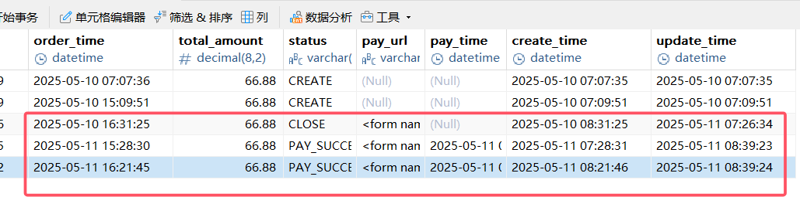

## 问题描述

最近在开发 SpringBoot 应用，使用 jdbc 连接 MySQL 数据库，对接支付宝沙箱。MySQL 部署在国内的服务器上，时区为 SYSTEM；SpringBoot 应用中的 application.yml 中也配置 MySQL 时区为 Asia/Shanghai。

```sql
mysql> SHOW VARIABLES LIKE '%time_zone%'; 
+------------------+--------+
| Variable_name    | Value  |
+------------------+--------+
| system_time_zone | UTC    |
| time_zone        | SYSTEM |
+------------------+--------+
```

```yaml
spring:
  datasource:
  username: username
  password: password
  url: jdbc:mysql://ip:port/s-pay-mall?useUnicode=true&characterEncoding=utf8&autoReconnect=true&zeroDateTimeBehavior=convertToNull&serverTimezone=Asia/Shanghai&useSSL=true
```

业务逻辑：创建订单或更新订单状态时，通过 mapper、xml 运行 SQL 语句，对象的 order_time 和 create_time、update_time 字段的时间不一致。create_time、update_time 都是 now()，但 order_time 是 Java 库的 new Date()。

但是插入/更新字段后，数据库中显示只有 order_time 是上海时区，即比另外两个字段快 8h，也就是 MySQL 的 now() 只是UTC时间（如图所示）。



所以我现在通过 order_time 来筛选时，通过加 8h，即 `now() + interval 8 hour` 来处理。

```xml
<!-- 更新订单支付状态和时间 -->
<update id="changeOrderPaySuccess" parameterType="site.dopplerxd.domain.po.PayOrder">  
update pay_order  
set status = #{status}, pay_time = now(), update_time = now()  
where order_id = #{orderId}  
</update>

<!-- 查询超时未支付订单 -->
<select id="queryTimeoutCloseOrderList" parameterType="java.lang.String" resultType="java.lang.String"> select order_id as orderId from pay_order where status = 'PAY_WAIT' and now() + interval 8 hour >= order_time + interval 30 minute order by order_id asc limit 50
</select>
```

## 解决

该问题是 **MySQL时区设置与JDBC/Spring Boot默认行为不一致** 导致的典型时间错位问题，可以通过修改 MySQL 配置文件，设置时区来解决。

我是通过 Docker 部署的 MySQL，所以要找到 MySQL 的配置文件并修改，然后映射到 Docker 环境中。

### 修改 my. cnf 并映射到容器中

在 my. cnf 中添加：

```ini
[mysqld]
default-time-zone = '+08:00'
```

然后重启 MySQL 容器，再次查看发现时区已正确修改为 UTC+8：

```sql
mysql> SHOW VARIABLES LIKE '%time_zone%';
+------------------+--------+
| Variable_name    | Value  |
+------------------+--------+
| system_time_zone | UTC    |
| time_zone        | +08:00 |
+------------------+--------+
2 rows in set (0.03 sec)
```

### 通过 docker-compose 设置 MySQL 时区

也可以通过 docker-compose 设置 MySQL 时区，以下是 ChatGPT 给出的 docker-compose 示例：

```yaml
version: '3.8'

services:
  mysql:
    image: mysql:5.7
    container_name: my-mysql
    ports:
      - "3306:3306"
    environment:
      MYSQL_ROOT_PASSWORD: your_password
      TZ: Asia/Shanghai
    volumes:
      - ./mysql-data:/var/lib/mysql
      - ./mysql-conf/my.cnf:/etc/mysql/conf.d/my.cnf
      - /etc/localtime:/etc/localtime:ro

```

