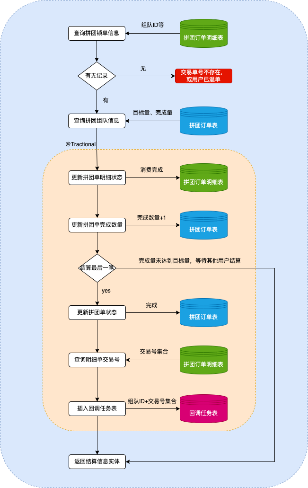
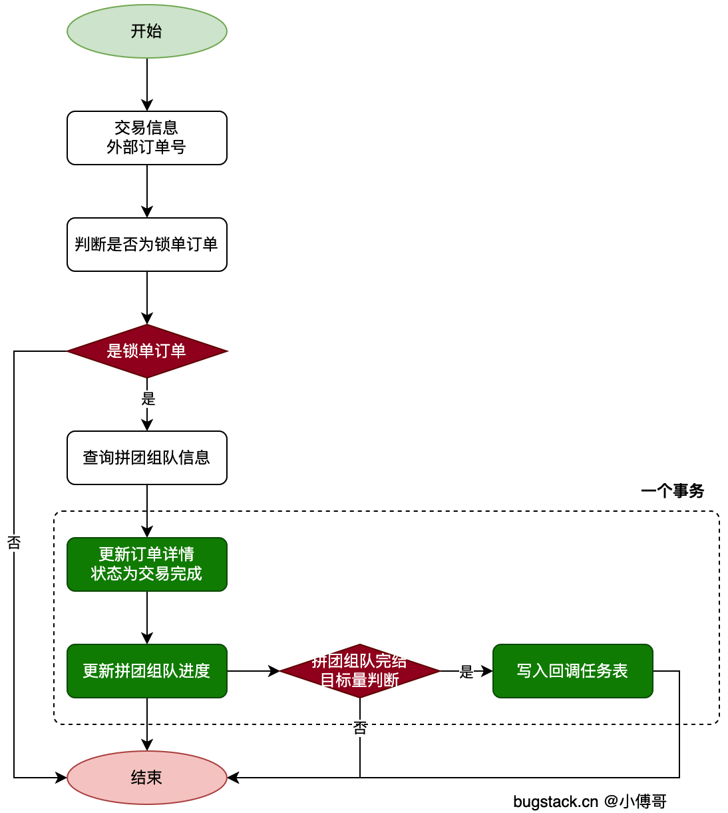

# 拼团组队结算统计业务流程与代码实现梳理

星尘的学习笔记 https://articles.zsxq.com/id_5tfh1ko2r2h6.html

## 一、业务流程概述



拼团组队结算统计主要围绕用户参与拼团活动、订单支付、组队达成、结算分账等环节展开。核心流程如下：

1. 用户参与拼团活动，生成预购订单并锁定。
2. 用户支付订单，触发结算流程。
3. 系统根据订单和组队信息，更新拼团进度与状态。
4. 拼团达成后，批量更新订单状态，完成结算。
5. 结算结果写入结算表，后续可用于分账、统计等。



## 二、核心实体与表结构

### 1. 主要表结构
- **group_buy_order**：拼团组队订单表，记录组队ID、活动ID、拼团目标、完成数量、状态等。
- **group_buy_order_list**：拼团订单明细表，记录每个用户的订单、状态、支付信息等。
- **group_buy_activity**、**group_buy_discount**：活动与优惠配置。
- **notify_task**：结算回调任务表。

### 2. 关键实体类
- **GroupBuyTeamEntity**：拼团组队实体，包含teamId、activityId、targetCount等属性。
- **GroupBuyTeamSettlementAggregate**：拼团组队结算聚合，聚合用户、组队、支付订单等信息。
- **TradePaySuccessEntity**、**TradePaySettlementEntity**：交易支付与结算实体。

## 三、服务接口与实现

### 1. 结算服务接口
```java
public interface ITradeSettlementOrderService {
    /**
     * 营销结算
     * @param tradePaySuccessEntity 交易支付订单实体对象
     * @return 交易结算订单实体
     */
    TradePaySettlementEntity settlementMarketPayOrder(TradePaySuccessEntity tradePaySuccessEntity);
}
```

### 2. 结算服务实现
- **TradeSettlementOrderService** 实现了上述接口，核心逻辑如下：
  1. 查询拼团订单信息（MarketPayOrderEntity）。
  2. 查询组团信息（GroupBuyTeamEntity）。
  3. 更新拼团订单明细状态为完成。
  4. 更新组团完成数量。
  5. 若拼团达成目标，批量更新组团订单状态为完成，并查询所有完成订单号。
  6. 生成结算实体，写入结算表。

#### 关键代码片段
```java
// 1. 更新拼团订单状态明细
int updateOrderListStatusCount = groupBuyOrderListDao.updateOrderStatus2COMPLETE(groupBuyOrderListReq);
if (updateOrderListStatusCount != 1) {
    throw new AppException(ResponseCode.UPDATE_ZERO);
}
// 2. 更新拼团达成数量
int updateAddCompleteCount = groupBuyOrderDao.updateAddCompleteCount(groupBuyTeamEntity.getTeamId());
if (updateAddCompleteCount != 1) {
    throw new AppException(ResponseCode.UPDATE_ZERO);
}
// 3. 拼团达成时，批量更新订单状态
if (groupBuyTeamEntity.getTargetCount() - groupBuyTeamEntity.getCompleteCount() == 1) {
    int updateOrderStatusCount = groupBuyOrderDao.updateOrderStatus2COMPLETE(groupBuyTeamEntity.getTeamId());
    if (updateOrderStatusCount != 1) {
        throw new AppException(ResponseCode.UPDATE_ZERO);
    }
    // 查询拼团交易完成外部单号列表
    List<String> outTradeNoList = groupBuyOrderListDao.queryGroupBuyCompleteOrderOutTradeNoListByTeamId(groupBuyTeamEntity.getTeamId());
    // ...后续结算处理
}
```

## 四、流程总结
- 结算流程以订单支付为触发点，串联订单、组队、活动等多表多实体。
- 通过聚合根（GroupBuyTeamSettlementAggregate）统一管理结算所需上下文。
- 结算服务实现了拼团进度、状态、明细的原子性更新，确保数据一致性。
- 达成拼团目标后，批量处理订单状态，便于后续分账与统计。

## 五、相关技术

### 单一职责原则 single responsibility principle

`职责` 定义为改变的原因，SRP 指的是一个模块应该有且只有一个改变的原因。

反例：一个用于编辑和打印报表的模块。

1. 报表的内容可以被改变（编辑）

2. 报表的格式可以被改变（打印）

SRP 认为应该拆解将两个职责。

为什么要这么做？

继续上面的案例，修改编辑功能，很可能影响打印功能，具有危险性。

再比如，营销交易锁单和结算是两个不同的业务，拆分后具有下面的好处，

1. 降低复杂性。
2. 提高可读性。
3. 提高可维护性。
4. 降低依赖风险。