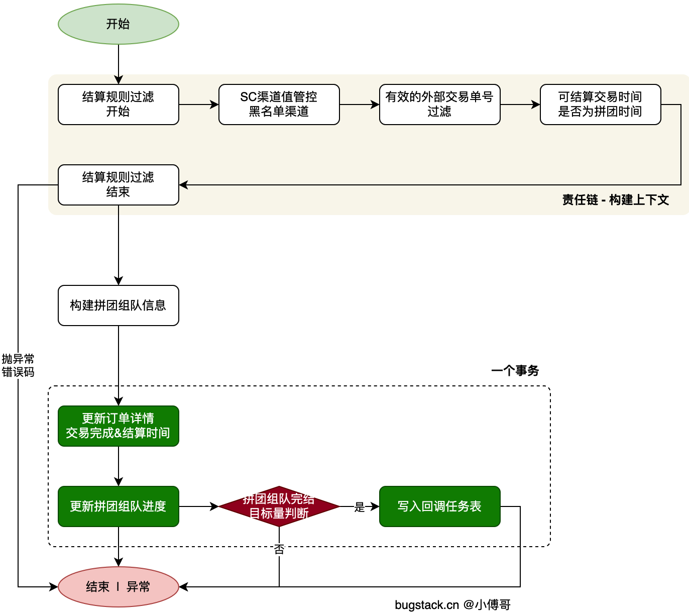
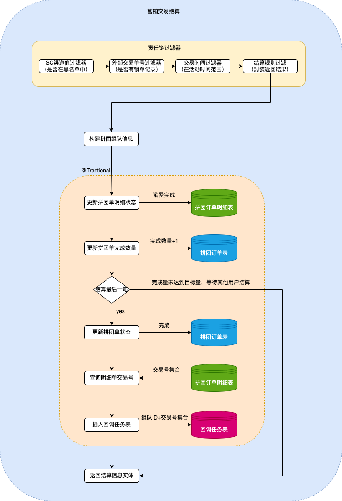

> 星尘的学习笔记 https://articles.zsxq.com/id_75jtgc875l1l.html

## 业务流程梳理

拼团交易结算的过程，需要一些列的规则过滤。包括；我们上一节提到的校验外部交易单的时间是否在拼团有效时间内，同时还有关于这笔外部交易单是否为有效的拼团锁单订单。另外像是 SC 渠道的有效性也需要在结算时进行校验。

所以，本节我们需要实现一套规则链，来处理这些业务规则。因为规则链已经被抽取为通用的模板了，那么本节使用起来会非常容易。

-   
    首先，本节的重点在于新增加结算规则过滤的责任链，处理；SC渠道管控、有效的外部交易单号、结算实现是否为拼团时效内。
- 那么这里会有一些功能改造点；
    - 拼团表，group_buy_order 增加 valid_start_time（有效开始时间）、valid_end_time（有效结束时间） 字段。用于每笔交易结算时候，用结算时间判断是否匹配到拼团有效时间范围内。
    - 拼团明细，group_buy_order_list 增加 out_trade_time（交易时间） 字段，记录每笔结算的订单结算的时间。随着状态更新的时候更新。
    - trade 领域下，lock 锁单。实体对象，修改名称。TradeRuleCommandEntity -> TradeLockRuleCommandEntity,TradeRuleFilterBackEntity -> TradeLockRuleFilterBackEntity 增加了 Lock 标识。便于在添加 TradeSettlementRuleCommandEntity、TradeSettlementRuleFilterBackEntity 时更好理解。
    - PayActivityEntity 添加 validTime，GroupBuyTeamEntity 添加 validStartTime、validEndTime
    - trade 领域下，settlement 结算服务中，使用责任链模板，实现营销交易规则的过滤。SCRuleFilter（SC黑名单管控过滤 DCCService 配置新的属性 scBlacklist）、OutTradeNoRuleFilter（外部交易单号有效性过滤）、SettableRuleFilter（交易时间是否在拼团有效时间内过滤）、EndRuleFilter（结束节点封装返回数据）
    - 交易服务，TradePaySettlementEntity 调用 tradeSettlementRuleFilter 责任链方法，并返回相关的数据信息。
    - settlementMarketPayOrder 结算一个事务下操作，增加 updateOrderStatus2COMPLETE 更新时候添加 outTradeTime 时间。

在营销交易结算业务的执行过程中，需要进行一系列的规则过滤，包括：

+ 判断SC值是否在黑名单；
+ 外部交易单号是否绑定一条锁单记；
+ 外部交易时间是否在拼团活动时间范围内；
+ 在这些规则都校验通过后，才会进入营销交易结算的正式业务流程。

