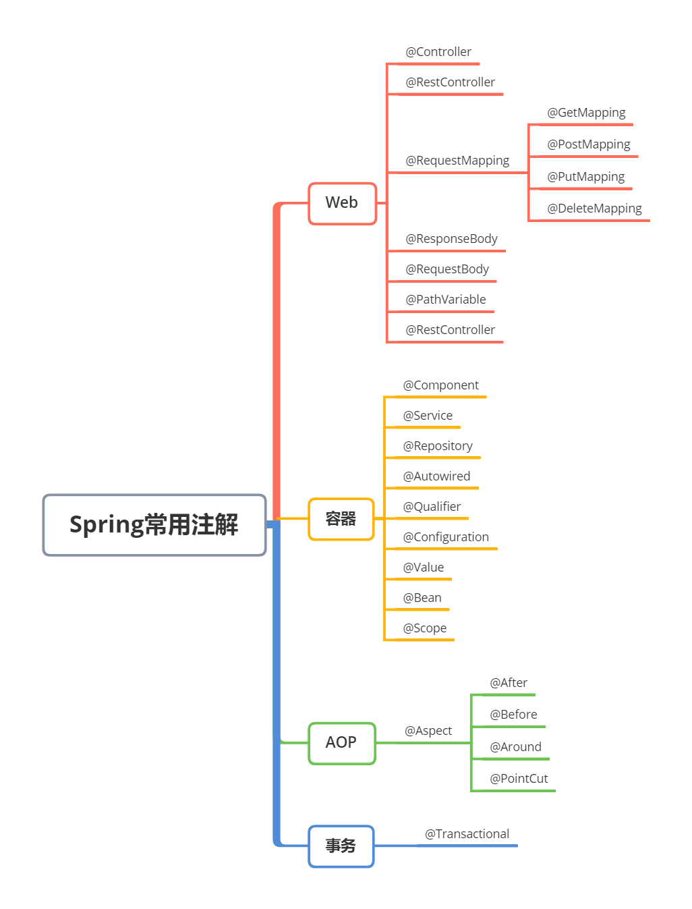
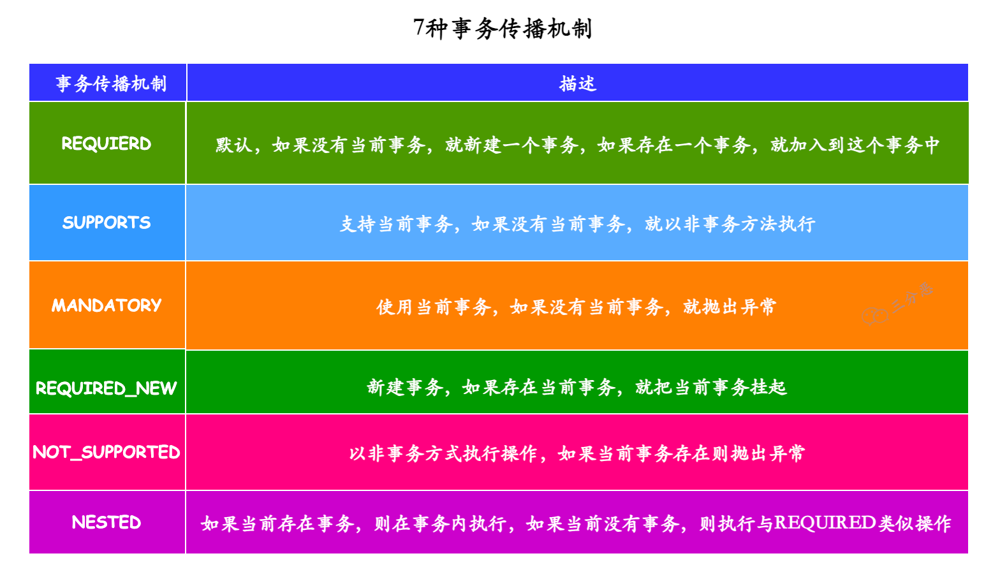

## 什么是 Spring


## Spring 有哪些模块


## Spring 中注入的常见注解，有什么区别



+ **@Autowired**：Spring 框架提供的注解，默认按照类型进行注入。如果存在多个相同类型的 Bean，会根据属性名进行匹配，如果匹配不上会抛出异常。可以通过 `@Qualifier` 注解指定具体的 Bean 名称。
+ **@Resource**：Java 提供的注解，默认按照名称进行注入，如果找不到对应的名称，则按照类型进行注入。
+ **@Inject**：JSR - 330 规范提供的注解，功能和 `@Autowired` 类似，默认按照类型进行注入。
+ `@Configuration`：标识配置类。
+ `@Bean`：用来定义 Bean。
+ `@Value`：用来注入配置文件中的属性值。
+ `@RestController` = `@Controller` + `@ResquestBody`
+ `@RequestMapping` 及其变体 `@GetMapping`、`@PostMapping`、`@PutMapping`、`@DeleteMapping` 用来映射 HTTP 请求。`@PathVariable` 获取路径参数，`@RequestParam` 获取请求参数，`@RequestBody` 接收 JSON 数据。
+ AOP 相关：`@Aspect` 定义切面，`@Pointcut` 定义切点，`@Before`、`@After`、`@Around` 这些定义通知类型
+ `@Transactional`：用在 Service 层需要保证事务原子性的方法上。
+ 生命周期相关：`@PostConstruct` 在 Bean 初始化后执行，`@PreDestroy` 在 Bean 销毁前执行。
+ `@SpringBootTest`：测试时经常用到。
+ `@SpringBootApplication`：启动类注解。

## @Controller 和 @RestController 的区别

1. 功能侧重点
    + `@Controller`：主要用于处理 Web 请求，并将请求映射到相应的处理方法。它通常用于传统的 MVC（Model - View - Controller）架构中，侧重于返回一个视图（View），例如 JSP、Thymeleaf 模板等。处理方法可以通过 `Model` 对象将数据传递给视图进行展示。
    + `@RestController`：是一个专门用于创建 RESTful Web 服务的控制器。它侧重于返回数据，通常以 JSON、XML 等格式直接返回给客户端，而不是返回一个视图。这在前后端分离的开发模式中非常常用，前端通过 HTTP 请求获取后端返回的数据来渲染页面。
2. 注解本质
    + `@Controller`：是一个常规的 Spring 组件注解，用于标识该类为一个控制器。它本身并不包含处理 HTTP 请求返回数据格式的特定逻辑。
    + `@RestController`：实际上是一个组合注解，它结合了 `@Controller` 和 `@ResponseBody` 注解的功能。`@ResponseBody` 注解的作用是将控制器方法的返回值直接写入 HTTP 响应体中，而不会经过视图解析器进行视图解析。
3. 返回值处理
    + `@Controller`：处理方法的返回值通常被视为视图名。Spring 会通过视图解析器将视图名解析为实际的视图资源，然后将模型数据填充到视图中进行渲染，最终返回给客户端。例如，如果返回值是 `"home"`，视图解析器会查找名为 `home` 的视图资源（如 `home.jsp` 或 `home.html`，取决于具体的视图解析器配置）。
    + `@RestController`：处理方法的返回值会直接作为 HTTP 响应体返回给客户端，并且会根据 `HttpMessageConverter` 机制将返回对象转换为合适的格式（如 JSON、XML 等）。例如，返回一个 Java 对象，Spring 会自动将其转换为 JSON 格式并返回给客户端，无需额外配置视图解析。

总结来说，如果开发的是传统的 MVC 应用，需要返回视图，使用 `@Controller`；如果开发的是 RESTful Web 服务，主要返回数据给前端，使用 `@RestController` 更为合适。

## @Resource 和 @Autowired 区别
+ **来源不同**：`@Autowired` 是 Spring 框架提供的注解，`@Resource` 是 Java 提供的注解（JSR - 250 规范）。
+ **注入方式不同**：`@Autowired` 默认按照类型进行注入，`@Resource` 默认按照名称进行注入。
+ **处理多个 Bean 时的行为不同**：当存在多个相同类型的 Bean 时，`@Autowired` 需要结合 `@Qualifier` 注解指定 Bean 名称，`@Resource` 可以直接通过名称匹配。

## @Component 和 @Bean 有什么区别？
都用于将对象交给 Spring 容器管理，但在使用场景、使用方式和作用目标等方面存在区别：

1. 使用场景
    + `@Component`：一般用于类层面，适用于那些比较常规的组件，比如服务层、数据访问层等。Spring 会自动扫描带有 `@Component` 注解及其派生注解（像 `@Service`、`@Repository`、`@Controller`）的类，并将它们注册到 Spring 容器中。这种方式适合处理那些可以通过组件扫描机制自动发现并注册的类。
    + `@Bean`：通常用于方法层面，适合手动创建和配置 Bean。当需要对 Bean 的创建过程进行更多的控制，或者要集成第三方库的类时，就可以使用 `@Bean` 注解。例如，当使用外部库提供的类，且需要对其进行自定义配置时，就可以在配置类里使用 `@Bean` 方法来创建和配置这个类的实例。
2. 使用方式
    + `@Component`：只需将 `@Component` 注解添加到类的定义上即可。Spring 会在启动时自动扫描指定包下带有该注解的类，并将其作为 Bean 注册到容器中。
    - `@Bean`：需要在配置类（带有 `@Configuration` 注解的类）里定义一个方法，在方法上添加 `@Bean` 注解，该方法的返回值就是要注册到 Spring 容器中的 Bean。示例如下：

```java
@Configuration
public class MyConfig {
    @Bean
    public MyBean myBean() {
        return new MyBean();
    }
}

class MyBean {
}
```

3. 作用目标
    + `@Component`：作用于类，将**整个类作为一个 Bean** 注册到 Spring 容器中。Spring 会使用默认的构造函数来创建该类的实例，并进行依赖注入。
    + `@Bean`：作用于方法，**方法的返回值会被注册为 Bean**。可以在方法内部编写复杂的逻辑来创建和配置 Bean，例如设置 Bean 的属性、调用初始化方法等。
4. 自动装配和命名
    + `@Component`：默认情况下，Bean 的名称是类名的首字母小写。不过可以通过 `@Component` 注解的参数来指定 Bean 的名称。例如：`@Component("myCustomComponent")`。
    + `@Bean`：默认情况下，Bean 的名称是方法名。也可以通过 `@Bean` 注解的参数来指定 Bean 的名称。例如：`@Bean("myCustomBean")`。

综上所述，`@Component` 适合自动扫描和注册常规组件，而 `@Bean` 更适合手动创建和配置 Bean，尤其是在需要对 Bean 的创建过程进行精细控制时。

如需要引入第三方包的一个类，我们不能通过修改源码使用 @Component，这时就可以用 @Bean 来进行注入。

## Spring 中的设计模式

+ **单例模式**：Spring 容器中的 Bean 默认是单例的，通过单例模式确保一个 Bean 在整个应用中只有一个实例，减少了资源的消耗。可通过 `@Scope("prototype")` 设置为每次获取都创建新实例。
+ **工厂模式**：Spring 的 `BeanFactory` 和 `ApplicationContext` 就是工厂模式的体现，负责创建和管理 Bean 对象。
+ **代理模式**：Spring AOP 是基于代理模式实现的，通过代理对象对目标对象进行增强，实现了日志记录、事务管理等功能。实现了接口的类用 JDK 动态代理，没有实现接口的类用 CGLIB 代理。
+ **模板方法模式**：如 JdbcTemplate，定义了数据库操作的基本流程：获取连接、执行 SQL、处理结果、关闭连接。
+ **观察者模式**：Spring 中的事件机制就是观察者模式的应用，可通过 `ApplicationEvent` 和 `ApplicationListener` 来实现事件的发布与监听。当一个事件发生时，会通知所有注册的监听器进行相应的处理。

## Spring 如何实现 Bean 的单例模式

Spring 的单例是容器级别的，同一个 Bean 在整个 Spring 容器中只会有一个实例。Spring 在启动的时候会把所有的 Bean 定义信息加载进来，然后在 DefaultSingletonBeanRegistry 这个类里面维护了一个叫 singletonObjects 的 **ConcurrentHashMap**，这个 Map 就是用来存储单例 Bean 的。key 是 Bean 的名称，value 就是 Bean 的实例对象。

第一次获取某个 Bean 的时候，Spring 会先检查 singletonObjects 这个 Map 里面有没有这个 Bean，如果没有就会创建一个新的实例，然后放到 Map 里面。后面再获取同一个 Bean 的时候，直接从 Map 里面取就行了，这样就保证了单例。

**如何解决循环依赖：使用三级缓存。**除了 singletonObjects 这个一级缓存，还有 earlySingletonObjects 二级缓存和 singletonFactories 三级缓存。这样即使有循环依赖，Spring 也能正确处理。

## Spring 框架中的单例 Bean 是线程安全的吗？
结论：不是线程安全的。

Spring 中的 bean 默认是单例模式，框架中并没有对单例 bean 进行多线程的封装处理。

Spring Bean 并没有可变的状态（如 Service 和 DAO 类），所以在某种程度上说 Spring 单例 Bean 是线程安全的。

但是如果 bean 中定义了可修改的成员变量，就需要考虑线程安全问题了，可以用多例或加锁来解决。

如定义 bean 时添加注解 `@Scope("prototype")`（默认为 singleton），这样请求 bean 相当于 new Bean() 了，就能够保证线程安全了。

## Bean 的生命周期
Spring 中 Bean 的生命周期包含以下几个关键阶段：

+ **实例化**：通过反射机制创建 Bean 的实例。
+ **属性赋值**：为 Bean 的属性设置值和对其他 Bean 的引用。
+ **初始化**：
    - 实现 `InitializingBean` 接口，调用 `afterPropertiesSet` 方法。
    - 自定义初始化方法（使用 `@PostConstruct` 注解或 `init - method` 属性指定）。
+ **使用**：Bean 正常使用，处理业务逻辑。
+ **销毁**：
    - 实现 `DisposableBean` 接口，调用 `destroy` 方法。
    - 自定义销毁方法（使用 `@PreDestroy` 注解或 `destroy - method` 属性指定）。

## 什么是 IoC 和 AOP，怎么理解的
+ **IoC（Inversion of Control，控制反转）**：是一种设计原则，将对象的创建和依赖关系的管理从代码中转移到外部容器（如 Spring 容器）。以前对象的创建和依赖关系的维护由开发者手动控制，现在交给容器来完成。例如，一个 `UserService` 依赖 `UserDao`，在传统方式中，`UserService` 内部会手动创建 `UserDao` 实例，而在 IoC 模式下，Spring 容器会创建 `UserDao` 实例并注入到 `UserService` 中。
+ **AOP（Aspect - Oriented Programming，面向切面编程）**：是对面向对象编程的一种补充。它将与业务逻辑无关但被多个模块共同使用的功能（如日志记录、事务管理等）提取出来，形成一个切面，然后将这些切面动态地织入到目标对象的方法执行过程中。比如在多个业务方法执行前后添加日志记录，使用 AOP 可以避免在每个方法中重复编写日志代码。

## Spring 底层是怎么实现 IoC 和 AOP 的？

### IoC（控制反转）的实现
IoC 的核心思想是将对象的创建、依赖关系的管理等控制权从代码中转移到 Spring 容器中，Spring 底层主要通过以下几个关键组件和技术来实现 IoC：

+ **BeanDefinition**：这是对 Bean 的抽象描述，它包含了 Bean 的各种元信息，如类名、作用域、依赖关系等。Spring 在启动时会解析配置文件（如 XML 配置文件、Java 注解等），将其中定义的 Bean 信息封装成 `BeanDefinition` 对象，存储在 `BeanDefinitionRegistry` 中。
+ **BeanFactory**：作为 Spring 容器的核心接口，`BeanFactory` 负责创建和管理 Bean。它根据 `BeanDefinition` 来创建 Bean 实例，支持延迟加载、依赖注入等功能。常见的实现类有 `DefaultListableBeanFactory`。
+ **ApplicationContext**：它是 `BeanFactory` 的子接口，在 `BeanFactory` 的基础上提供了更多的企业级功能，如国际化支持、事件发布等。`ApplicationContext` 在启动时会自动创建所有单例 Bean，而 `BeanFactory` 是在需要时才创建 Bean。
+ **依赖注入**：Spring 支持多种依赖注入方式，如构造函数注入、Setter 方法注入等。在创建 Bean 实例时，Spring 会根据 `BeanDefinition` 中的依赖信息，将依赖的 Bean 注入到目标 Bean 中。例如，当一个 Bean 依赖另一个 Bean 时，Spring 会自动查找并将依赖的 Bean 实例传递给目标 Bean 的构造函数或 Setter 方法。

### AOP（面向切面编程）的实现
AOP 的主要目的是将横切关注点（如日志记录、事务管理等）从业务逻辑中分离出来，Spring 底层通过以下两种主要方式实现 AOP：

+ **JDK 动态代理**：当目标对象实现了接口时，Spring 会使用 JDK 动态代理来创建代理对象。JDK 动态代理基于 Java 的反射机制，通过实现 `InvocationHandler` 接口和 `Proxy` 类来创建代理对象。在运行时，代理对象会拦截对目标对象方法的调用，并在调用前后插入切面逻辑。

```java
import java.lang.reflect.InvocationHandler;
import java.lang.reflect.Method;
import java.lang.reflect.Proxy;

// 定义接口
interface UserService {
    void addUser();
}

// 实现类
class UserServiceImpl implements UserService {
    @Override
    public void addUser() {
        System.out.println("添加用户");
    }
}

// 实现 InvocationHandler 接口
class MyInvocationHandler implements InvocationHandler {
    private Object target;

    public MyInvocationHandler(Object target) {
        this.target = target;
    }

    @Override
    public Object invoke(Object proxy, Method method, Object[] args) throws Throwable {
        System.out.println("方法调用前");
        Object result = method.invoke(target, args);
        System.out.println("方法调用后");
        return result;
    }
}

// 测试代码
public class JdkProxyExample {
    public static void main(String[] args) {
        UserService userService = new UserServiceImpl();
        MyInvocationHandler handler = new MyInvocationHandler(userService);
        UserService proxy = (UserService) Proxy.newProxyInstance(
                userService.getClass().getClassLoader(),
                userService.getClass().getInterfaces(),
                handler
        );
        proxy.addUser();
    }
}
```

+ **CGLIB 代理**：当目标对象没有实现接口时，Spring 会使用 CGLIB 代理来创建代理对象。CGLIB 是一个强大的、高性能的代码生成库，它通过继承目标对象的类来创建代理对象，并重写目标对象的方法，在方法调用前后插入切面逻辑。

Spring AOP 会根据目标对象是否实现接口来自动选择使用 JDK 动态代理还是 CGLIB 代理。此外，Spring AOP 还使用了 `AspectJ` 的注解和语法来定义切面、切点和通知，通过 `AnnotationAwareAspectJAutoProxyCreator` 等组件来自动创建代理对象。

综上所述，Spring 通过 `BeanDefinition`、`BeanFactory` 等组件实现了 IoC，通过 JDK 动态代理和 CGLIB 代理等技术实现了 AOP，为开发者提供了强大而灵活的开发框架。

## 为什么要 IOC，自己管理 Bean 不行吗

可以自己管理 Bean，但使用 IOC 有以下优势：

+ **降低耦合度**：对象之间的依赖关系由容器管理，对象只需要关注自身的业务逻辑，不需要关心依赖对象的创建和管理，降低了代码的耦合度。
+ **提高可维护性和可测试性**：由于依赖关系的管理集中在容器中，当依赖关系发生变化时，只需要修改容器的配置，而不需要修改大量的业务代码。同时，在进行单元测试时，可以方便地替换依赖对象。
+ **方便实现单例模式和对象的生命周期管理**：Spring 容器可以方便地实现单例模式，并且可以管理对象的生命周期，确保对象在合适的时间被创建和销毁。

## IoC 和 DI 的关系

- **IOC 是“核心思想”**：它描述的是 Spring 解决“对象依赖耦合”的**设计理念**——即“将对象的创建、依赖关系的维护等‘控制权’，从业务代码本身反转到 Spring 容器”。
    - 举个例子：传统开发中，Service 需要调用 Dao 时，要自己 `new DaoImpl()` 来创建 Dao 对象（控制权在 Service）；而 IOC 思想下，Service 不再关心 Dao 的创建，而是由 Spring 容器直接“给”它需要的 Dao 对象（控制权反转到容器）。IOC 的核心是“反转控制权”这个“目标”。
- **DI 是“实现手段”**：它是 Spring 实现 IOC 思想的**具体技术方式**——即“Spring 容器通过构造器注入、setter 注入、注解注入等方式，将对象依赖的组件‘主动注入’到对象中”。
    - 延续上面的例子：Spring 容器如何让 Service 拿到 Dao？本质就是通过 `@Autowired`（注解注入）或 XML 配置（setter 注入），把 Dao 实例“注入”到 Service 的成员变量中。DI 的核心是“如何把依赖给过去”这个“动作”。 

## IoC 的实现机制

1. 加载 Bean 的定义信息：Spring 扫描配置的包路径，找到标注了 `@Component`、`Service`、`Repository` 等注解的类，将这些类的元信息封装成 BeanDefinition 对象。
2. Bean 工厂的准备：Spring 创建一个 DefaultListableBeanFactory 作为 Bean 工厂来负责 Bean 的创建和管理。
3. Bean 的实例化和初始化：Spring 根据 BeanDefinition 来创建 Bean 实例。
    1. 对于单例 Bean，先检查缓存中是否已存在，不存在就通过反射调用构造方法来创建新实例。

## AOP

### 一、AOP（面向切面编程）的核心理解

AOP（Aspect-Oriented Programming）是一种通过“横向抽取”思想解决代码复用问题的编程范式。  
传统开发中，**业务逻辑**（如用户登录、订单提交）和**横切逻辑**（如日志记录、事务控制、权限校验）往往交织在一起（例如：每个接口方法都要写日志打印代码），导致代码冗余、耦合度高、维护困难。  

AOP的解决思路是：  
1. **分离关注点**：将横切逻辑从业务逻辑中抽离出来，封装成独立的“切面”（Aspect）；  
2. **动态织入**：通过框架（如Spring AOP）在**不修改业务代码**的前提下，将切面逻辑“自动插入”到业务方法的执行过程中（如方法执行前、执行后、抛出异常时）。  

核心概念：  
- **切面（Aspect）**：封装横切逻辑的类（如日志切面、事务切面）；  
- **切入点（Pointcut）**：定义“哪些方法需要被织入切面”（如所有Controller层的方法）；  
- **通知（Advice）**：定义“切面逻辑在目标方法的什么时机执行”（如前置通知@Before、后置通知@AfterReturning、环绕通知@Around等）；  
- **织入（Weaving）**：将切面逻辑插入到目标方法的过程（Spring AOP默认通过动态代理实现运行期织入）。  

### 二、AOP日志记录代码示例（基于Spring Boot）
以下示例实现“对所有Controller层的接口方法，自动记录请求参数、返回结果和执行时间”，体现AOP如何与业务逻辑解耦。  

#### 1. 引入依赖（Maven）  
```xml
<dependency>
    <groupId>org.springframework.boot</groupId>
    <artifactId>spring-boot-starter-aop</artifactId>
</dependency>
```

#### 2. 定义日志切面（核心AOP代码）  
```java
// import ...

// 1. @Aspect 标记此类为切面
@Aspect
// 2. @Component 确保被Spring容器管理
@Component
public class LogAspect {

    private static final Logger log = LoggerFactory.getLogger(LogAspect.class);

    // 3. 定义切入点：匹配所有Controller层的方法（包路径根据实际项目调整）
    @Pointcut("execution(* com.example.demo.controller..*(..))")
    public void controllerPointcut() {}

    // 4. 前置通知：在目标方法执行前执行（记录请求参数）
    @Before("controllerPointcut()")
    public void logBefore(JoinPoint joinPoint) {
        // 获取请求信息
        ServletRequestAttributes attributes = (ServletRequestAttributes) RequestContextHolder.getRequestAttributes();
        HttpServletRequest request = attributes.getRequest();

        // 打印请求详情
        log.info("【请求URL】：{}", request.getRequestURL());
        log.info("【请求方法】：{}", request.getMethod());
        log.info("【调用方法】：{}.{}", 
                 joinPoint.getSignature().getDeclaringTypeName(),  // 类名
                 joinPoint.getSignature().getName());             // 方法名
        log.info("【请求参数】：{}", Arrays.toString(joinPoint.getArgs()));  // 参数列表
    }

    // 5. 环绕通知：包围目标方法执行（记录执行时间）
    @Around("controllerPointcut()")
    public Object logAround(ProceedingJoinPoint proceedingJoinPoint) throws Throwable {
        long startTime = System.currentTimeMillis();
        // 执行目标方法（业务逻辑）
        Object result = proceedingJoinPoint.proceed();
        long endTime = System.currentTimeMillis();

        log.info("【执行时间】：{}ms", endTime - startTime);
        return result;  // 返回目标方法的执行结果
    }

    // 6. 后置返回通知：在目标方法成功执行后执行（记录返回结果）
    @AfterReturning(pointcut = "controllerPointcut()", returning = "result")
    public void logAfterReturning(Object result) {
        log.info("【返回结果】：{}", result);
    }
}
```

#### 3. 业务Controller（无需任何日志代码）  
```java
import org.springframework.web.bind.annotation.GetMapping;
import org.springframework.web.bind.annotation.RequestParam;
import org.springframework.web.bind.annotation.RestController;

@RestController
public class UserController {

    // 业务方法：查询用户（无任何日志相关代码）
    @GetMapping("/user")
    public String getUser(@RequestParam String username) {
        return "查询到用户：" + username;
    }
}
```

#### 4. 执行效果  
当访问 `http://localhost:8080/user?username=test` 时，控制台会自动打印日志：  
```
【请求URL】：http://localhost:8080/user
【请求方法】：GET
【调用方法】：com.example.demo.controller.UserController.getUser
【请求参数】：[test]
【执行时间】：5ms
【返回结果】：查询到用户：test
```

### 三、核心价值体现  
- **解耦**：业务代码（UserController）只关注核心逻辑，日志逻辑被抽离到LogAspect，后续修改日志格式只需改切面，无需改动所有业务类；  
- **复用**：一套日志逻辑可通过切入点匹配多个类/方法，避免代码重复；  
- **灵活**：通过调整切入点表达式，可随时控制哪些方法需要日志（如只给生产环境的接口加日志）。  

这就是AOP的核心思想：**用“横向切面”解决“纵向重复代码”问题**，是Spring等框架中实现事务、权限、监控等功能的核心技术。

## 切面的常用注解是什么，切面切的是什么？
+ **常用注解**：
    - **@Aspect**：用于定义切面类。
    - **@Before**：前置通知，在目标方法执行之前执行。
    - **@After**：后置通知，在目标方法执行之后执行，无论目标方法是否抛出异常。
    - **@AfterReturning**：返回通知，在目标方法正常返回后执行。
    - **@AfterThrowing**：异常通知，在目标方法抛出异常后执行。
    - **@Around**：环绕通知，在目标方法执行前后都可以进行增强。
+ **切面切的是连接点**：连接点是程序执行过程中的一个点，如方法调用、异常抛出等。在 Spring AOP 中，主要切的是方法调用，通过定义切入点表达式来指定要拦截的方法。

## 注解和 AOP 结合的方式怎么实现，还可以在哪些场景使用
+ **实现方式**：
    - 定义一个自定义注解，例如 `@MyAnnotation`。
    - 创建一个切面类，使用 `@Aspect` 注解标记，在切面类中使用切入点表达式匹配使用了 `@MyAnnotation` 注解的方法。
    - 在切面类中使用 `@Before`、`@After` 等通知注解对匹配的方法进行增强。
+ **应用场景**：
    - **日志记录**：在方法执行前后记录日志。
    - **权限验证**：在方法执行前验证用户的权限。
    - **事务管理**：使用 `@Transactional` 注解结合 AOP 实现事务的管理。
    - **性能监控**：记录方法的执行时间。

## 类比：Spring AOP 各类通知与三国杀的回合阶段

这个类比太形象了！确实，Spring AOP 的各类通知与三国杀的回合阶段在“**按固定顺序触发、各司其职且互不干扰核心流程**”的逻辑上高度相似，能帮你快速理解 AOP 通知的分工：

比如把“目标方法执行”类比成“武将的回合”，各个通知就对应回合里的不同阶段：  
- `@Before` 像“回合开始阶段”：在核心流程（回合/目标方法）正式启动前触发，比如先执行“英姿”“裸衣”等前置技能，对应 AOP 里的入参校验、日志打印等前置逻辑；  
- `@AfterReturning` 像“出牌阶段结束后”：核心流程（出完牌/方法正常返回）顺利完成后触发，比如“屯田”在出牌阶段结束后摸牌，对应 AOP 里记录方法返回值的逻辑；  
- `@AfterThrowing` 像“濒死阶段”：核心流程（回合/方法）出问题时触发（比如中“闪电”掉血/方法抛异常），对应 AOP 里的异常捕获与日志记录；  
- `@After` 像“回合结束阶段”：不管核心流程是否顺利（哪怕濒死被救回/方法抛异常），都会固定触发，比如“帷幕”在回合结束阶段弃置标记，对应 AOP 里的资源清理（如关闭流）等必执行逻辑；  
- 而 `@Around` 就像“神曹操的归心”这类能贯穿多个阶段的技能：能主动控制核心流程（是否让目标方法执行/是否让回合继续），还能在前后都加逻辑，相当于包揽了“回合开始-核心操作-回合结束”的全流程干预。

这种“阶段化触发”的设计，本质都是为了在“核心逻辑”（目标方法/武将回合）之外，灵活附加额外功能，同时不破坏核心流程的完整性——就像三国杀技能不影响“摸牌-出牌-弃牌”的基础回合框架，AOP 通知也不侵入业务代码本身。

## SpringBoot 自动装配原理
Spring Boot 自动装配基于以下几个核心机制：

+ **@SpringBootApplication 注解**：它是一个组合注解，包含 `@SpringBootConfiguration`、`@EnableAutoConfiguration` 和 `@ComponentScan`。其中 `@EnableAutoConfiguration` 是开启自动装配的关键。
+ **自动配置类**：Spring Boot 在 `spring - boot - autoconfigure` 模块中提供了大量的自动配置类，这些类位于 `META - INF/spring.factories` 文件中。当 Spring Boot 应用启动时，会根据类路径下的依赖和配置信息，自动加载合适的自动配置类。
+ **条件注解**：自动配置类中使用了大量的条件注解（如 `@ConditionalOnClass`、`@ConditionalOnMissingBean` 等），根据不同的条件来决定是否加载该配置类。例如，`@ConditionalOnClass` 表示只有当类路径下存在指定的类时，才会加载该配置类。

## 循环依赖问题
循环依赖指的是两个或多个 Bean 之间相互依赖，形成一个闭环。例如，`A` 依赖 `B`，`B` 又依赖 `A`。Spring 可以解决单例 Bean 的循环依赖问题，主要通过三级缓存机制：

+ **一级缓存（singletonObjects）**：存储已经完全初始化好的单例 Bean。
+ **二级缓存（singletonFactories）**：存储单例 Bean 的工厂对象，用于提前暴露 Bean 的引用。
+ **三级缓存（earlySingletonObjects）**：存储提前曝光的单例 Bean 实例，这些 Bean 还没有完成初始化。

当出现循环依赖时，Spring 会先将创建中的 Bean 放入三级缓存，当另一个 Bean 需要依赖该 Bean 时，会从三级缓存中获取其引用，避免了死循环。

## Spring 事务是什么，事务隔离级别有？
Spring 事务是对数据库事务的封装，通过 Spring 的事务管理机制，可以方便地对数据库操作进行事务控制。Spring 支持编程式事务和声明式事务（使用 `@Transactional` 注解）。

Spring 支持的事务隔离级别与数据库的事务隔离级别相对应，主要有：

+ **ISOLATION_DEFAULT**：使用数据库默认的隔离级别。
+ **ISOLATION_READ_UNCOMMITTED**：读未提交，允许读取未提交的数据，可能会出现脏读、不可重复读和幻读问题。
+ **ISOLATION_READ_COMMITTED**：读已提交，避免了脏读，但可能会出现不可重复读和幻读问题。
+ **ISOLATION_REPEATABLE_READ**：可重复读，保证在同一个事务中多次读取同一数据的结果是一致的，避免了脏读和不可重复读，但可能会出现幻读问题。
+ **ISOLATION_SERIALIZABLE**：串行化，最高的隔离级别，避免了脏读、不可重复读和幻读问题，但会导致并发性能下降。

## Spring @Transactional是怎么与持久层框架配合，实现事务方法异常是回滚DB的？

Spring 的 `@Transactional` 注解通过与持久层框架（如 MyBatis、Hibernate 等）协同，借助 AOP 机制和数据库事务特性，实现“方法异常时自动回滚数据库操作”的核心逻辑，具体流程如下：

### 1. **AOP 代理拦截事务方法**
`@Transactional` 的本质是 AOP 切面：  
- Spring 启动时，会为标注了 `@Transactional` 的 Bean 创建代理对象（JDK 动态代理或 CGLIB）。  
- 当调用被 `@Transactional` 修饰的方法时，代理对象会先拦截方法调用，在方法执行前后嵌入事务管理逻辑。

### 2. **与持久层框架协同开启事务**
- **获取数据库连接**：代理逻辑首先从数据源（`DataSource`）中获取数据库连接（`Connection`），并将连接的 `autoCommit` 设为 `false`（关闭自动提交，开启手动事务控制）。  
- **绑定连接到线程**：通过 `ThreadLocal` 将连接绑定到当前线程（如 Spring 的 `TransactionSynchronizationManager`），确保持久层框架在同一事务中使用**同一个连接**。  
- **持久层框架复用连接**：MyBatis、Hibernate 等框架会从线程中获取 Spring 绑定的连接执行 SQL，所有操作均在该连接对应的事务中进行（共享同一事务上下文）。

### 3. **根据方法执行结果决定提交/回滚**
- **正常执行完成**：方法无异常返回时，代理逻辑调用连接的 `commit()` 方法，提交事务，所有 SQL 操作生效。  
- **抛出指定异常**：若方法抛出 `@Transactional` 注解中 `rollbackFor` 指定的异常（默认是 `RuntimeException` 及其子类），代理逻辑会调用连接的 `rollback()` 方法，回滚所有 SQL 操作，数据库状态恢复到事务开始前。  
- **异常未被捕获**：若异常被方法内部捕获且未重新抛出，代理会认为方法正常执行，执行 `commit()`（这也是事务回滚失效的常见原因）。

### 4. **事务结束后释放资源**
无论提交还是回滚，代理逻辑最终会将连接的 `autoCommit` 恢复为默认值（通常为 `true`），并将连接归还给数据源（连接池），解除线程与连接的绑定。

### 核心协同点
- **连接共享**：Spring 通过线程绑定确保持久层框架与事务管理器使用同一数据库连接，保证所有操作在一个事务内。  
- **异常联动**：持久层框架执行 SQL 时若抛出异常（如主键冲突），只要未被捕获且符合回滚规则，Spring 就会触发事务回滚。  
- **底层依赖**：最终依赖数据库本身的事务支持（如 InnoDB 的 ACID 特性），Spring 仅负责事务的开启、提交/回滚的逻辑控制。

简言之，`@Transactional` 是“Spring 事务管理器 + AOP + 持久层框架 + 数据库事务”协同的结果，通过统一的连接管理和异常处理，实现了方法级别的事务控制。

## @Transactional 的失效场景

+ **方法不是 public**：`@Transactional` 注解只能应用于 `public` 方法，因为 Spring 的 AOP 是基于代理模式实现的，**非 `public` 方法无法被代理**。
+ **自调用问题**：在同一个类中，一个方法调用另一个带有 `@Transactional` 注解的方法，事务不会生效，因为这种调用**没有经过 Spring 的代理对象**。
+ **捕获异常但未抛出**：如果在事务方法内部用 try-catch 捕获了异常，但没有在 catch 块中将异常重新抛出，或者抛出一个新的能触发回滚的异常，那么 Spring 的事务拦截器就无法感知到异常的发生，也就没办法回滚。
+ **异常类型不匹配**：`@Transactional` 注解默认只对 `RuntimeException` 和 `Error` 进行回滚，如果抛出的异常不是这两种类型，且没有指定 `rollbackFor` 属性，事务不会回滚。
+ **数据库不支持事务**：如果使用的数据库不支持事务（如 MySQL 的 MyISAM 存储引擎），`@Transactional` 注解不会生效。

## 事务嵌套注解生效吗，为什么

事务嵌套注解可以生效。当一个带有 `@Transactional` 注解的方法调用另一个同样带有 `@Transactional` 注解的方法时，会根据 `propagation` 属性（事务传播行为）来决定如何处理嵌套事务。例如，`PROPAGATION_REQUIRED` 表示如果当前存在事务，则加入该事务；如果不存在事务，则创建一个新的事务。不同的传播行为可以满足不同的业务需求。

## Spring 的事务 @Transactional 如果不抛出异常，如何回滚

可以在方法内部手动调用 `TransactionAspectSupport.currentTransactionStatus().setRollbackOnly()` 方法来设置事务回滚。例如：

```java
@Service
public class UserService {
    @Transactional
    public void updateUser() {
        try {
            // 业务逻辑
            if (someCondition) {
                TransactionAspectSupport.currentTransactionStatus().setRollbackOnly();
            }
        } catch (Exception e) {
            // 异常处理
        }
    }
}
```

## Spring 事务传播机制

简单来说，当一个事务方法 A 调用另一个事务方法 B 时，方法 B 的事务应该如何运行？是加入方法 A 的现有事务，还是开启一个新事务，或者以非事务方式运行？这就是事务传播机制要解决的问题。

Spring 定义了七种事务传播行为，其中 REQUIRED 是默认的传播行为，表示如果当前存在事务，则加入该事务；如果当前没有事务，则创建一个新的事务。



当然，还有一些特殊情况。比如，我们希望记录一些操作日志，但不想因为主业务失败导致日志回滚。这时候 REQUIRES_NEW 就派上用场了。它不管当前有没有事务，都重新开启一个全新的、独立的事务来执行。这样，日志保存的事务和主业务的事务就互不干扰，即使主业务失败回滚，日志也能妥妥地保存下来。

另外，还有像 SUPPORTS、 NOT_SUPPORTED 这些。SUPPORTS 比较佛系，有事务就用，没事务就不用，适合一些不重要的更新操作。而 NOT_SUPPORTED 则更干脆，它会把当前的事务挂起，以非事务的方式去执行。比如说我们的事务里需要调用一个第三方的、响应很慢的接口，如果这个调用也包含在事务里，就会长时间占用数据库连接。把它用 NOT_SUPPORTED 包起来，就可以避免这个问题。

```java
@Transactional(propagation = Propagation.NOT_SUPPORTED)
public void callExternalApi() {
    // 调用第三方接口
}
```

最后还有一个比较特殊的 NESTED，嵌套事务。它有点像 REQUIRES_NEW，但又不完全一样。NESTED 是父事务的一个子事务，父事务回滚，它肯定也得回滚。但它自己回滚，却不会影响到父事务。这个特性在处理一些批量操作，希望能部分回滚的场景下特别有用。不过它需要数据库支持 Savepoint 功能，如 MySQL。

## SpringMVC 工作流程
+ 用户发送请求到前端控制器 `DispatcherServlet`。
+ `DispatcherServlet` 接收请求后，调用 `HandlerMapping` 查找处理该请求的 `Handler`（控制器方法）。
+ `HandlerMapping` 返回一个 `HandlerExecutionChain` 对象，包含 `Handler` 和对应的拦截器。
+ `DispatcherServlet` 调用 `HandlerAdapter` 来执行 `Handler`。
+ `HandlerAdapter` 调用具体的 `Handler` 处理请求，并返回一个 `ModelAndView` 对象。
+ `DispatcherServlet` 调用 `ViewResolver` 解析 `ModelAndView` 中的视图名称，返回一个 `View` 对象。
+ `DispatcherServlet` 调用 `View` 的 `render` 方法，将模型数据渲染到视图上，并返回给用户。

## 怎么实现 SpringBoot 自动装配、条件装配
+ **自动装配**：
    - 创建自动配置类，使用 `@Configuration` 注解标记。
    - 在自动配置类中使用 `@Conditional` 系列注解（如 `@ConditionalOnClass`、`@ConditionalOnMissingBean` 等）根据条件进行配置。
    - 在 `META - INF/spring.factories` 文件中指定自动配置类的全限定名。
+ **条件装配**：
    - 使用 `@Conditional` 注解及其派生注解（如 `@ConditionalOnProperty`、`@ConditionalOnResource` 等）来控制 Bean 的创建条件。例如，`@ConditionalOnProperty` 可以根据配置文件中的属性值来决定是否创建 Bean。


