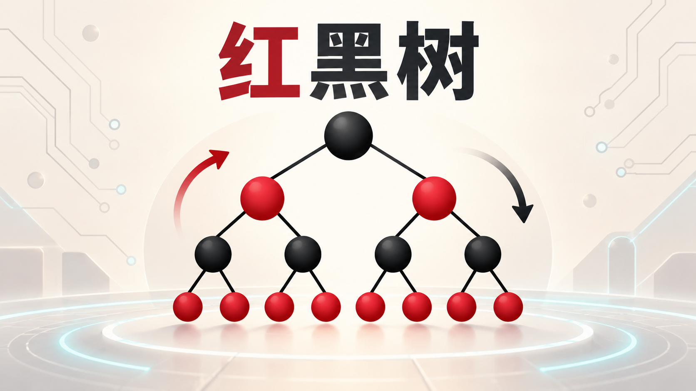

# 红黑树：原理、操作与 C++ 实现

红黑树是一棵自平衡二叉搜索树。它不追求绝对平衡，而是用少量颜色约束保证任意根到叶路径的长度不会相差过大，因此查找、插入和删除都能稳定在 $O(\log n)$。

## 1. 为什么需要红黑树

普通二叉搜索树在数据近似有序时可能退化成链，单次操作最坏需要 $O(n)$。红黑树通过旋转与重新着色控制树高，最坏树高不超过 $2\log_2(n+1)$，从而把三种基本操作的最坏复杂度都限制为 $O(\log n)$。

与 AVL 树相比，红黑树的平衡条件更宽松：查询路径可能略长，但更新时通常需要更少的旋转，适合插入、删除频繁的有序集合与映射。

## 2. 五条性质

将空孩子统一看作黑色哨兵叶子 `NIL`，红黑树满足：

1. 每个结点非红即黑；
2. 根结点是黑色；
3. 所有 `NIL` 叶子是黑色；
4. 红色结点的两个孩子都是黑色，即不存在相邻红结点；
5. 从任一结点到其所有后代 `NIL` 叶子的路径包含相同数量的黑色结点。

第 5 条中的黑色结点数量称为该结点的**黑高**。

## 3. 高度为什么是对数级

设某结点的黑高为 $bh$。从它到叶子的每条路径至少包含 $bh$ 个黑结点，因此以它为根的子树至少有 $2^{bh}-1$ 个内部结点。

又因为红结点不能相邻，任意路径上的红结点数不会超过黑结点数，所以树高 $h\le 2bh$。若整棵树有 $n$ 个内部结点：

$$
n\ge 2^{bh}-1
\quad\Longrightarrow\quad
h\le 2\log_2(n+1).
$$

## 4. 旋转：只改变局部结构

左旋和右旋不会破坏二叉搜索树的中序顺序。左旋以结点 `x` 的右孩子 `y` 为轴，让 `y` 上升、`x` 下沉到 `y` 的左侧；右旋完全对称。

```text
左旋 x：                 右旋 y：
    x                         y
   / \                       / \
  A   y         <=>         x   C
     / \                   / \
    B   C                 A   B
```

旋转本身是 $O(1)$，修复过程靠“旋转 + 重新着色”恢复红黑性质。

## 5. 插入

新结点先按二叉搜索树规则插入，并染成红色。染红不会改变任何路径的黑高，唯一可能出现的问题是父结点也为红色。

设当前结点为 `z`，父结点为 `p`，祖父结点为 `g`，叔叔结点为 `u`：

- `p` 为黑：无需修复；
- `p`、`u` 都为红：把 `p`、`u` 染黑，`g` 染红，再从 `g` 向上检查；
- `p` 为红、`u` 为黑：先把折线形结构转成直线形，再旋转祖父结点并交换父、祖父的颜色。

左右两侧情况完全对称。最后把根染黑。

## 6. 删除

删除首先按二叉搜索树规则进行：

- 没有左孩子：用右孩子替换；
- 没有右孩子：用左孩子替换；
- 有两个孩子：找到右子树最小结点作为后继，把后继移到被删结点的位置。

真正需要修复的是“被实际移走的颜色为黑色”。这会让替代结点所在路径少一个黑结点，可将替代结点看成暂时携带一层“额外黑色”。

设替代结点为 `x`，兄弟为 `w`。当 `x` 在父结点左侧时，有四种情况：

1. `w` 为红：交换父兄颜色并左旋父结点，转换为黑兄弟情形；
2. `w` 为黑，两个孩子都黑：把 `w` 染红，把额外黑色上移给父结点；
3. `w` 为黑，远侄子黑、近侄子红：右旋 `w`，转换为第 4 种；
4. `w` 为黑，远侄子红：调整颜色并左旋父结点，修复结束。

`x` 在右侧时镜像处理。

## 7. 完整 C++ 实现

下面实现的是不保存重复键的有序集合，提供插入、删除、查找、中序遍历和红黑性质校验。统一的黑色 `NIL` 哨兵能显著减少空指针分支，尤其适合删除修复。

```cpp
#include <algorithm>
#include <cassert>
#include <iostream>
#include <limits>
#include <vector>

class RedBlackTree {
private:
    enum class Color { Red, Black };

    struct Node {
        int key = 0;
        Color color = Color::Black;
        Node* parent = nullptr;
        Node* left = nullptr;
        Node* right = nullptr;
    };

    Node* nil_;
    Node* root_;
    std::size_t size_ = 0;

    void leftRotate(Node* x) {
        Node* y = x->right;
        x->right = y->left;
        if (y->left != nil_) {
            y->left->parent = x;
        }

        y->parent = x->parent;
        if (x->parent == nil_) {
            root_ = y;
        } else if (x == x->parent->left) {
            x->parent->left = y;
        } else {
            x->parent->right = y;
        }

        y->left = x;
        x->parent = y;
    }

    void rightRotate(Node* y) {
        Node* x = y->left;
        y->left = x->right;
        if (x->right != nil_) {
            x->right->parent = y;
        }

        x->parent = y->parent;
        if (y->parent == nil_) {
            root_ = x;
        } else if (y == y->parent->left) {
            y->parent->left = x;
        } else {
            y->parent->right = x;
        }

        x->right = y;
        y->parent = x;
    }

    void insertFixup(Node* z) {
        while (z->parent->color == Color::Red) {
            if (z->parent == z->parent->parent->left) {
                Node* uncle = z->parent->parent->right;
                if (uncle->color == Color::Red) {
                    z->parent->color = Color::Black;
                    uncle->color = Color::Black;
                    z->parent->parent->color = Color::Red;
                    z = z->parent->parent;
                } else {
                    if (z == z->parent->right) {
                        z = z->parent;
                        leftRotate(z);
                    }
                    z->parent->color = Color::Black;
                    z->parent->parent->color = Color::Red;
                    rightRotate(z->parent->parent);
                }
            } else {
                Node* uncle = z->parent->parent->left;
                if (uncle->color == Color::Red) {
                    z->parent->color = Color::Black;
                    uncle->color = Color::Black;
                    z->parent->parent->color = Color::Red;
                    z = z->parent->parent;
                } else {
                    if (z == z->parent->left) {
                        z = z->parent;
                        rightRotate(z);
                    }
                    z->parent->color = Color::Black;
                    z->parent->parent->color = Color::Red;
                    leftRotate(z->parent->parent);
                }
            }
        }
        root_->color = Color::Black;
    }

    void transplant(Node* u, Node* v) {
        if (u->parent == nil_) {
            root_ = v;
        } else if (u == u->parent->left) {
            u->parent->left = v;
        } else {
            u->parent->right = v;
        }
        v->parent = u->parent;
    }

    Node* minimum(Node* node) const {
        while (node->left != nil_) {
            node = node->left;
        }
        return node;
    }

    void eraseFixup(Node* x) {
        while (x != root_ && x->color == Color::Black) {
            if (x == x->parent->left) {
                Node* sibling = x->parent->right;
                if (sibling->color == Color::Red) {
                    sibling->color = Color::Black;
                    x->parent->color = Color::Red;
                    leftRotate(x->parent);
                    sibling = x->parent->right;
                }

                if (sibling->left->color == Color::Black &&
                    sibling->right->color == Color::Black) {
                    sibling->color = Color::Red;
                    x = x->parent;
                } else {
                    if (sibling->right->color == Color::Black) {
                        sibling->left->color = Color::Black;
                        sibling->color = Color::Red;
                        rightRotate(sibling);
                        sibling = x->parent->right;
                    }
                    sibling->color = x->parent->color;
                    x->parent->color = Color::Black;
                    sibling->right->color = Color::Black;
                    leftRotate(x->parent);
                    x = root_;
                }
            } else {
                Node* sibling = x->parent->left;
                if (sibling->color == Color::Red) {
                    sibling->color = Color::Black;
                    x->parent->color = Color::Red;
                    rightRotate(x->parent);
                    sibling = x->parent->left;
                }

                if (sibling->right->color == Color::Black &&
                    sibling->left->color == Color::Black) {
                    sibling->color = Color::Red;
                    x = x->parent;
                } else {
                    if (sibling->left->color == Color::Black) {
                        sibling->right->color = Color::Black;
                        sibling->color = Color::Red;
                        leftRotate(sibling);
                        sibling = x->parent->left;
                    }
                    sibling->color = x->parent->color;
                    x->parent->color = Color::Black;
                    sibling->left->color = Color::Black;
                    rightRotate(x->parent);
                    x = root_;
                }
            }
        }
        x->color = Color::Black;
    }

    Node* findNode(int key) const {
        Node* current = root_;
        while (current != nil_) {
            if (key == current->key) {
                return current;
            }
            current = key < current->key ? current->left : current->right;
        }
        return nil_;
    }

    void clear(Node* node) {
        if (node == nil_) {
            return;
        }
        clear(node->left);
        clear(node->right);
        delete node;
    }

    void inorder(Node* node, std::vector<int>& result) const {
        if (node == nil_) {
            return;
        }
        inorder(node->left, result);
        result.push_back(node->key);
        inorder(node->right, result);
    }

    int validateNode(Node* node, long long lower, long long upper) const {
        if (node == nil_) {
            return 1;
        }
        if (!(lower < node->key && node->key < upper)) {
            return -1;
        }
        if (node->left != nil_ && node->left->parent != node) {
            return -1;
        }
        if (node->right != nil_ && node->right->parent != node) {
            return -1;
        }
        if (node->color == Color::Red &&
            (node->left->color == Color::Red || node->right->color == Color::Red)) {
            return -1;
        }

        int leftHeight = validateNode(node->left, lower, node->key);
        int rightHeight = validateNode(node->right, node->key, upper);
        if (leftHeight < 0 || leftHeight != rightHeight) {
            return -1;
        }
        return leftHeight + (node->color == Color::Black ? 1 : 0);
    }

public:
    RedBlackTree() {
        nil_ = new Node;
        nil_->color = Color::Black;
        nil_->parent = nil_;
        nil_->left = nil_;
        nil_->right = nil_;
        root_ = nil_;
    }

    ~RedBlackTree() {
        clear(root_);
        delete nil_;
    }

    RedBlackTree(const RedBlackTree&) = delete;
    RedBlackTree& operator=(const RedBlackTree&) = delete;

    bool insert(int key) {
        Node* parent = nil_;
        Node* current = root_;

        while (current != nil_) {
            parent = current;
            if (key == current->key) {
                return false;
            }
            current = key < current->key ? current->left : current->right;
        }

        Node* node = new Node{key, Color::Red, parent, nil_, nil_};
        if (parent == nil_) {
            root_ = node;
        } else if (key < parent->key) {
            parent->left = node;
        } else {
            parent->right = node;
        }

        ++size_;
        insertFixup(node);
        return true;
    }

    bool erase(int key) {
        Node* target = findNode(key);
        if (target == nil_) {
            return false;
        }

        Node* moved = target;
        Color removedColor = moved->color;
        Node* replacement;

        if (target->left == nil_) {
            replacement = target->right;
            transplant(target, target->right);
        } else if (target->right == nil_) {
            replacement = target->left;
            transplant(target, target->left);
        } else {
            moved = minimum(target->right);
            removedColor = moved->color;
            replacement = moved->right;

            if (moved->parent == target) {
                replacement->parent = moved;
            } else {
                transplant(moved, moved->right);
                moved->right = target->right;
                moved->right->parent = moved;
            }

            transplant(target, moved);
            moved->left = target->left;
            moved->left->parent = moved;
            moved->color = target->color;
        }

        delete target;
        --size_;
        if (removedColor == Color::Black) {
            eraseFixup(replacement);
        }
        return true;
    }

    bool contains(int key) const {
        return findNode(key) != nil_;
    }

    std::size_t size() const {
        return size_;
    }

    bool empty() const {
        return root_ == nil_;
    }

    std::vector<int> inorder() const {
        std::vector<int> result;
        result.reserve(size_);
        inorder(root_, result);
        return result;
    }

    bool validate() const {
        if (nil_->color != Color::Black) {
            return false;
        }
        if (root_ == nil_) {
            return size_ == 0;
        }
        if (root_->parent != nil_ || root_->color != Color::Black) {
            return false;
        }
        return validateNode(
                   root_,
                   std::numeric_limits<long long>::lowest(),
                   std::numeric_limits<long long>::max()) > 0;
    }
};

int main() {
    RedBlackTree tree;
    for (int value : {41, 38, 31, 12, 19, 8, 50, 45, 60}) {
        tree.insert(value);
        assert(tree.validate());
    }

    tree.erase(12);
    tree.erase(41);
    assert(tree.validate());

    for (int value : tree.inorder()) {
        std::cout << value << ' ';
    }
    std::cout << '\n';
}
```

输出：

```text
8 19 31 38 45 50 60
```

## 8. 复杂度

| 操作 | 最坏时间复杂度 | 额外空间 |
| --- | --- | --- |
| 查找 | $O(\log n)$ | 迭代实现为 $O(1)$ |
| 插入 | $O(\log n)$ | 新结点 $O(1)$ |
| 删除 | $O(\log n)$ | $O(1)$ |
| 中序遍历 | $O(n)$ | 递归栈 $O(\log n)$ |

插入修复最多做 2 次旋转；删除修复最多做 3 次旋转。重新着色可能一路向根传播，但树高是 $O(\log n)$。

## 9. 实现要点与常见错误

- `NIL` 必须始终是黑色，并让它的左右孩子指向自身，删除修复才能安全访问兄弟的孩子；
- `transplant` 即使接入的是 `NIL`，也要更新其 `parent`，删除修复需要沿父指针判断位置；
- 删除双孩子结点时，记录的是后继原来的颜色，而不是目标结点的颜色；
- 每次旋转都要同时更新孩子、父结点以及根指针；
- 若允许重复键，应明确策略：记录出现次数，或规定相等键固定进入一侧；
- 调试时同时检查中序序列、根颜色、红结点约束和每条路径的黑高，仅检查有序性远远不够。

## 10. 红黑树与标准库

许多 C++ 标准库实现会用红黑树支撑 `std::map`、`std::set`、`std::multimap` 和 `std::multiset`，但标准只规定复杂度与行为，并不强制具体数据结构。工程代码应优先使用标准容器；手写红黑树更适合学习、面试推导或需要定制结点信息的场景。
